# GDD - Game Design Document - Módulo 1 - Inteli

## Nome do Grupo:
Cielitos

#### Nomes dos integrantes do grupo
- Alícia Medina 
- Eduardo Melquiades 
- Gabriel Scatolin 
- Lucas Borten 
- Nicolas Dely 
- Rachel Silvestre
- Sofia Brandão

## Sumário

[1. Introdução](#c1)

[2. Visão Geral do Jogo](#c2)

[3. Game Design](#c3)

[4. Desenvolvimento do jogo](#c4)

[5. Casos de Teste](#c5)

[6. Conclusões e trabalhos futuros](#c6)

[7. Referências](#c7)

[Anexos](#c8)

# <a name="c1"></a>1. Introdução (sprints 1 a 4)

## 1.1. Plano Estratégico do Projeto

### 1.1.1. Contexto da indústria (sprint 2)

&emsp; A Cielo S.A. posiciona-se como a líder nacional no setor de adquirência e serviços financeiros, desempenhando um papel sistêmico na economia brasileira. Fundada em 1995 (originalmente como VisaNet), a companhia evoluiu de uma processadora de transações para uma plataforma de tecnologia de ponta voltada ao varejo. Com presença capilarizada em 99% do território nacional, a Cielo detém uma abrangência sem paralelos, atendendo desde microempreendedores até gigantes do varejo corporativo.[\[1\]](#ref1)

&emsp; O impacto da organização é mensurável: em 2022, a empresa processou aproximadamente 9 bilhões de transações no mercado brasileiro, evidenciando sua relevância no ecossistema nacional de pagamentos eletrônicos.. [\[2\]](#ref2) Esse volume financeiro é sustentado por um ecossistema que ultrapassa a "maquininha", incluindo soluções de e-commerce, logística de pagamentos, antecipação de recebíveis e análise de dados (Big Data).

&emsp; Atualmente, a indústria de meios de pagamento no Brasil atravessa um cenário de hipercompetitividade e disrupção tecnológica. A Cielo enfrenta concorrentes de peso como Rede, Stone, Getnet e PagSeguro, além da ascensão das fintechs e do sistema PIX, que alteraram o comportamento de consumo. [\[3\]](#ref3) Nesse contexto, o diferencial competitivo da Cielo não reside apenas na tecnologia, mas na capacidade consultiva de sua força de vendas.

&emsp; A estratégia atual da companhia foca na transformação digital e na excelência do atendimento. Para manter a liderança, é imperativo que o time de vendas possua um conhecimento homogêneo e profundo sobre o portfólio. O uso de ferramentas de gamificação surge, portanto, como uma resposta estratégica para garantir a equidade no aprendizado e a atualização constante dos vendedores em um mercado que se redefine a cada ciclo tecnológico. [\[4\]](#ref4)

#### 1.1.1.1. Modelo de 5 Forças de Porter (sprint 2)

&emsp; A Análise das 5 Forças de Porter é um framework estratégico utilizado para compreender o nível de competitividade de uma empresa a partir da influência de agentes externos: a ameaça de novos entrantes, o poder de barganha dos fornecedores, o poder de barganha dos clientes, a ameaça de produtos substitutos e a rivalidade entre concorrentes existentes.[\[5\]](#ref5)

&emsp; Sob essa perspectiva, observa-se na imagem a análise desenvolvida pelo grupo com foco no setor de adquirência e meios de pagamento eletrônicos no Brasil, buscando compreender os principais desafios estruturais enfrentados pela Cielo e identificar fatores que impactam sua sustentabilidade competitiva.

<div align="center">
 <sub>Imagem 1 - Análise de 5 Forças de Porter - Cielo</sub>
 

 <sup>Fonte: Equipe cielitos, Faculdade Inteli 2026</sup>
</div>

&emsp; A ameaça de novos entrantes é considerada alta no mercado de adquirência e subadquirência. O avanço da digitalização e a expansão das fintechs reduziram significativamente as barreiras de entrada. Segundo dados do Banco Central, o sistema de pagamentos brasileiro registrou mais de 196 bilhões de transações via Pix entre 2020 e 2025 [\[21\]](#ref21) , evidenciando a rápida transformação do setor e a abertura para novos modelos de pagamento (Times Brasil, 2025). Além disso, empresas como Stone, PagSeguro e Mercado Pago ampliaram sua participação no mercado ao oferecer soluções integradas de pagamento e crédito para pequenos comerciantes. Apesar desse cenário competitivo, a Cielo mantém vantagens estruturais relevantes, como o suporte acionário do Banco do Brasil e do Bradesco, além de elevada capacidade de investimento em tecnologia, segurança e inovação. Outro diferencial competitivo são os DDNs (Distribuidores de Negócios), que ampliam sua capilaridade comercial e fortalecem o relacionamento com clientes em todo o território nacional, criando barreiras competitivas adicionais frente à entrada de novos players digitais no setor de pagamentos.

&emsp; O poder de barganha dos fornecedores é considerado moderado. No setor de adquirência, fornecedores estratégicos incluem bandeiras de cartão como Visa, Mastercard e Elo, além de provedores de tecnologia responsáveis pelos terminais de pagamento e infraestrutura digital, como Ingenico e serviços de computação em nuvem. Esses fornecedores exercem influência relevante ao estabelecer padrões tecnológicos e operacionais essenciais para o funcionamento do sistema de pagamentos. Contudo, devido à sua escala e posição consolidada no mercado brasileiro, a Cielo possui maior capacidade de negociação em comparação a empresas menores, o que reduz parcialmente o poder desses fornecedores.

&emsp; O poder de barganha dos clientes é elevado. Pequenos e médios empreendedores apresentam alta sensibilidade a preços e condições comerciais, enquanto grandes varejistas possuem forte poder de negociação devido ao elevado volume de transações processadas. Além disso, o baixo custo de troca entre adquirentes intensifica a competição por taxas mais atrativas. Para mitigar esse poder, a Cielo investe em estratégias de fidelização por meio da oferta de serviços agregados, como soluções de gestão de vendas, antecipação de recebíveis, integração com plataformas de e-commerce e ferramentas de análise de dados para comerciantes.

&emsp; A ameaça de produtos substitutos é considerada alta. Soluções como Pix, transferências via QR Code e carteiras digitais reduzem a dependência do arranjo tradicional de cartões. O crescimento do Pix é um exemplo claro dessa transformação: o sistema movimentou R$ 84,9 trilhões em cinco anos [\[21\]](#ref21), valor equivalente a mais de sete vezes o PIB brasileiro no período (Times Brasil, 2025). Esse avanço demonstra a rápida adoção de alternativas de pagamento que podem reduzir a relevância de modelos tradicionais baseados em maquininhas. Nesse contexto, a adaptação estratégica das adquirentes torna-se essencial para manter competitividade no mercado.

&emsp; Por fim, A rivalidade entre concorrentes existentes é intensa no setor de adquirência. Empresas como Stone, PagSeguro e Rede competem agressivamente por meio de diferenciação tecnológica, redução de taxas e oferta de serviços financeiros adicionais, como antecipação de recebíveis, crédito para lojistas e soluções de gestão empresarial. Além disso, fintechs e plataformas digitais ampliam a competição no ecossistema de pagamentos. Esse ambiente competitivo pressiona margens e exige inovação constante, eficiência operacional e fortalecimento do relacionamento com clientes.

### 1.1.2. Análise SWOT (sprint 2)

&emsp; A Matriz SWOT (Strengths, Weaknesses, Opportunities e Threats) é um framework que busca trazer uma análise abrangente das diferentes características de uma empresa, projeto ou processo, visando avaliar a posição competitiva deste elemento no mercado com base em dados. [\[6\]](#ref6) Por meio da Matriz SWOT, é possível visualizar fatores internos (Forças e Fraquezas) e fatores externos (Oportunidades e Ameaças) que afetam o desempenho do objeto em questão. [\[2\]](#ref2)

&emsp; A imagem apresenta uma Matriz SWOT elaborada para a empresa Cielo, com base nos princípios descritos no parágrafo anterior. Essa matriz destaca como a organização se posiciona frente aos principais fatores internos (forças e fraquezas) e externos (oportunidades e ameaças) identificados na análise.

<div align="center">
  <sub>Imagem 2 - Análise SWOT - Cielo</sub>
  

  <sup>Fonte: Equipe cielitos, Faculdade Inteli 2026</sup>
</div>

#### Forças (Strengths) 
- **Liderança e Capilaridade de Mercado:** Presente em 99% do território brasileiro, a Cielo possui a maior rede de aceitação do país, o que garante uma vantagem competitiva em volume de transações.

- **Ecossistema Tecnológico Adaptativo:** A implementação de tecnologias como o Cielo Tap (NFC) transforma smartphones em maquininhas, reduzindo a barreira de entrada para microempreendedores

- **Multibandeira e Homologação:** A companhia é homologada com as principais bandeiras globais e locais, oferecendo segurança e estabilidade operacional superior aos novos entrantes.

- **Portfólio Customizado:** Capacidade de oferecer produtos distintos (Cielo Lio, Cielo Zip, e-commerce) que atendem desde o pequeno varejo até grandes corporações.

### Fraquezas (Weaknesses)

- **Dependência do Varejo Físico:** Embora esteja em transição digital, a maior parte da receita ainda provém de transações físicas, tornando-a vulnerável a crises de mobilidade ou fechamento de comércio

- **Custos Operacionais Elevados:** A logística de manutenção e substituição de hardware (maquininhas) gera um custo fixo significativamente maior que o de competidores puramente digitais.

- **Desafios de Fidelização (Churn):** Devido à "guerra das maquininhas", a fidelidade do cliente é baixa, com alta sensibilidade a taxas e custos de aluguel.[\[7\]](#ref7)

### Oportunidades (Opportunities)

- **Expansão dos Meios Digitais:** O crescimento exponencial do Pix e do e-commerce permite à Cielo atuar como gateway de pagamento, indo além do hardware físico. 

- **Novos Modelos de Negócio (Logística):** O aumento do serviço de entregas (delivery) gera demanda por soluções de pagamento móveis e integradas a aplicativos. 

- **Data Intelligence:** Utilizar o grande volume de dados gerados pelo sistema de pagamentos brasileiro, responsável por bilhões de transações anuais, para oferecer serviços de análise de crédito e inteligência para lojistas.[\[21\]](#ref21)

### Ameaças (Threats)

- **Hipercompetitividade (Guerra de Taxas):** A entrada agressiva de players como Stone, PagSeguro e fintechs força a compressão das margens de lucro. 

- **Insegurança e Fraudes:** Ataques cibernéticos e fraudes em transações eletrônicas representam riscos relevantes para instituições financeiras e empresas de pagamentos, podendo gerar impactos financeiros e danos reputacionais (Banco Central do Brasil, 2024). [\[22\]](#ref22)

- **Desintermediação (Blockchain/DeFi):** O surgimento de tecnologias que eliminam intermediários financeiros pode ameaçar o modelo de negócio de adquirência a longo prazo.

&emsp; Com base nesta análise SWOT, destacamos que a Cielo S.A. pode utilizar sua liderança absoluta e capilaridade de mercado para aproveitar as oportunidades de expansão nos meios de pagamento digitais e serviços baseados em dados, como o Pix e o e-commerce. [\[1\]](#ref1)Isso mitigaria os riscos de dependência do varejo físico, aplicando uma estratégia de diversificação de receita que vai além do hardware tradicional. 

&emsp; Além disso, a Cielo fortaleceria sua posição contra a concorrência acirrada e a ameaça de novos entrantes ao investir na capacitação de sua força de vendas, garantindo que inovações como o Cielo Tap sejam disseminadas com eficiência e segurança. [\[5\]](#ref5) Ademais, a hipercompetitividade do setor e a volatilidade econômica são dificultadores diretos, já que a compressão de margens exige uma operação extremamente enxuta e consultiva. Este cenário em que a Cielo está inserida é altamente desafiador e compartilhado por concorrentes como Rede, Stone e PagSeguro. [\[6\]](#ref6) Entretanto, seu foco em tecnologia de ponta e a busca por equidade no aprendizado de seus colaboradores são fatores essenciais que lhe permitem manter a soberania e a competitividade no mercado nacional.

### 1.1.3. Missão / Visão / Valores (sprint 2)

&emsp; Missão, Visão e Valores são os três pilares fundamentais que definem a identidade e o propósito de uma empresa ou projeto.[\[10\]](#ref10) Definir esses conceitos é essencial para ter uma concepção clara de si mesma, de sua filosofia e até mesmo da maneira como deve ser estruturada e gerida.

&emsp; **Missão:** Desenvolver um jogo educacional capaz de capacitar gerentes de negócios que vivem em regiões mais afastadas, promovendo equidade no acesso à formação em vendas e reduzindo a diferença de aprendizado em relação aos profissionais localizados nos grandes centros urbanos. [\[9\]](#ref9)

&emsp; **Visão:** Ser referência em jogos educacionais para capacitação em vendas, destacando-se pela acessibilidade, jogabilidade e impacto social

&emsp; **Valores:** Os valores do projeto refletem os princípios éticos e operacionais que guiam o desenvolvimento do jogo, assegurando o alinhamento com a cultura de inovação e responsabilidade da Cielo S.A. [\[12\]](#ref12)

&emsp; **Equidade e Acessibilidade:** Garantir a democratização do conhecimento, assegurando que o aprendizado esteja disponível para todos os profissionais, independentemente de sua localização geográfica ou condição socioeconômica.

&emsp; **Inovação e Gamificação:** Utilizar tecnologias disruptivas para transformar processos de treinamento tradicionais em experiências de aprendizado dinâmicas e eficazes.[\[23\]](#ref23)

&emsp; **Aprendizagem Contínua (Lifelong Learning):** Fomentar uma cultura de autodesenvolvimento, incentivando a atualização constante das competências necessárias para o mercado de adquirência. [\[24\]](#ref24)

&emsp; **Foco na Experiência (UX/Gamer):** Priorizar a usabilidade e a jogabilidade, garantindo uma interface simples, intuitiva e envolvente para maximizar a retenção do conhecimento.

&emsp; **Impacto Social e Produtivo:** Contribuir diretamente para a formação profissional de qualidade, gerando oportunidades reais de crescimento e performance na rede de vendas. [\[8\]](#ref8)

### 1.1.4. Proposta de Valor (sprint 4)

<div align="center">
 <sub>Imagem 3 - Canvas da Proposta de Valor</sub>
 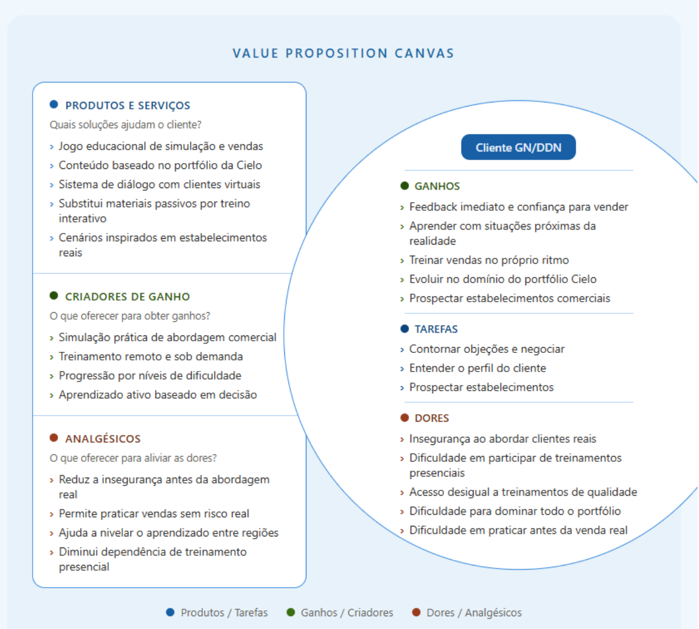 

 <sup>Fonte: Equipe cielitos, Faculdade Inteli 2026</sup>
</div>

&emsp; A imagem apresenta o **Value Proposition Canvas** do projeto Mini Mundo Cielo, ferramenta estratégica utilizada para estruturar a proposta de valor a partir do alinhamento entre as necessidades do cliente e as soluções oferecidas. O Canvas organiza, de um lado, o **perfil do cliente**, composto por suas tarefas, dores e ganhos, e, de outro, o **mapa de valor**, que descreve produtos e serviços, criadores de ganho e analgésicos. No contexto analisado, o cliente central é o **Gerente de Negócios** (GN/DDN), profissional responsável por prospectar estabelecimentos, compreender perfis de clientes, contornar objeções e conduzir negociações comerciais. 

&emsp; A imagem evidencia que esses profissionais enfrentam desafios relevantes, como insegurança na abordagem, dificuldade de acesso a treinamentos práticos e limitação no domínio do portfólio, ao mesmo tempo em que buscam ganhos como maior confiança, aprendizado aplicado e evolução no desempenho comercial. Em resposta a esse cenário, o Mini Mundo Cielo se posiciona como uma solução baseada em **simulação interativa**, oferecendo treinamento prático, progressivo e orientado por feedback imediato, reduzindo o risco da prática em situações reais e potencializando o desenvolvimento de competências comerciais.[\[29\]](#ref29)

&emsp; A proposta de valor do **Mini Mundo Cielo foi**, portanto, estruturada com base nessa lógica, conectando diretamente as necessidades dos GNs/DDNs a uma experiência de aprendizagem ativa. Embora o usuário direto da solução seja o profissional de vendas, a **Cielo S.A.** também se beneficia de forma estratégica, uma vez que o desenvolvimento dessas competências impacta diretamente a qualidade do atendimento, a eficiência do onboarding e a consistência das práticas comerciais em escala nacional. Dessa forma, o projeto articula dois níveis de valor complementares: no **nível individual**, promove aprendizado prático, autonomia e confiança; no **nível organizacional**, viabiliza um modelo de capacitação mais escalável, padronizado e mensurável.[30\]](#ref30)

&emsp; Um dos principais diferenciais do Mini Mundo Cielo está no seu formato **totalmente online**, acessível via navegador e sem necessidade de instalação, o que reduz barreiras logísticas e amplia significativamente o alcance do treinamento. Além disso, a solução se posiciona como uma iniciativa inovadora ao utilizar gamificação e **simulação de cenários reais** como ferramenta central de aprendizagem, substituindo modelos tradicionais baseados em conteúdos passivos por experiências interativas orientadas à tomada de decisão.

&emsp; Nesse contexto, o projeto se alinha a uma **transformação relevante** no ambiente corporativo, na qual treinamentos expositivos vêm sendo substituídos por abordagens mais eficazes, baseadas em prática, experimentação e feedback contínuo. Ao aproximar o treinamento da **realidade operacional** dos GNs/DDNs, o Mini Mundo Cielo aumenta a retenção do aprendizado, acelera o desenvolvimento de habilidades comerciais e contribui diretamente para melhoria de performance em campo.

&emsp; Embora o **Value Proposition Canvas** tenha sido estruturado a partir da perspectiva do Gerente de Negócios (GN/DDN), é possível analisar os impactos da solução em dois níveis complementares: o nível organizacional (Cielo S.A.) e o nível do usuário final (GN/DDN).

**Para a Cielo S.A. (impacto organizacional):**

- Ganhos gerados: padronização do treinamento comercial em escala nacional; redução da dependência de treinamentos presenciais; geração de métricas de desempenho; aceleração do onboarding de novos Gerentes de Negócios.

- Dores aliviadas: disparidade no nível de preparo entre regiões; dificuldade de escalar treinamentos com consistência; limitações dos modelos tradicionais de capacitação.

- Solução entregue: jogo educacional web-based que simula interações comerciais e permite acompanhamento mensurável do desenvolvimento dos profissionais.

**Para os Gerentes de Negócios (cliente do Canvas):**

- Ganhos gerados: aprendizado prático de técnicas de venda; possibilidade de treinar no próprio ritmo; feedback imediato; aumento da confiança em situações reais; maior domínio do portfólio de produtos.

- Dores aliviadas (analgésicos): redução da insegurança na abordagem comercial; acesso a treinamento prático sem riscos reais; superação das limitações de materiais passivos de capacitação.

- Produto/Serviço: experiência interativa baseada em simulação de cenários reais, com tomada de decisão, feedback contínuo e progressão por desempenho.

- Criadores de ganho: gamificação do processo de aprendizagem, prática repetível de situações de venda e feedback imediato que auxilia na consolidação das habilidades comerciais.

&emsp; Dessa forma, o **Mini Mundo Cielo** consolida uma proposta de valor centrada no usuário, mas com impacto direto nos resultados organizacionais, ao alinhar desenvolvimento individual e escalabilidade do treinamento corporativo.

### 1.1.5. Descrição da Solução Desenvolvida (sprint 4)

&emsp; O time Comercial da Cielo atua no modelo porta a porta, visitando estabelecimentos para ofertar soluções de pagamento e serviços de valor agregado. Atualmente, a empresa conta com aproximadamente 3.500 profissionais distribuídos em todo o território nacional, o que impõe desafios relevantes ao processo de capacitação. Equipes fora dos grandes centros urbanos frequentemente enfrentam limitações de acesso a treinamentos presenciais, gerando assimetrias no nível de preparo. Conforme Armstrong e Landers (2018) [\[25\]](#ref25), a dispersão geográfica em grandes organizações tende a comprometer a equidade no aprendizado e a padronização do conhecimento. 

&emsp; Para mitigar esse cenário, foi desenvolvido o Mini Mundo Cielo, um serious game acessado via navegador que aplica mecânicas de gamificação ao treinamento comercial. Fundamentado nos princípios de Kapp (2012) [\[26\]](#ref26), o jogo utiliza elementos típicos de jogos para facilitar a aprendizagem em contextos corporativos. A solução simula o cotidiano de um Gerente de Negócios, permitindo ao usuário explorar um ambiente em pixel art e interagir com clientes fictícios por meio de diálogos de múltipla escolha. Dessa forma, o colaborador pratica abordagens comerciais, contorna objeções e desenvolve domínio sobre o portfólio em um ambiente seguro e controlado.

&emsp; A solução foi concebida como uma ferramenta de treinamento assíncrono e de fácil acesso. Por operar diretamente no navegador, elimina barreiras técnicas e amplia o alcance da capacitação, garantindo que colaboradores de diferentes regiões tenham acesso à mesma experiência de aprendizado. De acordo com Werbach e Hunter (2012) [\[27\]](#ref27), a incorporação de elementos de game design em processos organizacionais permite a simulação de situações reais, favorecendo a aprendizagem prática sem riscos operacionais.

&emsp; Com a implementação da solução, espera-se promover maior padronização e escalabilidade do treinamento comercial, reduzindo disparidades regionais e elevando o nível médio de preparo da equipe. Além disso, o uso de jogos educativos tende a aumentar o engajamento e a retenção do conhecimento, aspectos fundamentais para a aplicação prática no campo. Conforme Gee (2017) [\[28\]](#ref28), ambientes interativos favorecem o desenvolvimento de competências complexas. Como consequência, projeta-se impacto positivo em indicadores como qualidade da abordagem comercial, taxa de conversão e desempenho geral de vendas.

&emsp; No fluxo de capacitação da Cielo, o Mini Mundo Cielo pode ser integrado à etapa inicial do processo de onboarding dos novos Gerentes de Negócios, após a apresentação institucional da empresa e o treinamento conceitual sobre o portfólio de soluções de pagamento. Nesse contexto, o jogo funciona como um ambiente de prática aplicada, no qual o colaborador pode simular situações reais de abordagem comercial e negociação antes de atuar diretamente em campo. Além disso, a ferramenta também pode ser utilizada como recurso complementar de reciclagem para profissionais já atuantes, permitindo atualização contínua de conhecimentos, estratégias de venda e domínio das soluções oferecidas pela empresa.

### 1.1.6. Matriz de Riscos (sprint 4)

&emsp; A antecipação de falhas críticas em projetos de tecnologia educacional exige uma abordagem que equilibre viabilidade técnica e engajamento do usuário. Esse processo está alinhado às práticas de gestão de riscos propostas pelo Project Management Institute (PMI), que define a identificação, análise e planejamento de respostas aos riscos como etapas fundamentais para reduzir incertezas e aumentar a probabilidade de sucesso em projetos (Project Management Institute, 2021). Segundo Kapp (2012) [\[26\]](#ref26), o sucesso de um serious game não depende apenas da estabilidade técnica, mas da capacidade de manter o fluxo de aprendizagem sem interrupções que comprometam a experiência do usuário.

<div align="center">
<sub>Tabela 1 - Matriz de Riscos e Oportunidades do Projeto</sub>

| # | Ameaça / Oportunidade  | Categoria | Descrição | Probabilidade (%) | Impacto | Responsável | Plano de Resposta |
|---|---|---|---|:---:|:---:|---|---|
| R1 | Ameaça | Tecnologia | Incompatibilidade do jogo com diferentes navegadores ou versões de sistema operacional dos GNs | 30% | Baixo | Alicia | Testar em Chrome, Edge e Firefox desde as primeiras sprints; padronizar versões mínimas suportadas na documentação. |
| R2 | Ameaça | Usuário / Engajamento | Desengajamento dos usuários com o formato de Serious Game | 50% | Alto | Eduardo | Aplicar testes de jogabilidade com o público-alvo real desde a Sprint 3; iterar narrativa e mecânicas com base no feedback. |
| R3 | Ameaça | Produto / Conteúdo | Conteúdo do portfólio Cielo sofrer alterações durante o desenvolvimento | 30% | Moderado | Sofia | Manter diálogos e missões parametrizáveis para facilitar atualização de conteúdo sem necessidade de refatoração de código. |
| R4 | Ameaça | Gestão de Projeto | Escopo técnico maior que a capacidade da equipe nas sprints definidas | 50% | Moderado | Gabriel | Priorizar MVP funcional com features essenciais; aplicar metodologia ágil com revisão de escopo a cada sprint. |
| R5 | Ameaça | Usuário / Usabilidade | Baixa adesão dos GNs por dificuldade com ferramentas digitais | 70% | Alto | Rachel | Garantir tutorial interativo progressivo no início do jogo;  priorizar UX simples e intuitiva em todas as telas; aplicar testes de usabilidade com usuários reais para validar a simplicidade da interface. |
| O1 | Oportunidade | Produto / Qualidade | Feedback positivo de usuários durante testes de jogabilidade | 70% | Alto | Eduardo | Realizar playtests frequentes com usuários reais; incorporar sugestões nas iterações de sprint para melhorar experiência e usabilidade. |
| O2 | Oportunidade | Estratégia / Treinamento | Padronização nacional do treinamento da Cielo | 90% | Alto | Lucas | Desenvolver conteúdo modular e atualizável, garantindo compatibilidade ampla entre navegadores e dispositivos. |
| O3 | Oportunidade | Engajamento do Usuário | Alta adesão dos GNs ao formato gamificado | 50% | Moderado | Rachel | Reforçar elementos de gamificação como ranking, CieloCoins, progressão, feedback imediato. |
| O4 | Oportunidade | Financeiro / Operacional | Redução de custos operacionais de treinamento | 30% | Baixo | Gabriel | Priorizar um MVP funcional que substitua parte dos treinamentos presenciais. |
| O5 | Oportunidade | Tecnologia / Dados | Implementação de sistema robusto de salvamento e gestão de progresso do jogador | 20% | Baixo | Nicolas | Implementar salvamento de estado da sessão e estruturar base para futuras integrações com backend, aumentando a confiabilidade e escalabilidade do sistema. |

<sup>Fonte: Equipe cielitos, Faculdade Inteli 2026</sup>
</div>

&emsp; A Tabela  apresenta a matriz de riscos do projeto, identificando as principais incertezas relacionadas ao desenvolvimento do Mini Mundo Cielo. A análise dos riscos evidencia que os fatores mais críticos do projeto estão concentrados na dimensão do usuário. O risco de desengajamento com o formato gamificado (R2) e a baixa adesão decorrente de dificuldades com ferramentas digitais (R5) combinam alta probabilidade com elevado impacto, configurando-se como os principais pontos de atenção. Esses riscos indicam que o sucesso da solução está menos condicionado a desafios técnicos e mais à capacidade de gerar uma experiência acessível, intuitiva e relevante para o público-alvo. Em contrapartida, riscos técnicos como incompatibilidade entre navegadores (R1) e mudanças no portfólio (R3) apresentam menor criticidade relativa, sendo mitigáveis por meio de boas práticas de desenvolvimento e parametrização do conteúdo.

&emsp; No que se refere às oportunidades, destaca-se a possibilidade de padronização nacional do treinamento (O2), que apresenta alta probabilidade e impacto elevado, configurando-se como o principal vetor estratégico do projeto. Adicionalmente, o potencial de aumento de engajamento por meio da gamificação (O3) e a geração de feedback contínuo a partir de testes com usuários (O1) reforçam o caráter iterativo e orientado à melhoria contínua da solução. A redução de custos operacionais (O4) e a evolução tecnológica com sistemas de salvamento e gestão de progresso (O5) complementam os ganhos esperados, ainda que com menor impacto imediato.

<div align="center">
 <sub>Imagem 4 - Matriz de Riscos</sub>
 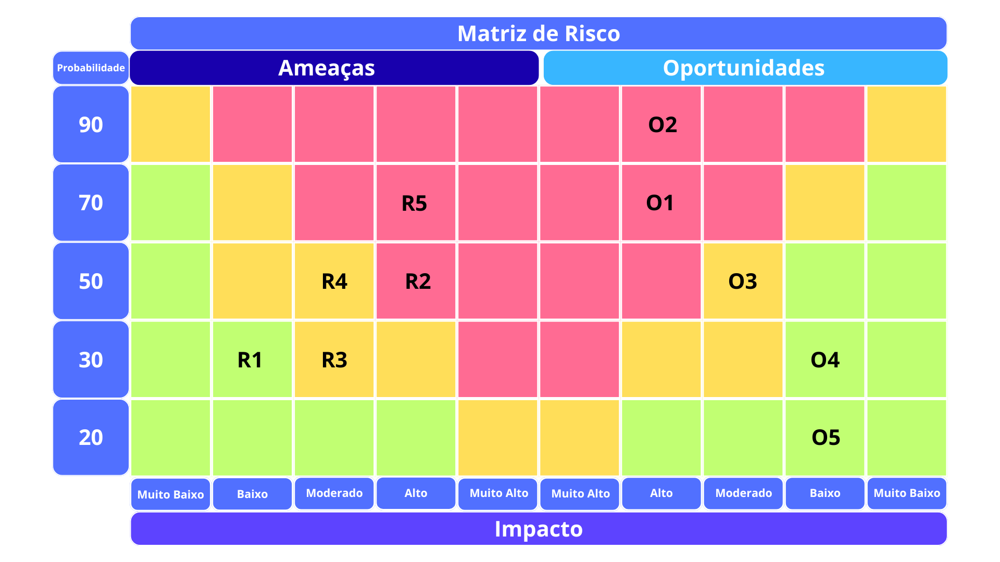

 <sup>Fonte: Equipe cielitos, Faculdade Inteli 2026</sup>
</div>

&emsp; A imagem apresenta a matriz de riscos do projeto, relacionando probabilidade de ocorrência e impacto no desenvolvimento. A visualização permite identificar rapidamente os itens de maior criticidade, com destaque para R2 e R5, posicionados em zonas de maior atenção, e para O2, como principal oportunidade estratégica. Essa representação gráfica facilita a priorização de esforços e o direcionamento das ações ao longo das sprints.

&emsp; A análise integrada da matriz permite que a equipe direcione recursos e decisões de forma mais eficiente, priorizando riscos críticos e potencializando oportunidades de maior impacto. Alinhada aos princípios ágeis, essa abordagem contribui para a redução de retrabalho, aumento da qualidade do produto e maior aderência às necessidades reais dos usuários. Como resultado, o projeto evolui de forma controlada, mantendo consistência técnica e relevância prática para o contexto comercial da Cielo.

### 1.1.7. Objetivos, Metas e Indicadores (sprint 4)

&emsp; O modelo SMART, proposto por George T. Doran, (Doran, 1981) [\[29\]](#ref29), é uma abordagem amplamente utilizada na definição de objetivos, baseada em cinco critérios: específicos (Specific), mensuráveis (Measurable), alcançáveis (Achievable), relevantes (Relevant) e temporais (Time-bound). Essa metodologia permite estruturar metas de forma clara e objetiva, facilitando o acompanhamento do progresso e a avaliação dos resultados ao longo do tempo. 

&emsp; No contexto do projeto Mini Mundo Cielo, a aplicação do modelo SMART contribui para organizar o desenvolvimento em etapas bem definidas, garantindo que cada entrega esteja alinhada às expectativas do parceiro e às necessidades dos usuários, além de seguir boas práticas de gerenciamento de projetos, conforme orientado pelo PMBOK Guide do Project Management Institute (2021) [\[30\]](#ref30).

<div align="center">
<sub>Tabela 2 - Objetivos SMART do Projeto</sub>

| # | Objetivo | Específico | Mensurável | Alcançável | Relevante | Temporal |
|---|----------|-----------|-----------|-----------|----------|---------|
| O1 | Entregar MVP funcional com Cidade 1 completa | Implementar mapa, cenas de estabelecimentos internas, 7 NPCs com diálogos e sistema de moedas | 100% dos requisitos da Cidade 1 implementados e testados | Escopo dimensionado para 5 sprints com equipe de 8 pessoas, alinhado a práticas ágeis de desenvolvimento incremental recomendadas pelo Scrum Guide | Permite validar o core loop do jogo com o parceiro | Até o final da Sprint 4 |
| O2 | Melhorar navegação no mapa | Ajustar colisões e movimentação | ≤ 2 erros de colisão por mapa | Baseado no tiled map já desenvolvido | GGarante jogabilidade fluida | Até o final da Sprint 5 |
| O3 | Validar o jogo com testes de jogabilidade | Realizar sessões de playtest com pelo menos 5 usuários externos | Coletar avaliação mínima de 7/10 de satisfação nos testes | Acessar usuários por meio da rede de contatos da equipe e da Inteli | Fundamenta decisões de melhoria com base em dados reais | Até o final da Sprint 5 |
| O4 | Garantir acessibilidade básica | Implementar modo daltônico, controle de volume e brilho | Todas as opções de acessibilidade funcionais nas configurações | Recursos já planejados na mecânica de configurações | Atende a diversidade do público-alvo de 3.000 GNs anuais | Até o final da Sprint 4 |
| O5 | Representar diversidade no elenco de personagens | Criar 4 personagens jogáveis e 8 NPCs com diversidade étnica e regional | 100% dos personagens com fichas técnicas e sprites finalizados | Personagens já desenvolvidos em pixel art nas primeiras sprints | Reflete a diversidade real da base de vendedores da Cielo no Brasil | Até o final da Sprint 2 |

<sup>Fonte: Equipe cielitos, Faculdade Inteli 2026</sup>
</div>

&emsp; A Tabela apresenta os principais objetivos estratégicos do projeto estruturados de acordo com os critérios do modelo SMART. Cada objetivo foi detalhado considerando sua especificidade, forma de mensuração, viabilidade de execução, relevância para o projeto e prazo de realização. Essa organização permite que os objetivos do projeto sejam compreendidos de maneira clara e objetiva, além de garantir que cada meta possua critérios concretos para sua implementação e avaliação. Dessa forma, a equipe consegue alinhar o planejamento das sprints com os resultados esperados, assegurando que o desenvolvimento do jogo avance de forma estruturada e consistente.

&emsp; Para acompanhar a evolução do projeto, cada objetivo estratégico foi desdobrado em metas SMART e indicadores de desempenho (KPIs). Enquanto as metas definem os resultados esperados dentro de um prazo específico, os indicadores permitem monitorar quantitativamente o progresso e avaliar o alcance dos objetivos do projeto.

<div align="center">
<sub>Tabela 3 - Objetivo, Meta e Indicador</sub>

| Objetivo | Meta (SMART) | Indicador (KPI) |
|----------|--------------|----------------|
| Desenvolver o núcleo jogável do Mini Mundo Cielo | Entregar um MVP funcional da Cidade 1 contendo mapa completo, NPCs e sistema de moedas até o final da Sprint 4 | Percentual de funcionalidades implementadas da Cidade 1 (%) |
| Melhorar a experiência de navegação no mapa | Reduzir erros de colisão e movimentação para no máximo 2 por mapa até a Sprint 5 | Número de bugs de colisão registrados nos testes |
| Validar a experiência de jogabilidade | Realizar testes com pelo menos 5 usuários externos e atingir nota média mínima de 7/10 até a Sprint 5 | Média de satisfação dos usuários nos playtests |
| Garantir acessibilidade básica no jogo | Implementar modo daltônico, controle de volume e brilho no menu de configurações até a Sprint 4 | Número de funcionalidades de acessibilidade implementadas |
| Representar diversidade entre personagens | Desenvolver 4 personagens jogáveis e 8 NPCs com diversidade étnica e regional até a Sprint 2 | Percentual de personagens finalizados (%) |

<sup>Fonte: Equipe cielitos, Faculdade Inteli 2026</sup>
</div>

&emsp; A Tabela apresenta o desdobramento dos objetivos estratégicos em metas SMART associadas a indicadores de desempenho (KPIs). Enquanto os objetivos definem a direção geral do projeto, as metas estabelecem resultados específicos a serem alcançados dentro de um período determinado. Já os indicadores permitem medir quantitativamente o progresso do desenvolvimento, possibilitando acompanhar a evolução do projeto ao longo das sprints. Essa relação entre objetivo, meta e indicador facilita o monitoramento contínuo das entregas e contribui para uma gestão mais eficiente e orientada a resultados.

&emsp; Dessa forma, a definição estruturada de objetivos, metas e indicadores contribui para garantir maior clareza no planejamento e no acompanhamento do projeto. A utilização do modelo SMART, aliada ao monitoramento por meio de indicadores de desempenho, permite avaliar de maneira objetiva o progresso das atividades e identificar possíveis necessidades de ajustes ao longo do desenvolvimento. Esse processo fortalece a gestão do projeto e assegura que as entregas estejam alinhadas aos objetivos estabelecidos e às expectativas do parceiro.

## 1.2. Requisitos do Projeto (sprints 1 e 2)

&emsp; Os requisitos do projeto descrevem as funcionalidades e características necessárias para o desenvolvimento do jogo, considerando as demandas do parceiro e as decisões do grupo. Eles orientam a implementação técnica e a experiência do usuário, devendo ser atualizados sempre que houver mudanças no projeto.

<div align="center">
<sub>Tabela 4 - Requisitos Funcionais do Projeto</sub>

\# | Requisitos Funcionais (RF)
--- | ---
RF01| O jogo deverá apresentar uma tela inicial contendo as opções “Jogar”, “Créditos” e “Configurações”.
RF02| O jogo deverá permitir o controle do personagem por meio das seta do teclado numérico para movimentação no ambiente.
RF03| O jogo deverá permitir a interação com objetos e NPCs através do acionamento da tecla E.
RF04| O jogo deverá apresentar uma tela de seleção de personagens antes do início da partida.
RF05| O jogo deverá apresentar um mapa interativo que possibilite o acompanhamento do deslocamento e progresso do personagem.
RF06| O jogo deverá permitir a interação com NPCs que simulem situações reais de atendimento e venda de serviços.
RF07| O jogo deverá apresentar diálogos interativos que representem etapas do processo de venda utilizado pelo parceiro.
RF08| O jogo deverá bloquear temporariamente o controle de movimentação do jogador durante diálogos, eventos narrativos ou interações importantes, retomando o controle após o término da interação.
RF09| O jogo deverá exibir janelas informativas ou pop-ups para apresentar instruções, feedbacks de ações, resultados de desafios, alertas e outras informações relevantes ao jogador.
RF10| O jogo deverá incluir quizzes e puzzles que registrem métricas de acertos e falhas dos jogadores.
RF11| O jogo deverá conter missões vinculadas ao ganho de moedas como sistema de progressão e recompensa.
RF12| O jogo deverá ser estruturado em levels (níveis) com dificuldade e objetivos progressivos.
RF13| O jogo deverá conter cutscenes para introduzir a narrativa e realizar transições entre missões.
RF14| O jogo deverá apresentar um Menu de pausa com opções de retornar ao jogo, configurações e sair.
RF15| O jogo deverá apresentar instruções claras e progressivas sobre suas mecânicas e objetivos.
RF16| O jogo deverá apresentar uma cena final de encerramento após a conclusão de todos os níveis e metas.
 
<sup>Fonte: Equipe cielitos, Faculdade Inteli 2026</sup>
</div>

<div align="center">
<sub>Tabela 5 - Requisitos Não Funcionais do Projeto</sub>

\# |  Requisitos Não Funcionais (RNF)
--- |---|
RNF01| O jogo deverá ser desenvolvido para a plataforma web, permitindo acesso via navegador sem necessidade de instalação.
RNF02| O jogo deverá utilizar a identidade visual (cores e logotipos) da Cielo.
RNF03| O jogo deverá conter referências visuais, logotipos e cores dos bancos parceiros (Bradesco e Banco do Brasil), incluindo a representação de suas agências.
RNF04| O jogo deverá integrar o aprendizado de técnicas de venda e serviços à narrativa e às missões de forma pedagógica.
RNF05| O jogo deverá basear suas missões e rotas em trajetos e situações reais enfrentadas pelos vendedores da Cielo.
RNF06| O jogo deverá permitir, através do menu de configurações, o ajuste de volume, brilho e a ativação de um modo de daltonismo.
RNF07| O jogo deverá ser intuitivo, garantindo que o jogador compreenda a progressão sem auxílio externo.

<sup>Fonte: Equipe cielitos, Faculdade Inteli 2026</sup>
</div>

## 1.3. Público-alvo do Projeto (sprint 2)

&emsp; O público-alvo é definido como o extrato demográfico e profissional para o qual o produto é direcionado, permitindo a personalização da linguagem e das mecânicas de engajamento para maximizar a conversão educacional. [\[11\]](#ref11) No contexto do Mini Mundo Cielo, o foco reside na padronização da excelência comercial em escala nacional. 

&emsp; O público-alvo é composto por novos Gerentes de Negócios (GNs) da área comercial da Cielo. São adultos com ensino médio completo, com idade média aproximada de 44 anos, distribuídos por todo o território brasileiro. Anualmente, cerca de 3.000 novos profissionais ingressam na função, com maior concentração na região Sudeste (aproximadamente 2.000), seguida pelo Nordeste (315), Sul (340), Centro-Oeste (200) e Norte (100), evidenciando um público geograficamente diverso.

&emsp; Trata-se de profissionais em fase ativa da carreira, muitos com responsabilidades pessoais e foco em estabilidade e crescimento profissional. A função de Gerente de Negócios representa uma oportunidade dentro do mercado formal, o que indica um público que valoriza resultados concretos e aplicabilidade prática no trabalho.

&emsp; Por atuarem na área comercial, desenvolvem habilidades de comunicação e argumentação, embora possam apresentar diferentes níveis de familiaridade com ferramentas digitais. Assim, o jogo deve priorizar simplicidade, clareza e usabilidade, garantindo um treinamento acessível e alinhado à realidade desses profissionais em diferentes contextos regionais. 

&emsp; A Cielo já utiliza jogos físicos em treinamentos presenciais, bem recebidos pelos participantes. O Mini Mundo Cielo surge como evolução dessa estratégia, digitalizando e ampliando o acesso ao aprendizado, ao mesmo tempo em que reforça a cultura da empresa e promove padronização do treinamento em escala nacional. 

### Perfil Demográfico e Profissional

- **Segmento:** Novos Gerentes de Negócios (GN) da área comercial da Cielo S.A.

- **Escolaridade:** Ensino Médio completo (mínimo exigido para a função).

- **Faixa Etária Média:** 44 anos (Perfil de adultos com experiência prévia em vendas ou transição de carreira).

- **Necessidade Operacional:** Profissionais em fase de onboarding que necessitam de domínio rápido do portfólio (Cielo Tap, Lio, e-commerce) e da cultura organizacional. [\[1\]](#ref1)

- **Distribuição Geográfica e Escala**
O projeto visa atender uma demanda anual de aproximadamente 3.000 novos profissionais, caracterizando-se por uma alta dispersão geográfica que justifica a digitalização do treinamento.

- **Justificativa de Gamificação Digital**
A utilização de gamificação no Mini Mundo Cielo busca tornar o processo de treinamento mais engajador e acessível para os Gerentes de Negócios da empresa. Ao transformar situações reais de vendas em desafios interativos, o jogo permite que os profissionais pratiquem tomada de decisão, comunicação e identificação de necessidades do cliente em um ambiente seguro e controlado. Além disso, o formato digital possibilita padronizar o treinamento em diferentes regiões do país, garantindo maior equidade no acesso ao aprendizado.

# <a name="c2"></a>2. Visão Geral do Jogo (sprint 2)

## 2.1. Objetivos do Jogo (sprint 2)

&emsp; O objetivo do jogo é capacitar o jogador no desenvolvimento de competências específicas de atendimento e vendas, como identificação de necessidades do cliente, comunicação persuasiva e resolução de objeções. A aprendizagem ocorre por meio de missões interativas que simulam situações reais do cotidiano comercial, nas quais o jogador deve interagir com NPCs, responder quizzes e tomar decisões que impactam o resultado da negociação. A progressão é estruturada em fases com sistemas de pontuação, feedback imediato e recompensas, permitindo mensurar o desempenho e acompanhar a evolução das habilidades ao longo da experiência. A conclusão do jogo ocorre quando o jogador completa todas as missões disponíveis nas cidades do mapa, atendendo diferentes estabelecimentos comerciais e acumulando pontuação e moedas por meio de decisões corretas nos desafios e quizzes. Ao finalizar todas as etapas, o jogador é reconhecido dentro da narrativa como um gerente de negócios preparado para atuar com excelência no atendimento e na venda de soluções da Cielo. [19](#ref19)


## 2.2. Características do Jogo (sprint 2)

&emsp; O Mini Mundo Cielo é classificado como um Serious Game, projetado para equilibrar a carga pedagógica com o entretenimento. Suas características técnicas foram selecionadas para atender à diversidade do público-alvo e à complexidade do ecossistema de pagamentos. [\[4\]](#ref4)

### 2.2.1. Gênero do Jogo (sprint 2)

&emsp; O Mini Mundo Cielo é classificado tecnicamente como um Serious Game (Jogo Sério) educacional, [\[20\]](#ref20)com uma estrutura híbrida que combina elementos de Simulação, RPG Leve e Aventura Narrativa. O foco central não reside apenas no entretenimento, mas na validação de competências críticas para o sucesso comercial dentro da Cielo S.A. [\[4\]](#ref4)

&emsp; A experiência mergulha o jogador em uma jornada interativa onde a progressão é pautada por missões de campo e tomada de decisão em tempo real. Cada fase funciona como um laboratório seguro para testar habilidades de negociação, resolução de problemas e domínio técnico do portfólio de produtos, transformando o onboarding em um processo dinâmico e envolvente.

### 2.2.2. Plataforma do Jogo (sprint 2)

&emsp; O jogo será desenvolvido para desktop, com acesso via navegador, dispensando instalação.

- **Dispositivo compatíveis:** Computadores desktop e notebooks.

- **Sistemas compatíveis:** Navegadores modernos compatíveis (Google Chrome, Microsoft Edge e Firefox).

### 2.2.3. Número de jogadores (sprint 2)

&emsp; Mini Mundo Cielo é projetado para um jogador (single player), permitindo experiência individual focada no aprendizado e na progressão personalizada das habilidades de vendas.

### 2.2.4. Títulos semelhantes e inspirações (sprint 2)

&emsp; O projeto se inspira em jogos que utilizam progressão por tarefas, interação com personagens e evolução gradual do jogador. Um dos principais referenciais é Stardew Valley, que apresenta mecânicas de rotina, missões e interação com NPCs, influenciando a estrutura de progressão do jogo.

<div align="center">
 <sub>Imagem 4 - Stardew Valley</sub><br/>
 

 <sup>Fonte: Stardew Valley, 2026.</sup><br/>

 <sub>Imagem 5 - Stardew Valley</sub>
 

 <sup>Fonte: Stardew Valley, 2026.</sup>
</div>

&emsp; Outra inspiração é Pokémon FireRed, que contribui com a lógica de progressão por objetivos, desbloqueio de novas áreas e evolução contínua das habilidades do jogador. Esses elementos orientam a organização das fases e o sistema de recompensas do projeto.

<div align="center">
 <sub>Imagem 6 - Pokemon FireRed</sub>
 

 <sup>TechTudo (2016)</sup>
</div>

&emsp; O jogo também se baseia em princípios de gamificação e serious games aplicados à aprendizagem profissional.

### 2.2.5. Tempo estimado de jogo (sprint 5)

&emsp; O jogo foi projetado para sessões curtas e progressivas, permitindo que cada partida tenha duração média de até 15 minutos, facilitando sua aplicação em contextos de aprendizagem e treinamento. A experiência completa é estimada em aproximadamente 3 horas, considerando a realização de todas as missões, desafios e interações previstas nas diferentes fases. 

&emsp; Ressalta-se que essa estimativa será validada por meio de testes com o público-alvo, que permitirão avaliar o tempo real de conclusão, identificar possíveis ajustes de ritmo e refinar a duração total da experiência conforme o comportamento dos jogadores.

# <a name="c3"></a>3. Game Design (sprints 2 e 3)

## 3.1. Enredo do Jogo (sprints 2 e 3)

&emsp; O jogo simula o dia a dia de um DDN da Cielo, profissional responsável pelo relacionamento com estabelecimentos comerciais e pela expansão de soluções de pagamento da empresa. A experiência busca aproximar o jogador da realidade do trabalho em campo, apresentando situações comuns do cotidiano comercial.

&emsp; A jornada do jogador começa em uma agência bancária parceira da Cielo, onde o personagem inicia seu dia de trabalho. Nesse ambiente, ele interage com o Gerente Geral e com o Gerente PJ, que apresentam os objetivos e direcionam a missão do dia.

&emsp; A partir desse momento, o jogador passa a visitar diferentes estabelecimentos comerciais da região, onde precisa interagir com comerciantes, compreender suas necessidades e apresentar soluções adequadas de pagamento. Cada interação simula etapas reais do processo de vendas, como abordagem inicial, identificação de demandas do cliente, argumentação comercial e resolução de dúvidas.

&emsp; Ao longo da experiência, o jogador recebe missões que representam desafios progressivamente mais complexos, exigindo tomada de decisão, comunicação estratégica e capacidade de negociação. Cada missão concluída contribui para o avanço na jornada profissional do personagem.

&emsp; A progressão narrativa acompanha essa evolução, permitindo que o jogador desbloqueie novos estabelecimentos, enfrente situações mais desafiadoras e aprofunde sua compreensão sobre o processo de vendas e relacionamento com clientes. Dessa forma, a narrativa funciona como um fio condutor da aprendizagem, contextualizando as atividades do jogo em situações inspiradas na prática profissional de um DDN da Cielo.

## 3.2. Personagens (sprints 2 e 3)

### 3.2.1. Controláveis

<div align="center">
<sub>Tabela 6 - Personagens</sub>

| \#  |          Personagem           |                  Spritesheet                  |
| :-: | :---------------------------: | :-------------------------------------------: |
|  1  | Gabriel Oliveira | 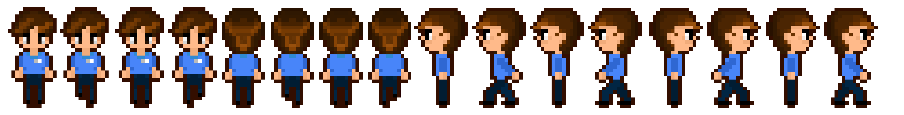  |
|  2  | Maya Souza | 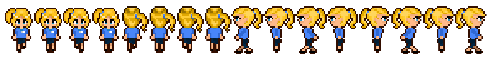 |
|  3  | Dandara Santos | 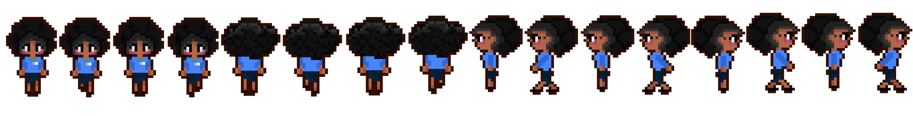  |
|  4  |João Victor |   |

<sup>Fonte: Equipe cielitos, Faculdade Inteli 2026</sup>
</div>

## Personagens Controláveis

&emsp; Os personagens controláveis representam os novos Gerentes de Negócios da Cielo em processo de onboarding. Embora possuam identidades visuais e histórias individuais distintas, todos os personagens compartilham a diversidade étnica e cultural brasileira, refletindo o compromisso do projeto com a representatividade. 

Cada personagem foi desenvolvido em pixel art 2D, com spritesheet contendo 16 frames, que estão organizados em quatro direções de movimentação com quatro frames de animação cada, o que permite movimentação fluida no mapa em formato top-down. As diferenças entre os personagens são de natureza narrativa e representativa, não havendo distinções de vantagem mecânica entre eles, o que assegura equidade na experiência de aprendizagem. A escolha do personagem pelo jogador impacta exclusivamente na identificação e na imersão visual, sem interferir no desempenho ou nas mecânicas de jogo.

&emsp; Nota: Todos os personagens compartilham a mesma estrutura visual: uniforme azul com crachá institucional e dispositivo de pagamento portátil. As distinções entre eles são exclusivamente de ordem narrativa e representativa.

### Gabriel Oliveira:

&emsp; Gabriel Oliveira é um personagem masculino de 38 anos, oriundo de Recife (PE). Seu perfil narrativo foi concebido para representar o modelo de gerente orientado à construção e à manutenção de relacionamentos com clientes. No contexto do jogo, sua atuação está associada à gestão de carteira e ao atendimento recorrente, com ênfase na fidelização. Visualmente, o personagem é apresentado em pixel art 2D com uniforme azul, crachá institucional e dispositivo de pagamento portátil.

### Maya Souza:

&emsp; Maya Souza é uma personagem feminina de 42 anos, natural de Salvador (BA). Seu perfil narrativo representa o modelo de gerente com foco em desenvolvimento e crescimento de clientes. No âmbito do jogo, sua atuação está associada à expansão de negócios e ao cumprimento de metas de crescimento, com ênfase na ampliação de resultados da carteira sob sua responsabilidade. Visualmente, a personagem é apresentada em pixel art 2D com uniforme azul, crachá institucional e dispositivo de pagamento portátil.

### Dandara Santos:

&emsp; Dandara Santos é uma personagem feminina de 40 anos, originária de São Paulo (SP). Seu perfil narrativo representa o modelo de gerente voltado à negociação e à construção de confiança com o cliente. No contexto do jogo, sua atuação está associada a negociações complexas e ao atendimento consultivo, com ênfase na condução estruturada de interações comerciais. Visualmente, a personagem é apresentada em pixel art 2D com uniforme azul, crachá institucional e dispositivo de pagamento portátil.

### João Victor

&emsp; João Victor é um personagem masculino de 45 anos, proveniente de Pelotas (RS). Seu perfil narrativo foi desenvolvido para representar o modelo de gerente voltado à conversão de novos clientes. No jogo, sua atuação está associada à aquisição de novos contratos, com ênfase na prospecção ativa e no fechamento inicial de vendas. Visualmente, o personagem é apresentado em pixel art 2D com uniforme azul, crachá institucional e dispositivo de pagamento portátil.

#### Fichas técnicas visuais dos quatro personagens controláveis:

<div align="center">
 <sub>Imagem 7 - Fixa técnica dos personagens jogáveis</sub>
 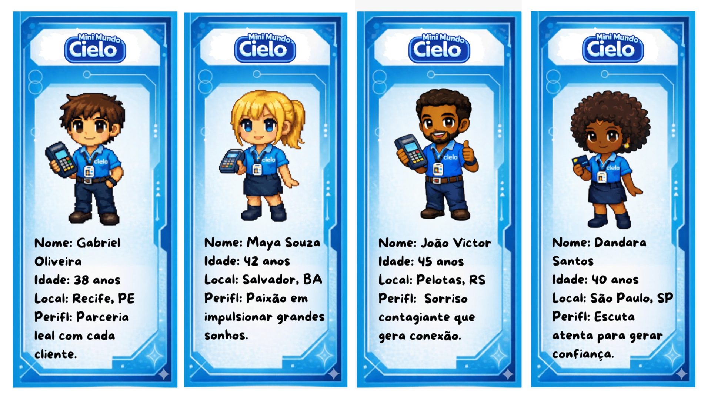

 <sup>Fonte: Equipe cielitos, Faculdade Inteli 2026</sup>
</div>

&emsp; Com isso, espera-se que o jogador se identifique com os personagens e se sinta representado ao longo da experiência. A diversidade narrativa, aliada à equidade mecânica, reforça a imersão e contribui para uma gameficação do onboarding mais envolvente e significativa.

### 3.2.2. Non-Playable Characters (NPC)

&emsp; Os NPCs do Mini Mundo Cielo são fundamentais para a progressão do enredo, trazendo auxílio para a resolução de puzzles e determinação dos objetivos primários e secundários do jogador.

<div align="center">
<sub>Tabela 7 - NPCs</sub>

| # | Personagem | Classificação | Ilustração |
|:-:|:----------:|:-------------:|:----------:|
| 1 | Alícia  | Trabalha no mercado | 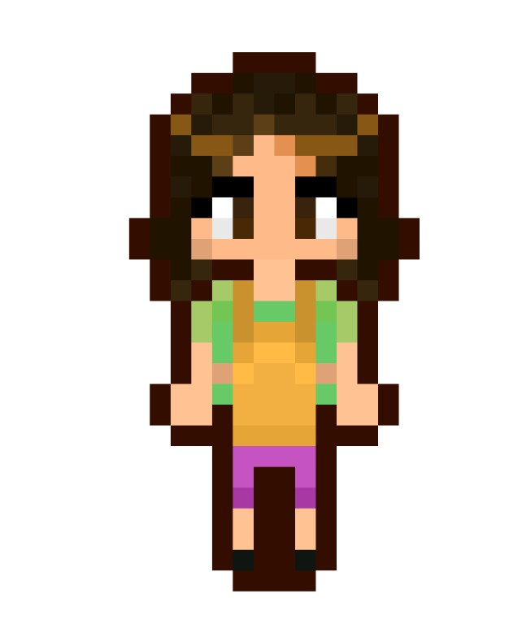 |
| 2 | Eduardo | Trabalha no salão de beleza | 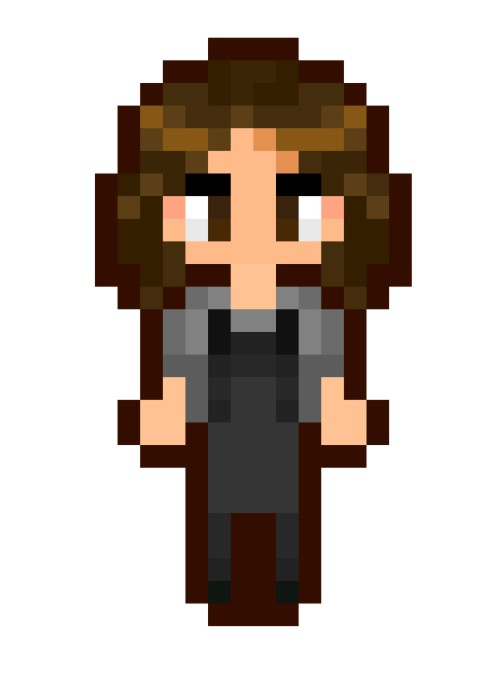 |
| 3 | Lucas | Trabalha no restaurante de comida japonesa | 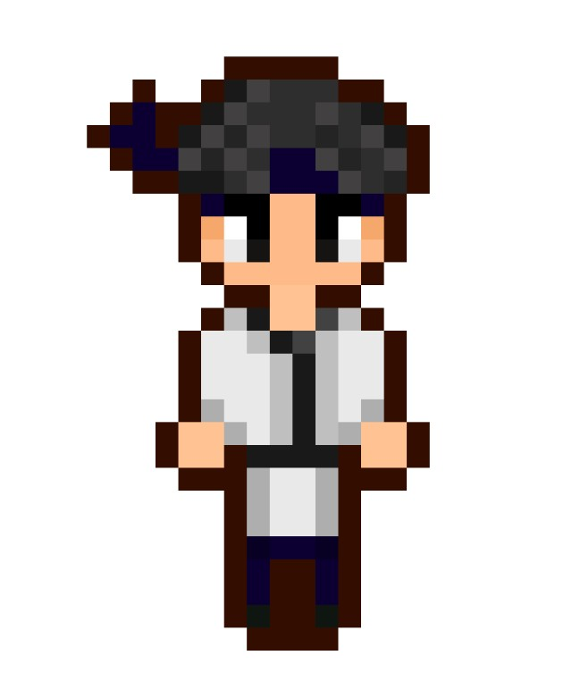 |
| 4 | Gabriel | Trabalha em escritório | 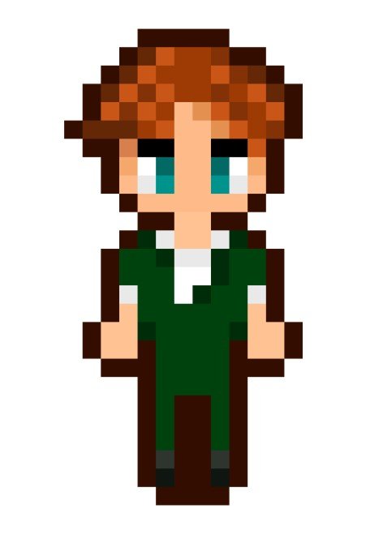 |
| 5 | Nicolas | Trabalha no posto de gasolina |  |
| 6 | Rachel | Trabalha na farmácia |  |
| 7 | Sofia | Trabalha na padaria | 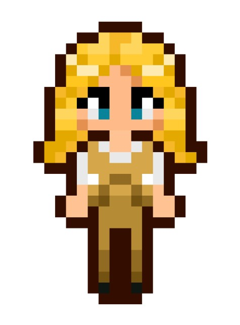 |
| 8 | Vanessa | Tutora do usúario/ jogador |  |
| 9 | Theo | PJ da primeira agência | 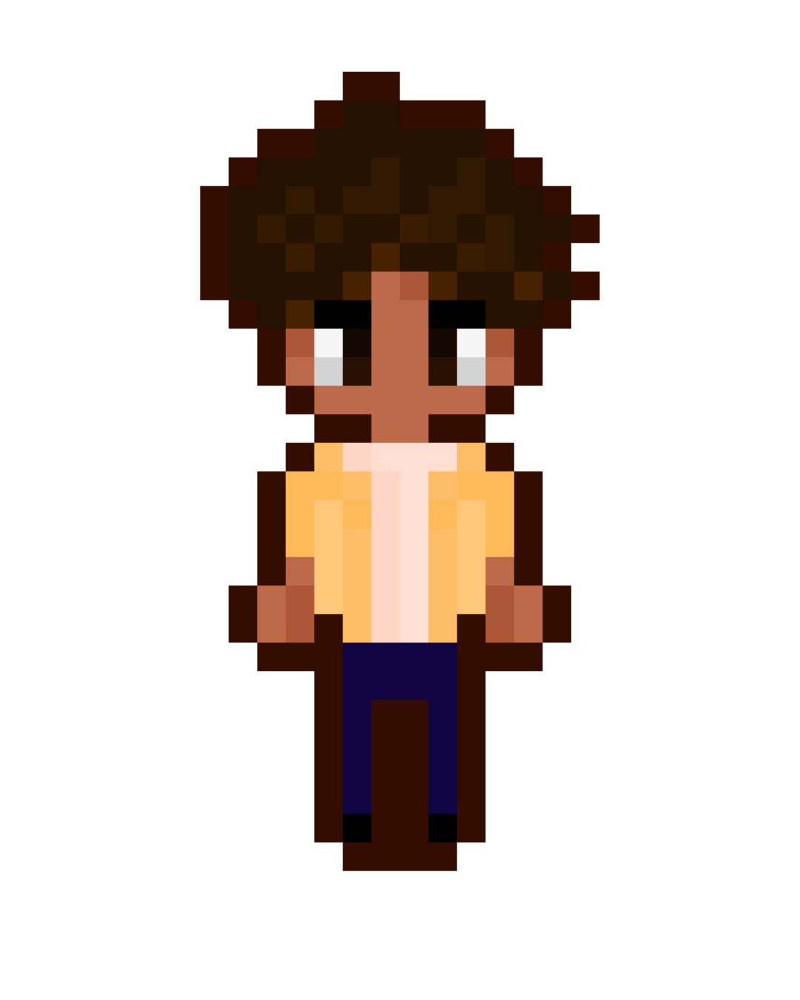 |
| 10 | Camila | PJ da segunda agência | 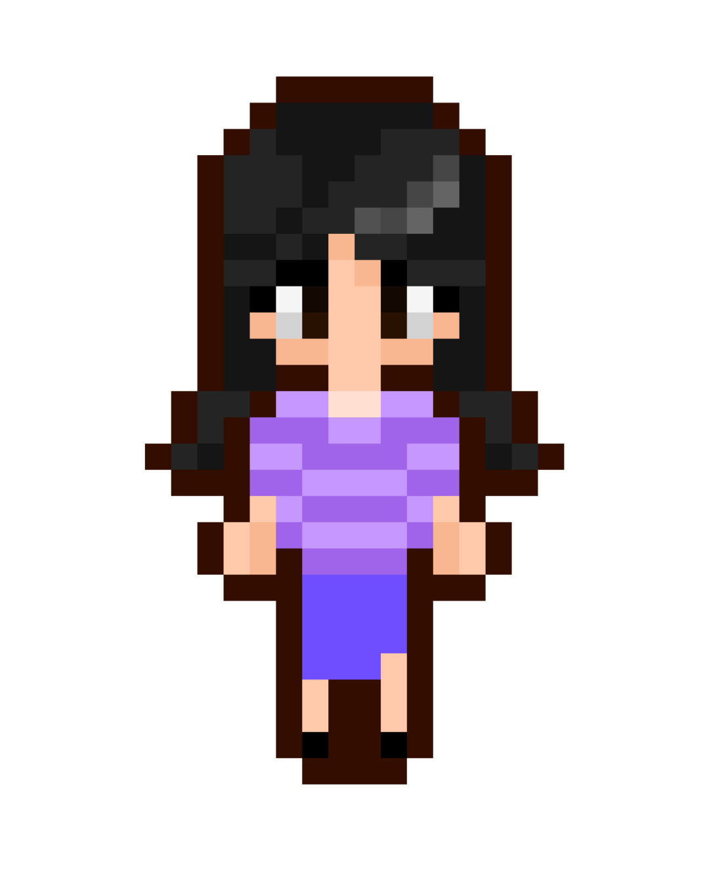 |
| 11 | Pricila | PJ da terceira agência | 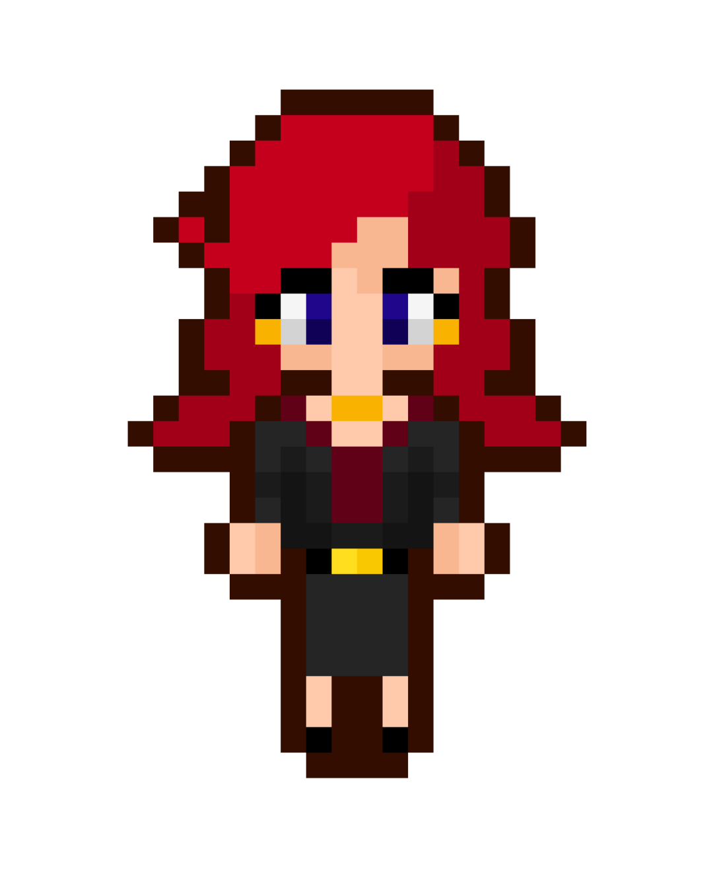 |
| 12 | Iza | Gerente da primeira agência | 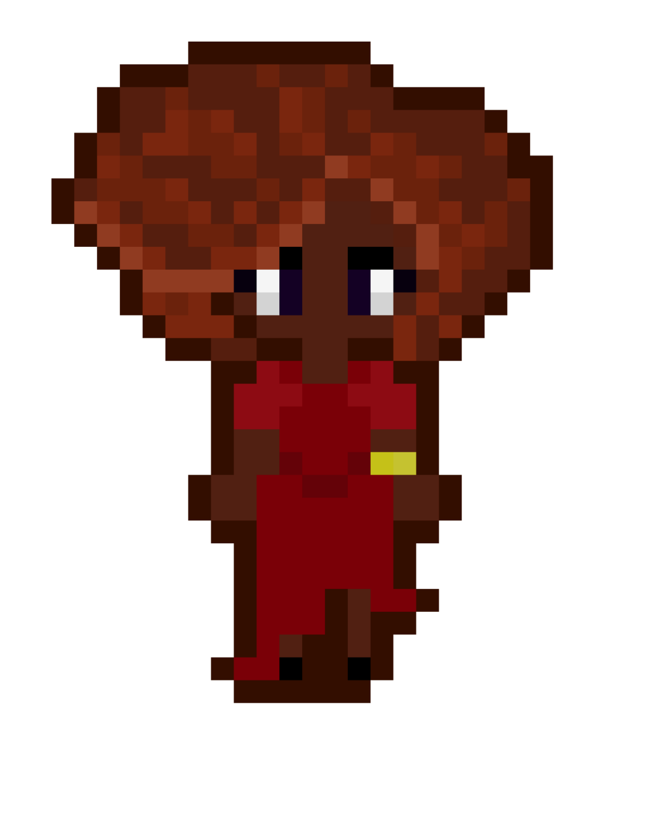 |
| 13 | Enzo | Gerente da segunda agência | 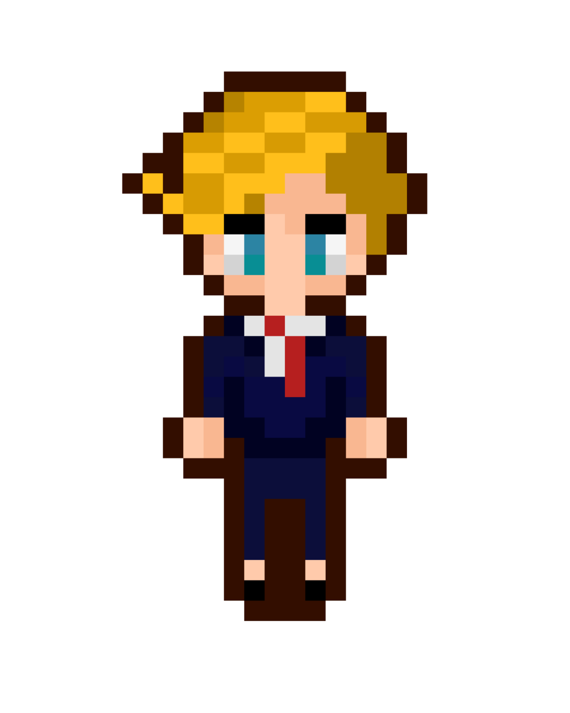 |
| 14 | Leticia | Gerente da terceira agência | 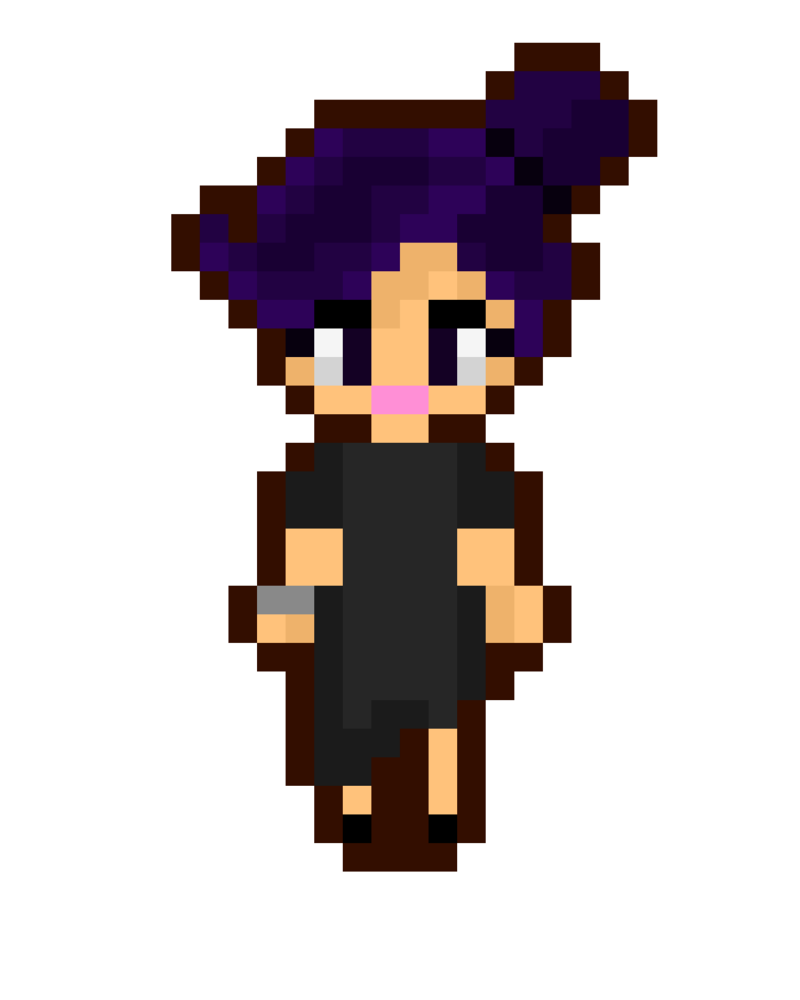 |

 <sup>Fonte: Equipe cielitos, Faculdade Inteli 2026</sup>
</div>
</div> 

### 3.2.3. Diversidade e Representatividade dos Personagens

&emsp; A concepção do elenco do Mini Mundo Cielo fundamenta-se na senioridade e na capilaridade nacional dos gerentes de negócios da companhia. A escolha das personagens Dandara, Gabriel, João Vitor e Maya foi estruturada para transpor a barreira do entretenimento, atuando como um instrumento de equidade pedagógica. [\[14\]](#ref14)

- **Embasamento na Realidade Brasileira:** As decisões de design estão ancoradas nos dados do Censo Demográfico 2022 (IBGE), que reporta uma população majoritariamente feminina e negra (pretos e pardos somam 55,5% dos brasileiros). [\[16\]](#ref16) Ao definir a idade média das personagens em 44 anos, o projeto espelha a maturidade profissional exigida pelo cargo de gestão na Cielo, enquanto a seleção de sobrenomes como "Santos" e "Souza" reflete a herança do registro civil nacional, gerando uma ancoragem realista e cotidiana. [\[13\]](#ref13)

- **Adequação ao Público-Alvo:** Conforme detalhado na Seção 1.3, o público-alvo é composto por adultos distribuídos por todo o território nacional. O jogo promove a representatividade ao apresentar avatares que ocupam a mesma faixa geracional e profissional dos usuários. Essa simetria entre jogador e personagem estabelece o pertencimento, transformando o treinamento corporativo em uma extensão do ambiente de trabalho real, o que potencializa o engajamento e a retenção do conteúdo.

- **Justificativa de Equidade:** O projeto promove a equidade ao descentralizar a liderança de um único perfil hegemônico. A inclusão de Dandara Santos (mulher negra) e João Vitor (homem negro) em postos de gerência sênior atua na validação de grupos historicamente sub-representados em espaços de decisão. A autoridade dentro da narrativa do jogo é distribuída de forma equânime, reforçando o compromisso da Cielo com uma cultura inclusiva e o cumprimento de metas de ESG (Social). [\[12\]](#ref12)

- **Inovação e Criatividade:** A inovação reside na desconstrução de estereótipos regionais através da técnica de subversão de vieses inconscientes. [\[15\]](#ref15) Ao posicionar João Vitor como representante de Pelotas (RS) e Maya Souza como representante de Salvador (BA), o jogo desafia a homogeneização geográfica. Essa solução criativa celebra a miscigenação e a mobilidade profissional real do Brasil, oferecendo uma representação sofisticada que evita caricaturas e estimula o pensamento crítico sobre diversidade no ambiente corporativo.

## 3.3. Mundo do jogo (sprints 2 e 3)

### 3.3.1. Locações Principais e/ou Mapas (sprints 2 e 3)

&emsp; Os estabelecimentos representam os ambientes de missão do Mini Mundo Cielo. Cada local simula um tipo de cliente do cotidiano comercial e apresenta desafios específicos relacionados à abordagem, negociação e fechamento de vendas.
Em cada estabelecimento o jogador interage com um NPC comerciante, utilizando a tecla de interação para iniciar diálogos e responder perguntas estratégicas em formato de quiz. As respostas geram recompensas em CieloCoins, que determinam o progresso dentro da missão. A dificuldade e a quantidade de moedas necessárias aumentam progressivamente ao longo das fases.

### Mapa Geral 

&emsp; A Cidade constitui a área de entrada do jogo e permite a movimentação livre do personagem por meio das teclas WASD. O ambiente simula a rotina de visitas do GN e cumpre as seguintes funções narrativas e pedagógicas:

- introduzir os controles básicos do personagem; 
- instruir o jogador por meio de missões mediadas pela NPC tutora Vanessa; 
- permitir o deslocamento entre os estabelecimentos disponíveis; 
- desbloquear áreas progressivamente, conforme a conclusão das missões;
- representar simbolicamente a evolução profissional do jogador ao longo da experiência. 

<div align="center">
 <sub>Imagem 8 - Mapa geral - Mini Mundo Cielo</sub>
 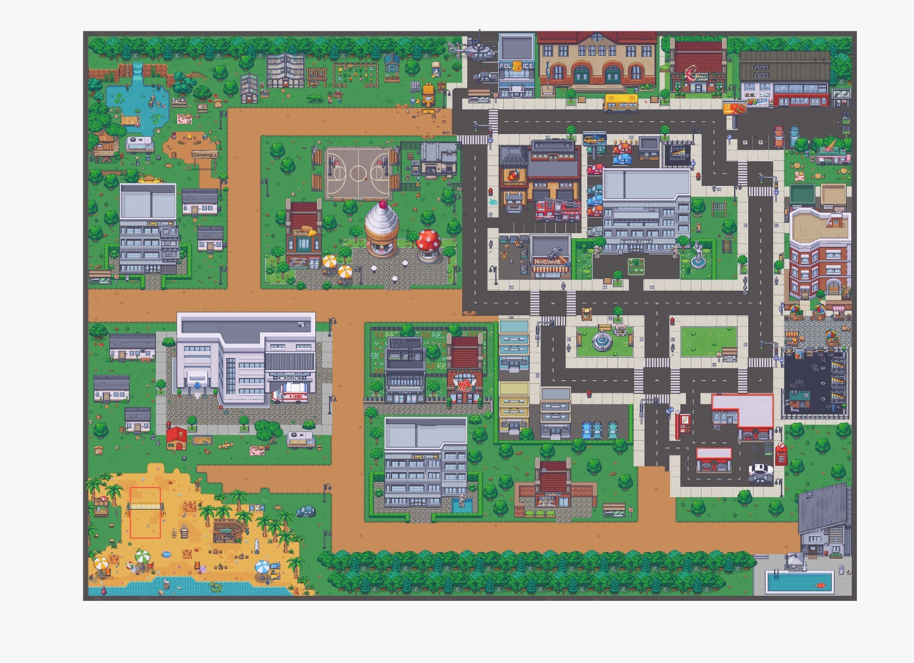

 <sup>Fonte: Equipe cielitos, Faculdade Inteli 2026</sup>
</div>
   
&emsp; O mapa é delimitado por barreiras invisíveis e elementos urbanos, garantindo o controle narrativo do ambiente. Novos estabelecimentos tornam-se acessíveis à medida que as missões anteriores são concluídas, promovendo uma progressão estruturada e coerente com os objetivos de aprendizagem. 

### Bancos (Agência 1, Agência 2 e Agência 3)

&emsp; As agências bancárias representam o ponto inicial de organização das atividades do DDN dentro de cada capítulo do jogo. Nesse ambiente, o jogador realiza o check-in no aplicativo Salesforce e interage com o Gerente Geral (GG) e o Gerente PJ, responsáveis por apresentar as missões e orientar as visitas comerciais que deverão ser realizadas nos estabelecimentos da região. Durante as interações, o jogador responde perguntas em formato de quiz, recebendo CieloCoins de acordo com suas decisões. Os objetivos pedagógicos desta missão incluem:

- compreender o fluxo de trabalho inicial do DDN dentro da agência;
- desenvolver abordagem profissional com diferentes perfis de gestores;
- compreender o planejamento das visitas comerciais;
- praticar tomada de decisão em interações estratégicas.

<div align="center">
 <sub>Imagem 9 - Agência - Mini Mundo Cielo</sub>
 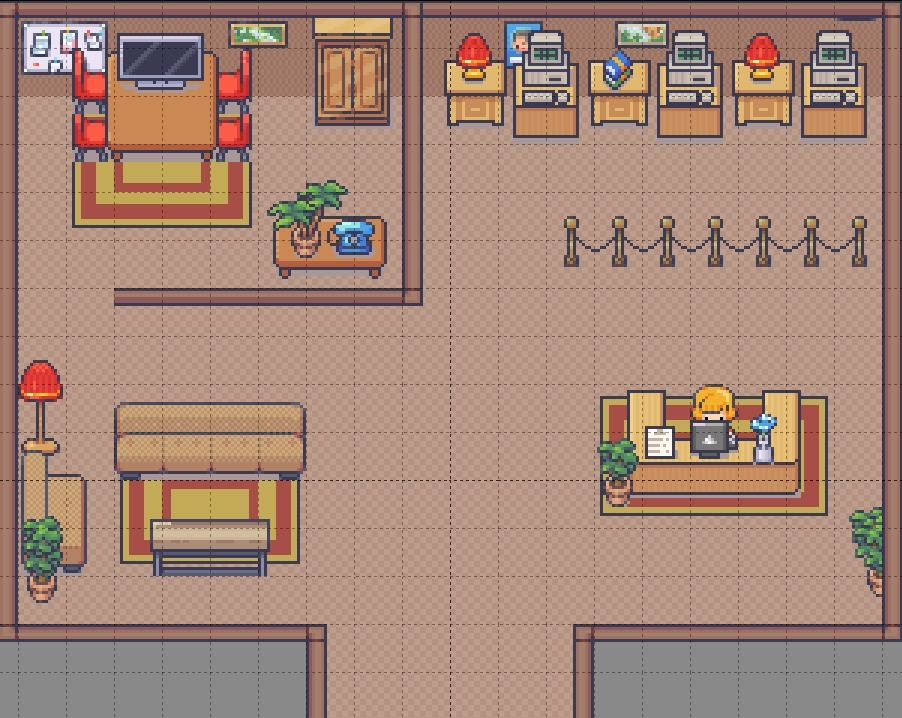             

 <sup>Fonte: Equipe cielitos, Faculdade Inteli 2026</sup>
</div>

&emsp; A exigência de pontuação aumenta ao longo dos capítulos. Na Agência 1 o jogador precisa atingir 150 CieloCoins, enquanto na Agência 2 a exigência sobe para 400 CieloCoins, representando maior domínio das estratégias de abordagem e negociação. Na Agência 3, além da maior pontuação exigida (500 CieloCoins), o jogador enfrenta um novo desafio: o PJ se recusa a acompanhá-lo na visita comercial, exigindo maior autonomia na tomada de decisão.

### Padaria

&emsp; A padaria representa um comércio de bairro com fluxo constante de clientes e operações de baixo a médio ticket médio. A proprietária, Sofia, manifesta preocupações relacionadas a taxas, agilidade no atendimento e controle do caixa. A missão estrutura-se por meio de diálogo interativo, no qual o jogador deve identificar e apresentar as soluções mais adequadas do portfólio da Cielo. Os objetivos pedagógicos desta fase contemplam: 

- apresentar soluções de pagamento rápidas e acessíveis; 
- comunicar as taxas de forma clara e transparente; 
- fortalecer o relacionamento com pequenos empreendedores.

<div align="center">
 <sub>Imagem 10 - Padaria - Mini Mundo Cielo</sub>
 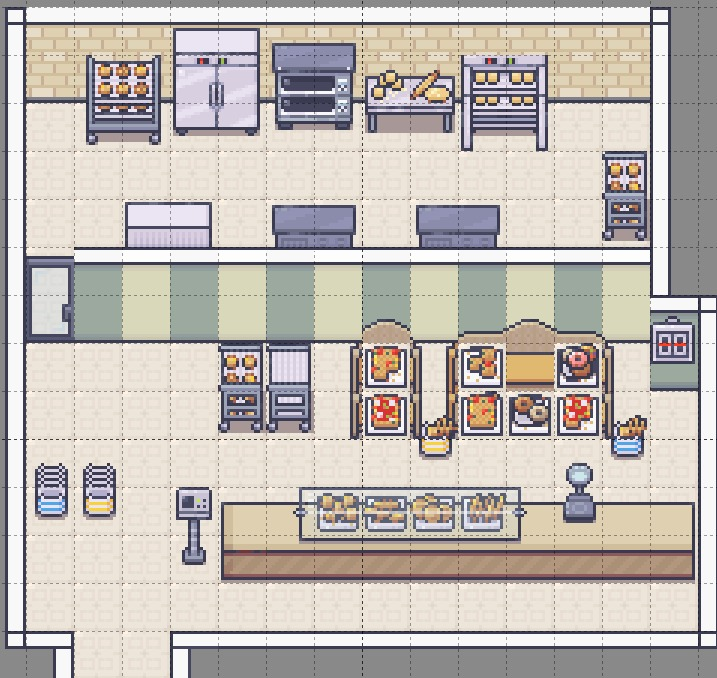

 <sup>Fonte: Equipe cielitos, Faculdade Inteli 2026</sup>
</div>

### Farmácia

&emsp; A farmácia simboliza estabelecimentos com alta demanda transacional e sensibilidade a questões de segurança e estabilidade operacional. A NPC Rachel questiona a confiabilidade e a segurança do sistema. Os objetivos pedagógicos desta missão incluem: 

- argumentar sobre segurança transacional; 
- diferenciar as soluções da Cielo em relação à concorrência;
- reforçar a credibilidade institucional da empresa.

<div align="center">
 <sub>Imagem 11 - Farmácia - Mini Mundo Cielo</sub>
 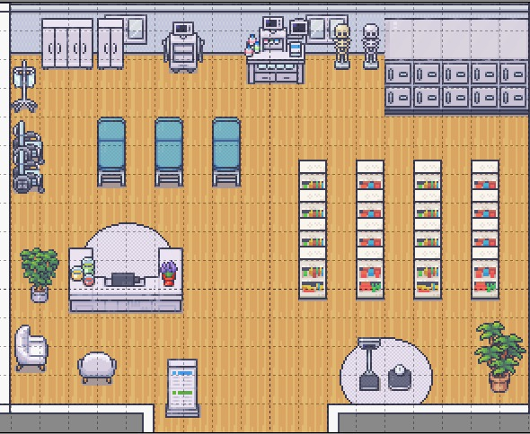

 <sup>Fonte: Equipe cielitos, Faculdade Inteli 2026</sup>
</div>

&emsp; O foco central desta fase é o desenvolvimento da autoridade técnica e da confiança junto ao cliente.

### Escritório

&emsp; O escritório representa um ambiente corporativo no qual o DDN interage com o responsável pelo estabelecimento, o NPC Gabriel. Nesse cenário, o jogador precisa conduzir uma negociação mais estruturada, considerando as necessidades específicas do negócio e demonstrando domínio das soluções da Cielo. Durante a interação, o jogador deve responder às perguntas do sistema de quiz, simulando etapas reais do processo comercial, desde a abordagem inicial até o fechamento da venda. Os objetivos pedagógicos desta missão incluem:

- desenvolver uma abordagem profissional em ambientes corporativos;
- trabalhar a argumentação estratégica durante a negociação;
- identificar as necessidades específicas de clientes empresariais;
- consolidar o processo de apresentação e fechamento de vendas.

<div align="center">
 <sub>Imagem 12 - Escritório - Mini Mundo Cielo</sub>
 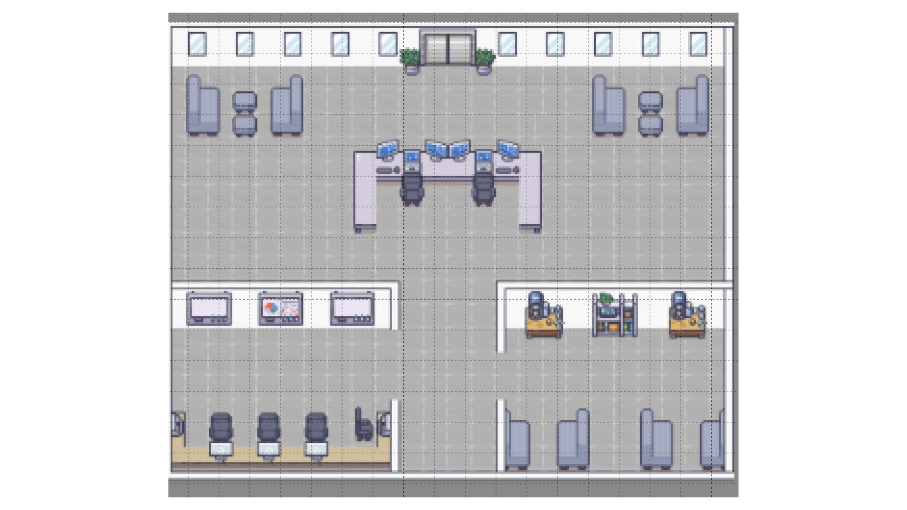

 <sup>Fonte: Equipe cielitos, Faculdade Inteli 2026</sup>
</div>

&emsp; O foco central desta fase é fortalecer a capacidade de negociação em contextos mais formais e estratégicos, exigindo do jogador maior preparo na comunicação e na apresentação das soluções da Cielo.

### Loja de roupas 

&emsp; A loja de roupas representa negócios do setor de serviços com recorrência de clientes. O NPC Eduardo manifesta preocupações relacionadas ao fluxo de caixa e à antecipação de recebíveis. Os objetivos pedagógicos desta fase compreendem: 

- compreender o funcionamento da antecipação de recebíveis; 
- explicar conceitos de gestão financeira de forma acessível;
- adotar postura consultiva junto ao cliente; 
- personalizar soluções conforme o perfil do estabelecimento.

<div align="center">
 <sub>Imagem 13 - Loja de roupas - Mini Mundo Cielo</sub>
 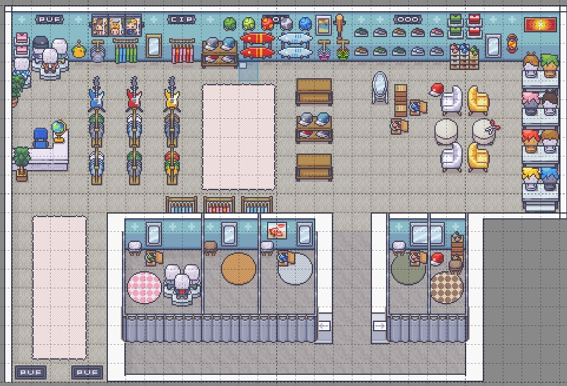

 <sup>Fonte: Equipe cielitos, Faculdade Inteli 2026</sup>
</div>

&emsp; Nesta fase, o jogador expande sua atuação para um perfil consultivo, diferenciando-se da abordagem meramente transacional das etapas anteriores.

&emsp; A partir do Capítulo 2, o nível de dificuldade aumenta significativamente. Nesta fase o jogador precisa atingir 400 CieloCoins para convencer o cliente e concluir a negociação.


### Metrô (Minigame)

&emsp; O metrô introduz uma dinâmica diferente das demais fases do jogo. Nesse ambiente ocorre um mini game de coleta de moedas, no qual o personagem se movimenta automaticamente enquanto o jogador controla os deslocamentos laterais para evitar obstáculos e coletar CieloCoins. Os objetivos desta fase incluem:

- introduzir dinamismo à experiência de jogo;
- incentivar a exploração do mapa;
- oferecer recompensas adicionais em CieloCoins;
- criar uma pausa entre as missões de negociação.

<div align="center">
 <sub>Imagem 14 - Metrô - Mini Mundo Cielo</sub>
 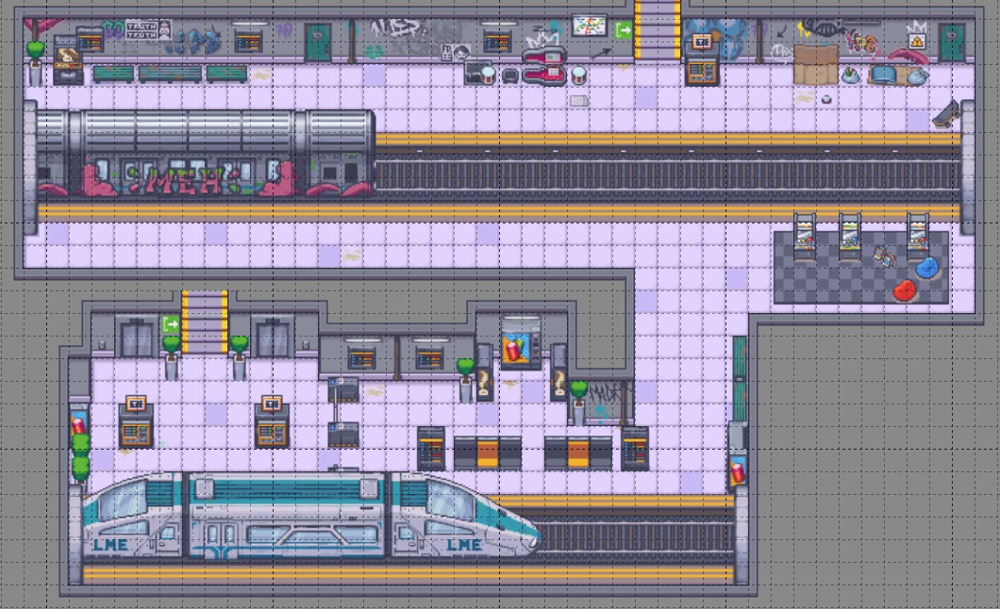

 <sup>Fonte: Equipe cielitos, Faculdade Inteli 2026</sup>
</div>

&emsp; As moedas coletadas durante o mini game são somadas ao total do jogador, funcionando como bônus dentro da progressão do jogo.


### Restaurante de Comida Japonesa

&emsp; O restaurante simboliza estabelecimentos com alto fluxo de clientes e demanda por soluções ágeis e integradas de pagamento. O NPC Lucas apresenta objeções que exigem maior domínio técnico do portfólio da Cielo e maior complexidade argumentativa durante a negociação. Os objetivos pedagógicos desta missão incluem:

- aprofundar o domínio das estratégias de venda;
- lidar com objeções mais complexas;
- aplicar argumentação comercial estruturada;
- conduzir negociações em ambientes de maior movimentação.

<div align="center">
 <sub>Imagem 15 - Restaurante - Mini Mundo Cielo</sub>
 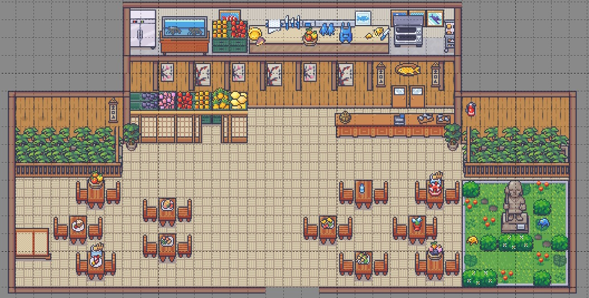

 <sup>Fonte: Equipe cielitos, Faculdade Inteli 2026</sup>
</div>

### Mercado

&emsp; O mercado representa estabelecimentos varejistas com grande volume de vendas e operações mais complexas. A NPC Alicia responsável apresenta objeções relacionadas a taxas e concorrência, exigindo do jogador maior domínio argumentativo e capacidade de negociação. Os objetivos pedagógicos desta missão incluem:

- consolidar as competências de abordagem e negociação;
- trabalhar argumentação comercial em cenários competitivos;
- aplicar estratégias de fechamento de vendas;
- desenvolver tomada de decisão estratégica.

<div align="center">
 <sub>Imagem 16 - Mercado - Mini Mundo Cielo</sub>
 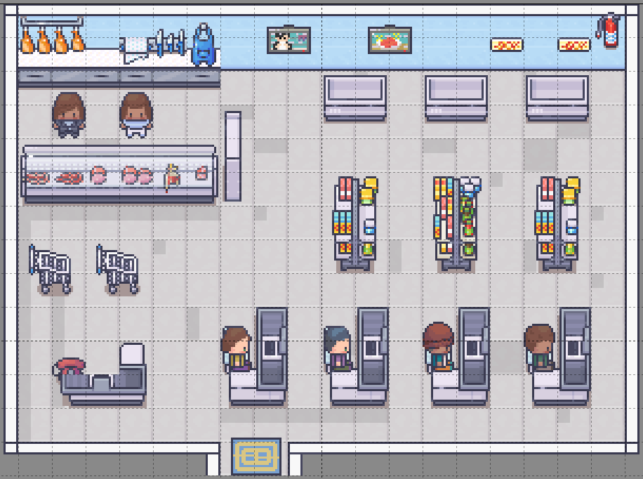

 <sup>Fonte: Equipe cielitos, Faculdade Inteli 2026</sup>
</div>
 
### Posto de Gasolina

&emsp; O posto de gasolina representa o desafio final do Mini Mundo Cielo. O estabelecimento possui alto volume de transações e exige soluções integradas que garantam fluidez no atendimento e eficiência operacional. Durante a negociação, o jogador precisa demonstrar domínio completo das estratégias de venda desenvolvidas ao longo do jogo para o NPC Nicolas. Os objetivos pedagógicos desta missão incluem:

- aplicar todas as competências desenvolvidas nas fases anteriores;
- conduzir negociações em cenários de alta complexidade;
- apresentar soluções integradas do portfólio da Cielo;
- realizar o fechamento estratégico da venda.

<div align="center">
 <sub>Imagem 17 - Posto de gasolina - Mini Mundo Cielo</sub>
 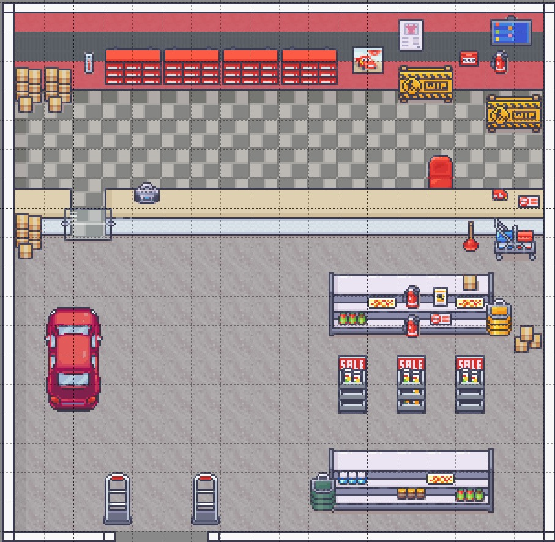

 <sup>Fonte: Equipe cielitos, Faculdade Inteli 2026</sup>
</div>

&emsp; Esta é a fase mais difícil do jogo. O jogador precisa atingir 750 CieloCoins para convencer o cliente e concluir a missão. Diferentemente das fases anteriores, respostas erradas passam a resultar em perda de pontos, aumentando o nível de desafio.

### Síntese das Locações

&emsp; Em síntese, as locações descritas estruturam a experiência do Mini Mundo Cielo, articulando de forma integrada os elementos narrativos, as mecânicas de jogo e os objetivos pedagógicos. A progressão entre os ambientes é concebida de maneira gradual e aplicada, promovendo o desenvolvimento contínuo das competências profissionais do jogador ao longo de toda a jornada.

### 3.3.2. Navegação pelo mundo (sprints 2 e 3)

&emsp; A dinâmica de movimentação dos personagens no mundo do jogo foi concebida para reforçar a sensação de progressão e descoberta gradual. O deslocamento ocorre livremente dentro das áreas já desbloqueadas, por meio de movimentação direcional no mapa urbano, permitindo ao jogador explorar ruas, aproximar-se de estabelecimentos e interagir com pontos específicos do cenário. Essa exploração não é apenas espacial, mas também estratégica, pois cada interação representa a possibilidade de iniciar um novo desafio de vendas, diretamente vinculado ao avanço narrativo e ao desenvolvimento profissional do personagem.

&emsp; O mundo do jogo é estruturado em uma única cidade interativa, organizada segundo uma lógica de progressão sequencial baseada em capítulos e missões. O ponto inicial de cada capítulo é a agência bancária parceira da Cielo, onde o jogador realiza seu check-in e recebe orientações do Gerente Geral (GG) e do Gerente PJ sobre as visitas comerciais que deverão ser realizadas. A partir desse momento, o jogador passa a se deslocar pelo mapa urbano para visitar os estabelecimentos designados, cada um representando um desafio específico dentro do processo de vendas.

&emsp; No Capítulo 1, o jogador inicia sua jornada profissional e realiza visitas a estabelecimentos que introduzem as mecânicas básicas de negociação, incluindo a padaria, a farmácia e o escritório. Cada fase apresenta metas específicas de desempenho e exige que o jogador alcance uma pontuação mínima de CieloCoins para concluir a missão e desbloquear o próximo estabelecimento. Caso os critérios não sejam atingidos, o desafio deve ser repetido até que o desempenho mínimo seja alcançado.

&emsp; No Capítulo 2, a complexidade das interações aumenta, introduzindo novos tipos de estabelecimentos e desafios comerciais mais elaborados, como o salão de beleza, o restaurante e o mercado. Nesse estágio, o jogador também tem acesso a um mini game localizado no metrô, que adiciona dinamismo à experiência e permite a coleta de moedas adicionais. A progressão continua sendo condicionada ao desempenho nas missões, reforçando a curva de aprendizagem ao longo do jogo.

&emsp; Por fim, o Capítulo 3 representa o momento mais desafiador da jornada do jogador. Nesse estágio, o personagem retorna à agência para uma nova avaliação e recebe a missão final de negociação no posto de gasolina, um cenário que exige maior domínio das estratégias de venda desenvolvidas nas fases anteriores. Após superar esse desafio, o jogador retorna à agência para a conclusão da experiência.

&emsp; Em síntese, o sistema de movimentação e desbloqueio estrutura a progressão do jogo de forma clara e estratégica, integrando exploração do mapa, desempenho nas missões e evolução narrativa. Assim, cada novo estabelecimento visitado simboliza não apenas o avanço espacial dentro da cidade, mas também o desenvolvimento contínuo das competências profissionais do personagem ao longo da experiência.

### 3.3.3. Condições climáticas e temporais (sprints 2 e 3)

&emsp; O jogo apresenta variações leves de condições temporais e ambientais com o objetivo de enriquecer a ambientação e a sensação de progressão ao longo da experiência. As fases podem ocorrer em diferentes períodos do dia, como manhã, tarde e noite, refletindo a rotina comercial dos estabelecimentos e contribuindo para a contextualização das interações com os NPCs.

&emsp; As condições climáticas possuem caráter principalmente estético, podendo incluir variações visuais como dias ensolarados ou nublados, sem impactar diretamente as mecânicas principais de gameplay. Essas mudanças auxiliam na imersão do jogador e na diferenciação visual entre fases e áreas do mapa.

&emsp; O tempo não atua como um fator limitante rígido para a conclusão das atividades. Cada missão foi projetada para ser realizada no ritmo do jogador, embora algumas tarefas possam sugerir objetivos de duração estimada para fins de organização e acompanhamento do progresso.

### 3.3.4. Concept Art (sprint 2)

&emsp; O termo concept art, traduzido como "arte de conceito", refere-se a ilustrações elaboradas com a finalidade de representar visualmente a identidade, a atmosfera e a direção estética de um projeto. No contexto do presente jogo, as concept arts desempenharam papel fundamental na consolidação do estilo visual, na definição da ambientação das cidades fictícias e no estabelecimento da personalidade dos personagens. Após a consolidação do enredo, procedeu-se ao desenvolvimento dos personagens e ao level design de cada módulo, buscando-se coerência entre narrativa, mecânica e estética.

### Integração dos Cenários

&emsp; Previamente à etapa de implementação final, foi elaborada uma arte conceitual representando a integração dos cenários do jogo. Tal ilustração demonstra a forma pela qual os ambientes se conectam visualmente dentro da proposta das duas cidades, apresentando a composição geral dos espaços urbanos. Essa produção funcionou como guia orientador para a construção dos mapas e do trajeto que o jogador passará.

<div align="center">
 <sub>Imagem 18 - Concept Art - integração entre cenários</sub>
 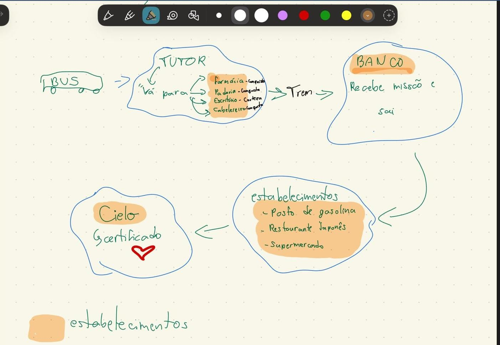

 <sup> Fonte: Equipe cielitos, Faculdade Inteli 2026</sup>
</div>

### Telas de Interface: Tela Inicial e Tela da Ponte

&emsp; Foram elaboradas concept arts para as telas de interface do jogo, a saber:

- Tela Inicial: responsável por apresentar a identidade visual do jogo e proporcionar a primeira impressão ao jogador;
- Tela da Ponte: corresponde à transição entre a cena incial e a primeira cidade.
Ambas as telas foram concebidas de modo a manter coerência estética com os demais elementos do jogo, garantindo unidade visual e favorecendo a imersão do jogador.

<div align="center">
 <sub>Imagem 19 - Concept Art - Cidades do jogo</sub>
 
  
 <sup>Fonte: Equipe cielitos, Faculdade Inteli 2026</sup>
</div>

&emsp; Em síntese, as concept arts desenvolvidas no âmbito do Sprint 2 constituíram a base estrutural para a construção visual do mapa do jogo, orientando decisões de design, ambientação e identidade gráfica anteriormente à etapa de implementação definitiva.

### 3.3.5. Trilha sonora (sprint 4)

&emsp; A construção da sonoplastia do jogo não se limita apenas à inserção de trilhas e efeitos sonoros, mas envolve uma organização conceitual que considera a origem e a função desses sons dentro da experiência do jogador. Nesse sentido, é fundamental distinguir os conceitos de som diegético e não diegético, amplamente discutidos na literatura de áudio para jogos digitais.

&emsp; De acordo com Lucas Correia Meneguette (2016) [\[32\]](#ref32), o som pode ser classificado conforme sua relação com o universo ficcional do jogo, sendo o som diegético aquele que pertence ao mundo do jogo, com fonte inserida na narrativa e potencialmente perceptível pelos personagens, enquanto o som não diegético é direcionado exclusivamente ao jogador, como trilhas sonoras de fundo e efeitos de interface. Essa distinção é essencial para a construção da identidade sonora e da imersão, uma vez que os sons diegéticos reforçam a coerência do mundo ficcional (cosmopoiese), ao passo que os não diegéticos atuam principalmente na modulação emocional e no direcionamento da experiência do jogador.

&emsp; No contexto do Mini Mundo Cielo, essa distinção se torna ainda mais relevante, uma vez que o jogo é baseado em interações, tomada de decisão e simulação de situações reais de negociação. Assim, os elementos sonoros foram planejados para reforçar tanto a narrativa quanto o aprendizado do jogador. Os arquivos utilizados estão em formato MP3 e contam com trilhas sonoras diferentes para cada estabelecimento, com o objetivo de gerar a experiência esperada em cada fase.

&emsp; Com base nisso, os áudios do jogo foram organizados e classificados conforme sua função e sua relação com o universo narrativo, conforme apresentado na tabela a seguir:

<div align="center">
<sub>Tabela 8 - Sons</sub>

| # | Título | Tipo | Autoria | Uso no jogo |
|---|--------|------|---------|-------------|
| 1 | Trilha sonora da tela inicial | Trilha / Som não-diegético | [Pixabay](https://pixabay.com/music/upbeat-%e7%b4%a0%e6%99%b4%e3%82%89%e3%81%97%e3%81%84%e6%9c%9d%e6%97%a5-wonderful-morning-sun-121506/) | Executada na SceneInicial e ScenePersonagem |
| 2 | Trilha sonora da parte urbana | Trilha / Som não-diegético | [Pixabay](https://pixabay.com/music/beats-lofi-study-calm-peaceful-chill-hop-112191/) | Executada quando o personagem entra na parte urbana do mapa geral |
| 3 | Trilha sonora da padaria | Trilha / Som não-diegético | [Hooksounds](https://www.hooksounds.com/pt-br/royalty-free-music/plush-cafe/2504928/) | Executada quando o personagem entra na padaria |
| 4 | Trilha sonora da parte da praia | Trilha / Som não-diegético | [Hooksounds](https://www.hooksounds.com/pt-br/royalty-free-music/sunkissed-samba/2346808/) | Executada quando o personagem entra na parte da praia no mapa geral |
| 5 | Trilha sonora da farmácia | Trilha / Som não-diegético | [Toystock](https://joystock.org/royalty-free-music/track/ambient-background-music) | Executada quando o personagem entra na farmácia |
| 6 | Trilha sonora do escritório | Trilha / Som não-diegético | [Motionarray](https://motionarray.com/royalty-free-music/calm-corporate-background-258970/) | Executada quando o personagem entra no escritório |
| 7 | Trilha sonora do mercado | Trilha / Som não-diegético | [Hooksounds](https://www.hooksounds.com/pt-br/royalty-free-music/coffee-shopping/535420/) | Executada quando o personagem entra no mercado |
| 8 | Trilha sonora agência01 | Trilha / Som não-diegético | [Pixabay](https://pixabay.com/music/corporate-uplifting-383889/) | Executada quando o personagem entra na Agência01 |
| 9 | Trilha sonora agência02 | Trilha / Som não-diegético | [Pixabay](https://pixabay.com/music/electronic-corporate-corporate-background-488317/) | Executada quando o personagem entra na Agência02 |
| 10 | Trilha sonora agência03 | Trilha / Som não-diegético | [Pixabay](https://pixabay.com/music/upbeat-boss-fight-one-400508/) | Executada quando o personagem entra na Agência03 |
| 11 | Efeito sonoro chuva | Efeito / Som diegético | [Pixabay](https://pixabay.com/sound-effects/rain-110508/) | Executada quando a chuva inicia |
| 12 | Trilha sonora loja de roupas | Trilha / Som não-diegético | [Pixabay](https://pixabay.com/music/upbeat-breathe-underwater-summer-house-pop-385496/) | Executada quando o personagem entra na loja de roupas |
| 13 | Trilha sonora posto de gasolina | Trilha / Som não-diegético | [Pixabay](https://pixabay.com/music/upbeat-boss-fight-one-400508/) | Executada quando o personagem entra no posto de gasolina |
| 14 | Trilha sonora metrô | Trilha / Som não-diegético | [Hooksounds](https://www.hooksounds.com/pt-br/royalty-free-music/vintage-city/177508/) | Executada quando o personagem entra no metrô |
| 15 | Trilha sonora restaurante | Trilha / Som não-diegético | [Hooksounds](https://www.hooksounds.com/pt-br/royalty-free-music/pagoda-crest/2447913/) | Executada quando o personagem entra no restaurante |
| 16 | Trilha sonora cena da estação de trem do mini game do metrô | Trilha / Som não-diegético | [Hooksounds](https://www.hooksounds.com/pt-br/royalty-free-music/) | Executada na cena da estação de trem no mini game do metrô |
| 17 | Trilha sonora cena da cidade do mini game do metrô | Trilha / Som não-diegético | [Hooksounds](https://www.hooksounds.com/pt-br/royalty-free-music/) | Executada na cena da cidade no mini game do metrô |
| 18 | Trilha sonora cena da cielo do mini game do metrô | Trilha / Som não-diegético | [Hooksounds](https://www.hooksounds.com/pt-br/royalty-free-music/) | Executada na cena da cielo no mini game do metrô |
| 19 | Trilha sonora cena da floresta do mini game do metrô | Trilha / Som não-diegético | [Hooksounds](https://www.hooksounds.com/pt-br/royalty-free-music/) | Executada na cena da floresta no mini game do metrô |
| 20 | Efeito sonoro de coleta de moeda | Efeito / Som diegético | [Hooksounds](https://www.hooksounds.com/pt-br/royalty-free-music/) | Executada quando o personagem coleta uma moeda |

 <sup>Fonte: Equipe cielitos, Faculdade Inteli 2026</sup>
</div>

## 3.4. Inventário  (sprint 3)

<div align="center">
<sub>Tabela 9 - Inventário</sub>

\# | item | | descrição | como obter | função | efeito sonoro
--- | --- | --- | --- | --- | --- | ---
| CieloCoin ||Moeda virtual utilizada como recompensa dentro do jogo, representando o progresso do jogador durante as atividades. | Obtida ao completar tarefas, vencer mini games ou coletar moedas espalhadas pelo mapa durante a exploração dos cenários. | Indicar o progresso e recompensar o desempenho do jogador ao longo da jornada no jogo. | Som curto de moeda/coleta ao receber uma CieloCoin.|

 <sup>Fonte: Equipe cielitos, Faculdade Inteli 2026</sup>
</div>

## 3.5. Gameflow (Diagrama de cenas) (sprint 2)

&emsp; O Gameflow é uma técnica que permite a análise visual completa da progressão de um jogo de forma não-linear, encadeando as diferentes telas e cenários, bem como as interações que o usuário deve fazer para transitar entre eles.[17](#ref17) Por ser conciso e bem abrangente, o Gameflow traz um entendimento geral do funcionamento do jogo de forma efetiva. Abaixo, um esquema que descreve o diagrama de cenas do Mini mundo cielo.

<div align='center'>
 <sub>Imagem 20 - Página 1 do Diagrama de Cenas</sub>
 
 
 <sup>Fonte: Equipe cielitos, Faculdade Inteli 2026</sup>
</div>

&emsp;O diagrama de cenas abaixo representa o fluxo completo de navegação entre as telas do Mini Mundo Cielo, desde o menu inicial até as transições entre as cidades do jogo.

- **SceneInicial** → tela de menu principal com botões Jogar, Configurações e Créditos.
- **ScenePersonagem** → tela de seleção dos 4 personagens jogáveis.
- **SceneCutscene** → vídeo introdutório que contextualiza a narrativa do jogo.
- **SceneJogo** → cena principal de gameplay (Cidade 1), com movimentação do personagem, interação com NPCs e sistema de missões.
- **SceneCidade2** → cena da segunda cidade, desbloqueada após completar as missões da Cidade 1 com pontuação mínima.
- **SceneFinal** → tela de encerramento com certificado de conclusão na sede da Cielo.

## 3.6. Regras do jogo (sprint 3)

&emsp; As regras do Mini Mundo Cielo definem as condições de progresso, sucesso e falha dentro da experiência do jogador. Elas determinam como as missões podem ser iniciadas, como as negociações funcionam e quais critérios devem ser atendidos para avançar na jornada profissional simulada no jogo

### Fluxo de Navegação e Menus

#### Menu Inicial:

- Jogar: Gatilho para a cena de Seleção de Personagens.
- Créditos: Sobreposição ou transição para a lista de colaboradores.
- Configurações: Acesso a sub-menu de ajustes globais (Volume: 0–100%, Brilho, Filtro de Daltonismo: On/Off).

#### Seleção de Personagens:

- Feedback Visual: O hover (passar o mouse) ativa uma animação de destaque e escala (+10%) no card do personagem.
- Informação: Exibição dinâmica de descrição e status de vida (HP/Resistência). A Resistência indica quantos erros de diálogo o jogador pode cometer durante as negociações.
- Confirmação: O clique bloqueia a seleção e inicia o carregamento (loading) do Nível 1.

### Regras de Início (Prólogo)

#### Interação com NPC (Vanessa):

A proximidade habilita o prompt da tecla [E].

- Trava de Diálogo: O jogador perde o controle de movimentação até que todos os nós do diálogo sejam percorridos.

- Gatilho de Progressão: O fim do diálogo ativa o script de follow (Vanessa caminha até a ponte). A entrada no ônibus (trigger de área) dispara a cutscene de transição para o Banco.

### O Hub do Banco e Missões

- Gerente-Geral: Atua como o Quest Giver. O diálogo concede ao jogador a rota da missão.

### Logística de Venda:

&emsp; Objetivo Secundário: Otimização da rota de visita aos estabelecimentos, incentivando o jogador a planejar a ordem das interações.

- Parceiro (PJ): O personagem PJ deve estar dentro de um raio de distância específico para que as interações com clientes sejam habilitadas. Caso o parceiro esteja fora desse raio, o diálogo com o cliente não pode ser iniciado.

### Sistema de Negociação (Interação com Clientes)

&emsp; Durante a negociação, o jogador deve selecionar uma entre três opções de resposta para reagir às objeções apresentadas pelo cliente. Cada escolha influencia diretamente o progresso da negociação e a pontuação obtida ao final da interação:

- Estrutura da Resposta: Cada pergunta apresenta 3 níveis de eficácia:

- Adequada (+2 Cielo Coins): Resposta ideal, alinhada aos valores Cielo.

- Intermediária (+1 Cielo Coins): Resposta neutra, mantém a negociação ativa.

- Inadequada (0 Cielo Coins): Resposta errada, reduz a probabilidade de fechamento e diminui a barra de Resistência do personagem.

### Cálculo de Feedback: 

&emsp; Ao final da árvore de diálogo, o sistema soma os pontos obtidos durante a interação.

- Sucesso: Soma ≥ Limiar estipulado (Venda Concluída).

- Falha: Soma < Limiar estipulado (Venda Perdida).

&emsp; Consequências da Falha: Quando a negociação falha, o cliente encerra a conversa e o estabelecimento fica temporariamente indisponível para nova tentativa. Caso todos os estabelecimentos da rota estejam indisponíveis, o jogador pode retornar ao Gerente-Geral para reiniciar a missão.

&emsp; Resultado: Exibição de interface de feedback com o resumo da performance e impacto na progressão.

## 3.7. Mecânicas do jogo (sprint 3)

&emsp; Esta seção descreve as principais mecânicas de controle e interação disponíveis ao jogador, detalhando como o personagem se movimenta, interage com o ambiente e realiza negociações dentro do Mini Mundo Cielo:

- Dispositivos de entrada utilizados;  
- Comandos disponíveis; 
- Estados do jogo afetados;
- Respostas sistêmicas decorrentes de cada comando.

**Plataforma**: Desktop  
**Dispositivos de entrada:** Teclado e Mouse  
**Modelo de interação:** Tempo real com eventos condicionais.

### 3.7.2. Mecânicas de Interface e Navegação

#### Tela Inicial

**Dispositivo:** Mouse  
**Modelo de interação:** Clique pontual  

##### Elementos interativos:

**Botão Jogar**
Ação do jogador: Clique com o mouse  
Resultado sistêmico: Transição para a cena de seleção de personagem  

**Botão Créditos**
Ação do jogador: Clique com o mouse  
Resultado sistêmico: Abertura da tela de créditos com links externos (LinkedIn dos desenvolvedores e opção de gerar certificado para LinkedIn)  

**Botão Configurações**
Ação do jogador: Clique com o mouse  
Resultado sistêmico: Abertura de pop-up de configurações  

#### Seleção de Personagem

Dispositivo: Mouse  

##### Elementos interativos: 

Quatro cartas de personagem disponíveis  

###### Interações possíveis:

**Hover sobre carta**
Ação do jogador: Passar o cursor do mouse sobre a carta do personagem  
Resultado sistêmico: Ativação de animação de destaque com aumento de escala do elemento selecionado, indicando foco do jogador.

**Seleção de personagem**
Ação do jogador: Clique em uma carta  
Restrição: Seleção única  
Resultado sistêmico: O personagem selecionado é definido como avatar ativo e carregado para o início da partida.


### 3.7.3 Mecânicas de Configuração e Acessibilidade

Interface em formato pop-up modal.

#### Controle de Volume

Dispositivo: Mouse  

**Botão “+”*8
Resultado: Incremento do volume global do jogo  

**Botão “–”**
Resultado: Redução do volume global do jogo  

#### Controle de Brilho

Dispositivo: Mouse  

**Botão “+”** 
Resultado: Aumento do brilho da tela  

**Botão “–”** 
Resultado: Redução do brilho da tela  

#### Modo Alto Contraste

Dispositivo: Mouse  

**Botão ON**  
Estado visual: Verde  
Resultado: Ativação de contraste elevado para melhoria de legibilidade  

**Botão OFF**
Estado visual: Vermelho  
Resultado: Retorno ao padrão visual original  

#### Modos para Daltonismo

Dispositivo: Mouse  

**Opções disponíveis:**

- Normal  
- Deuteranomalia  
- Protanomalia  
- Tritanomalia  

Resultado sistêmico: Ajuste da paleta de cores do jogo para adaptação visual conforme o perfil selecionado.

#### Fechar Configurações

Dispositivo: Mouse  

Botão Fechar  

Resultado: Retorno à cena anterior sem reinicialização do estado do jogo.

### 3.7.4. Mecânicas de Movimento e Controle em Tempo Real

#### Movimentação do Personagem

Dispositivo: Teclado  

Modelo: Movimento contínuo enquanto tecla estiver pressionada 

<div align="center">
<sub>Tabela 10 - Teclas de movimentação</sub>

| Tecla | Ação |
|------|------|
| W | Movimento para cima |
| A | Movimento para esquerda |
| S | Movimento para baixo |
| D | Movimento para direita |

 <sup>Fonte: Equipe cielitos, Faculdade Inteli 2026</sup>
</div>
 
Observação técnica: O deslocamento é contínuo e depende do tempo de pressão da tecla.

#### Interação com NPC

**Pré-condição**: Proximidade espacial com NPC  

**Tecla E**  

**Resultado:** Abertura de pop-up de diálogo  

No pop-up:

**Botão “Vamos!”** 

Dispositivo: Mouse  

**Resultado:**  
NPC executa movimento programado para a direita, iniciando o deslocamento narrativo do personagem até o ponto de transição da fase.

**Botão Fechar / Cancelar**

Dispositivo: Mouse  

**Resultado:**  
Fechamento do pop-up de diálogo sem progressão da interação, retornando o jogador ao estado normal de controle.

#### Controle de Tela

<div align="center">
<sub>Tabela 11 - Teclas de controle de tela</sub>

| Tecla | Resultado |
|------|-----------|
| F | Alterna modo tela cheia |
| ESC | Sai da tela cheia ou pausa o jogo |

 <sup>Fonte: Equipe cielitos, Faculdade Inteli 2026</sup>
</div>

**Primeiro acionamento do ESC:** Sai do modo tela cheia (se ativo)  
**Segundo acionamento:** Pausa o jogo e abre menu principal  


#### Transição de Cena

**Condição:** Personagem atinge limite direito da tela  

**Resultado sistêmico:**

- Mudança automática de cena  
- Reprodução de vídeo (ambiente de ônibus)  
- Interações do jogador ficam temporariamente desativadas durante a reprodução do vídeo.


### 3.7.5. Mecânicas de Exploração no Mapa

Dispositivo: Teclado  

**Movimentação via WASD**  

Sistema de progressão:

- O mapa segue ordem lógica de estabelecimentos  
- Entrada condicionada ao posicionamento do jogador  

Condição de entrada:

Quando o personagem está dentro da área de interação do estabelecimento.

**Resultado:** Acesso ao interior.


#### Sistema de Progressão

Condição de ativação:  
Conclusão da interação com cliente no estabelecimento atual.

Ação do jogador:  
Finalizar a negociação com o cliente.

**Resultado sistêmico:**

- Caso a negociação seja bem-sucedida, o próximo estabelecimento é desbloqueado no mapa.  
- Caso a negociação falhe, o estabelecimento atual fica temporariamente indisponível para nova tentativa, conforme regras descritas na seção 3.6.  
- A missão ativa é atualizada de acordo com o resultado da interação.  
- Continuidade da progressão do jogador no mapa.


### 3.7.6. Mecânica de Diálogo e Tomada de Decisão

**Dentro dos estabelecimentos:**

Dispositivo: Mouse  

Interface: três opções de resposta apresentadas ao jogador.

Ação do jogador:

Clique em uma das opções disponíveis.

**Resultado sistêmico:**

- Progressão da árvore de diálogo.  
- Acúmulo de pontuação de negociação conforme sistema descrito na seção 3.6.  
- Cada escolha gera um valor de pontuação relacionado à eficácia da resposta durante a negociação.  
- Ao final da árvore de diálogo ocorre o cálculo da pontuação total da negociação.  
- O sistema determina sucesso ou falha da venda conforme o limiar estabelecido nas regras do jogo.  
- O resultado da negociação impacta a progressão do jogador no mapa e o estado do estabelecimento visitado.


### 3.7.7. Mecânica de Recompensa

Essa mecânica define o sistema de pontuação e recompensas obtidas pelo jogador durante as interações com clientes.

####  Condição de ativação

Após a conclusão de uma negociação, o jogador recebe recompensas em CieloCoins, que refletem seu desempenho durante a interação e contribuem para sua progressão no jogo.

#### Sistema de pontuação

<div align="center">
<sub>Tabela 12 - Sistema de pontuação</sub>

| # | Tipo de resposta | Pontuação | Impacto |
|---|---|---|---|
| 1 | Resposta adequada | Pontuação máxima | Aumenta chance de sucesso |
| 2 | Resposta intermediária | Pontuação parcial | Mantém negociação estável |
| 3 | Resposta inadequada | Sem pontuação | Reduz eficácia da negociação |

 <sup>Fonte: Equipe cielitos, Faculdade Inteli 2026</sup>
</div>


#### Resultado sistêmico

- Atualização do total de Cielo Coins do jogador  
- Registro do desempenho da interação  
- Atualização do ranking do jogador  

#### Feedback ao jogador

&emsp; O sistema apresenta retorno visual indicando o resultado da escolha realizada.

### 3.7.8. Mecânica de Ranking

**Acesso via botão dedicado**  

Dispositivo: Mouse  

Resultado: Abertura da tela de ranking regional  

**Funcionalidades:**

- Visualização de ranking por cidade  
- Exibição comparativa de Cielo Coins acumuladas  
- Scroll vertical para navegação  
- Botão Fechar para retorno ao mapa  

Modelo: Interface informacional não interativa com dados dinâmicos.

### 3.7.9. Classificação das Mecânicas

Categorias de Mecânicas Implementadas

**Mecânicas de Navegação e Interface**

Interação com menus, telas de configuração e navegação entre cenas.

**Mecânicas de Movimento em Tempo Real**

Controle do personagem no mapa utilizando teclado (WASD) e interação contextual com NPCs.

**Mecânicas de Escolha e Decisão**

Sistema de diálogo com múltiplas opções que impactam a pontuação e progressão do jogador.

## 3.8. Implementação Matemática de Animação/Movimento (sprint 4)

### 3.8.1. Movimentação do Personagem

&emsp; O personagem se move com velocidade constante em quatro direções (cima, baixo, esquerda, direita), caracterizando um movimento uniforme em cada eixo do plano cartesiano.

&emsp; A atualização da posição pode ser descrita pela equação vetorial do movimento uniforme:

$$
\vec{P}_{n+1} = \vec{P}_n + \vec{v} \cdot \Delta t
$$

&emsp; De forma equivalente, separando por eixos:

$$
x_{n+1} = x_n + v_x \cdot \Delta t
$$

$$
y_{n+1} = y_n + v_y \cdot \Delta t
$$

Onde:
- $(x_n, y_n)$ = posição atual do personagem (em pixels)
- $v_x$, $v_y$ = componentes da velocidade nos eixos horizontal e vertical
- $\Delta t$ = intervalo de tempo entre frames

&emsp; No sistema de coordenadas do Phaser, o eixo Y é invertido (valores positivos apontam para baixo), o que explica o uso de velocidade negativa para movimento para cima.

#### Implementação

```js
personagem.setVelocity(0);

if (teclas.left.isDown) {
  personagem.setVelocityX(-velocidade);
} else if (teclas.right.isDown) {
  personagem.setVelocityX(velocidade);
}

if (teclas.up.isDown) {
  personagem.setVelocityY(-velocidade);
} else if (teclas.down.isDown) {
  personagem.setVelocityY(velocidade);
}
```
#### Interpretação

&emsp; A cada frame, o motor de física do Phaser atualiza automaticamente a posição do personagem com base nas velocidades definidas, garantindo um movimento uniforme (sem aceleração) em cada eixo.

&emsp; Assim, o personagem percorre distâncias proporcionais ao tempo, mantendo velocidade constante enquanto uma tecla de direção estiver pressionada.

### 3.8.3. Detecção de Proximidade com NPCs

&emsp; A interação com NPCs é ativada quando o personagem se encontra dentro de um raio de proximidade. Para isso, utiliza-se a distância euclidiana entre dois pontos no plano cartesiano 2D.

$$
d = \sqrt{(x_2 - x_1)^2 + (y_2 - y_1)^2}
$$

&emsp; Onde:
- $(x_1, y_1)$ representa a posição do personagem  
- $(x_2, y_2)$ representa a posição do NPC  

&emsp; No sistema implementado, considera-se que o personagem está próximo do NPC quando:

$$
d < 30
$$

&emsp; Esse valor define o raio de interação em pixels. Quando essa condição é satisfeita, o indicador `[E]` é exibido na tela, permitindo a interação.

#### Implementação em Código

```js
const distNpc = Phaser.Math.Distance.Between(
  personagem.x,
  personagem.y,
  79,
  141
);

const pertoNpc = distNpc < 30;
```
#### Controle de Interface

```js
if (pertoNpc !== this.perto_npc) {
  this.perto_npc = pertoNpc;
  this.labelNpc.setVisible(pertoNpc && !this.dentroZonaSaida);
}
```

#### Interação com o NPC

```js
if (pertoNpc && Phaser.Input.Keyboard.JustDown(this.teclaE)) {
  console.log("[SceneFarmacia] Interagiu com o NPC da farmácia");
}
```

#### Interpretação Matemática

&emsp; A equação da distância euclidiana define uma região circular de raio $r = 30$ centrada no NPC. Sempre que o personagem entra nessa região, considera-se que ele está suficientemente próximo para interagir.

&emsp; Geometricamente, isso corresponde ao conjunto de pontos que satisfazem:

$$
(x - x_{npc})^2 + (y - y_{npc})^2 < r^2
$$

#### Conclusão

&emsp; A implementação utiliza uma função matemática clássica da geometria analítica para detectar proximidade entre dois elementos no plano. O comportamento observado no jogo é consistente com o modelo teórico, garantindo uma interação precisa e eficiente com os NPCs.

### 3.8.4. Animação Clock Wipe (Transição de Cenas)

&emsp; A transição entre a cutscene e a próxima cena é realizada por meio de um efeito clock wipe, no qual uma máscara circular reduz progressivamente a área visível da tela.

&emsp; O progresso da animação é dado por $t \in [0,1]$, onde $t = 0$ representa o início e $t = 1$ o final da transição.

&emsp; O ângulo inicial é dado por $\theta_0 = -\frac{\pi}{2}$ e evolui até completar $2\pi$ radianos:

$$
\theta(t) = -\frac{\pi}{2} + t \cdot 2\pi
$$

&emsp; Aplicação no código:

```js
const progress = tween.getValue();
const startAngle = -Math.PI / 2 + progress * Math.PI * 2;
```

#### Sentidos da animação

##### Sentido horário (clockwise)

&emsp; Ângulo inicial:

$$
\theta_{inicial}(t) = -\frac{\pi}{2} + t \cdot 2\pi
$$

&emsp; Ângulo final:

$$
\theta_{final} = -\frac{\pi}{2} + 2\pi
$$

```js
if (clockwise) {
  const startAngle = -Math.PI / 2 + progress * Math.PI * 2;
  const endAngle = -Math.PI / 2 + Math.PI * 2;
  maskGraphics.arc(cx, cy, raio, startAngle, endAngle, false);
}
```

##### Sentido anti-horário (counterclockwise)

&emsp; Ângulo inicial:

$$
\theta_{inicial} = -\frac{\pi}{2}
$$

&emsp; Ângulo final:

$$
\theta_{final}(t) = -\frac{\pi}{2} + (1 - t)\cdot 2\pi
$$

```js
else {
  const startAngle = -Math.PI / 2;
  const endAngle = -Math.PI / 2 + (1 - progress) * Math.PI * 2;
  maskGraphics.arc(cx, cy, raio, startAngle, endAngle, false);
}
```

#### Cálculo do raio da máscara

$$
r = \frac{\sqrt{w^2 + h^2}}{2}
$$

```js
const raio = Math.hypot(this.scale.width, this.scale.height) / 2;
```

#### Interpolação temporal (Easing)

$$
t' = \frac{1 - \cos(\pi t)}{2}
$$

```js
this.tweens.add({
  targets: { progress: 0 },
  progress: 1,
  duration: this.CONFIG.WIPE_DURATION,
  ease: this.CONFIG.WIPE_EASE,
 }
);
```

&emsp; Essa interpolação torna a animação mais fluida, reduzindo a velocidade no início e no fim.
 
### 3.8.5. Animação Cinemática da Chuva (MU + MUV)

&emsp; A chuva é implementada em uma cena paralela (`SceneChuva`), iniciada via `this.scene.launch('SceneChuva')`. Essa abordagem evita interferências do zoom da câmera principal e garante que as coordenadas das gotas correspondam diretamente aos pixels da tela.

&emsp; Cada gota é modelada como uma partícula em movimento bidimensional, onde os eixos são independentes: no eixo X ocorre Movimento Uniforme (MU) e no eixo Y ocorre Movimento Uniformemente Variado (MUV), com velocidade inicial nula.[\[33\]](#ref33)

<div align="center">
 <sub>Imagem 21 - Relação matemática com a chuva do jogo</sub><br/>
 
 
 <sup>Fonte: Equipe cielitos, Faculdade Inteli 2026</sup>
</div>

&emsp; A função responsável pela animação é:

- Arquivo: `src/scenes/SceneChuva.js`  
- Função: `animacaoCinematica(g)`  
- Linha: 60  

#### Parâmetros do Modelo

<div align="center">
<sub>Tabela 13 - Parâmetros do modelo</sub>

| Parâmetro            | Símbolo | Descrição |
|---------------------|--------|-----------|
| Posição inicial X   | xi     | Coordenada horizontal inicial da gota (pixels), gerada aleatoriamente. |
| Posição inicial Y   | yi     | Coordenada vertical inicial (negativa), acima da tela. |
| Posição final X     | xf     | Coordenada final no eixo X, definida por deslocamento horizontal. |
| Posição final Y     | yf     | Coordenada final no eixo Y (abaixo da tela). |
| Tempo total         | T      | Duração total da animação da gota (1,2 s a 1,8 s). |
| Tempo corrente      | t      | Tempo acumulado da animação: $t \in [0, T]$. |
| Elemento gráfico    | g      | Objeto que representa a gota e armazena seu estado. |

 <sup>Fonte: Equipe cielitos, Faculdade Inteli 2026</sup>
</div>

#### Modelagem Matemática

&emsp; O movimento da gota é descrito pelo vetor posição:

$$
\vec{r}(t) = (x(t), y(t))
$$

##### Eixo X — Movimento Uniforme (MU)

$$
v_x = \frac{x_f - x_i}{T}
$$

$$
x(t) = x_i + v_x \cdot t
$$

&emsp; A velocidade horizontal é constante, representando o efeito do vento.

##### Eixo Y — Movimento Uniformemente Variado (MUV)

$$
a_y = \frac{2(y_f - y_i)}{T^2}
$$

$$
v_y(t) = a_y \cdot t
$$

$$
y(t) = y_i + \frac{1}{2} a_y \cdot t^2
$$

&emsp; A gota parte do repouso vertical ($v_0 = 0$) e acelera continuamente, simulando a gravidade.

#### Implementação da Função

```js
animacaoCinematica(g) {
    // Quando o tempo total termina, a gota chega ao destino e é desativada
    if (g.t >= g.T) {
      g.x = g.xf;
      g.y = g.yf;
      g.ativo = false;
      return;
    }

    var t = g.t;

    // No eixo X, a gota se move com velocidade constante
    var x_atual = g.xi + g.vx * t;

    // No eixo Y, a gota acelera para simular a queda
    var vy_atual = g.ay * t;
    var y_atual = g.yi + 0.5 * g.ay * t * t;

    g.x = x_atual;
    g.y = y_atual;

    // Imprime a cada frame os dados de MU e MUV desta gota
    console.log(
      "[MU  | X] frame:" +
        g.frame +
        " t:" +
        t.toFixed(3) +
        "s" +
        " vx:" +
        g.vx.toFixed(2) +
        "px/s" +
        " x:" +
        x_atual.toFixed(1) +
        "px"
    );
    console.log(
      "[MUV | Y] frame:" +
        g.frame +
        " t:" +
        t.toFixed(3) +
        "s" +
        " ay:" +
        g.ay.toFixed(2) +
        "px/s²" +
        " vy:" +
        vy_atual.toFixed(2) +
        "px/s" +
        " y:" +
        y_atual.toFixed(1) +
        "px"
    );
  }
```

#### Pré-cálculo dos Parâmetros

```js
g.vx = (g.xf - g.xi) / g.T;
g.ay = (2 * (g.yf - g.yi)) / (g.T * g.T);
```

#### Atualização Temporal

```js
g.t += delta / 1000;
```

&emsp; O uso do delta garante que a animação seja independente da taxa de frames.

#### Interpretação Física

- Eixo X → velocidade constante → Movimento Uniforme  
- Eixo Y → aceleração constante → Movimento Uniformemente Variado  
- Movimento resultante → trajetória parabólica  

$$
\vec{r}(t) = (x_i + v_x t)\hat{x} + \left(y_i + \frac{1}{2} a_y t^2\right)\hat{y}
$$

#### Validação (Console)

&emsp; Os logs confirmam o comportamento esperado:

- $v_x$ constante → MU validado  
- $v_y$ crescente → MUV validado  
- $y(t)$ cresce quadraticamente → queda acelerada  


#### Conclusão

&emsp; A implementação atende todos os requisitos propostos, utilizando apenas operações matemáticas básicas e modelagem física coerente. O comportamento visual da chuva reproduz corretamente um movimento bidimensional com MU no eixo X e MUV no eixo Y.

# <a name="c4"></a>4. Desenvolvimento do Jogo

## 4.1. Desenvolvimento preliminar do jogo (sprint 1)

&emsp;A Sprint 1 teve como objetivo principal a estruturação conceitual e visual do jogo, estabelecendo as bases do projeto antes do desenvolvimento técnico aprofundado. As entregas desta etapa concentraram-se em três frentes: a organização do repositório e arquitetura inicial do código, a criação dos personagens jogáveis e NPCs em pixel art, e o desenvolvimento dos cenários que compõem o mapa do jogo.
&emsp;O jogo foi concebido como uma simulação de cidade, na qual o jogador assume o papel de um Gerente de Negócios da Cielo e percorre diferentes estabelecimentos comerciais realizando interações de venda. Essa decisão conceitual orienta diretamente a estrutura de níveis, missões e mecânicas de interação previstas nos requisitos funcionais.

####  Estrutura do Projeto
&emsp;O projeto foi estruturado de forma modular, separando os diferentes componentes do sistema em arquivos e pastas distintas: cenas, assets (imagens, spritesheets e áudios) e arquivos de lógica principal. Essa organização facilita a manutenção, a leitura do código e o trabalho colaborativo em equipe.
&emsp;  Os arquivos centrais desta etapa são:

**main.js**: responsável por inicializar o jogo via Phaser 3 e gerenciar o carregamento e a transição entre cenas.
**index.html**: responsável pelas configurações da página web e pela integração com o main.js, viabilizando o acesso ao jogo diretamente pelo navegador, atendendo ao RNF01, que determina que o jogo deve ser desenvolvido para plataforma web sem necessidade de instalação.

&emsp;A escolha do framework Phaser 3 foi motivada pela sua compatibilidade nativa com navegadores, suporte a spritesheets e animações 2D, sistema de cenas e câmera, e ampla documentação; fatores que sustentam a implementação futura de requisitos como movimentação (RF02), câmera de acompanhamento (RF06) e sistema de cenas e cutscenes (RF14).

#### Desenvolvimento de personagens jogáveis:

&emsp; Nesta sprint, foram desenvolvidos os personagens jogáveis em pixel art 2D utilizando a ferramenta Piskel. Os sprites foram criados seguindo um padrão consistente de tamanho e proporção, o que facilita sua integração futura no código e a implementação de animações de movimento. Essa etapa estabelece a base visual para a tela de seleção de personagens prevista no RF04.
&emsp; Cada personagem foi desenhado com frames separados que permitirão futuras animações de movimentação (andar, parar, interagir), diretamente relacionadas ao controle pelas setas do teclado numérico, definido no RF02.

&emsp; **Sprites dos personagens jogáveis:**

<div align="center">
 <sub>Imagem 22 - Sprite sheet personagens jogáveis</sub>
 

 <sub>Imagem 23 - Personagens jogáveis</sub>
 

 <sub>Fonte: Autoria Própria usando o Piskel (2026)
 Descrição: imagem do sprite sheet dos personagens jogáveis</sub>
</div>
	


#### Desenvolvimento de personagens secundários:

&emsp;Além dos personagens jogáveis, foram desenvolvidos os NPCs que representam lojistas e funcionários dos estabelecimentos comerciais presentes no mapa. Cada NPC foi associado a um integrante do grupo e a um tipo de comércio específico, contribuindo tanto para a ambientação quanto para a narrativa do jogo.
&emsp;Esses personagens são a base para as mecânicas de interação de venda simulada previstas no RF07 (interação com NPCs em situações de atendimento) e no RF08 (execução das etapas de venda conforme o padrão do parceiro Cielo). A definição visual dos NPCs nesta sprint viabiliza que, nas próximas iterações, sejam implementados os diálogos e os fluxos de negociação vinculados a cada personagem.

&emsp; **Sprites dos personagens secundários:**

<div align="center">
 <sub>Imagem 24 - Personagens secundários </sub>
 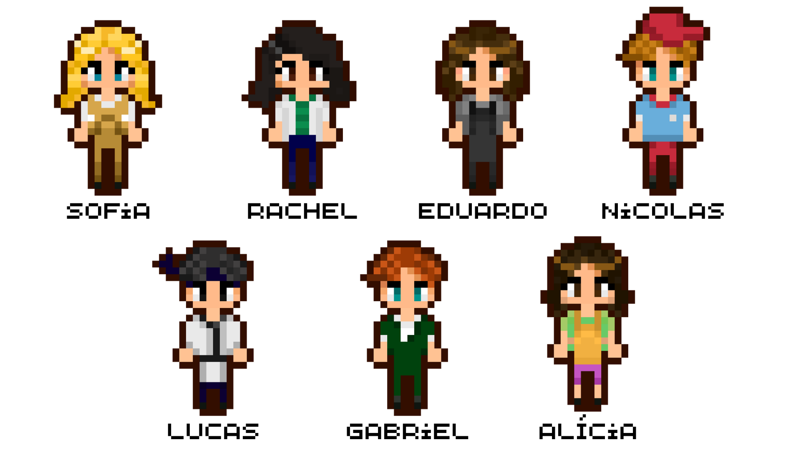

 <sub>Imagem 25 - Foto perfil personagens secundários </sub>
 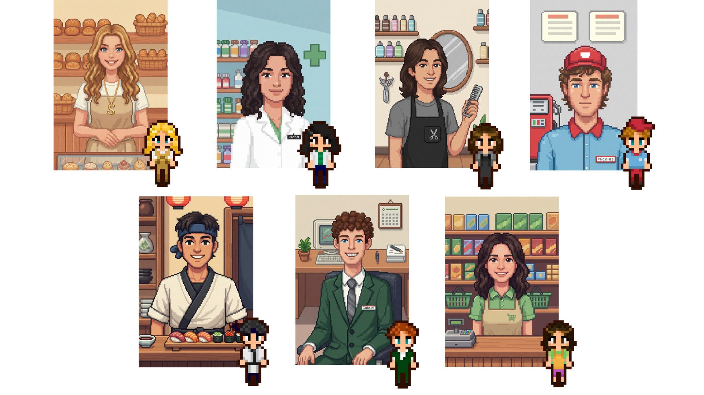

 <sub>Fonte: Autoria Própria usando o Piskel e Inteligência Artifcial (2026) 
 Descrição: imagens detalhada dos personagens secundários que trabalham no comércios do jogo.</sub>
</div>

#### Estrutura dos cenários iniciais:
&emsp; Os cenários iniciais do jogo representam os primeiros ambientes exploráveis pelo jogador durante a experiência de treinamento. Essa decisão atende ao RNF05, que determina que as missões e rotas do jogo devem ser baseadas em situações reais enfrentadas pelos vendedores da Cielo.


&emsp; Os ambientes foram concebidos em estilo pixel art, utilizando ferramentas de inteligência artificial como apoio na geração inicial das imagens, que posteriormente foram adaptadas para o contexto visual do jogo. A escolha desse estilo visual busca garantir leveza gráfica, fácil leitura visual e compatibilidade com o design do jogo.

&emsp; Cada cenário representa um tipo de estabelecimento comercial onde o jogador interage com clientes e realizar simulações de venda de soluções de pagamento. Esses ambientes funcionam como espaços de interação, nos quais o jogador inicia diálogos, toma decisões e avança na progressão do treinamento.


<div align="center">
  <sub>Imagem 26 - Cenários internos dos estabelecimentos</sub><br>
  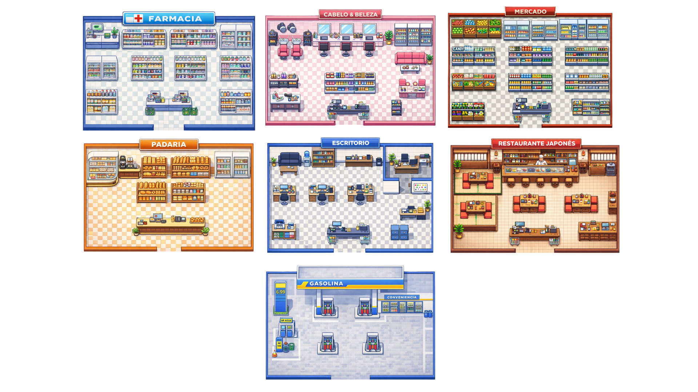<br>
  <sup>Fonte: Autoria própria utilizando Inteligência Artificial (2026)</sup>
</div>

#### Limitações Atuais do Protótipo
&emsp;Por se tratar de uma sprint inicial com foco em conceituação e estruturação, o protótipo desta fase apresenta as seguintes limitações:

 - Nenhuma mecânica funcional implementada: os personagens e cenários existem apenas como assets visuais; movimentação, colisões e interações ainda não foram codificadas.
 - Ausência de sistema de cenas no Phaser: o main.js inicializa o framework, mas ainda não há cenas funcionais carregadas - tela inicial (RF01), seleção de personagens (RF04) e cutscenes (RF14) estão previstas para as próximas sprints.
 - Assets não integrados ao código: os spritesheets e cenários foram criados, mas ainda não foram carregados nem referenciados no código do jogo.

## 4.2. Desenvolvimento básico do jogo (sprint 2)

&emsp; No desenvolvimento preliminar do jogo, o principal objetivo foi estruturar as cenas iniciais e implementar os sistemas fundamentais de jogabilidade. Para isso, o foco esteve na criação do menu principal, na tela de seleção de personagens, no mapa de gameplay com movimentação do jogador, no primeiro NPC interativo e na cutscene introdutória com transições personalizadas.

&emsp; Durante esse processo, foi identificado um erro no sistema de animação do personagem: ao trocar de direção durante o movimento, os frames continuavam sendo reproduzidos no estado anterior. A solução foi implementar animações separadas para cada direção, com frames carregados dinamicamente conforme o personagem escolhido na tela anterior.

&emsp; Durante esta sprint foram desenvolvidos os seguintes elementos do jogo:

- Implementação da cutscene inicial que introduz o contexto do jogo;
- Criação da tela inicial (menu principal);
- Desenvolvimento da tela de seleção de personagem;
- Implementação da cena da ponte, que representa a transição inicial do jogador para a cidade;
- Criação de acessibilidades na cena de configuração (Daltonismo, mudança de brilho e contraste).

&emsp; Alguns elementos ainda estão em desenvolvimento e serão finalizados nas próximas sprints:

- Implementação da cena do mapa da cidade.
- Desenvolvimento da cena da agência bancária.
- Implementação da cena do escritório.
- Integração entre as diferentes cenas do jogo, garantindo a transição correta entre elas.

&emsp; A maior dificuldade foi sincronizar esse carregamento dinâmico com o sistema de animação, garantindo que as imagens corretas fossem carregadas no `preload()` antes de serem referenciadas no `create()`. Isso exigiu um sistema de passagem de dados entre cenas, onde o nome da pasta e o prefixo do personagem são transmitidos como parâmetro ao iniciar a `SceneJogo`. 

Imagem 27 - Tela inicial do Mini Mundo Cielo &emsp;<sub>Fonte: Equipe Cielitos, Faculdade Inteli 2026</sub>

&emsp; O primeiro cenário desenvolvido foi o menu principal (`SceneInicial.js`). Primeiramente, foram criadas as variáveis de configuração da cena e definida a lista de botões com suas posições, escalas e ações correspondentes:

```js
this.CONFIG = {
  PIXELATE_AMOUNT: 40,
  PIXELATE_DURATION: 800,
  BOTOES: [
    { key: "botaoJogar",    x: "center", y: 600, scale: 0.5,  action: "startGame"    },
    { key: "botaoConfig",   x: "center", y: 870, scale: 0.48, action: "openSettings" },
    { key: "botaoCreditos", x: "center", y: 730, scale: 0.85, action: "fecharJogo"   }
  ]
};
```

&emsp; Em seguida, os botões foram adicionados de forma iterativa com efeitos de hover. A transição para a próxima cena aplica um efeito de pixelização progressiva usando postFX do Phaser:

```js
btn.on("pointerover", () => btn.setScale(botao.scale * 1.07));
btn.on("pointerout",  () => btn.setScale(botao.scale));

startGame() {
  const pixelated = this.cameras.main.postFX.addPixelate(1);
  this.add.tween({
    targets: pixelated, amount: this.CONFIG.PIXELATE_AMOUNT,
    duration: this.CONFIG.PIXELATE_DURATION, ease: "Sine.easeIn",
    onComplete: () => { this.scene.start("ScenePersonagem"); }
  });
}
```
Algumas cenas de telas do jogo:
<div align="center">
 <sub>Imagem 28 - Tela Inicial </sub>
 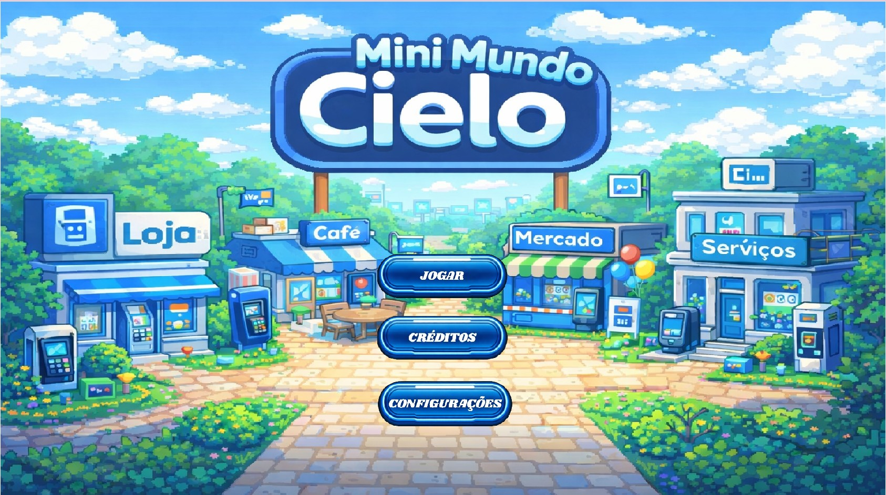
 
 <sub>Imagem 29 - Tela de Configurações </sub>
 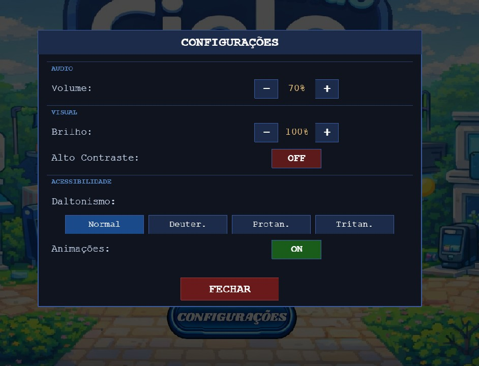

 <sub>Imagem 30 - Tela de seleção de personagens </sub>
 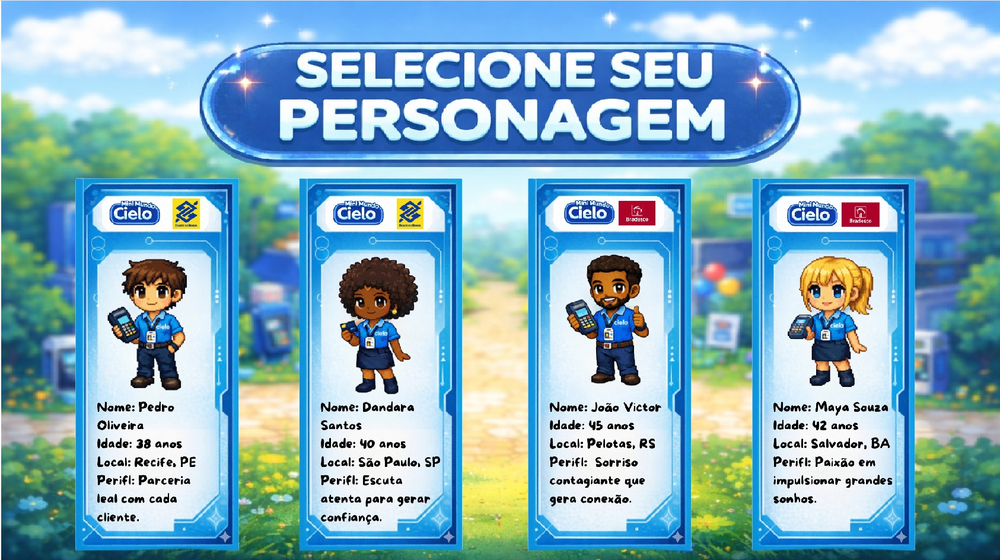

 <sub>Imagem 31 - Tela de tutorial </sub>
 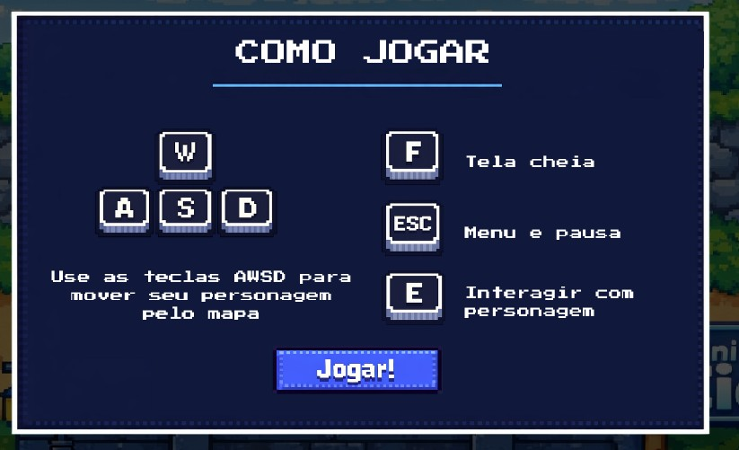

 <sub>Imagem 32 - Tela da ponte </sub>
 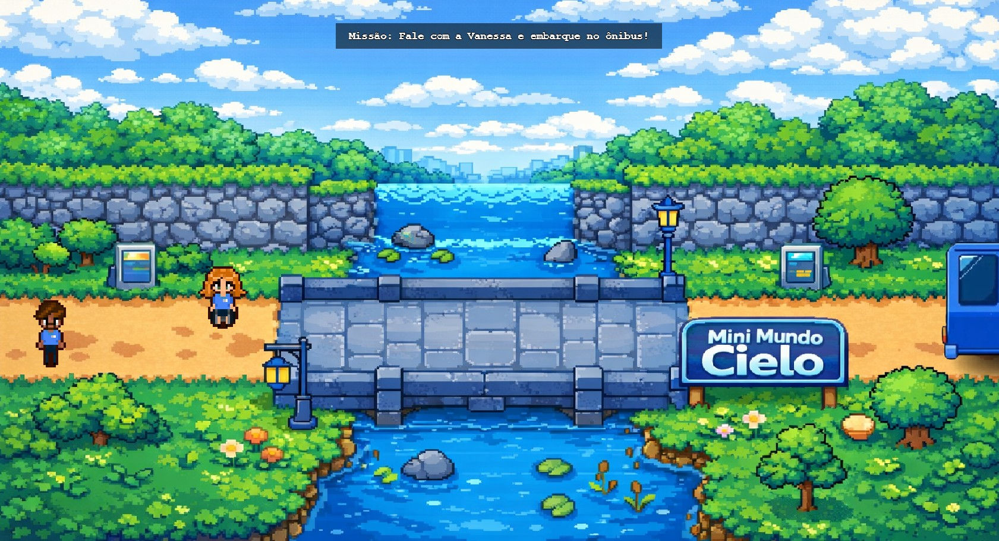

 <sub>Imagem 33 - Tela da Cutscene </sub>
 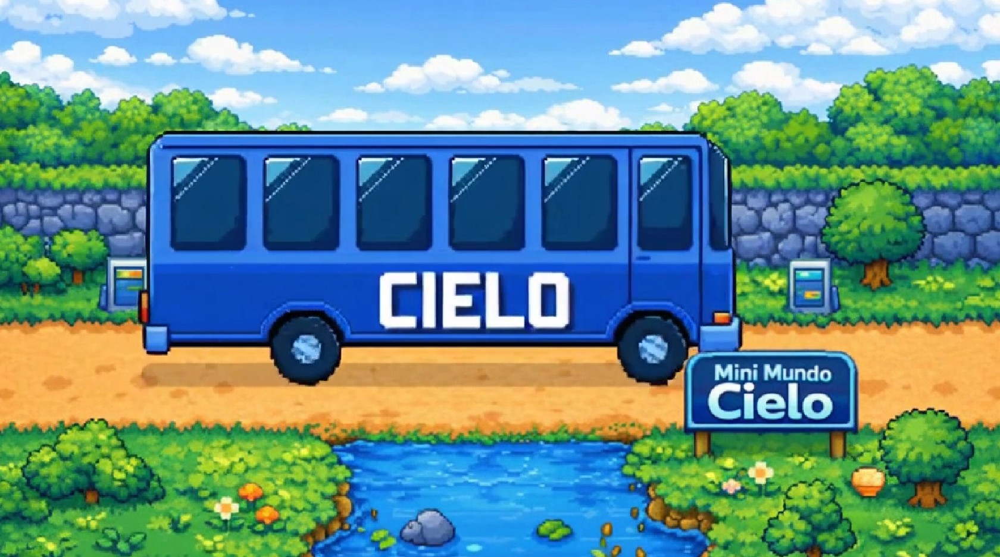

 <sub>Imagem 34 - Tela de seleção de personagens</sub>

 <sub>Fonte: Equipe Cielitos, Faculdade Inteli 2026</sub>
</div>

&emsp; Na tela de seleção (`ScenePersonagem.js`), foram criadas as variáveis para definir os quatro personagens jogáveis com suas posições, escalas e prefixos de arquivo. Ao clicar, os dados do personagem escolhido são passados para a cena seguinte:

```js
this.listaPersonagens = [
  { id: "Gabriel", x: 300,  y: 700, escala: 0.42, prefixoArquivo: "HB" },
  { id: "Maya",    x: 730,  y: 700, escala: 0.42, prefixoArquivo: "ML" },
  { id: "Joao",    x: 1170, y: 700, escala: 0.42, prefixoArquivo: "HM" },
  { id: "Dandara", x: 1600, y: 700, escala: 0.42, prefixoArquivo: "MM" }
];

// Ao clicar, realiza fade out e inicia SceneJogo com os dados do personagem
this.scene.start("SceneJogo", { nomePasta: dados.id, prefixo: dados.prefixoArquivo });
```

&emsp;No arquivo `SceneJogo.js`, foram criadas as variáveis de estado que controlam todas as interações da cena, e os 16 frames do personagem (4 direções × 4 frames) são carregados dinamicamente no `preload()` com base no personagem recebido:

```js
this.podeMover       = false; // Bloqueado até fechar o tutorial
this.dialogoNpcAberto = false;
this.npcPartiu        = false;
this.transicaoAtiva   = false;

for (let i = 1; i <= 4; i++) {
  this.load.image(`sprite_frente_${i}`,  `${caminhoBase}/${pre}_frente_${i}.png`);
  this.load.image(`sprite_direita_${i}`, `${caminhoBase}/${pre}_direita_${i}.png`);
  // ... demais direções
}
```

&emsp; Após isso, foi desenvolvida a função `criarAnimacoes()`, que cria de forma iterativa as animações das quatro direções de movimento:

```js
criarAnimacoes() {
  ['frente', 'tras', 'direita', 'esquerda'].forEach(dir => {
    this.anims.create({
      key: `andar_${dir}`,
      frames: [{ key: `sprite_${dir}_1` }, { key: `sprite_${dir}_2` },
               { key: `sprite_${dir}_3` }, { key: `sprite_${dir}_4` }],
      frameRate: 8,
      repeat: -1
    });
  });
}
```

&emsp; Na sequência, utilizando a função `update()`, nativa do Phaser.js, foi implementada a movimentação do personagem pelas teclas WASD, com a animação pausando automaticamente ao soltar as teclas, e os limites de mapa restringindo a área de movimento:

```js
update() {
  corpoFisico.setVelocity(0);
  if (this.teclasControl.d.isDown) {
    corpoFisico.setVelocityX(this.velocidadePersonagem);
    this.personagemSprite.anims.play("andar_direita", true);
    estaAndando = true;
  }
  // ... demais direções

  if (!estaAndando) { this.personagemSprite.anims.pause(); }
  else              { this.personagemSprite.anims.resume(); }

  this.personagemSprite.y = Phaser.Math.Clamp(this.personagemSprite.y, 578, 690);
  this.personagemSprite.x = Phaser.Math.Clamp(this.personagemSprite.x, 0, 1920);
}
```

&emsp; Para estar de acordo com o princípio de reutilização de código da POO, foi desenvolvido um sistema padrão de interação com objetos do cenário. No caso do NPC Vanessa, uma colisão por posição impede o jogador de ultrapassá-lo, e a detecção de proximidade com `Phaser.Math.Distance.Between()` exibe o indicador `[E]` e abre o diálogo ao pressionar a tecla:

```js
// Colisão — impede o jogador de passar pelo NPC
const limiteX = this.npcSprite.x - 60;
if (this.personagemSprite.x > limiteX) this.personagemSprite.x = limiteX;

// Proximidade e interação
const distNpc = Phaser.Math.Distance.Between(/* player e npc */);
this.indicadorE.setVisible(distNpc < 150 && !this.dialogoNpcAberto);

if (distNpc < 150 && Phaser.Input.Keyboard.JustDown(this.teclaE)) {
  this.dialogoNpcAberto = true;
  this.mostrarDialogoObjetivo(); // Abre diálogo com efeito typewriter
}
```
<div align="center">
 <sub>Imagem 35 - Cena de gameplay com o NPC Vanessa na ponte</sub>

 <sup>Fonte: Equipe cielitos, Faculdade Inteli 2026</sup>
</div>

&emsp; Por fim, ao chegar na borda direita do mapa, é acionada a transição clock wipe em sentido horário usando máscara de geometria do Phaser. Essa mesma função foi encapsulada e reutilizada na `SceneCutscene.js` ao final do vídeo introdutório:

```js
iniciarClockWipe() {
  const maskGraphics = this.make.graphics();
  this.cameras.main.setMask(maskGraphics.createGeometryMask());

  this.tweens.add({
    targets: { progress: 0 }, progress: 1, duration: 1000, ease: "Sine.easeInOut",
    onUpdate: (tween) => {
      const startAngle = -Math.PI / 2 + tween.getValue() * Math.PI * 2;
      maskGraphics.clear();
      maskGraphics.arc(cx, cy, raio, startAngle, -Math.PI / 2 + Math.PI * 2, false);
      maskGraphics.fillPath();
    },
    onComplete: () => { this.scene.start("SceneCutscene"); }
  });
}
```

&emsp; **Dificuldades**:

- Implementar o carregamento dinâmico dos sprites conforme o personagem selecionado, garantindo que todos os frames estivessem disponíveis antes de criar as animações
- Criar o sistema de colisão simples com o NPC sem utilizar physics bodies, usando apenas comparação de posições no eixo X
- Corrigir a animação do personagem para que pausasse e retomasse corretamente ao parar e reiniciar o movimento

&emsp; **Próximos passos**

- Criar o mapa interno dos estabelecimentos para a fase seguinte
- Adicionar os puzzles e desafios de vendas do jogo
- Implementar mais NPCs com diálogos e interações variadas

## 4.3. Desenvolvimento intermediário do jogo (sprint 3)

&emsp; Durante a terceira sprint do projeto, o foco do desenvolvimento foi expandir o ambiente jogável do jogo, implementando o mapa principal da cidade e iniciando a criação dos cenários internos dos estabelecimentos presentes no jogo. Essa etapa teve como objetivo transformar o jogo em um ambiente explorável mais amplo, permitindo ao jogador navegar por um cenário urbano e iniciar a interação com diferentes locais da narrativa.

&emsp; A partir da estrutura desenvolvida nas sprints anteriores, foi criada a cena SceneCidade.js, responsável por gerenciar o mapa urbano, a movimentação do personagem nesse ambiente, o sistema de colisões com elementos do cenário e as zonas de interação que permitem acessar determinados estabelecimentos.

&emsp; Além disso, também foi iniciado o desenvolvimento dos ambientes internos dos estabelecimentos do jogo utilizando o software Tiled, permitindo estruturar os cenários que serão utilizados nas próximas etapas da narrativa.

&emsp; Durante esta sprint foram desenvolvidos os seguintes elementos do jogo:

- Implementação do mapa principal da cidade utilizando o sistema de Tilemaps do Phaser.js;
- Integração dos tilesets gráficos responsáveis pela composição visual do cenário urbano;
- Desenvolvimento do sistema de colisão entre o personagem e objetos do ambiente, como prédios, veículos e obstáculos;
- Implementação da câmera dinâmica, que acompanha o personagem durante a movimentação pelo mapa;
- Criação do sistema de interação com estabelecimentos, permitindo acessar ambientes internos;
- Desenvolvimento dos cenários internos de diversos estabelecimentos utilizando o editor de mapas Tiled;
- Exportação desses cenários para o projeto no formato JSON, preparando sua futura integração ao jogo.

### Implementação do mapa da cidade:

&emsp; Para a construção do cenário urbano do jogo foi utilizado o software Tiled, um editor amplamente utilizado no desenvolvimento de jogos 2D para criação de mapas baseados em tiles.

&emsp; O mapa da cidade foi projetado no Tiled e posteriormente exportado no formato JSON, permitindo sua integração com o motor de jogos Phaser.js. O carregamento desse mapa ocorre dentro do método `preload()` da cena responsável pelo ambiente urbano.

```js
this.load.tilemapTiledJSON('mapaGeral', 'src/assets/imagens/mapsjson/tileMaps/mapaMiniMundoVF.tmj?v=5');
```

&emsp; Além do arquivo de mapa, também foram carregados os tilesets, que são os conjuntos de imagens utilizados para compor visualmente o cenário.

```js
this.load.image('tilesMapaTopo', 'src/assets/imagens/mapsjson/tileSets/Modern_Exteriors_Top.png?v=1');
this.load.image('tilesMapaBase', 'src/assets/imagens/mapsjson/tileSets/Modern_Exteriors_Bottom.png?v=1');
```

&emsp; Após o carregamento desses recursos, o mapa é instanciado na cena utilizando o método `make.tilemap()`, permitindo acessar suas camadas e estruturas internas.

```js
const mapa = this.make.tilemap({ key: 'mapaGeral' });
```

&emsp; Essa abordagem permite organizar o cenário em diferentes camadas e facilita a implementação de elementos como colisões, objetos interativos e elementos decorativos.

<div align="center">
 <sub>Imagem 36 - Mapa geral - Mini Mundo Cielo</sub>
 

 <sup>Fonte: Equipe cielitos, Faculdade Inteli 2026</sup>
</div>

### Organização das camadas do mapa:

&emsp; O mapa da cidade foi estruturado utilizando múltiplas camadas, permitindo separar elementos visuais e objetos com colisão. Essa organização facilita tanto a construção do cenário quanto a implementação da lógica de interação com o ambiente.

&emsp; Para evitar repetição de código durante a criação das camadas, foi implementada uma função auxiliar responsável por instanciá-las no Phaser.

```js
_criarCamada(mapa, nome, tilesets) {
  const camada = mapa.createLayer(nome, tilesets, 0, 0);
  return camada;
}
```

&emsp; As camadas do mapa foram divididas em três categorias principais:

- Camadas de chão e elementos decorativos, responsáveis apenas pela composição visual do cenário;
- Camadas de objetos com colisão, que impedem a movimentação do personagem;
- Camadas de elementos posicionados acima do personagem, utilizadas para criar sensação de profundidade no cenário.

&emsp; Para as camadas que devem bloquear o movimento do jogador, foi utilizado o método **`setCollisionByExclusion()`**:

```js
caminhoInferior.setCollisionByExclusion([-1]);
carrosVeiculos.setCollisionByExclusion([-1]);
estabelecimentos.setCollisionByExclusion([-1]);
```

&emsp; Esse sistema garante que o personagem não atravesse elementos como veículos, prédios e outros obstáculos presentes no mapa.

### Movimentação do personagem no mapa:

&emsp; O personagem é criado utilizando o sistema de física do Phaser, permitindo controlar sua velocidade e detectar colisões com os objetos do cenário.

```js
this.personagem = this.physics.add.sprite(spawnX, spawnY, 'sprite_frente_1');
this.personagem.setCollideWorldBounds(true);
```

&emsp; O sistema de controle permite utilizar tanto as setas direcionais quanto as teclas WASD, oferecendo maior flexibilidade ao jogador.

```js
this.teclas = this.input.keyboard.createCursorKeys();
```

&emsp; Durante o loop de atualização do jogo `(update())`, o sistema verifica quais teclas estão pressionadas e aplica velocidade ao personagem, além de reproduzir a animação correspondente à direção do movimento.

&emsp; Quando o jogador interrompe o movimento, a animação é pausada e o sprite retorna ao primeiro frame da direção atual, representando o estado de repouso do personagem.

### Sistema de câmera dinâmica:

&emsp; Para melhorar a experiência de navegação pelo cenário, foi implementado um sistema de câmera que acompanha automaticamente o personagem durante sua movimentação.

```js
this.cameras.main.startFollow(this.personagem);
```

&emsp; Além disso, foi aplicado um nível de zoom específico para melhorar a visualização do cenário.

```js
this.cameras.main.setZoom(4);
```

&emsp; Também foram definidos limites para a câmera, impedindo que o jogador visualize áreas externas ao mapa.

```js
this.cameras.main.setBounds(MAPA_X, MAPA_Y, MAPA_LARGURA, MAPA_ALTURA);
```

<div align="center">
 <sub>imagem 37 - Personagem no mapa geral - Mini Mundo Cielo</sub>
 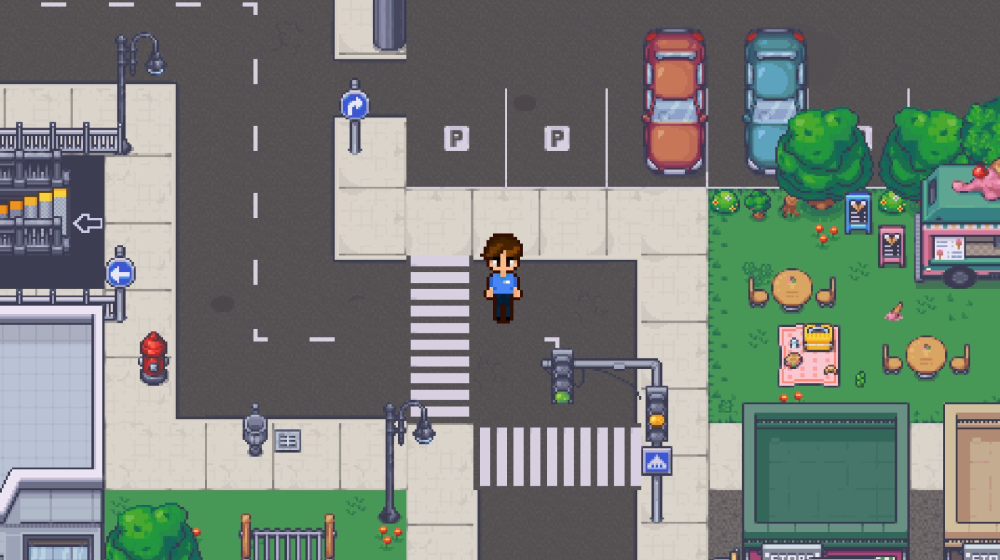
 
 <sup>Fonte: Equipe cielitos, Faculdade Inteli 2026</sup>
</div>

### Sistema de interação com estabelecimentos:

&emsp; Uma das principais funcionalidades desenvolvidas nesta sprint foi o sistema de interação que permite ao jogador acessar determinados estabelecimentos presentes no mapa da cidade. Para isso, foi criada uma zona de interação utilizando um retângulo geométrico que representa a área próxima à entrada de um prédio.

```js
this.zonaAgencia = new Phaser.Geom.Rectangle(950, 840, 90, 80);
```

&emsp; Quando o personagem entra nessa área, um indicador visual é exibido informando que a tecla E pode ser pressionada para entrar no local.

```JS
this.labelE = this.add.text(993, 838, '[E] Entrar');
``` 

&emsp; Caso o jogador pressione a tecla correspondente, é iniciada uma transição de cena utilizando um efeito de fade-out da câmera.

```JS
this.cameras.main.fadeOut(800, 0, 0, 0);
```

&emsp; Após a conclusão da animação, o jogo inicia a cena interna do estabelecimento.

```JS
this.scene.start('SceneEscritorio');
```

&emsp; Esse sistema estabelece a base para a navegação entre o mapa da cidade e os diferentes ambientes internos do jogo.

<div align="center">
 <sub>Imagem 38 - Mapa geral - Mini Mundo Cielo</sub>
 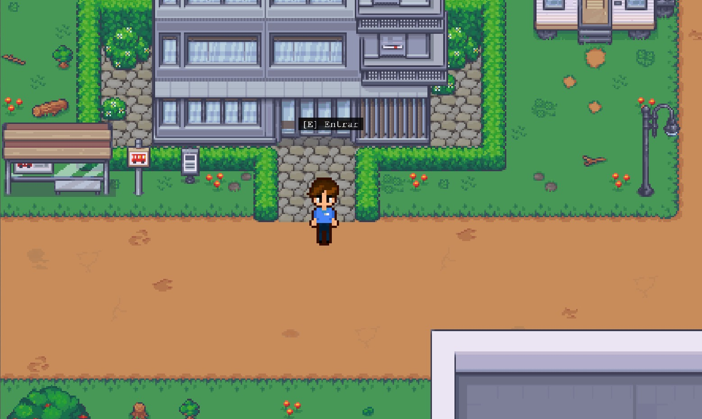

 <sup>Fonte: Equipe cielitos, Faculdade Inteli 2026</sup>
</div>

### Desenvolvimento dos cenários internos:

&emsp; Além da implementação do mapa principal da cidade, também foi iniciado o desenvolvimento dos cenários internos dos estabelecimentos presentes no jogo. Esses ambientes foram projetados utilizando o software Tiled, seguindo o mesmo padrão estrutural utilizado na construção do mapa externo.

&emsp; Durante essa etapa foram desenvolvidos os mapas internos dos seguintes estabelecimentos:

- Agências bancárias 1 2 e 3;
- Padaria;
- Farmácia;
- Loja de roupa;
- Estação de metrô;
- Restaurante;
- Supermercado;
- Posto de gasolina.

&emsp; Cada ambiente foi criado como um tilemap independente, permitindo maior organização do projeto e facilitando a implementação de interações específicas dentro de cada local.
Após a criação no Tiled, os mapas foram exportados no formato JSON, tornando possível sua integração com o motor Phaser.js por meio do sistema de carregamento de tilemaps.

&emsp; Apesar de esses cenários já estarem implementados e exportados para o projeto, a integração completa desses ambientes ao mapa da cidade ainda não foi finalizada durante esta sprint. Dessa forma, a conexão entre o mapa principal e todos os estabelecimentos será concluída nas próximas etapas do desenvolvimento.

<div align="center">
 <sub>Imagens 39 e 40 - Estabelecimentos internos - Mini Mundo Cielo</sub>
 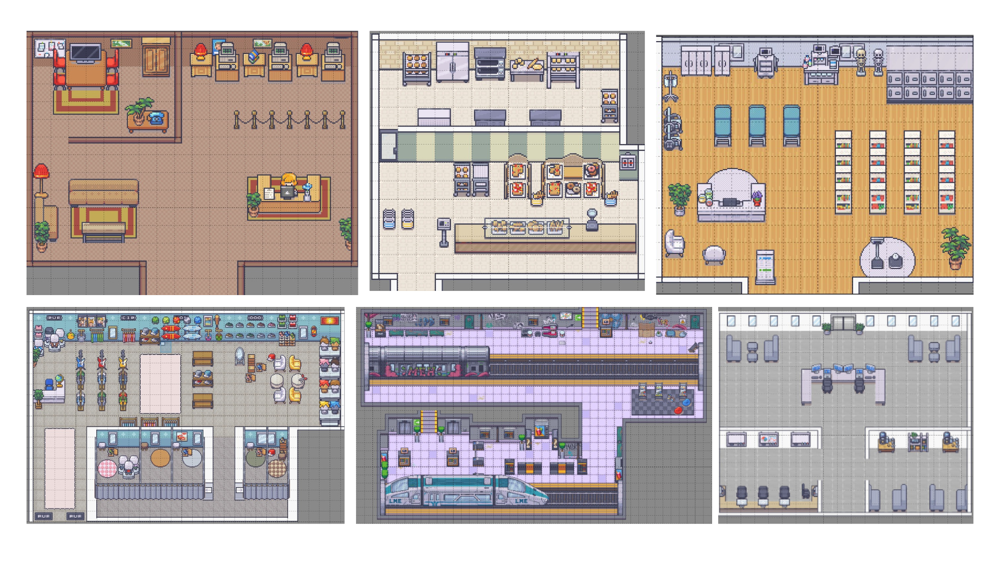
 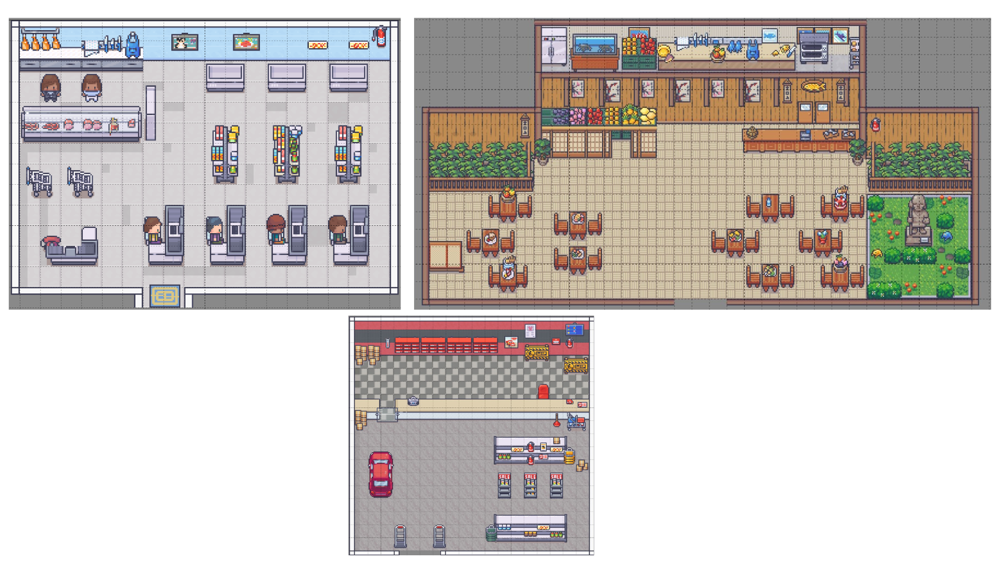

 <sup>Fonte: Equipe cielitos, Faculdade Inteli 2026</sup>
</div>

### Dificuldades:

&emsp; Durante o desenvolvimento desta sprint, algumas dificuldades técnicas foram encontradas, principalmente relacionadas à integração do mapa com o sistema de movimentação do personagem e com os elementos interativos do cenário.

Entre os principais desafios estão:

- Integrar corretamente o mapa criado no editor Tiled ao motor Phaser.js;
- Configurar o sistema de colisão em múltiplas camadas do mapa, sem interferir nos elementos decorativos;
- Ajustar a escala do personagem para manter proporção adequada em relação ao tamanho dos tiles do cenário;
- Implementar um sistema confiável de detecção de proximidade para interação com estabelecimentos;
- Organizar a estrutura dos mapas internos dos estabelecimentos para futura integração ao sistema de navegação do jogo.


### Próximos passos:

&emsp; Nas próximas sprints, o desenvolvimento será direcionado para ampliar as interações dentro do jogo e finalizar a integração dos cenários internos ao mapa da cidade.
Entre os próximos objetivos estão:

- Integrar todos os estabelecimentos internos ao mapa da cidade.
- Implementar NPCs adicionais com diálogos e objetivos específicos.
- Implementar novas interações com NPCs dentro dos estabelecimentos.
- Desenvolver os desafios e puzzles relacionados à temática do jogo.
- Adicionar novas mecânicas de gameplay ligadas ao sistema de progressão do jogador.
- Realizar ajustes visuais e melhorias na navegação pelo mapa.

## 4.4. Desenvolvimento final do MVP (sprint 4)

&emsp; O desenvolvimento do jogo ao longo das três primeiras sprints foi estruturado de forma progressiva, partindo da base conceitual até a construção de um ambiente jogável mais completo.

&emsp; Na sprint 1, o foco esteve na definição da estrutura inicial do projeto, com a organização modular dos arquivos e a criação dos primeiros elementos visuais do jogo, incluindo personagens jogáveis, NPCs e cenários em pixel art, estabelecendo a identidade estética e narrativa da experiência.

&emsp; Na sprint 2, o desenvolvimento avançou para a implementação das funcionalidades básicas de jogabilidade, como o menu principal, a seleção de personagens, a cutscene introdutória e o sistema inicial de movimentação do jogador. Também foram estruturadas as primeiras interações com NPCs e iniciadas as transições entre cenas, consolidando a base técnica do jogo.

&emsp; Já na sprint 3, o projeto evoluiu para um ambiente mais robusto e explorável, com a implementação do mapa principal da cidade, sistema de câmera dinâmica, colisões com o cenário e a criação das zonas de interação que permitem acessar estabelecimentos. Além disso, foi iniciado o desenvolvimento dos cenários internos utilizando tilemaps, ampliando as possibilidades de navegação e interação dentro do jogo.

&emsp; Durante a quarta sprint, o foco do desenvolvimento foi a consolidação do jogo como um Produto Mínimo Viável (MVP), integrando os sistemas previamente construídos em uma experiência coesa, com início, meio e fim bem definidos.

&emsp; Nessa etapa, os ambientes internos foram finalizados e conectados ao mapa principal, garantindo a navegação contínua entre cenas e a interação com diferentes estabelecimentos. Além disso, foram implementados o roteiro narrativo, os sistemas de interface (HUD), a sonoplastia e mecânicas complementares, como o mini game e efeitos dinâmicos de ambiente (chuva e vento), elevando o nível de imersão do jogador.

&emsp; Apesar dos desafios técnicos relacionados à integração entre cenas e à organização estrutural do projeto, a sprint resultou em uma versão funcional do jogo, apta para testes e refinamentos na etapa seguinte.

&emsp; **Elementos desenvolvidos na sprint 4:**

- Finalização dos cenários internos (metrô e agências) utilizando o Tiled;
- Integração completa das cenas ao sistema principal (SceneCidade.js);
- Implementação da navegação entre o mapa e os estabelecimentos;
- Desenvolvimento e integração do mini game do metrô;
- Implementação de efeitos dinâmicos (chuva e vento) baseados em lógica matemática;
- Integração das interações dentro dos estabelecimentos;
- Integração da IA nos diálogos e interações;
- Estruturação do fluxo de progressão do jogador;
- Interface e experiência do usuário (HUD):
    - Mini-mapa;
    - Interface da maquininha Cielo;
    - Aba de missões;
    - Contador de progresso;
- Recursos visuais e sonoros:
    - Criação e implementação de novas sprite sheets;
    - Implementação de trilha sonora e efeitos sonoros.

 ### SceneCidade.js como hub central de navegação
 
&emsp; A SceneCidade.js foi estruturada como o ponto central de articulação do Mini Mundo Cielo, concentrando em uma única cena os sistemas responsáveis pelo carregamento do mapa, movimentação do personagem, controle de câmera, interface visual e gestão das transições entre ambientes. Seu método init() recebe os dados de contexto transmitidos entre cenas, como personagem escolhido, posição de spawn e progresso de missão,  e os recupera do Phaser.Registry quando não estão disponíveis diretamente.

```js
init(dados = {}) {
  this.nomePastaEscolhida = dados.nomePasta || this.registry.get("nomePasta") || "Pedro";
  this.prefixoEscolhido = dados.prefixo || this.registry.get("prefixo") || "HB";
  this.spawnXCustom = dados.spawnX || null;
  this.spawnYCustom = dados.spawnY || null;
} 
```

&emsp; A conexão com os estabelecimentos é gerenciada por zonas de interação geométricas instanciadas individualmente para cada local. Ao detectar o personagem nessas áreas, a cena exibe um indicador visual e aguarda o acionamento da tecla E para iniciar a transição com fade-out da câmera.

 ```js
jsthis.zonaAgencia = new Phaser.Geom.Rectangle(976, 856, 90, 80);
this.labelE = this.add.text(976, 856, "[E] Entrar", { fontSize: "6px", color: "#ffffff" }).setVisible(false); 
```

&emsp; A progressão pelo mapa é orientada por setas-guia sequenciais, cujo índice é persistido no registry. O método _avancarSequenciaSetas() valida se o jogador acessou o estabelecimento correto antes de avançar para o próximo destino, estruturando a experiência de forma linear sem bloquear a exploração livre.

```js
js_avancarSequenciaSetas(localAtual) {
  const localEsperado = this.sequenciaSetas[this.indiceSetaAtual];
  if (localAtual !== localEsperado) return;
  this.indiceSetaAtual += 1;
  this.registry.set("sequenciaSetaCidade", this.indiceSetaAtual);
}
```

### Finalização dos cenários internos

&emsp; Com a estrutura de navegação da SceneCidade.js consolidada, esta sprint foi dedicada à finalização e integração dos cenários internos de todos os estabelecimentos. Cada ambiente foi implementado como uma cena independente - SceneAgencia01, ScenePadaria, SceneEscritorio, entre outros - seguindo um padrão estrutural comum com os métodos init, preload, create e update.

&emsp; O sistema de colisão interna foi estruturado com uma convenção de nomenclatura nas camadas do Tiled: camadas prefixadas com N - compõem apenas a camada visual, enquanto camadas prefixadas com C - recebem colisão ativa.

```js
jsconst paredeC = this._criarCamada(mapa, "C - ParedeComColid", tilesets);
[paredeC].filter(Boolean).forEach((c) => c.setCollisionByExclusion([-1]));
 ```

&emsp; A função auxiliar `_criarCamada()` foi reaproveitada em todas as cenas, centralizando o tratamento de erros e evitando repetição de código. A saída de cada estabelecimento é gerenciada por uma zona geométrica que inicia a transição de volta à SceneCidade.js com fade-out, devolvendo o jogador ao ponto de entrada correspondente.

### Integração das interações dentro dos estabelecimentos

As interações com NPCs dentro dos estabelecimentos seguem um padrão comum a todas as cenas internas: ao se aproximar de um personagem, o jogador visualiza um indicador `[E]` Falar e um símbolo de exclamação animado. Ao pressionar a tecla, a cena atual é pausada e uma cena de diálogo é iniciada em paralelo via scene.launch(), preservando o estado do ambiente.

```js
jsif (pertoNpc && Phaser.Input.Keyboard.JustDown(this.teclaE)) {
  this.scene.pause();
  this.scene.launch("SceneDialogoPadaria", { cenaOrigem: "ScenePadaria" })
};
```
&emsp; Cada cena de diálogo foi estruturada com um roteiro desenvolvido em parceria com o advisor da Cielo, simulando situações reais de abordagem comercial. A cada cena, o jogador escolhe entre três respostas classificadas como correta, neutra ou errada, com pesos distintos no sistema de Cielo Coins.

&emsp; Após a escolha, o método `_chamarLLM()` gera a réplica do NPC. No modo estrito, a resposta vem diretamente do roteiro. Quando desativado, ela é gerada dinamicamente pela API da Groq com o modelo llama-3.1-8b-instant, orientada por um prompt que contextualiza o perfil do NPC e o tom esperado conforme a qualidade da resposta do jogador.

&emsp; Ao final do roteiro, é exibida uma tela de resultado com a pontuação da fase, o total de Cielo Coins acumulados e uma avaliação qualitativa do desempenho. O progresso é registrado no Phaser.Registry, permitindo que a SceneCidade.js reconheça a conclusão do diálogo e avance o fluxo de missões.

### Mini game do metrô

&emsp; Como mecânica complementar ao fluxo principal, foi desenvolvido um mini game acessível dentro da cena do metrô com o objetivo de tornar a experiência mais dinâmica e interativa, além de oferecer ao jogador uma oportunidade de acumular Cielo Coins de forma expressiva. O jogador controla um personagem em um cenário de plataforma, coletando moedas e desviando de bombas. O jogo é dividido em quatro fases com cenários e trilhas sonoras distintas, que se alternam automaticamente conforme a pontuação avança.

```js
jsif (this.pontuacao >= 10 && this.faseAtual === 1) {
  this.trocarFase(2, 'background2', 'musicaFase2');
}
```

&emsp; Os itens coletáveis são spawados periodicamente durante a partida. A moeda comum vale +1 ponto, a moeda extra +3 e a bomba desconta -1, incentivando o jogador a se movimentar com atenção pelo cenário.

```js
jsthis.time.addEvent({ delay: 20000, callback: this.spawnMoedaExtra, loop: true });
this.time.addEvent({ delay: 10000, callback: () => { this.spawnBomba(); }, loop: true });
```

&emsp; Ao atingir 40 moedas, o jogo é encerrado e os pontos são convertidos em Cielo Coins globais, acumulados no Phaser.Registry e refletidos no HUD da cidade. O jogador é então devolvido automaticamente à cena do metrô com um efeito de fade-out.

```js
jsconst coinsGanhas = Math.max(0, this.pontuacao) * 50;
const totalAtual = Number(this.registry.get("cieloCoins") ?? 0);
this.registry.set("cieloCoins", totalAtual + coinsGanhas);
```
Imagem XXX - print do mini game 
### Interface e experiência do usuário (HUD)

&emsp; Para apoiar a navegação e o acompanhamento do progresso, foram implementados durante esta sprint os principais elementos de interface do jogo, todos integrados diretamente à SceneCidade.js e configurados para não aparecerem no minimapa.

&emsp; O elemento central do HUD é a maquininha Cielo, posicionada no canto inferior direito da tela. Ao ser clicada, ela se expande com uma animação de tween até o centro da câmera, revelando quatro botões de ação: mapa interativo, configurações, ranking e diário de missões. Um botão de fechar a recolhe de volta ao canto com a mesma suavidade.

```js
jsthis.hudIcon.on("pointerdown", () => {
  this.tweens.add({
    targets: this.hudIcon,
    x: cam.worldView.centerX,
    y: cam.worldView.centerY,
    scale: this.hudIconZoomScale,
    duration: 260,
    ease: "Quad.Out",
  })
 }
)
```

&emsp; O contador de Cielo Coins é exibido no canto superior direito e atualizado a cada frame com base no valor armazenado no Phaser.Registry, refletindo em tempo real os ganhos obtidos nos diálogos e no mini game.
O diário de missões é acessado pelo botão correspondente na maquininha e exibe a lista de objetivos da fase com seus respectivos status - pendente, em andamento ou concluída - sincronizados automaticamente com o registry sempre que um evento de progressão é disparado.

&emsp; O minimapa foi implementado com uma câmera secundária independente (miniMapCam), que renderiza o mapa em escala reduzida no canto superior esquerdo e exibe um ponto verde indicando a posição atual do jogador. O botão de mapa interativo da maquininha redireciona o jogador para a SceneMapaInterativo, que pode ser fechada com ESC para retornar ao ponto exato onde o jogador estava.

```js
jsthis.input.keyboard?.once("keydown-ESC", () => {
  const retornoX = Number(this.registry.get("cidadeRetornoX"));
  const retornoY = Number(this.registry.get("cidadeRetornoY"));
  this.scene.start("SceneCidade", { spawnX: retornoX, spawnY: retornoY });
});
```
Imagem 41 - HUD 
Imagem 42 - maquininha 

### Desenvolvimento de novas sprite sheets

&emsp; Para atender às necessidades narrativas da sprint 4, foram desenvolvidos novos personagens em pixel art 2D utilizando o site Piskel App, seguindo o mesmo processo adotado nas sprints anteriores. Cada agência recebeu dois NPCs distintos, um representando o Gerente Geral (GG) e outro o Parceiro de Negócios (PJ), totalizando novos personagens distribuídos ao longo dos ambientes internos do jogo.

&emsp; Assim como nos personagens jogáveis, parte dos NPCs foi desenvolvida com animações de movimento em múltiplas direções, enquanto outros utilizam sprites estáticos, adequados para personagens que permanecem fixos em seus postos durante as interações. Essa abordagem mista permitiu equilibrar a qualidade visual com o esforço de produção dentro do prazo da sprint.

### Fluxo de progressão do jogador

&emsp; O sistema de progressão do Mini Mundo Cielo foi estruturado em torno de um módulo centralizado de pontuação, o "scoring.js", responsável por gerenciar o saldo de Cielo Coins do jogador ao longo de toda a sessão. Esse módulo é importado pelas cenas de diálogo e pelo mini game, garantindo que os coins acumulados em cada fase sejam somados a um total global persistido no Phaser.Registry.
A pontuação é organizada em três capítulos com valores e regras distintas. No capítulo 1, respostas corretas valem 100 coins e erros não penalizam. No capítulo 3, a dificuldade aumenta e respostas erradas passam a subtrair 50 coins, exigindo maior atenção do jogador.

```js
jsexport const SCORING_CONFIG = {
  chapter1: { correct: 100, generic: 50, wrong: 0 },
  chapter3: { correct: 300, generic: 150, wrong: -50 },
}
```

&emsp; A função handleAnswer() é chamada a cada escolha do jogador nas cenas de diálogo, aplicando os coins correspondentes ao capítulo e tipo de resposta. O total é atualizado diretamente no registry e refletido em tempo real no HUD.

```js
jsexport function handleAnswer(registry, chapter, tipo) {
  const cfg = SCORING_CONFIG[chapter];
  let amount = tipo === "correta" ? cfg.correct
             : tipo === "neutra"  ? cfg.generic
             :                     cfg.wrong;
  addCoins(registry, amount);
  return amount;
}
```

&emsp; Cada fase possui uma meta de coins definida em METAS_BASE, verificada ao final do diálogo via checkGoal(). O resultado determina a avaliação qualitativa exibida na tela de encerramento, incentivando o jogador a revisitar as fases e aprimorar seu desempenho.

<div align="center">
 <sub>Imagem 41 - Resultado Diálogo - Mini Mundo Cielo</sub>
 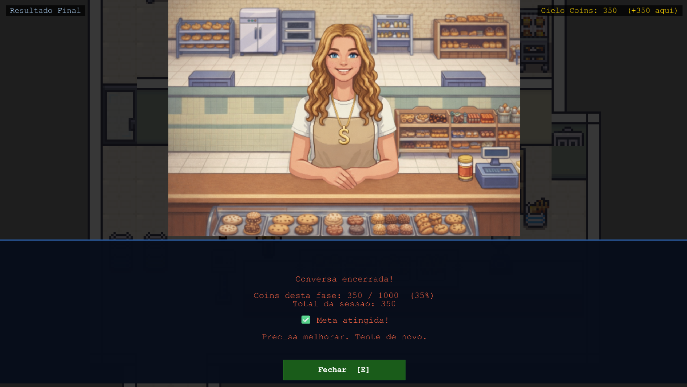

 <sup>Fonte: Equipe cielitos, Faculdade Inteli 2026</sup>
</div>

### Efeitos dinâmicos de ambiente Chuva

&emsp; Para aumentar a imersão no mapa da cidade, foi implementada a SceneChuva, uma cena paralela lançada junto à SceneCidade.js com fundo transparente, sobrepondo o cenário sem interferir na jogabilidade. O efeito utiliza um pool de 800 gotas reutilizáveis, evitando a criação contínua de objetos e preservando a performance.

&emsp; O movimento de cada gota foi calculado com base em equações cinemáticas, integrando o artefato de matemática do projeto diretamente ao código. No eixo X a gota se desloca com velocidade constante (MU) e no eixo Y a queda é simulada com aceleração crescente (MUV).

```js
jsvar x_atual = g.xi + g.vx * t;
var y_atual = g.yi + 0.5 * g.ay * t * t;
```

&emsp; A chuva inicia automaticamente após 30 segundos de jogo, dura 50 segundos e é acompanhada de trilha sonora própria. As gotas são desenhadas quadro a quadro com gradiente de opacidade para simular o brilho natural da água.

<div align="center">
 <sub>Imagem 42 - Efeito de Chuva - Mini Mundo Cielo</sub>
 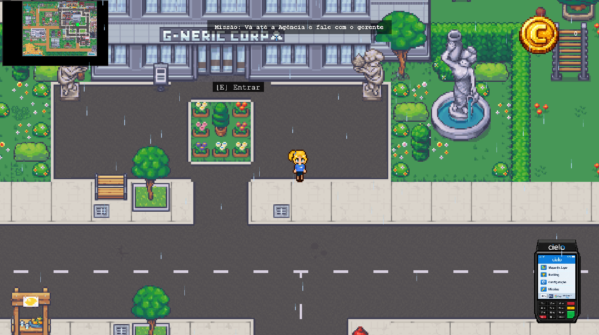
 
 <sup>Fonte: Equipe cielitos, Faculdade Inteli 2026</sup>
</div>

### Trilha sonora e efeitos sonoros

&emsp; A implementação da sonoplastia seguiu a organização conceitual já detalhada na seção 3.3.5 do documento, que distingue sons diegéticos e não diegéticos conforme sua relação com o universo narrativo do jogo. Na sprint 4, essa estrutura foi integrada ao código de todas as cenas internas e do mapa principal.

&emsp; Cada cena carrega e inicializa sua própria trilha sonora no método preload() e a reproduz em loop no create(). Ao encerrar a cena, o áudio é interrompido via evento de shutdown, evitando sobreposição de trilhas durante as transições.

```js
jsthis.musica = this.sound.add('trilhaAgencia01', { loop: true, volume: 0.5 });
this.musica.play();

this.events.on("shutdown", () => {
  this.musica.stop();
})
```

&emsp; Além das trilhas por ambiente, foram implementados efeitos sonoros pontuais, como o som de coleta de itens no mini game do metrô, reforçando o feedback imediato das ações do jogador.

### Dificuldades

&emsp; Durante o desenvolvimento desta sprint, os principais desafios estiveram relacionados à integração dos múltiplos sistemas desenvolvidos em paralelo por toda a equipe. Entre as principais dificuldades encontradas estão:

- Conectar todas as cenas internas ao mapa principal, exigindo atenção constante à consistência dos dados transmitidos entre cenas, como posições de spawn, estado das missões e progresso persistido no Phaser.Registry;
- Replicar e ajustar individualmente o mecanismo completo de entrada e saída para cada estabelecimento, envolvendo detecção de zona, indicadores visuais, fade-out, transição de cena e retorno ao ponto correto do mapa;
- Integrar simultaneamente trilha sonora, diálogos com IA e sistema de pontuação, onde qualquer inconsistência no ciclo de vida das cenas, como uma trilha não interrompida no shutdown, causava sobreposição de áudios e comportamentos inesperados;
- Trabalhar com toda a equipe no mesmo código ao mesmo tempo, o que exigiu organização rigorosa para evitar conflitos e regressões entre as funcionalidades desenvolvidas em paralelo.

### Próximos passos

&emsp; Para as próximas etapas do desenvolvimento, o foco será o refinamento e o polimento da experiência construída durante o MVP. Entre os principais objetivos estão:

- Corrigir inconsistências visuais, de colisão e de fluxo identificadas durante os testes
- Corrigir e ajustar os diálogos com NPCs para garantir coerência narrativa
- Implementar novos efeitos sonoros e expandir a cobertura de trilhas nos ambientes ainda sem áudio
- Finalizar a implementação das missões no HUD da maquininha Cielo, com atualização dinâmica conforme o progresso do jogador
- Finalizar o mapa interativo acessível pela maquininha Cielo

### Conclusão da Sprint 4

&emsp; Ao final da sprint 4, o projeto atingiu o estágio de Produto Mínimo Viável (MVP), apresentando um fluxo completo de jogabilidade com início, desenvolvimento e conclusão de objetivos. O jogo já permite a navegação entre ambientes, interação com NPCs, progressão estruturada por missões, sistema de pontuação integrado e mecânicas complementares, como o mini game e efeitos dinâmicos de ambiente. Dessa forma, o MVP atende aos requisitos propostos no GDD, estando apto para testes, validação com usuários e refinamentos nas etapas seguintes do desenvolvimento

## 4.5. Revisão do MVP (sprint 5)

O desenvolvimento do Mini Mundo Cielo ao longo das quatro sprints anteriores percorreu um caminho progressivo: na sprint 1 foram definidos a estrutura modular do projeto e os primeiros elementos visuais em pixel art; na sprint 2 foram implementadas as funcionalidades básicas de jogabilidade; na sprint 3 o jogo ganhou um ambiente explorável com mapa, câmera dinâmica e zonas de interação; e na sprint 4 o projeto atingiu o estágio de MVP com integração completa dos cenários, sistema de pontuação, HUD, mini game e sonoplastia. A sprint 5 foi dedicada ao refinamento e polimento desse MVP, corrigindo inconsistências e validando a experiência com usuários reais.

Elementos desenvolvidos na sprint 5:

- Implementação das imagens de tutorial nas cenas de diálogo e no mapa da cidade
- Correção do bug de HUD em múltiplas cenas internas
- Criação do feedback imediato por escolha nos quizzes e melhoria do feedback final
- Correção das pontuações no sistema de Cielo Coins
- Correção e reformulação do mini game do metrô
- Adição do HUD de missões nas cenas internas que ainda não o possuíam
- Implementação do PJ Theo e da PJ Camila como guias de navegação no mapa da cidade
- Correção das zonas de interação com os estabelecimentos
- Implementação da tela de vitória (`SceneVitoria`)
- Deploy do mini game
- Playtests realizados com públicos distintos ao redor da faculdade
- Revisão e refinamento geral do jogo

### Tutorial nas cenas de diálogo e no mapa da cidade

Cada cena de diálogo passou a exibir uma tela de tutorial antes do início da conversa, orientando o jogador sobre as mecânicas da negociação. O tutorial é construído com elementos Phaser destruídos ao clicar em "Começar", sem interferir no estado da cena.

```js
btnBg.on("pointerdown", () => {
  els.forEach((el) => el?.destroy?.());
  this._mostrarCena(0);
});
```

Além disso, foi implementado um tutorial do mapa exibido na primeira vez que o jogador entra na `SceneCidade`. O estado de exibição é persistido no `Phaser.Registry` para que o tutorial apareça apenas uma vez por sessão.

```js
mostrarTutorialMapa() {
  if (!this.registry.get("tutorialMapaVisto")) {
    this.registry.set("tutorialMapaVisto", true);
    // Exibe imagem com zona clicável sobre o botão "Entendi!"
    const btnZone = this.add.zone(cx, cy + dH * 0.38, dW * 0.55, dH * 0.14)
      .setInteractive({ useHandCursor: true });
    btnZone.on("pointerdown", () => this.fecharTutorialMapa());
  }
}
```

<sub>Figura XX - Tela de tutorial das cenas de diálogo</sub>

``

<sub>Fonte: Equipe Cielitos, Faculdade Inteli 2026</sub>

### Feedback imediato por escolha e melhoria do feedback final

Nesta sprint foi criado o sistema de feedback imediato, exibido logo após cada escolha e antes da resposta do NPC. Ao selecionar uma opção, a cena entra no estado `"feedback"` e exibe um título e texto explicativo específicos para aquela resposta, informando se a abordagem foi correta, neutra ou inadequada.

```js
_mostrarFeedbackEscolha(escolha) {
  this.estado = "feedback";
  this.textoFeedbackTitulo.setText(escolha.feedbackTitulo).setVisible(true);
  this.textoFeedback.setText(escolha.feedbackTexto).setVisible(true);
  this._mostrarContinuar("Continuar  ->");
}
```

O fluxo completo de uma escolha passou a seguir a sequência: seleção → feedback imediato → réplica do NPC → próxima cena. O feedback final também foi melhorado, apresentando avaliação qualitativa com cor e mensagem distintas por faixa de desempenho.

```js
if (pct >= 40) { avaliacao = "Vendedor nato! Negócio fechado!"; cor = "#44ff88"; }
else           { avaliacao = "Quase...";                        cor = "#ff6644"; }
```

<sub>Figura XX - Feedback imediato após escolha do jogador</sub>

``

<sub>Fonte: Equipe Cielitos, Faculdade Inteli 2026</sub>

### Correção das pontuações

O módulo `scoring.js` foi revisado e expandido para contemplar todos os capítulos com valores e regras distintas. O capítulo 2 recebeu sua configuração própria com pontuações mais altas, o capítulo 3 passou a penalizar respostas erradas, e o mini game do metrô recebeu um limite de colisões configurável de forma centralizada.

```js
export const SCORING_CONFIG = {
  chapter1: { correct: 100, generic:  50, wrong:   0 },
  chapter2: { correct: 200, generic: 100, wrong:   0 },
  chapter3: { correct: 300, generic: 150, wrong: -50 },
  metro_minigame: { coin_value: 50, max_collisions: 3 },
};
```

### Correção e reformulação do mini game do metrô

O mini game foi reformulado com um timer global de 120 segundos, com fases alternando automaticamente a cada 30 segundos via fade de câmera e troca de trilha sonora, sem acúmulo de objetos ou sobreposição de áudio.

```js
trocarFase(novaFase, novaImagem, novaMusicaKey) {
  this.faseAtual = novaFase;
  this.cameras.main.fade(400, 0, 0, 0);
  this.time.delayedCall(400, () => {
    this.fundo1.setTexture(novaImagem);
    this.musica.stop();
    this.musica = this.sound.add(novaMusicaKey, { loop: true, volume: 0.5 });
    this.musica.play();
    this.cameras.main.fadeIn(400, 0, 0, 0);
  });
}
```

Ao fim do tempo, os pontos são convertidos em Cielo Coins globais e o jogador retorna à cena do metrô com fade-out. O mini game foi também deployado de forma independente nesta sprint.

IMAGEM MINI GAME

### PJ Theo e PJ Camila como guias de navegação

Nesta sprint o sistema de escolta por NPCs foi expandido. O PJ Theo guia o jogador nos atendimentos do capítulo 1, enquanto a PJ Camila assume a escolta no capítulo 2, conduzindo o jogador até a Loja de Roupas, o Metrô, o Restaurante e o Supermercado. Ambos os personagens receberam animações completas com 4 frames em 4 direções, alternando o sprite conforme o sentido do deslocamento.


Cada guia segue uma rota de waypoints predefinida e exibe um balão de fala contextual conforme seu estado, aguardando o jogador caso ele se distancie além do raio configurável.

```js
this.labelTheoGuia.setText(
  this.pjChegouDestinoRota  ? "[Chegamos. Entre na Padaria]"  :
  this.pjEsperandoJogador   ? "[Vem comigo! Estou esperando]" : "[Siga o PJ]"
);
```

Após a conclusão de cada atendimento, o guia reativa automaticamente com uma nova rota em direção ao próximo estabelecimento, persistindo esse estado no `Phaser.Registry`.

```js
if (this.pjAguardandoPadaria && this.registry.get("padaria_dialogo_concluido") === true) {
  this.pjDestinoAtual  = "farmacia";
  this.pjRotaWaypoints = [
    { x: 1488, y: 915 }, { x: 1596, y: 915 },
    { x: 1596, y: 1295 }, { x: 1126, y: 1295 },
  ];
  this.registry.set("ag01_escolta_pj_agencia2", true);
}
```

<sub>Figura XX - PJ Theo acompanhando o personagem no mapa da cidade</sub>

``

<sub>Fonte: Equipe Cielitos, Faculdade Inteli 2026</sub>

### Correção das zonas de interação

As zonas de interação de todos os estabelecimentos foram recalibradas. Cada zona é verificada quadro a quadro no `update()`, exibindo o label `[E] Entrar` apenas quando o personagem está dentro da área correspondente. O sistema também passou a validar se o PJ guia já chegou ao destino antes de liberar a entrada, evitando que o jogador acesse o estabelecimento antes do momento correto da narrativa.

```js
this.zonaPadaria  = new Phaser.Geom.Rectangle(1425, 818, 100, 80);
this.zonaFarmacia = new Phaser.Geom.Rectangle(1081, 1181,  80, 80);

// Entrada só liberada quando o guia chegou ao destino
if (!this._podeEntrarNoEstabelecimento(alvoTentado)) return;
```

### Tela de vitória

Foi implementada a `SceneVitoria`, exibida ao final do jogo após a conclusão de todos os atendimentos. A cena apresenta uma imagem de encerramento e um botão que retorna o jogador à tela inicial.

```js
botaoFechar.on("pointerdown", () => {
  this.scene.start("SceneInicial");
});
```
IMAGEM DA CENA 

### Playtests e validação com usuários

Durante esta sprint foram realizadas sessões de playtest ao redor da faculdade com dois grupos: pessoas mais jovens, próximas à faixa etária de estagiários, e profissionais adultos alinhados ao perfil do público-alvo principal. As sessões foram conduzidas de forma supervisionada, com observação do comportamento durante a navegação, interações com NPCs e realização dos quizzes. Os resultados orientaram os ajustes finais de diálogos, tutoriais e feedbacks implementados nesta sprint.

IMAGENS 

### Dificuldades

- Garantir que o feedback imediato fosse exibido e ocultado corretamente no ciclo de estados da cena de diálogo sem interferir na sequência de resposta do NPC
- Implementar a troca de guia entre Theo e Camila conforme o capítulo ativo, mantendo consistência de estado no registry entre cenas
- Calibrar as zonas de interação de todos os estabelecimentos e implementar a validação de chegada do PJ antes de liberar a entrada
- Balancear o tempo da sprint entre correções técnicas, validação com usuários e o deploy do mini game

### Conclusão da Sprint 5

A sprint 5 encerrou o ciclo de desenvolvimento do Mini Mundo Cielo com o jogo em sua versão mais polida e estável. A criação do sistema de feedback imediato, a expansão do sistema de escolta com Theo e Camila, a reformulação do mini game, a implementação dos tutoriais e da tela de vitória, e a validação com usuários reais consolidaram o projeto como uma experiência de treinamento gamificada funcional, coerente com os objetivos propostos no GDD e pronta para apresentação ao parceiro Cielo. Foi uma trajetória de 05 sprints de muito aprendizado e crescimento e estamos muito felizes com o resultado final. 


# <a name="c5"></a>5. Testes

## 5.1. Casos de Teste (sprints 2 a 4)

&emsp; Os casos de teste são conjuntos de condições, ações, dados de entrada e resultados esperados, projetados para verificar se uma funcionalidade específica de um software funciona corretamente.

### Casos de Teste — Mini Mundo Cielo

#### Tabela de Casos de Teste

<div align="center">
<sub>Tabela 14 - Tabela dos casos de testes</sub>

| # | Pré-condição | Descrição do teste | Pós-condição | Requisitos Relacionados |
|---|---|---|---|---|
| 1 | O jogo foi iniciado no navegador e está em processo de carregamento inicial. | Aguardar a abertura completa do jogo e verificar se a tela inicial é exibida corretamente. | A tela inicial é carregada sem erros visuais ou travamentos. | RF01, RNF01 |
| 2 | A tela inicial foi carregada com sucesso. | Verificar se o fundo da tela inicial está visível, dimensionado corretamente e posicionado de forma adequada. | O fundo é exibido corretamente na tela inicial. | RF01 |
| 3 | A tela inicial está visível e interativa. | Verificar se os botões principais da tela inicial estão visíveis, identificáveis e clicáveis. | Os botões da tela inicial estão funcionando corretamente. | RF01 |
| 4 | A tela inicial está carregada e os botões estão visíveis. | Passar o cursor do mouse sobre os botões da tela inicial e observar se há animação visual de destaque. | As animações dos botões são executadas corretamente ao passar o mouse. | RF01 |
| 5 | O jogador está na tela inicial. | Clicar no botão Jogar e verificar se ocorre a transição para a tela de seleção de personagens. | A transição para a tela de seleção de personagens ocorre corretamente. | RF01, RF04 |
| 6 | A tela de seleção de personagens foi carregada. | Verificar se os personagens são exibidos corretamente na tela de seleção. | Os personagens são carregados corretamente e ficam visíveis para seleção. | RF04 |
| 7 | A tela de seleção de personagens está aberta. | Passar o cursor do mouse sobre os personagens e observar se ocorre o destaque visual previsto. | O efeito de hover é aplicado corretamente aos personagens. | RF04 |
| 8 | A tela de seleção de personagens está aberta e interativa. | Selecionar um personagem com um clique e verificar se o carregamento do mundo é iniciado com o personagem escolhido. | O mundo do jogo é carregado com o personagem selecionado. | RF04 |
| 9 | O mundo do jogo foi carregado com o personagem selecionado. | Utilizar as teclas W, A, S e D para movimentar o personagem em diferentes direções. | O personagem se movimenta corretamente conforme os comandos do jogador. | RF02 |
| 10 | O personagem está posicionado em uma área com obstáculos no cenário. | Tentar movimentar o personagem em direção a barreiras ou objetos com colisão. | O personagem não atravessa os obstáculos do cenário. | RF02 |
| 11 | O mundo do jogo foi iniciado após a seleção do personagem. | Observar a interface logo após o início da fase e verificar se o tutorial é exibido. | O tutorial aparece corretamente ao jogador. | RF15 |
| 12 | A tela inicial foi carregada com sucesso. | Clicar no botão Créditos e verificar se a listagem de colaboradores é exibida corretamente. | A tela ou sobreposição de créditos é aberta corretamente. | RF01 |
| 13 | A tela de créditos está aberta. | Fechar a tela de créditos e verificar se o jogo retorna ao menu inicial sem falhas. | O jogador retorna corretamente à tela inicial. | RF01 |
| 14 | A tela inicial foi carregada com sucesso. | Clicar no botão Configurações e verificar se o submenu de ajustes globais é aberto. | O menu de configurações é exibido corretamente. | RF01, RNF06 |
| 15 | O menu de configurações está aberto. | Alterar o volume para diferentes valores dentro do intervalo permitido e verificar se o ajuste é aceito pelo sistema. | O controle de volume responde corretamente às alterações realizadas. | RNF06 |
| 16 | O menu de configurações está aberto. | Alterar a configuração de brilho e observar se há mudança perceptível na apresentação visual. | O brilho é ajustado corretamente de acordo com a configuração escolhida. | RNF06 |
| 17 | O menu de configurações está aberto. | Ativar e desativar o filtro de daltonismo, verificando se a mudança visual é aplicada ao jogo. | O filtro de daltonismo é ativado e desativado corretamente. | RNF06 |
| 18 | O jogador se encontra no prólogo, em uma área próxima à NPC Vanessa. | Aproximar o personagem da NPC e verificar se o prompt de interação com a tecla E é exibido. | O prompt de interação aparece corretamente quando o jogador se aproxima da NPC. | RF03, RF06 |
| 19 | O jogador está próximo da NPC Vanessa e o prompt de interação está visível. | Pressionar a tecla E para iniciar o diálogo com a NPC. | O diálogo com a NPC é iniciado corretamente. | RF03, RF06 |
| 20 | O diálogo com a NPC Vanessa foi iniciado. | Tentar movimentar o personagem durante o diálogo e verificar se o controle do jogador permanece bloqueado até o fim da interação. | O jogador não consegue se mover durante o diálogo, e o bloqueio funciona corretamente. | RF09 |
| 21 | O jogador concluiu o diálogo do prólogo com a NPC Vanessa e o gatilho de progressão foi ativado. | Deslocar o personagem até a área de entrada do ônibus e verificar se a cutscene é iniciada corretamente. | A cutscene do ônibus é iniciada ao entrar na área de gatilho. | RF13 |
| 22 | A cutscene do ônibus foi iniciada. | Acompanhar a execução completa da cutscene e verificar se a transição para o banco ocorre corretamente ao final. | A transição para o hub do banco é concluída corretamente após a cutscene. | RF13 |
| 23 | O jogador concluiu o prólogo e está no hub principal do banco. | Aproximar o personagem do Gerente-Geral e iniciar a interação. | O diálogo com o Gerente-Geral é iniciado corretamente. | RF06 |
| 24 | O diálogo com o Gerente-Geral foi iniciado. | Percorrer todas as falas do NPC até o encerramento do diálogo. | A missão principal é atribuída corretamente ao jogador. | RF11 |
| 25 | O jogador recebeu uma missão do Gerente-Geral. | Verificar se a interface exibe de forma clara o objetivo atual da missão. | O objetivo da missão aparece corretamente na interface. | RF15 |
| 26 | O jogador está com uma missão ativa. | Deslocar-se até o primeiro estabelecimento indicado pela rota da missão. | O sistema reconhece corretamente a chegada ao local da missão. | RF11 |
| 27 | O jogador está acompanhado do personagem PJ. | Aproximar-se de um cliente com o PJ dentro da distância exigida para interação. | A interação com o cliente é habilitada corretamente. | RF06 |
| 28 | O jogador está próximo de um cliente, mas o PJ está fora do raio exigido. | Tentar iniciar a interação com o cliente. | A interação permanece bloqueada até que o PJ esteja dentro da distância necessária. | RF06 |
| 29 | O jogador iniciou uma negociação com um cliente. | Selecionar uma resposta classificada como adequada durante a interação. | O sistema registra corretamente a pontuação máxima prevista para a resposta. | RF07, RF10 |
| 30 | O jogador iniciou uma negociação com um cliente. | Selecionar uma resposta classificada como intermediária durante a interação. | O sistema registra corretamente a pontuação intermediária prevista para a resposta. | RF07, RF10 |
| 31 | O jogador está dentro do mundo do jogo com a interface ativa. | Abrir o mapa interativo por meio do comando previsto na interface. | O mapa do jogo é exibido corretamente na tela. | RF05 |
| 32 | O mapa interativo está aberto e o jogador está visível nele. | Movimentar o personagem pelo cenário e observar se sua posição no mapa é atualizada. | A posição do personagem no mapa é atualizada conforme seu deslocamento. | RF05 |
| 33 | O personagem se aproxima de um evento ou objeto que gera uma mensagem informativa. | Acionar o evento e observar se uma janela pop-up aparece com a informação correspondente. | A janela pop-up aparece corretamente com a mensagem esperada. | RF09 |
| 34 | Um pop-up informativo está aberto na interface. | Interagir com o botão de confirmação ou fechamento do pop-up. | O pop-up é fechado e o jogo retorna ao estado normal de interação. | RF09 |
| 35 | O jogador concluiu todos os objetivos de uma missão dentro de um nível. | Finalizar a missão e observar se o sistema libera o próximo nível do jogo. | O próximo nível é desbloqueado e disponibilizado ao jogador. | RF12 |
| 36 | O jogador está dentro de uma fase ativa do jogo. | Pressionar a tecla ou botão configurado para pausa do jogo. | O menu de pausa é exibido na tela com as opções disponíveis. | RF14 |
| 37 | O menu de pausa está aberto. | Selecionar a opção de retornar ao jogo. | O menu de pausa é fechado e o jogo continua normalmente. | RF14 |
| 38 | O jogador concluiu todas as missões e níveis do jogo. | Aguardar a conclusão final da última missão e observar o comportamento do sistema. | A cutscene ou cena final do jogo é exibida ao jogador. | RF16 |
| 39 | A cena final do jogo foi iniciada. | Assistir à execução completa da cena final. | O jogo apresenta a tela de encerramento ou os créditos finais. | RF16 |
| 40 | O jogador concluiu uma missão com sucesso e ainda permanece na fase atual. | Verificar se o sistema registra a missão como concluída no progresso do jogador. | A missão passa a constar como concluída no sistema de progresso. | RF11, RF12 |
| 41 | O jogador concluiu uma missão que concede CieloCoins como recompensa. | Finalizar a missão e verificar se a quantidade correta de CieloCoins é adicionada ao total do jogador. | O saldo de CieloCoins é atualizado corretamente. | RF11 |
| 42 | O jogador concluiu parcialmente os objetivos de uma missão. | Abrir a interface de acompanhamento da missão e verificar se o progresso parcial é exibido corretamente. | O jogador visualiza quantos objetivos já foram cumpridos e quantos ainda faltam. | RF11, RF15 |
| 43 | O jogador acabou de concluir uma missão principal. | Verificar se o jogo apresenta feedback imediato de missão concluída. | O sistema exibe mensagem, animação ou pop-up confirmando a conclusão da missão. | RF09, RF11 |
| 44 | O jogador concluiu uma missão e recebeu uma nova rota no mapa. | Abrir o mapa e verificar se o novo destino da missão é exibido corretamente. | O mapa passa a orientar a nova etapa da progressão. | RF05, RF11, RF15 |
| 45 | O jogador está em uma fase com múltiplas missões sequenciais. | Concluir a missão anterior e verificar se a missão seguinte é liberada automaticamente. | A próxima missão da sequência fica disponível. | RF11, RF12 |
| 46 | O jogador está em uma missão que exige interação com NPC antes de prosseguir. | Tentar avançar sem falar com o NPC obrigatório da missão. | O jogo impede a progressão até que a interação obrigatória seja realizada. | RF06, RF11, RF15 |
| 47 | O jogador ainda não concluiu os objetivos mínimos exigidos para avançar. | Tentar acessar a área, evento ou nível seguinte antes de concluir a missão atual. | O acesso à próxima etapa permanece bloqueado. | RF11, RF12 |
| 48 | O jogador termina todas as missões principais de um nível. | Verificar se o jogo reconhece o cumprimento completo dos requisitos da fase. | A fase é encerrada corretamente e o avanço é autorizado. | RF11, RF12 |
| 49 | O jogador completou um nível inteiro com todas as metas previstas. | Verificar se o sistema salva o nível como concluído e marca o próximo como disponível. | O nível atual é registrado como concluído e o próximo é desbloqueado. | RF12 |
| 50 | O jogador concluiu um nível e retorna ao hub ou menu de seleção. | Verificar se o progresso do nível anterior permanece salvo ao reentrar no jogo. | O progresso permanece registrado corretamente. | RF12, RNF07 |
| 51 | O jogador inicia um novo nível após desbloqueá-lo. | Verificar se os objetivos do novo nível são apresentados com clareza no início da fase. | O jogador recebe instruções iniciais e entende o novo objetivo. | RF12, RF15, RNF07 |
| 52 | O jogador está no início de um nível mais avançado. | Verificar se as tarefas apresentam aumento perceptível de complexidade em relação ao nível anterior. | O nível demonstra progressão de dificuldade de forma coerente. | RF12 |
| 53 | O jogador iniciou uma negociação com um cliente. | Selecionar uma resposta de maior qualidade durante a interação comercial. | O sistema registra corretamente melhor desempenho e recompensa proporcional em CieloCoins. | RF07, RF10, RF11 |
| 54 | O jogador iniciou uma negociação com um cliente. | Selecionar uma resposta intermediária durante a interação comercial. | O sistema registra corretamente desempenho intermediário e recompensa compatível. | RF07, RF10, RF11 |
| 55 | O jogador concluiu uma interação de venda com desempenho abaixo do esperado. | Verificar se o sistema apresenta feedback pedagógico orientando melhoria antes da próxima missão. | O jogador recebe retorno educativo sobre erros e acertos. | RF09, RF10, RNF04 |
| 56 | O jogador iniciou um quiz vinculado à progressão da missão. | Responder corretamente ao quiz e verificar se o objetivo da missão é atualizado. | O sistema registra o acerto e atualiza o progresso da missão. | RF10, RF11 |
| 57 | O jogador iniciou um quiz obrigatório para continuar a fase. | Responder incorretamente ao quiz e verificar se o jogo fornece feedback e mantém a missão pendente. | O erro é registrado, o jogador recebe feedback e precisa tentar novamente ou seguir instrução alternativa. | RF09, RF10, RF15 |
| 58 | O jogador está em uma missão com etapa de puzzle obrigatória. | Resolver o puzzle corretamente e verificar se a próxima etapa narrativa é liberada. | A missão avança para a próxima etapa após a solução do puzzle. | RF10, RF11 |
| 59 | O jogador está em uma missão com etapa de puzzle obrigatória. | Falhar na resolução do puzzle e verificar se o sistema registra a falha sem quebrar o fluxo do jogo. | A falha é registrada e o jogador pode refazer ou receber orientação adicional. | RF09, RF10, RF15 |
| 60 | O jogador está em transição entre duas missões conectadas narrativamente. | Verificar se uma cutscene ou evento intermediário é executado antes de liberar a próxima missão. | A transição narrativa ocorre corretamente e preserva o fluxo de progressão. | RF13, RF11, RF12 |
| 61 | O jogador sai de uma interação narrativa obrigatória e retorna ao controle do personagem. | Verificar se os controles são reativados somente após o término completo do evento. | O controle é restaurado no momento correto, sem antecipação ou atraso. | RF09 |
| 62 | O jogador pausou o jogo durante uma fase com missão ativa. | Retomar a partida e verificar se o progresso da missão permanece inalterado. | O estado da missão é preservado após a pausa. | RF14, RF11 |
| 63 | O jogador completa uma missão relacionada ao aprendizado de técnica de venda. | Verificar se a missão concluída está coerente com a proposta pedagógica do jogo. | A missão reforça corretamente o conteúdo de vendas e atendimento. | RNF04, RF11 |
| 64 | O jogador percorre uma rota de missão baseada em situação real de atendimento. | Verificar se o objetivo da missão representa adequadamente uma situação prática do contexto comercial. | A progressão mantém coerência com situações reais do vendedor. | RNF05, RF11 |
| 65 | O jogador conclui todos os requisitos principais de progressão. | Verificar se o jogo apresenta sensação clara de evolução por meio de desbloqueios, feedbacks e transições. | A progressão é percebida de forma intuitiva e contínua pelo jogador. | RF11, RF12, RNF07 |
| 66 | O jogador inicia uma nova sessão no navegador após já ter avançado anteriormente. | Verificar se o fluxo do jogo direciona o jogador ao ponto compatível com seu progresso, e não ao início absoluto sem motivo. | O acesso respeita a progressão já alcançada, se houver sistema de continuidade implementado. | RF12, RNF07 |
| 67 | O jogador tenta repetir uma missão já concluída, caso o sistema ofereça essa opção. | Verificar se a repetição da missão não corrompe o progresso principal do jogo. | O progresso principal é mantido consistente mesmo com repetição. | RF11, RF12 |
| 68 | O jogador concluiu a última missão do último nível do jogo. | Verificar se o sistema encerra a progressão principal e direciona o jogador para a cena final. | A progressão é encerrada corretamente e a cena final é iniciada. | RF16 |
| 69 | A cena final do jogo foi iniciada após a conclusão de todos os objetivos principais. | Assistir à execução completa da cena final e verificar se o encerramento é apresentado corretamente. | O jogo exibe a tela de encerramento ou os créditos finais de forma adequada. | RF16 |

<sup>Fonte: Equipe cielitos, Faculdade Inteli 2026</sup>
</div>

## 5.2. Testes de jogabilidade (playtests) (sprint 5)

### 5.2.1 Registros de testes

&emsp; Para avaliar a experiência do jogador e identificar possíveis melhorias no jogo, foram realizados 12 playtests com dois grupos de participantes:

- **7 estudantes universitários**
- **5 participantes com perfil semelhante ao público-alvo do jogo**

&emsp; Os nomes apresentados são fictícios, utilizados apenas para fins de organização e registro das sessões de teste.

&emsp; A divisão entre os grupos permitiu comparar a experiência de jogadores com maior familiaridade com jogos digitais com a de jogadores que representam o público-alvo principal do projeto.

&emsp; Os testes foram realizados em notebooks, em sessões individuais com duração média entre 10 e 15 minutos. Durante esse período, os participantes exploraram o jogo livremente enquanto foram observados aspectos relacionados à compreensão das mecânicas, progressão nas missões, dificuldades encontradas e percepção geral da experiência.

&emsp; As sessões ocorreram sem interferência direta dos avaliadores, permitindo observar dificuldades naturais de navegação, interação e compreensão dos objetivos. Ao final da experiência, os participantes também forneceram comentários qualitativos e uma nota geral para o jogo.

#### Registro detalhado dos participantes

&emsp; A Tabela apresenta o registro completo dos 12 playtests realizados, incluindo informações sobre o perfil dos participantes, experiência prévia com jogos, compreensão das mecânicas, progressão no jogo, dificuldades relatadas, avaliação geral e sugestões de melhoria.

<div align="center">
<sub>Tabela 15 - Registros dos casos de testes</sub>

| Teste | Tipo | Nome | Experiência prévia com games | Conseguiu iniciar o jogo? | Entendeu regras e mecânicas? | Conseguiu progredir? | Dificuldades | Nota | O que gostou | O que pode melhorar |
|------|------|------|------|------|------|------|------|------|------|------|
| 1 | Estudante | Lucas | Sim, jogador casual | Sim | Parcialmente, entendeu a movimentação, mas não percebeu o HUD de missões | Sim, porém com alguma dificuldade | Dificuldade em identificar o objetivo da missão | 7.5 | Design visual do mapa | Tornar os objetivos mais claros |
| 2 | Estudante | Marina | Não, joga raramente | Sim | Parcialmente, teve dificuldade em entender as instruções iniciais | Parcialmente | Ficou perdida após a cena da padaria | 6.5 | Música e ambientação | Melhorar as instruções iniciais |
| 3 | Estudante | Henrique | Sim, jogador frequente | Sim | Sim | Sim | Encontrou bugs ao abrir algumas interfaces | 8.0 | Modo daltônico e design | Reduzir número de perguntas |
| 4 | Estudante | Ana | Sim | Sim | Parcialmente | Sim | Encontrou bugs no mapa | 7.0 | Cutscenes | Diminuir quantidade de texto |
| 5 | Estudante | Martins | Sim | Sim | Sim | Sim | Sentiu falta de feedback nos quizzes | 8.0 | Mini game do metrô | Feedback após respostas |
| 6 | Estudante | Beatriz | Sim | Sim | Sim | Sim | Bugs de movimentação no mini game | 7.5 | Visual do jogo | Melhorar movimentação do personagem |
| 7 | Estudante | Gabriel | Sim | Sim | Parcialmente | Sim | Dificuldade em encontrar objetivos no mapa | 7.0 | Ambientação e personagens | Melhorar orientação no mapa |
| 8 | Público-alvo | Menezes | Sim, jogador casual | Sim | Sim | Sim | Demorou para perceber a maquininha | 8.5 | Design e mini game | Destacar elementos interativos |
| 9 | Público-alvo | Fernanda  | Sim | Sim | Parcialmente | Sim | Ficou perdida em alguns momentos | 7.5 | História e ambientação | Melhorar orientação das missões |
| 10 | Público-alvo | João | Sim | Sim | Sim | Sim | Achou o quiz longo | 8.0 | Mini game | Reduzir quantidade de perguntas |
| 11 | Público-alvo | Juliana | Sim, casual | Sim | Sim | Sim | Pequenos bugs no mapa | 8.0 | Visual do jogo | Corrigir bugs de colisão |
| 12 | Público-alvo | Roberto | Sim, porém baixa experiência | Sim | Parcialmente, leu o tutorial mas teve dificuldade em compreender algumas interações | Parcialmente, avançou até a padaria e o mini game | Dificuldade com WASD, zonas de interação e mecânicas do mini game | 7.0 | Personagens e proposta do jogo | Tutorial mais claro e melhorar zonas de interação |

<sup>Fonte: Equipe cielitos, Faculdade Inteli 2026</sup>
</div>

&emsp; Esses registros permitiram identificar padrões de comportamento e diferenças entre jogadores experientes e jogadores que representam o público-alvo.

#### Perfil dos participantes

[Imagem 43 — Experiência prévia com jogos digitais]

&emsp; O gráfico apresenta a proporção de participantes com experiência prévia em jogos. Observa-se que a maioria dos estudantes já possuía familiaridade com jogos digitais, enquanto parte dos participantes do público-alvo apresentou experiência limitada, o que influencia diretamente a facilidade de compreensão das mecânicas e controles.

#### Distribuição das Avaliações

[Imagem 44 — Distribuição das notas atribuídas pelos jogadores]

&emsp;A maior parte das avaliações ficou entre 7 e 8 pontos, indicando uma percepção geral positiva da experiência. Mesmo entre participantes com menor experiência em jogos, o jogo foi considerado interessante e visualmente atrativo.

#### Análise dos Testes — Estudantes

&emsp; Entre os estudantes, a maioria conseguiu iniciar e progredir no jogo sem grandes dificuldades, demonstrando boa compreensão dos controles e das mecânicas básicas.

&emsp; As principais dificuldades observadas foram:

- identificação de objetivos no mapa  
- alguns bugs de interface  
- quantidade de perguntas nos quizzes  

&emsp; Apesar dessas questões, vários participantes destacaram positivamente o design visual, ambientação, cutscenes e o mini game.

##### Interpretação:

&emsp; Os estudantes demonstraram maior facilidade em compreender os controles e as mecânicas básicas, porém ainda foram identificados problemas relacionados principalmente à interface e à clareza dos objetivos das missões. Isso indica que, mesmo para jogadores experientes, alguns elementos do jogo ainda precisam de melhorias para facilitar a progressão. 

#### Análise dos Testes — Público-Alvo (Jogadores mais velhos)

&emsp; Os participantes que representam o público-alvo apresentaram maior dificuldade com controles e interações iniciais, especialmente aqueles com menor experiência prévia em jogos digitais.

&emsp; As principais dificuldades observadas foram:

- movimentação utilizando WASD
- identificação de zonas de interação
- compreensão de alguns elementos do HUD
- entendimento do mini game

&emsp; Durante alguns testes foi observado que alguns jogadores **exploraram o cenário por alguns minutos antes de perceber o NPC responsável por iniciar a missão**, indicando que a sinalização de objetivos poderia ser mais clara. Apesar dessas dificuldades, os participantes destacaram positivamente a diversidade dos personagens, narrativa, ambientação e o mini game.

##### Interpretação

&emsp; Jogadores com menor experiência em jogos digitais apresentaram maior dificuldade em compreender os controles e as interações básicas do jogo. Esse resultado indica a necessidade de melhorias como tutoriais mais claros e instruções mais objetivas

#### Comparação entre grupos

[Imagem 45 — Comparação de dificuldades entre estudantes e público-alvo]

&emsp; A imagem apresenta uma comparação entre as dificuldades relatadas por estudantes e participantes com perfil semelhante ao público-alvo do jogo. Os estudantes relataram com maior frequência bugs e problemas de orientação no mapa, enquanto o público-alvo apresentou mais dificuldades relacionadas à interação com objetos e compreensão de algumas mecânicas.

&emsp; Essa diferença indica que jogadores com menor familiaridade com jogos digitais podem necessitar de tutoriais mais claros, feedback visual e melhor sinalização de elementos interativos, contribuindo para tornar a experiência mais acessível e intuitiva.

##### Análise Geral dos Playtests

[imagem 46 — Principais dificuldades encontradas durante os testes]

&emsp; A imagem apresenta a frequência das principais dificuldades relatadas pelos participantes durante os testes do jogo. Observa-se que os problemas mais recorrentes estiveram relacionados a bugs técnicos, orientação de objetivos no mapa e interação com elementos do jogo, indicando pontos em que a experiência do jogador pode ser aprimorada.

&emsp; Esses problemas foram observados em ambos os grupos, mas tiveram **maior impacto entre jogadores do público-alvo**, reforçando a importância de tornar o jogo mais acessível.

#### Conclusão

&emsp; Os playtests realizados permitiram identificar pontos importantes de melhoria relacionados principalmente à interface, orientação do jogador e feedback das mecânicas.

&emsp; Também foi possível observar diferenças relevantes entre jogadores experientes e jogadores que representam o **público-alvo do projeto**, especialmente em relação à compreensão dos controles e das interações iniciais.

&emsp; Apesar dessas dificuldades, os participantes apresentaram **avaliações positivas sobre o jogo**, destacando principalmente o **design visual, ambientação, personagens e mini game**.

&emsp; Esses resultados indicam que o projeto possui uma base sólida, podendo ser aprimorado com melhorias voltadas à acessibilidade, clareza das mecânicas e orientação do jogador, especialmente considerando as necessidades do público-alvo mais velho.

### 5.2.2 Melhorias

&emsp; Com base nos resultados obtidos durante os playtests e nas observações realizadas pela equipe ao longo do desenvolvimento, foram identificadas algumas oportunidades de melhoria relacionadas principalmente à responsividade dos controles, clareza das mecânicas e feedback fornecido ao jogador.

&emsp; A análise das sessões de teste indicou que parte dos participantes, especialmente aqueles com menor experiência prévia com jogos digitais, apresentou dificuldades na compreensão inicial das interações e objetivos do jogo. Considerando que o público-alvo do projeto inclui jogadores mais velhos, essas melhorias foram definidas com o objetivo de tornar a experiência mais acessível, intuitiva e compreensível.

#### Justificativa das Prioridades

&emsp; A priorização das melhorias foi definida considerando principalmente o *impacto* de cada problema na experiência inicial do jogador, bem como sua influência na compreensão das mecânicas fundamentais do jogo.

&emsp; A Tabela apresenta os principais problemas identificados durante os testes, bem como sua origem, prioridade de desenvolvimento e o plano de ação proposto.

<div align="center">
<sub>Tabela 16 - Plano de Melhorias Pós-Playtest</sub>

| # | Problema Identificado | Origem | Prioridade | Plano de Ação |
|---|---|---|---|---|
| M1 | Alguns jogadores não perceberam o HUD de missões ou os objetivos atuais. | Relatos de participantes durante o playtest | Alta | Reestruturar o HUD de missões com maior destaque visual, utilizando ícones, cores e posicionamento mais evidente na interface. |
| M2 | Parte dos jogadores teve dificuldade em entender os objetivos iniciais do jogo. | Observação da equipe e relatos de participantes | Alta | Melhorar o tutorial inicial e incluir instruções contextuais nas primeiras missões para orientar o jogador sobre as tarefas a serem realizadas. |
| M3 | Alguns jogadores não perceberam quais elementos do cenário eram interativos. | Observação durante os testes | Média | Adicionar indicadores visuais próximos a NPCs e objetos interativos, como ícones ou destaque ao se aproximar. |
| M4 | Mecânicas adicionais do jogo não foram exploradas espontaneamente pelos jogadores. | Observação durante o playtest | Média | Apresentar gradualmente os controles e mecânicas do jogo durante as primeiras etapas da experiência, utilizando mensagens de tutorial contextual. |
| M5 | Ausência de feedback visual claro ao completar missões ou objetivos. | Identificado pela equipe durante a análise dos testes | Média | Implementar animações ou efeitos visuais que indiquem claramente a conclusão de objetivos e reforcem a sensação de progresso. |
| M6 | Diferença pouco clara entre escolhas nos primeiros diálogos de negociação. | Observação durante os playtests | Baixa | Ajustar as respostas iniciais dos NPCs para tornar mais evidente a diferença entre escolhas adequadas e inadequadas. |

<sub>Fonte: Autoria Própria (2026)</sub>
</div>

&emsp; As melhorias **M1** e **M2** receberam prioridade **alta**, pois estão diretamente relacionadas à compreensão dos objetivos e à orientação do jogador dentro do jogo. Durante os testes, foi observado que alguns participantes tiveram dificuldade em identificar o que deveria ser feito em determinados momentos, o que pode comprometer a progressão e gerar frustração, especialmente entre jogadores com menor familiaridade com jogos digitais.

&emsp; As melhorias **M3**, **M4** e **M5** foram classificadas como prioridade **média**, pois contribuem para melhorar a clareza das interações e o entendimento das mecânicas disponíveis. A presença de indicadores visuais, tutoriais contextuais e feedbacks de conclusão de missão pode facilitar a interpretação das ações do jogador e tornar a experiência mais intuitiva.

&emsp; Por fim, a melhoria **M6** recebeu prioridade **baixa**, pois está relacionada ao balanceamento das escolhas nos primeiros diálogos de negociação. Embora essa melhoria contribua para aprimorar a experiência narrativa e estratégica do jogo, ela não impede diretamente a progressão do jogador.

#### Conclusão

&emsp; A identificação dessas melhorias evidencia a importância da realização de playtests durante o desenvolvimento de jogos, pois permite identificar dificuldades reais enfrentadas pelos jogadores e orientar decisões de design baseadas na experiência do usuário.

&emsp; A implementação das melhorias propostas contribuirá para tornar o jogo mais acessível, claro e intuitivo, especialmente para jogadores com menor experiência em jogos digitais. 

# <a name="c6"></a>6. Conclusões e trabalhos futuros (sprint 5)

## 6.1. Atingimento dos Objetivos

&emsp; O Mini Mundo Cielo foi desenvolvido com o objetivo central de capacitar Gerentes de Negócios da Cielo S.A. por meio de uma experiência gamificada que simula situações reais de venda do portfólio da empresa. Ao longo das sprints de desenvolvimento, o projeto avançou de forma significativa em direção a esse objetivo, entregando um MVP funcional com as seguintes realizações:

&emsp; **Objetivos atingidos:**
- Implementação completa do fluxo de jogo: menu inicial → seleção de personagem → gameplay → interação com NPC → transição de cena.
- Desenvolvimento de 4 personagens jogáveis representativos da diversidade brasileira, cada um com sprite sheet animado em 4 direções e 16 frames.
- Criação de 8 NPCs secundários com identidades, estabelecimentos e contextos de venda distintos.
- Sistema de movimentação funcional com WASD, colisão com obstáculos, limites de mapa e detecção de proximidade para interação.
- Implementação de opções de acessibilidade (modo daltônico, controle de volume e brilho) nas configurações do jogo.
- Identidade visual alinhada à marca Cielo, com uso de cores institucionais, logotipos e referências ao portfólio da empresa.
- Sistema de diálogo com múltipla escolha e feedback imediato, replicando as etapas de negociação do processo de venda.

&emsp; **Objetivos parcialmente atingidos:**

- A Cidade 2 foi planejada mas não completamente implementada no MVP, sendo identificada como prioridade para versões futuras.
- O sistema de ranking regional foi arquitetado nas mecânicas, mas a integração com backend para persistência de dados não foi realizada neste ciclo.

## 6.2. Pontos Fortes e Pontos de Melhoria

&emsp; **Pontos fortes:**

- A escolha do Phaser.js como framework permitiu desenvolvimento ágil e compatibilidade nativa com navegadores modernos, sem necessidade de plugins ou instalação.
- A estrutura modular do código (separação de cenas, assets e lógica) facilita a manutenção e a colaboração em equipe, além de simplificar a adição de novas funcionalidades.
- O design dos personagens e do mundo em pixel art transmite uma estética coesa e acessível, compatível com o público-alvo sem exigir hardware de alto desempenho.
- A representatividade étnica e regional nos personagens jogáveis e NPCs é um diferencial que reforça o senso de pertencimento dos GNs ao interagir com o jogo.
- O sistema de transições animadas (pixelização e clock wipe) eleva a qualidade percebida do produto, conferindo ao jogo uma identidade visual distinta.

&emsp; **Pontos de melhoria:**

- O input lag identificado no playtest indica necessidade de otimização da lógica de movimento no ciclo `update()`.
- A curva de aprendizagem poderia ser mais suave com um tutorial mais completo que apresente gradualmente todos os controles disponíveis.
- A ausência de feedback visual explícito ao completar missões reduz a sensação de recompensa do jogador.
- A documentação de sprints 3, 4 e 5 no GDD poderia ser mais detalhada, com screenshots e descrições de cada funcionalidade implementada.

## 6.3. Plano de Trabalhos Futuros

&emsp; Com base nos aprendizados do desenvolvimento do MVP, nos feedbacks dos testes de jogabilidade e nas limitações de escopo identificadas, foram definidas as seguintes prioridades para versões futuras do Mini Mundo Cielo:

<div align="center">
<sub>Tabela 17 - Melhorias</sub>

| # | Melhoria | Descrição | Impacto Esperado |
|---|----------|-----------|-----------------|
| F1 | Implementação completa da Cidade 2 | Desenvolver a segunda cidade com estabelecimentos de maior complexidade e NPCs com missões avançadas de venda | Aumenta o tempo de jogo para ~3h e aprofunda o aprendizado do portfólio |
| F2 | Backend e persistência de dados | Implementar servidor para salvar progresso do jogador, histórico de missões e pontuações | Permite ranking real entre GNs e geração de relatórios de desempenho para a Cielo |
| F3 | Sistema de ranking regional | Exibir leaderboard por região do Brasil, incentivando competição saudável entre GNs | Aumenta engajamento e permite à Cielo identificar regiões com melhor performance |
| F4 | Expansão do sistema de quizzes | Adicionar mais variações de perguntas por NPC e embaralhar opções de resposta a cada sessão | Evita memorização mecânica das respostas e garante aprendizado genuíno |
| F5 | Otimização de performance | Refatorar o ciclo `update()` para reduzir input lag; implementar carregamento lazy de assets | Melhora a experiência de jogo, especialmente em computadores com hardware limitado |
| F6 | Versão mobile | Adaptar controles para toque e redimensionar a interface para telas menores | Amplia o alcance do treinamento para GNs que utilizam tablets ou smartphones no campo |
| F7 | Atualização dinâmica de conteúdo | Parametrizar diálogos e produtos em arquivos externos (JSON), permitindo atualização do portfólio Cielo sem refatoração de código | Garante relevância do conteúdo a longo prazo sem depender de intervenção técnica |

<sup>Fonte: Equipe cielitos, Faculdade Inteli 2026</sup>
</div>

&emsp; O Mini Mundo Cielo demonstrou, ao longo deste ciclo de desenvolvimento, que a gamificação aplicada ao treinamento corporativo é uma estratégia viável, engajante e alinhada às necessidades da Cielo S.A. O feedback positivo dos testes de jogabilidade valida a premissa pedagógica do projeto e aponta para um produto com potencial real de impacto na capacitação de milhares de Gerentes de Negócios em todo o Brasil.

# <a name="c7"></a>7. Referências (sprint 5)

&emsp; Optou-se pela utilização das normas da APA (American Psychological Association) em vez das normas da ABNT (Associação Brasileira de Normas Técnicas), com o intuito de alinhar o projeto a padrões internacionais de formatação e citação, favorecendo sua aplicação e reconhecimento em contextos acadêmicos e profissionais fora do Brasil.

<br><a name="ref1">[1]:</a>
CIELO S.A. **Quem somos**. Disponível em: https://www.cielo.com.br/institucional/. Acesso em: 26 fev. 2026.

<br><a name="ref2">[2]:</a> 
Cielo S.A. (2025). Integrated annual report 2024. https://www.cielo.com.br/docs/sustentabilidade/2024/eng/Integrated_Annual_Report_2024.pdf?srsltid=AfmBOopjbujbqFTNRcEC8_5eRj9k4r1myFfLZ4ijzCengVUfgUoG7B5-&utm_source=

<br><a name="ref3">[3]:</a>
VALOR ECONÔMICO. **Guerra das maquininhas: Cielo reage e disputa se acirra**. Disponível em: https://valor.globo.com/. Acesso em: 26 fev. 2026.

<br><a name="ref4">[4]:</a>
 HARVARD BUSINESS REVIEW. **How Gamification Can Help Your Employees Learn**. Disponível em: https://hbr.org/. Acesso em: 26 fev. 2026.

<br><a name="ref5">[5]:</a> 
Júnior, H. (2015). As cinco forças de porter e os fatores críticos de sucesso: Uma análise da tomada de decisões estratégicas na empresa Total Eletro em Pau dos Ferros-RN. Universidade do Estado do Rio Grande do Norte. Disponível em: https://www.uern.br/controledepaginas/2015-/arquivos/5018helder_viana_marinho_de_oliveira_janior.pdf. Acesso em: 26 fev. 2026.

<br><a name="ref6">[6]:</a> Cielo. (s.d.). Como fazer análise SWOT. Blog Cielo. 
https://blog.cielo.com.br/vender/como-fazer-analise-swot/ acesso em 26 fev. 2026

<br><a name="ref7">[7]:</a> Exame. (2020, janeiro 27). O pior da guerra das maquininhas de fato passou para a Cielo? Exame. https://exame.<br><a name="ref8">[8]:</a>com/negocios/o-pior-da-guerra-das-maquininhas-de-fato-passou-para-a-cielo/ Acesso em: 26 fevereiro 2026.
Exame. (2016, maio 3). Cielo vê concorrência mais agressiva e retração de clientes. Exame. https://exame.com/negocios/cielo-ve-concorrencia-mais-agressiva-e-retracao-de-clientes/ Acesso em: 26 fevereiro 2026.

<br><a name="ref9">[9]:</a>Kotler, P.; Keller, K. Administração de Marketing.
Sebrae (2022). Planejamento estratégico empresarial. acessado em: 18 fevereiro 2026

<br><a name="ref10">[10]:</a> Corrales, J. A. (2019, maio 8). Entenda o que é a missão e a visão de uma empresa com o exemplo de 3 marcas de sucesso. Rock Content - BR; Rock Content. https://rockcontent.com/br/blog/missao-e-visao

<br><a name="ref11">[11]:</a>Desidério, M. (2017, agosto 14). 5 dicas essenciais para definir o público-alvo do seu negócio. Exame. https://exame.com/pme/5-dicas-essenciais-para-definir-o-publico-alvo-do-seu-negocio/ Acesso em: 26 fevereiro 2026.

<br><a name="ref12">[12]:</a>Serviço Brasileiro de Apoio às Micro e Pequenas Empresas (Sebrae). (s.d.). ESG: o que é e qual é a importância? Saiba aqui! https://sebrae.com.br/sites/PortalSebrae/ufs/pe/artigos/esg-o-que-e-e-qual-e-a-importancia-saiba-aqui,4ef39fd767ede710VgnVCM100000d701210aRCRD Acesso em: 26 fevereiro 2026.

<br><a name="ref13">[13]:</a>Souza, B. (2025, novembro 4). IBGE revela nomes e sobrenomes mais populares do Brasil; veja ranking. CNN Brasil. https://www.cnnbrasil.com.br/nacional/brasil/ibge-revela-nomes-e-sobrenomes-mais-populares-do-brasil-veja-ranking/ Acesso em: 26 fevereiro 2026.

<br><a name="ref14">[14]:</a>Instituto Claro. (2022, agosto 26). Construção de identidade: a importância da representatividade. Instituto Claro. https://www.institutoclaro.org.br/educacao/para-ensinar/planos-de-aula/construcao-de-identidade-a-importancia-da-representatividade/ Acesso em: 26 fevereiro 2026

<br><a name="ref15">[15]:</a>Avelino, D. (2023, abril 20). Como os vieses inconscientes impactam a diversidade nas empresas. StartSe. https://www.startse.com/artigos/vies-inconsciente-nas-empresas/ Acesso em: 26 fevereiro 2026.

<br><a name="ref16">[16]:</a>nstituto Brasileiro de Geografia e Estatística (IBGE). (2023, dezembro 22). Censo 2022: pela primeira vez desde 1991 a maior parte da população do Brasil se declara parda. Agência IBGE Notícias. https://agenciadenoticias.ibge.gov.br/agencia-noticias/2012-agencia-de-noticias/noticias/38719-censo-2022-pela-primeira-vez-desde-1991-a-maior-parte-da-populacao-do-brasil-se-declara-parda Acesso em: 26 fevereiro 2026.

<br><a name="ref17">[17]:</a>Oniria. (s.d.). Como os games motivam o aprendizado e desenvolvimento profissional dos colaboradores. Oniria. https://oniria.com.br/como-os-games-motivam-o-aprendizado-e-desenvolvimento-profissional-dos-colaboradores/Acesso em: 26 fevereiro 2026.

<br><a name="ref18">[18]:</a>Neogrid. (2020, dezembro 15). O poder de barganha dos compradores na cadeia de suprimentos pode ser o vilão dos consumidores. Neogrid. https://neogrid.com/o-poder-de-barganha-dos-compradores-na-cadeia-de-suprimentos-e-frequentemente-o-vilao-dos-consumidores/Acesso em: 26 fevereiro 2026.

<br><a name="ref19">[19]:</a>Michael, D. R., & Chen, S. L. (2005). Serious games: Games that educate, train, and inform. Thomson Course Technology.

<br><a name="ref20">[20]:</a>Baldissera, O. (2021, agosto 30). O que é serious game, estratégia poderosa de gamificação. Pós PUCPR Digital. https://posdigital.pucpr.br/blog/serious-game

<br><a name="ref21">[21]:</a> Times Brasil. (2025, novembro 16). Em cinco anos, Pix soma R$ 84,9 trilhões e supera sete vezes o PIB do Brasil, mostra estudo. https://timesbrasil.com.br/brasil/economia-brasileira/em-cinco-anos-pix-soma-r-849-trilhoes-e-supera-sete-vezes-o-pib-do-brasil-mostra-estudo/?utm_source=chatgpt.com

<br><a name="ref22">[22]:</a> Banco Central do Brasil. (2025). Relatório integrado 2024. https://www.bcb.gov.br/content/publicacoes/rig/RIG_2024.pdf

<br><a name="ref23">[23]:</a>Deterding, S., Dixon, D., Khaled, R., & Nacke, L. (2011). From game design elements to gamefulness: Defining gamification. Proceedings of the 15th International Academic MindTrek Conference.

<br><a name="ref24">[24]:</a> Garvin, D. A. (1993). Building a learning organization. Harvard Business Review, 71(4), 78–91.

<br><a name="ref25">[25]:</a> Armstrong, M. B., & Landers, R. N. (2018). Gamification of employee training and development: Gamification of employee training. International Journal of Training and Development, 22(2). https://doi.org/10.1111/ijtd.12124.

<br><a name="ref26">[26]:</a> Kapp, K. M. (2012). The gamification of learning and instruction: Game-based methods and strategies for training and education. Pfeiffer. https://www.wiley.com/en-us/The+Gamification+of+Learning+and+Instruction:+Game-based+Methods+and+Strategies+for+Training+and+Education-p-9781118096345.

<br><a name="ref27">[27]:</a> Werbach, K., & Hunter, D. (2012). For the win: How game thinking can revolutionize your business. Wharton Digital Press. https://mackinstitute.wharton.upenn.edu/2012/for-the-win-how-game-thinking-can-revolutionize-your-business/.

<br><a name="ref28">[28]:</a> Gee, J. P. (2017). Teaching, learning, literacy in our high-risk high-tech world: A framework for becoming human. Teachers College Press. https://www.tcpress.com/teaching-learning-literacy-in-our-high-risk-high-tech-world-9780807758601.

<br><a name="ref29">[29]:</a> Doran, G. T. (1981). There's a S.M.A.R.T. way to write management's goals and objectives. Management Review, 70(11), 35–36. https://www.eval.fr/wp-content/uploads/2020/01/S.M.A.R.T-Way-Management-Review-eval.fr_.pdf.

<br><a name="ref30">[30]:</a> Project Management Institute. (2021). A guide to the Project Management Body of Knowledge (PMBOK® Guide) (7th ed.). https://www.pmi.org/standards/pmbok.

<br><a name="ref31">[31]:</a> Schwaber, K., & Sutherland, J. (2020). The Scrum Guide: The definitive guide to Scrum: The rules of the game. https://scrumguides.org/scrum-guide.html.

<br><a name="ref32">[32]:</a> Meneguette, L. C. (2016). A afinação do mundo virtual: identidade sonora em jogos digitais. Pontifícia Universidade Católica de São Paulo (PUCSP). https://repositorio.pucsp.br/handle/handle/19060

<br><a name="ref33">[33]:</a> Halliday, D., Resnick, R., & Walker, J. (2016). Fundamentos de física (10ª ed.). LTC.

<br><a name="ref34">[34]:</a> Project Management Institute. (2021). *A guide to the project management body of knowledge (PMBOK® Guide)* (7th ed.). PMI.

# <a name="c8"></a>Anexos

## 8.1. Diagrama de Cenas

&emsp;O diagrama de cenas abaixo representa o fluxo completo de navegação entre as telas do Mini Mundo Cielo, desde o menu inicial até as transições entre as cidades do jogo.

- **SceneInicial** → tela de menu principal com botões Jogar, Configurações e Créditos.
- **ScenePersonagem** → tela de seleção dos 4 personagens jogáveis.
- **SceneCutscene** → vídeo introdutório que contextualiza a narrativa do jogo.
- **SceneJogo** → cena principal de gameplay (Cidade 1), com movimentação do personagem, interação com NPCs e sistema de missões.
- **SceneCidade2** → cena da segunda cidade, desbloqueada após completar as missões da Cidade 1 com pontuação mínima.
- **SceneFinal** → tela de encerramento com certificado de conclusão na sede da Cielo.

## 8.2. Tabela de Requisitos x Funcionalidades Implementadas

<div align="center">
<sub>Tabela 5 - Rastreabilidade de Requisitos</sub>

| Requisito | Descrição | Status |
|-----------|-----------|:------:|
| R1 | Tela inicial com opções Jogar, Créditos e Configurações | Implementado |
| R2 | Controle do personagem via WASD | Implementado |
| R3 | Jogo para plataforma web sem instalação | Implementado |
| R4 | Mapa interativo com deslocamento do personagem | Implementado |
| R5 | Interação com NPCs que simulam situações de venda | Implementado |
| R6 | Aprendizado de técnicas de venda integrado à narrativa | Implementado |
| R7 | Missões com sistema de moedas como recompensa | Implementado |
| R8 | Identidade visual Cielo (cores, logotipos) | Implementado |
| R9 | Quizzes e puzzles com registro de acertos e falhas | Parcial |
| R10 | Instruções claras e progressivas (tutorial) | Implementado |
| R11 | Missões inspiradas em situações reais da Cielo | Implementado |
| R12 | Câmera no formato top-down | Implementado |
| R13 | Etapas de venda seguindo passo a passo da Cielo | Implementado |

<sub>Fonte: Autoria Própria (2026)</sub>
</div>


