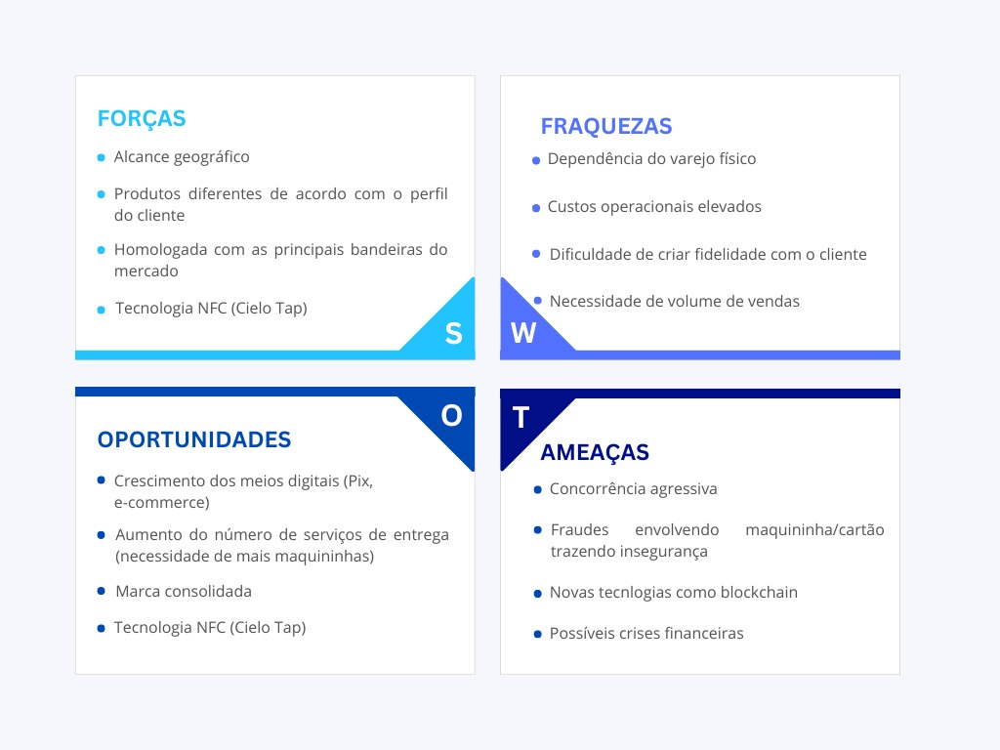

<<<<<<< HEAD:documents/gdd.md


# GDD - Game Design Document - Módulo 1 - Inteli

**_Os trechos em itálico servem apenas como guia para o preenchimento da seção. Por esse motivo, não devem fazer parte da documentação final_**

## Nome do Grupo:
Cielitos
#### Nomes dos integrantes do grupo
- Ana Alícia Medina Santos da Rocha Nunes
- Eduardo Melquiades Amaral 
- Gabriel Thomas Correia Scatolin 
- Lucas Komatsu Borten 
- Matheus Correia
- Nicolas Dely 
- Rachel Silvestre
- Sofia Brandão

## Sumário

[1. Introdução](#c1)

[2. Visão Geral do Jogo](#c2)

[3. Game Design](#c3)

[4. Desenvolvimento do jogo](#c4)

[5. Casos de Teste](#c5)

[6. Conclusões e trabalhos futuros](#c6)

[7. Referências](#c7)

[Anexos](#c8)

<br>

## Lista de figuras

Figura 1 - Análise de 5 Forças de Porter - Cielo

Figura 2 - Análise SWOT - Cielo

Figura 3 - Personagens secundários

Figura 4 - Stardew Valley

Figura 5 - Pokemon FireRed

Figura 6 - Página 1 do Diagrama de Cenas

# <a name="c1"></a>1. Introdução (sprints 1 a 4)

## 1.1. Plano Estratégico do Projeto

### 1.1.1. Contexto da indústria (sprint 2)

&emsp; A Cielo S.A. posiciona-se como a líder nacional no setor de adquirência e serviços financeiros, desempenhando um papel sistêmico na economia brasileira. Fundada em 1995 (originalmente como VisaNet), a companhia evoluiu de uma processadora de transações para uma plataforma de tecnologia de ponta voltada ao varejo. Com presença capilarizada em 99% do território nacional, a Cielo detém uma abrangência sem paralelos, atendendo desde microempreendedores até gigantes do varejo corporativo.[1](#ref1)
<br>&emsp;O impacto da organização é mensurável: em 2022, a empresa processou aproximadamente 9 bilhões de transações, movimentando o equivalente a 7% do Produto Interno Bruto (PIB) brasileiro. [2](#ref2) Esse volume financeiro é sustentado por um ecossistema que ultrapassa a "maquininha", incluindo soluções de e-commerce, logística de pagamentos, antecipação de recebíveis e análise de dados (Big Data).
<br>&emsp;Atualmente, a indústria de meios de pagamento no Brasil atravessa um cenário de hipercompetitividade e disrupção tecnológica. A Cielo enfrenta concorrentes de peso como Rede, Stone, Getnet e PagSeguro, além da ascensão das fintechs e do sistema PIX, que alteraram o comportamento de consumo. [3](#ref3) Nesse contexto, o diferencial competitivo da Cielo não reside apenas na tecnologia, mas na capacidade consultiva de sua força de vendas.
<br>&emsp;A estratégia atual da companhia foca na transformação digital e na excelência do atendimento. Para manter a liderança, é imperativo que o time de vendas possua um conhecimento homogêneo e profundo sobre o portfólio. O uso de ferramentas de gamificação surge, portanto, como uma resposta estratégica para garantir a equidade no aprendizado e a atualização constante dos vendedores em um mercado que se redefine a cada ciclo tecnológico. [4](#ref4)


#### 1.1.1.1. Modelo de 5 Forças de Porter (sprint 2)

&emsp;A Análise das 5 Forças de Porter é um framework estratégico utilizado para compreender o nível de competitividade de uma empresa a partir da influência de agentes externos: a ameaça de novos entrantes, o poder de barganha dos fornecedores, o poder de barganha dos clientes, a ameaça de produtos substitutos e a rivalidade entre concorrentes existentes.[5](#ref5)

&emsp;Sob essa perspectiva, observa-se na Figura 01 a análise desenvolvida pelo grupo com foco no setor de adquirência e meios de pagamento eletrônicos no Brasil, buscando compreender os principais desafios estruturais enfrentados pela Cielo e identificar fatores que impactam sua sustentabilidade competitiva.


<div align="center">
<sub>Figura 1 - Análise de 5 Forças de Porter - Cielo</sub>

<sup>Fonte: Equipe cielitos, Faculdade Inteli 2026</sup>
</div>

A aplicação do modelo à Cielo demonstra que a ameaça de novos entrantes é moderada a baixa, devido às barreiras regulatórias impostas pelo Banco Central, à necessidade de elevados investimentos em tecnologia e segurança e à exigência de grande escala operacional. Ainda assim, fintechs e soluções digitais inovadoras ampliam a pressão competitiva ao oferecer serviços mais flexíveis e integrados.
&emsp;Em relação ao poder de barganha dos fornecedores, observa-se um nível moderado. As bandeiras de cartão e provedores de tecnologia exercem influência significativa por definirem padrões e tecnologias essenciais. Contudo, a escala e a estrutura da Cielo permitem negociar condições estratégicas e reduzir impactos sobre suas margens. [18](#ref18)
&emsp;Por outro lado, o poder de barganha dos clientes é elevado. Pequenos e médios comerciantes são sensíveis a preço, enquanto grandes varejistas negociam condições personalizadas devido ao alto volume transacionado. O baixo custo de troca entre adquirentes intensifica a pressão sobre taxas e margens, exigindo estratégias de fidelização e diferenciação.
&emsp;A ameaça de produtos substitutos é alta, impulsionada por tecnologias que dispensam o uso do arranjo de cartões tradicionais, como o Pix, pagamentos via QR Code direto entre contas e o uso emergente de criptomoedas. Esses substitutos reduzem a dependência das maquininhas e alteram a dinâmica de receita da indústria.
&emsp;Por fim, a rivalidade no setor é intensificada pela presença de players robustos como Stone, PagSeguro e Rede, que disputam agressivamente a mesma base de clientes por meio de guerra de taxas e antecipação de recebíveis. Esse cenário limita a rentabilidade média do setor e exige investimentos contínuos em inovação e serviços financeiros integrados. 


### 1.1.2. Análise SWOT (sprint 2)

&emsp; A Matriz SWOT (Strengths, Weaknesses, Opportunities e Threats) é um framework que busca trazer uma análise abrangente das diferentes características de uma empresa, projeto ou processo, visando avaliar a posição competitiva deste elemento no mercado com base em dados. [6](#ref6) Por meio da Matriz SWOT, é possível visualizar fatores internos (Forças e Fraquezas) e fatores externos (Oportunidades e Ameaças) que afetam o desempenho do objeto em questão. [2](#ref2)

&emsp; A Figura 2 apresenta uma Matriz SWOT elaborada para a empresa Cielo, com base nos princípios descritos no parágrafo anterior. Essa matriz destaca como a organização se posiciona frente aos principais fatores internos (forças e fraquezas) e externos (oportunidades e ameaças) identificados na análise.


<div align="center">
  <sub>Figura 2 - Análise SWOT - Cielo</sub>
  
  <sup>Fonte: Equipe cielitos, Faculdade Inteli 2026</sup>
</div>

#### Forças (Strengths) 
1. **Liderança e Capilaridade de Mercado:** Presente em 99% do território brasileiro, a Cielo possui a maior rede de aceitação do país, o que garante uma vantagem competitiva em volume de transações.

2. **Ecossistema Tecnológico Adaptativo:** A implementação de tecnologias como o Cielo Tap (NFC) transforma smartphones em maquininhas, reduzindo a barreira de entrada para microempreendedores

3. **Multibandeira e Homologação:** A companhia é homologada com as principais bandeiras globais e locais, oferecendo segurança e estabilidade operacional superior aos novos entrantes.

4. **Portfólio Customizado:** Capacidade de oferecer produtos distintos (Cielo Lio, Cielo Zip, e-commerce) que atendem desde o pequeno varejo até grandes corporações.

### Fraquezas (Weaknesses)

1. **Dependência do Varejo Físico:** Embora esteja em transição digital, a maior parte da receita ainda provém de transações físicas, tornando-a vulnerável a crises de mobilidade ou fechamento de comércio

2. **Custos Operacionais Elevados:** A logística de manutenção e substituição de hardware (maquininhas) gera um custo fixo significativamente maior que o de competidores puramente digitais.

3. **Desafios de Fidelização (Churn):** Devido à "guerra das maquininhas", a fidelidade do cliente é baixa, com alta sensibilidade a taxas e custos de aluguel. [7](#ref7)

### Oportunidades (Opportunities)

1. **Expansão dos Meios Digitais:** O crescimento exponencial do Pix e do e-commerce permite à Cielo atuar como gateway de pagamento, indo além do hardware físico. 

2. **Novos Modelos de Negócio (Logística):** O aumento do serviço de entregas (delivery) gera demanda por soluções de pagamento móveis e integradas a aplicativos. 

3. **Data Intelligence:** Utilizar o volume massivo de dados transacionados (7% do PIB) para oferecer serviços de consultoria e análise de crédito para lojistas. 

### Ameaças (Threats)
1. **Hipercompetitividade (Guerra de Taxas):** A entrada agressiva de players como Stone, PagSeguro e fintechs força a compressão das margens de lucro. 

2. **Insegurança e Fraudes:** Ataques cibernéticos e fraudes em cartões trazem riscos financeiros e de reputação para a marca. [14]

3. **Desintermediação (Blockchain/DeFi):** O surgimento de tecnologias que eliminam intermediários financeiros pode ameaçar o modelo de negócio de adquirência a longo prazo.

 &emsp;Com base nesta análise SWOT, destacamos que a Cielo S.A. pode utilizar sua liderança absoluta e capilaridade de mercado para aproveitar as oportunidades de expansão nos meios de pagamento digitais e serviços baseados em dados, como o Pix e o e-commerce. [1](#ref1)Isso mitigaria os riscos de dependência do varejo físico, aplicando uma estratégia de diversificação de receita que vai além do hardware tradicional. &emsp; Além disso, a Cielo fortaleceria sua posição contra a concorrência acirrada e a ameaça de novos entrantes ao investir na capacitação de sua força de vendas, garantindo que inovações como o Cielo Tap sejam disseminadas com eficiência e segurança. [5](#ref5) Ademais, a hipercompetitividade do setor e a volatilidade econômica são dificultadores diretos, já que a compressão de margens exige uma operação extremamente enxuta e consultiva. Este cenário em que a Cielo está inserida é altamente desafiador e compartilhado por concorrentes como Rede, Stone e PagSeguro. [6](#ref6) Entretanto, seu foco em tecnologia de ponta e a busca por equidade no aprendizado de seus colaboradores são fatores essenciais que lhe permitem manter a soberania e a competitividade no mercado nacional.


### 1.1.3. Missão / Visão / Valores (sprint 2)

Missão, Visão e Valores são os três pilares fundamentais que definem a identidade e o propósito de uma empresa ou projeto.[10](#ref10) Definir esses conceitos é essencial para ter uma concepção clara de si mesma, de sua filosofia e até mesmo da maneira como deve ser estruturada e gerida.

**Missão:** Desenvolver um jogo educacional capaz de capacitar gerentes de negócios que vivem em regiões mais afastadas, promovendo equidade no acesso à formação em vendas e reduzindo a diferença de aprendizado em relação aos profissionais localizados nos grandes centros urbanos. [9](#ref9)

**Visão:** Ser referência em jogos educacionais para capacitação em vendas, destacando-se pela acessibilidade, jogabilidade e impacto social

**Valores:** Os valores do projeto refletem os princípios éticos e operacionais que guiam o desenvolvimento do jogo, assegurando o alinhamento com a cultura de inovação e responsabilidade da Cielo S.A. [12](#ref12)

Equidade e Acessibilidade: Garantir a democratização do conhecimento, assegurando que o aprendizado esteja disponível para todos os profissionais, independentemente de sua localização geográfica ou condição socioeconômica.

Inovação e Gamificação: Utilizar tecnologias disruptivas para transformar processos de treinamento tradicionais em experiências de aprendizado dinâmicas e eficazes.

Aprendizagem Contínua (Lifelong Learning): Fomentar uma cultura de autodesenvolvimento, incentivando a atualização constante das competências necessárias para o mercado de adquirência. [2](#ref2)

Foco na Experiência (UX/Gamer): Priorizar a usabilidade e a jogabilidade, garantindo uma interface simples, intuitiva e envolvente para maximizar a retenção do conhecimento.

Impacto Social e Produtivo: Contribuir diretamente para a formação profissional de qualidade, gerando oportunidades reais de crescimento e performance na rede de vendas. [8](#ref8)


### 1.1.4. Proposta de Valor (sprint 4)

*Posicione aqui o canvas de proposta de valor. Descreva os aspectos essenciais para a criação de valor da ideia do produto com o objetivo de ajudar a entender melhor a realidade do cliente e entregar uma solução que está alinhado com o que ele espera.*

### 1.1.5. Descrição da Solução Desenvolvida (sprint 4)

*Descreva brevemente a solução desenvolvida para o parceiro de negócios. Descreva os aspectos essenciais para a criação de valor da ideia do produto com o objetivo de ajudar a entender melhor a realidade do cliente e entregar uma solução que está alinhado com o que ele espera. Observe a seção 2 e verifique que ali é possível trazer mais detalhes, portanto seja objetivo aqui. Atualize esta descrição até a entrega final, conforme desenvolvimento.*

### 1.1.6. Matriz de Riscos (sprint 4)

*Registre na matriz os riscos identificados no projeto, visando avaliar situações que possam representar ameaças e oportunidades, bem como os impactos relevantes sobre o projeto. Apresente os riscos, ressaltando, para cada um, impactos e probabilidades com plano de ação e respostas.*

### 1.1.7. Objetivos, Metas e Indicadores (sprint 4)

*Definição de metas SMART (específicas, mensuráveis, alcançáveis, relevantes e temporais) para seu projeto, com indicadores claros para mensuração*

## 1.2. Requisitos do Projeto (sprints 1 e 2)

Os requisitos do projeto descrevem as funcionalidades e características necessárias para o desenvolvimento do jogo, considerando as demandas do parceiro e as decisões do grupo. Eles orientam a implementação técnica e a experiência do usuário, devendo ser atualizados sempre que houver mudanças no projeto.

<div align="center">

<sub>Tabela 1 - Requisitos do Projeto</sub>

\# | Requisito  
--- | ---
1| O jogo deverá apresentar uma tela inicial contendo as opções “Jogar”, “Créditos” e “Configurações”.
2| O controle do personagem deverá ser realizado por meio das teclas WASD para movimentação no ambiente do jogo.
3| O jogo deverá ser desenvolvido para a plataforma web, permitindo acesso via navegador sem necessidade de instalação.
4| O jogo deverá apresentar um mapa interativo que represente estabelecimentos do cotidiano dos usuários, possibilitando o acompanhamento do deslocamento e progresso do personagem.
5| O jogador deverá interagir com NPCs que simulam situações de atendimento e venda, baseadas em contextos reais do parceiro.
6| As mecânicas do jogo deverão possibilitar o aprendizado de conceitos de serviço e técnicas de venda utilizadas pelo parceiro, integradas à narrativa e às missões.
7| O jogo deverá conter missões vinculadas ao ganho de moedas, utilizadas como sistema de progressão e recompensa.
8| O jogo deverá utilizar referências visuais, cores e logotipos da Cielo, respeitando a identidade visual do parceiro.
9| O jogo deverá incluir quizzes e puzzles ao longo da experiência para reforçar o aprendizado, permitindo o registro de métricas de acertos e falhas dos jogadores.
10| O jogo deverá apresentar instruções claras e progressivas, possibilitando que o jogador compreenda as mecânicas e avance de forma intuitiva.
11| As missões do jogo deverão ser inspiradas em missões reais já utilizadas pelo parceiro, e o trajeto do personagem deverá ser baseado nas rotas reais utilizadas pelos vendedores da Cielo.
12| O jogo deverá contar com uma câmera de acompanhamento no formato side-scroller/top-down.
13| As etapas de venda do parceiro deverão seguir o mesmo passo a passo ao longo do jogo durante as interações.

<sub>Fonte: Autoria Própria (2026) </sub>
</div>

## 1.3. Público-alvo do Projeto (sprint 2)

&emsp;O público-alvo é definido como o extrato demográfico e profissional para o qual o produto é direcionado, permitindo a personalização da linguagem e das mecânicas de engajamento para maximizar a conversão educacional. [11](#ref11) No contexto do Mini Mundo Cielo, o foco reside na padronização da excelência comercial em escala nacional. O público-alvo é composto por novos Gerentes de Negócios (GNs) da área comercial da Cielo. São adultos com ensino médio completo, com idade média aproximada de 44 anos, distribuídos por todo o território brasileiro. 
&emsp;Anualmente, cerca de 3.000 novos profissionais ingressam na função, com maior concentração na região Sudeste (aproximadamente 2.000), seguida pelo Nordeste (315), Sul (340), Centro-Oeste (200) e Norte (100), evidenciando um público geograficamente diverso.
Trata-se de profissionais em fase ativa da carreira, muitos com responsabilidades pessoais e foco em estabilidade e crescimento profissional. A função de Gerente de Negócios representa uma oportunidade dentro do mercado formal, o que indica um público que valoriza resultados concretos e aplicabilidade prática no trabalho. Por atuarem na área comercial, desenvolvem habilidades de comunicação e argumentação, embora possam apresentar diferentes níveis de familiaridade com ferramentas digitais. Assim, o jogo deve priorizar simplicidade, clareza e usabilidade, garantindo um treinamento acessível e alinhado à realidade desses profissionais em diferentes contextos regionais. 
&emsp;A Cielo já utiliza jogos físicos em treinamentos presenciais, bem recebidos pelos participantes. O Mini Mundo Cielo surge como evolução dessa estratégia, digitalizando e ampliando o acesso ao aprendizado, ao mesmo tempo em que reforça a cultura da empresa e promove padronização do treinamento em escala nacional. 

### Perfil Demográfico e Profissional
**Segmento:** Novos Gerentes de Negócios (GN) da área comercial da Cielo S.A.

**Escolaridade:** Ensino Médio completo (mínimo exigido para a função).

**Faixa Etária Média:** 44 anos (Perfil de adultos com experiência prévia em vendas ou transição de carreira).

**Necessidade Operacional:** Profissionais em fase de onboarding que necessitam de domínio rápido do portfólio (Cielo Tap, Lio, e-commerce) e da cultura organizacional. [1](#ref1)

**Distribuição Geográfica e Escala**
O projeto visa atender uma demanda anual de aproximadamente 3.000 novos profissionais, caracterizando-se por uma alta dispersão geográfica que justifica a digitalização do treinamento.

**Justificativa de Gamificação Digital**
A transição dos jogos físicos presenciais para o Mini Mundo Cielo representa a evolução da estratégia de learning & development da companhia. Ao digitalizar dinâmicas que já possuem eficácia comprovada, a Cielo elimina barreiras geográficas e garante que um Gerente de Negócios no Norte tenha a mesma equidade de aprendizado e acesso às ferramentas que um profissional no Sudeste. 


# <a name="c2"></a>2. Visão Geral do Jogo (sprint 2)

## 2.1. Objetivos do Jogo (sprint 2)

&emsp;O objetivo do jogo é capacitar o jogador no desenvolvimento de competências específicas de atendimento e vendas, como identificação de necessidades do cliente, comunicação persuasiva e resolução de objeções. A aprendizagem ocorre por meio de missões interativas que simulam situações reais do cotidiano comercial, nas quais o jogador deve interagir com NPCs, responder quizzes e tomar decisões que impactam o resultado da negociação. A progressão é estruturada em fases com sistemas de pontuação, feedback imediato e recompensas, permitindo mensurar o desempenho e acompanhar a evolução das habilidades ao longo da experiência. [19](#ref19)


## 2.2. Características do Jogo (sprint 2)
&emsp;O Mini Mundo Cielo é classificado como um Serious Game, projetado para equilibrar a carga pedagógica com o entretenimento. Suas características técnicas foram selecionadas para atender à diversidade do público-alvo e à complexidade do ecossistema de pagamentos. [4]

### 2.2.1. Gênero do Jogo (sprint 2)
&emsp;O Mini Mundo Cielo é classificado tecnicamente como um Serious Game (Jogo Sério) educacional, [20](#ref20) com uma estrutura híbrida que combina elementos de Simulação, RPG Leve e Aventura Narrativa. O foco central não reside apenas no entretenimento, mas na validação de competências críticas para o sucesso comercial dentro da Cielo S.A. [4]
&emsp;A experiência mergulha o jogador em uma jornada interativa onde a progressão é pautada por missões de campo e tomada de decisão em tempo real. Cada fase funciona como um laboratório seguro para testar habilidades de negociação, resolução de problemas e domínio técnico do portfólio de produtos, transformando o onboarding em um processo dinâmico e envolvente.
### 2.2.2. Plataforma do Jogo (sprint 2)

O jogo será desenvolvido para desktop, com acesso via navegador, dispensando instalação.

Dispositivo: Computadores desktop e notebooks.
Sistema: Navegadores modernos compatíveis (Google Chrome, Microsoft Edge e Firefox).

### 2.2.3. Número de jogadores (sprint 2)

Mini Mundo Cielo é projetado para um jogador (single player), permitindo experiência individual focada no aprendizado e na progressão personalizada das habilidades de vendas.

### 2.2.4. Títulos semelhantes e inspirações (sprint 2)

&emsp;O projeto se inspira em jogos que utilizam progressão por tarefas, interação com personagens e evolução gradual do jogador. Um dos principais referenciais é Stardew Valley, que apresenta mecânicas de rotina, missões e interação com NPCs, influenciando a estrutura de progressão do jogo.

&emsp;Outra inspiração é Pokémon FireRed, que contribui com a lógica de progressão por objetivos, desbloqueio de novas áreas e evolução contínua das habilidades do jogador. Esses elementos orientam a organização das fases e o sistema de recompensas do projeto.

<div align="center">
<sub>Figura 4 - Stardew Valley</sub><br/>

<sup>Fonte: Stardew Valley, 2026.</sup><br/>
<sub>Figura 5 - Pokemon FireRed</sub><br/>

  <sup>TechTudo (2016)</sup>
</div>


O jogo também se baseia em princípios de gamificação e serious games aplicados à aprendizagem profissional.

### 2.2.5. Tempo estimado de jogo (sprint 5)

&emsp;O jogo foi projetado para sessões curtas e progressivas, permitindo que cada partida tenha duração média de até 15 minutos, facilitando sua aplicação em contextos de aprendizagem e treinamento. A experiência completa é estimada em aproximadamente 3 horas, considerando a realização de todas as missões, desafios e interações previstas nas diferentes fases. 
&emsp;Ressalta-se que essa estimativa será validada por meio de testes com o público-alvo, que permitirão avaliar o tempo real de conclusão, identificar possíveis ajustes de ritmo e refinar a duração total da experiência conforme o comportamento dos jogadores.

# <a name="c3"></a>3. Game Design (sprints 2 e 3)

## 3.1. Enredo do Jogo (sprints 2 e 3)

&emsp;O jogador assume o papel de um novo gerente de vendas que inicia sua jornada profissional em uma empresa de tecnologia de pagamentos localizada no centro da cidade. Em seu primeiro dia, ele precisa explorar o ambiente, conhecer diferentes estabelecimentos e interagir com personagens que representam clientes reais do cotidiano comercial.

 &emsp;Ao longo da experiência, o jogador recebe missões que simulam situações de atendimento, negociação e resolução de problemas, enfrentando desafios progressivamente mais complexos. Cada interação contribui para o desenvolvimento de competências essenciais, como comunicação com clientes, identificação de necessidades e tomada de decisão em contextos de vendas.

 &emsp;A progressão narrativa acompanha a evolução profissional do personagem, que passa de iniciante a especialista, desbloqueando novas áreas da cidade, novos tipos de clientes e desafios mais estratégicos. Dessa forma, a narrativa funciona como um fio condutor para a aprendizagem, contextualizando as atividades do jogo em situações próximas da realidade do mercado.

## 3.2. Personagens (sprints 2 e 3)

### 3.2.1. Controláveis

<div align="center">
<sub>Quadro 2 - Personagens</sub>

| \#  |          Personagem           |                  Spritesheet                  |
| :-: | :---------------------------: | :-------------------------------------------: |
|  1  | Lucas Silva|   |
|  2  | Maya Sato |  |
|  3  | Dandara Souza |   |
|  4  |João Santos |   |

*Descreva os personagens controláveis pelo jogador. Mencione nome, objetivos, características, habilidades, diferenciais etc. Utilize figuras (character art, sprite sheets etc.) para ilustrá-los. Caso utilize material de terceiros em licença Creative Commons, não deixe de citar os autores/fontes.* 

*Caso não existam personagens (ex. jogo Tetris), mencione os motivos de não existirem e como o jogador pode interpretar tal fato.*

### 3.2.2. Non-Playable Characters (NPC)
&emsp; Os NPCs do Mini Mundo Cielo são fundamentais para a progressão do enredo, trazendo auxílio para a resolução de puzzles e determinação dos objetivos primários e secundários do jogador.

<div align="center">

**Quadro 5 — Lista de NPCs**

| # | Personagem | Classificação | Ilustração |
|:-:|:----------:|:-------------:|:----------:|
| 1 | Alícia  | Trabalha no mercado |  |
| 2 | Eduardo | Trabalha no salão de beleza |  |
| 3 | Lucas | Trabalha no restaurante de comida japonesa |  |
| 4 | Gabriel | Trabalha em escritório |  |
| 5 | Nicolas | Trabalha no posto de gasolina |  |
| 6 | Rachel | Trabalha na farmácia |  |
| 7 | Sofia | Trabalha na padaria |  |

</div> 


### 3.2.3. Diversidade e Representatividade dos Personagens

A concepção do elenco do Mini Mundo Cielo fundamenta-se na senioridade e na capilaridade nacional dos gerentes de negócios da companhia. A escolha das personagens Dandara, Gabriel, João Vitor e Maya foi estruturada para transpor a barreira do entretenimento, atuando como um instrumento de equidade pedagógica. [14](#ref14)

1. **Embasamento na Realidade Brasileira:** As decisões de design estão ancoradas nos dados do Censo Demográfico 2022 (IBGE), que reporta uma população majoritariamente feminina e negra (pretos e pardos somam 55,5% dos brasileiros). [16](#ref16) Ao definir a idade média das personagens em 44 anos, o projeto espelha a maturidade profissional exigida pelo cargo de gestão na Cielo, enquanto a seleção de sobrenomes como "Santos" e "Souza" reflete a herança do registro civil nacional, gerando uma ancoragem realista e cotidiana. [13](#ref13)

2. **Adequação ao Público-Alvo:** Conforme detalhado na Seção 1.3, o público-alvo é composto por adultos distribuídos por todo o território nacional. O jogo promove a representatividade ao apresentar avatares que ocupam a mesma faixa geracional e profissional dos usuários. Essa simetria entre jogador e personagem estabelece o pertencimento, transformando o treinamento corporativo em uma extensão do ambiente de trabalho real, o que potencializa o engajamento e a retenção do conteúdo.

3. **Justificativa de Equidade:** O projeto promove a equidade ao descentralizar a liderança de um único perfil hegemônico. A inclusão de Dandara Santos (mulher negra) e João Vitor (homem negro) em postos de gerência sênior atua na validação de grupos historicamente sub-representados em espaços de decisão. A autoridade dentro da narrativa do jogo é distribuída de forma equânime, reforçando o compromisso da Cielo com uma cultura inclusiva e o cumprimento de metas de ESG (Social). [12](#ref12)

4. **Inovação e Criatividade:** A inovação reside na desconstrução de estereótipos regionais através da técnica de subversão de vieses inconscientes. [15](#ref15) Ao posicionar João Vitor como representante de Pelotas (RS) e Maya Souza como representante de Salvador (BA), o jogo desafia a homogeneização geográfica. Essa solução criativa celebra a miscigenação e a mobilidade profissional real do Brasil, oferecendo uma representação sofisticada que evita caricaturas e estimula o pensamento crítico sobre diversidade no ambiente corporativo.

## 3.3. Mundo do jogo (sprints 2 e 3)

### 3.3.1. Locações Principais e/ou Mapas (sprints 2 e 3)

*Descreva o ambiente do jogo, em que locais ele ocorre. Ilustre com imagens. Se houverem mapas, posicione-os aqui, descrevendo as áreas em acordo com o enredo. Se houverem fases, descreva-as também em acordo com o enredo (pode ser um jogo de uma fase só). Utilize listas ou tabelas para organizar esta seção. Caso utilize material de terceiros em licença Creative Commons, não deixe de citar os autores/fontes.*

### 3.3.2. Navegação pelo mundo (sprints 2 e 3)

*Descreva como os personagens se movem no mundo criado e as relações entre as locações – como as áreas/fases são acessadas ou desbloqueadas, o que é necessário para serem acessadas etc. Utilize listas ou tabelas para organizar esta seção.*

### 3.3.3. Condições climáticas e temporais (sprints 2 e 3)

&emsp; O jogo apresenta variações leves de condições temporais e ambientais com o objetivo de enriquecer a ambientação e a sensação de progressão ao longo da experiência. As fases podem ocorrer em diferentes períodos do dia, como manhã, tarde e noite, refletindo a rotina comercial dos estabelecimentos e contribuindo para a contextualização das interações com os NPCs.

&emsp; As condições climáticas possuem caráter principalmente estético, podendo incluir variações visuais como dias ensolarados ou nublados, sem impactar diretamente as mecânicas principais de gameplay. Essas mudanças auxiliam na imersão do jogador e na diferenciação visual entre fases e áreas do mapa.

&emsp; O tempo não atua como um fator limitante rígido para a conclusão das atividades. Cada missão foi projetada para ser realizada no ritmo do jogador, embora algumas tarefas possam sugerir objetivos de duração estimada para fins de organização e acompanhamento do progresso.

### 3.3.4. Concept Art (sprint 2)

&emsp; Traduzindo "concept art", chegamos a, literalmente, "arte de conceito". Nesse sentido, fazer uma concept art é criar ilustrações simples que conseguem passar a essência e identidade de algum projeto visual como, por exemplo, desenhos animados e jogos digitais.
&emsp; Após a consolidação do enredo, iniciamos o desenho dos personagens e o level design de cada um dos módulos:


Figura 1: detalhe da cena da partida do herói para a missão, usando sua nave

### 3.3.5. Trilha sonora (sprint 4)

*Descreva a trilha sonora do jogo, indicando quais músicas serão utilizadas no mundo e nas fases. Utilize listas ou tabelas para organizar esta seção. Caso utilize material de terceiros em licença Creative Commons, não deixe de citar os autores/fontes.*

*Exemplo de tabela*
\# | titulo | ocorrência | autoria
--- | --- | --- | ---
1 | tema de abertura | tela de início | própria
2 | tema de combate | cena de combate com inimigos comuns | Hans Zimmer
3 | ... 

## 3.4. Inventário e Bestiário (sprint 3)

### 3.4.1. Inventário

*\<opcional\> Caso seu jogo utilize itens ou poderes para os personagens obterem, descreva-os aqui, indicando títulos, imagens, meios de obtenção e funções no jogo. Utilize listas ou tabelas para organizar esta seção. Caso utilize material de terceiros em licença Creative Commons, não deixe de citar os autores/fontes.* 

*Exemplo de tabela*
\# | item |  | como obter | função | efeito sonoro
--- | --- | --- | --- | --- | ---
1 | moeda |  | há muitas espalhadas em todas as fases | acumula dinheiro para comprar outros itens | som de moeda
2 | madeira |  | há muitas espalhadas em todas as fases | acumula madeira para construir casas | som de madeiras
3 | ... 

### 3.4.2. Bestiário

*\<opcional\> Caso seu jogo tenha inimigos, descreva-os aqui, indicando nomes, imagens, momentos de aparição, funções e impactos no jogo. Utilize listas ou tabelas para organizar esta seção. Caso utilize material de terceiros em licença Creative Commons, não deixe de citar os autores/fontes.* 

*Exemplo de tabela*
\# | inimigo |  | ocorrências | função | impacto | efeito sonoro
--- | --- | --- | --- | --- | --- | ---
1 | robô terrestre |  |  a partir da fase 1 | ataca o personagem vindo pelo chão em sua direção, com velocidade constante, atirando parafusos | se encostar no inimigo ou no parafuso arremessado, o personagem perde 1 ponto de vida | sons de tiros e engrenagens girando
2 | robô voador |  | a partir da fase 2 | ataca o personagem vindo pelo ar, fazendo movimento em 'V' quando se aproxima | se encostar, o personagem perde 3 pontos de vida | som de hélice
3 | ... 

## 3.5. Gameflow (Diagrama de cenas) (sprint 2)

&emsp; O Gameflow é uma técnica que permite a análise visual completa da progressão de um jogo de forma não-linear, encadeando as diferentes telas e cenários, bem como as interações que o usuário deve fazer para transitar entre eles.[17](#ref17) Por ser conciso e bem abrangente, o Gameflow traz um entendimento geral do funcionamento do jogo de forma efetiva. Abaixo, um esquema que descreve o diagrama de cenas do Mini mundo cielo.

<div align='center'>
<sub>Figura 6 - Página 1 do Diagrama de Cenas</sub>

<sup>Fonte: Equipe cielitos, Faculdade Inteli 2026</sup>
</div>

## 3.6. Regras do jogo (sprint 3)

*Descreva aqui as regras do seu jogo: objetivos/desafios, meios para se conseguir alcançar*

*Ex. O jogador deve pilotar o carro e conseguir terminar a corrida dentro de um minuto sem bater em nenhum obstáculo.*

*Ex. O jogador deve concluir a fase dentro do tempo, para obter uma estrela. Se além disso ele coletar todas as moedas, ganha mais uma estrela. E se além disso ele coletar os três medalhões espalhados, ganha mais uma estrela, totalizando três. Ao final do jogo, obtendo três estrelas em todas as fases, desbloqueia o mundo secreto.*  

## 3.7. Mecânicas do jogo (sprint 3)

*Descreva aqui as formas de controle e interação que o jogador tem sobre o jogo: quais os comandos disponíveis, quais combinações de comandos, e quais as ações consequentes desses comandos. Utilize listas ou tabelas para organizar esta seção.*

*Ex. Em um jogo de plataforma 2D para desktop, o jogador pode usar as teclas WASD para mecânicas de andar, mirar para cima, agachar, e as teclas JKL para atacar, correr, arremesar etc.*

*Ex. Em um jogo de puzzle para celular, o jogador pode tocar e arrastar sobre uma peça para movê-la sobre o tabuleiro, ou fazer um toque simples para rotacioná-la*

## 3.8. Implementação Matemática de Animação/Movimento (sprint 4)

*Descreva aqui a função que implementa a movimentação/animação de personagens ou elementos gráficos no seu jogo. Sua função deve se basear em alguma formulação matemática (e.g. fórmula de aceleração). A explicação do funcionamento desta função deve conter notação matemática formal de fórmulas/equações. Se necessário, crie subseções para sua descrição.*

# <a name="c4"></a>4. Desenvolvimento do Jogo

## 4.1. Desenvolvimento preliminar do jogo (sprint 1)

## 1. Estrutura do projeto: 
O projeto foi estruturado de forma modular, separando os diferentes eixos do sistema em arquivos distintos, como cenas, assets e códigos principais, incluindo a separação do arquivo main.js. 
Essa organização facilita a manutenção, a leitura do código e o trabalho em equipe.
Os principais arquivos são:
Main.js: arquivo responsável por inicializar o jogo e gerenciar as cenas.
index.html: arquivo responsável pelas configurações da página web e pela integração com o main.js.

## 2. Estrutura dos Personagens:
A primeira versão do jogo teve como foco principal o desenvolvimento visual e conceitual, priorizando a criação dos personagens e dos cenários iniciais que compõem o universo do jogo.

2.1. Desenvolvimento de personagens jogáveis:

Nesta etapa, foram desenvolvidos alguns personagens jogáveis em pixel art 2D utilizando o site piskelapp.com.
Os personagens foram pensados para permitir futuras animações.
Sprites dos personagens jogáveis:

<div align="center">
	
<sub>Figura 1 - Sprite sheet personagens jogáveis</sub>


<sub>Figura 2 - Personagens jogáveis</sub>


<sub>Fonte: Autoria Própria usando o Piskel (2026)Descrição: imagem do sprite sheet dos personagens jogáveis</sub>
</div>
	
Os sprites foram criados seguindo um padrão de tamanho e proporção, facilitando sua utilização posterior no código do jogo e garantindo consistência visual entre os personagens.

2.2. Desenvolvimento de personagens secundários:

Além dos personagens jogáveis, foram desenvolvidos personagens secundários (NPCs), que representam diferentes profissões e ambientes do jogo. Esses NPCs contribuem para a ambientação e a narrativa, sendo que cada um representa um integrante do grupo.
Sprites dos personagens secundários:

<div align="center">
	
<sub>Figura 3 - Personagens secundários </sub>


</div>

<div align="center">
<sub>Fonte: Autoria Própria usando o Piskel (2026) Descrição: imagem dos personagens secundários que trabalham no comércios do jogo</sub>
</div>
	
<sub>Figura 4 - Foto perfil personagens secundários </sub>


<div align="center">
<sub>Fonte: Autoria Própria usando o Piskel e Inteligência Artifcial (2026) Descrição: imagens detalhada dos personagens secundários que trabalham no comércios do jogo</sub>
</div>

## 3. Estrutura dos cenários iniciais:
Foram desenvolvidos cenários iniciais em pixel art utilizando ferramentas de inteligência artificial. Esses cenários representam os primeiros ambientes que o jogador irá explorar.

<sub>Figura 5 - Cenários dos estabelecimentos internamente</sub>


<sub>Fonte: Autoria Própria usando Inteligência Artifcial (2026) Descrição: imagens dos cenários internos do jogo</sub>
</div>

## 4.2. Desenvolvimento básico do jogo (sprint 2)

&emsp;No desenvolvimento preliminar do jogo, o principal objetivo foi estruturar as cenas iniciais e implementar os sistemas fundamentais de jogabilidade. Para isso, o foco esteve na criação do menu principal, na tela de seleção de personagens, no mapa de gameplay com movimentação do jogador, no primeiro NPC interativo e na cutscene introdutória com transições personalizadas.

&emsp;Durante esse processo, foi identificado um erro no sistema de animação do personagem: ao trocar de direção durante o movimento, os frames continuavam sendo reproduzidos no estado anterior. A solução foi implementar animações separadas para cada direção, com frames carregados dinamicamente conforme o personagem escolhido na tela anterior.

&emsp;A maior dificuldade foi sincronizar esse carregamento dinâmico com o sistema de animação, garantindo que as imagens corretas fossem carregadas no `preload()` antes de serem referenciadas no `create()`. Isso exigiu um sistema de passagem de dados entre cenas, onde o nome da pasta e o prefixo do personagem são transmitidos como parâmetro ao iniciar a `SceneJogo`. Apesar dos desafios, todas as dificuldades foram superadas e o trabalho foi concluído com sucesso.

Figura 28 - Tela inicial do Mini Mundo Cielo &emsp;<sub>Fonte: Equipe Cielitos, Faculdade Inteli 2026</sub>

&emsp;O primeiro cenário desenvolvido foi o menu principal (`SceneInicial.js`). Primeiramente, foram criadas as variáveis de configuração da cena e definida a lista de botões com suas posições, escalas e ações correspondentes:

```js
this.CONFIG = {
  PIXELATE_AMOUNT: 40,
  PIXELATE_DURATION: 800,
  BOTOES: [
    { key: "botaoJogar",    x: "center", y: 600, scale: 0.5,  action: "startGame"    },
    { key: "botaoConfig",   x: "center", y: 870, scale: 0.48, action: "openSettings" },
    { key: "botaoCreditos", x: "center", y: 730, scale: 0.85, action: "fecharJogo"   }
  ]
};
```

&emsp;Em seguida, os botões foram adicionados de forma iterativa com efeitos de hover. A transição para a próxima cena aplica um efeito de pixelização progressiva usando postFX do Phaser:

```js
btn.on("pointerover", () => btn.setScale(botao.scale * 1.07));
btn.on("pointerout",  () => btn.setScale(botao.scale));

startGame() {
  const pixelated = this.cameras.main.postFX.addPixelate(1);
  this.add.tween({
    targets: pixelated, amount: this.CONFIG.PIXELATE_AMOUNT,
    duration: this.CONFIG.PIXELATE_DURATION, ease: "Sine.easeIn",
    onComplete: () => { this.scene.start("ScenePersonagem"); }
  });
}
```

Figura 29 - Tela de seleção de personagens &emsp;<sub>Fonte: Equipe Cielitos, Faculdade Inteli 2026</sub>

&emsp;Na tela de seleção (`ScenePersonagem.js`), foram criadas as variáveis para definir os quatro personagens jogáveis com suas posições, escalas e prefixos de arquivo. Ao clicar, os dados do personagem escolhido são passados para a cena seguinte:

```js
this.listaPersonagens = [
  { id: "Gabriel", x: 300,  y: 700, escala: 0.42, prefixoArquivo: "HB" },
  { id: "Maya",    x: 730,  y: 700, escala: 0.42, prefixoArquivo: "ML" },
  { id: "Joao",    x: 1170, y: 700, escala: 0.42, prefixoArquivo: "HM" },
  { id: "Dandara", x: 1600, y: 700, escala: 0.42, prefixoArquivo: "MM" }
];

// Ao clicar, realiza fade out e inicia SceneJogo com os dados do personagem
this.scene.start("SceneJogo", { nomePasta: dados.id, prefixo: dados.prefixoArquivo });
```

&emsp;No arquivo `SceneJogo.js`, foram criadas as variáveis de estado que controlam todas as interações da cena, e os 16 frames do personagem (4 direções × 4 frames) são carregados dinamicamente no `preload()` com base no personagem recebido:

```js
this.podeMover       = false; // Bloqueado até fechar o tutorial
this.dialogoNpcAberto = false;
this.npcPartiu        = false;
this.transicaoAtiva   = false;

for (let i = 1; i <= 4; i++) {
  this.load.image(`sprite_frente_${i}`,  `${caminhoBase}/${pre}_frente_${i}.png`);
  this.load.image(`sprite_direita_${i}`, `${caminhoBase}/${pre}_direita_${i}.png`);
  // ... demais direções
}
```

&emsp;Após isso, foi desenvolvida a função `criarAnimacoes()`, que cria de forma iterativa as animações das quatro direções de movimento:


```js
criarAnimacoes() {
  ['frente', 'tras', 'direita', 'esquerda'].forEach(dir => {
    this.anims.create({
      key: `andar_${dir}`,
      frames: [{ key: `sprite_${dir}_1` }, { key: `sprite_${dir}_2` },
               { key: `sprite_${dir}_3` }, { key: `sprite_${dir}_4` }],
      frameRate: 8,
      repeat: -1
    });
  });
}
```

&emsp;Na sequência, utilizando a função `update()`, nativa do Phaser.js, foi implementada a movimentação do personagem pelas teclas WASD, com a animação pausando automaticamente ao soltar as teclas, e os limites de mapa restringindo a área de movimento:

```js
update() {
  corpoFisico.setVelocity(0);
  if (this.teclasControl.d.isDown) {
    corpoFisico.setVelocityX(this.velocidadePersonagem);
    this.personagemSprite.anims.play("andar_direita", true);
    estaAndando = true;
  }
  // ... demais direções

  if (!estaAndando) { this.personagemSprite.anims.pause(); }
  else              { this.personagemSprite.anims.resume(); }

  this.personagemSprite.y = Phaser.Math.Clamp(this.personagemSprite.y, 578, 690);
  this.personagemSprite.x = Phaser.Math.Clamp(this.personagemSprite.x, 0, 1920);
}
```

&emsp;Para estar de acordo com o princípio de reutilização de código da POO, foi desenvolvido um sistema padrão de interação com objetos do cenário. No caso do NPC Vanessa, uma colisão por posição impede o jogador de ultrapassá-lo, e a detecção de proximidade com `Phaser.Math.Distance.Between()` exibe o indicador `[E]` e abre o diálogo ao pressionar a tecla:

```js
// Colisão — impede o jogador de passar pelo NPC
const limiteX = this.npcSprite.x - 60;
if (this.personagemSprite.x > limiteX) this.personagemSprite.x = limiteX;

// Proximidade e interação
const distNpc = Phaser.Math.Distance.Between(/* player e npc */);
this.indicadorE.setVisible(distNpc < 150 && !this.dialogoNpcAberto);

if (distNpc < 150 && Phaser.Input.Keyboard.JustDown(this.teclaE)) {
  this.dialogoNpcAberto = true;
  this.mostrarDialogoObjetivo(); // Abre diálogo com efeito typewriter
}
```

Figura 30 - Cena de gameplay com o NPC Vanessa na ponte &emsp;<sub>Fonte: Equipe Cielitos, Faculdade Inteli 2026</sub>

&emsp;Por fim, ao chegar na borda direita do mapa, é acionada a transição clock wipe em sentido horário usando máscara de geometria do Phaser. Essa mesma função foi encapsulada e reutilizada na `SceneCutscene.js` ao final do vídeo introdutório:

```js
iniciarClockWipe() {
  const maskGraphics = this.make.graphics();
  this.cameras.main.setMask(maskGraphics.createGeometryMask());

  this.tweens.add({
    targets: { progress: 0 }, progress: 1, duration: 1000, ease: "Sine.easeInOut",
    onUpdate: (tween) => {
      const startAngle = -Math.PI / 2 + tween.getValue() * Math.PI * 2;
      maskGraphics.clear();
      maskGraphics.arc(cx, cy, raio, startAngle, -Math.PI / 2 + Math.PI * 2, false);
      maskGraphics.fillPath();
    },
    onComplete: () => { this.scene.start("SceneCutscene"); }
  });
}
```

Dificuldades

- Implementar o carregamento dinâmico dos sprites conforme o personagem selecionado, garantindo que todos os frames estivessem disponíveis antes de criar as animações
- Criar o sistema de colisão simples com o NPC sem utilizar physics bodies, usando apenas comparação de posições no eixo X
- Corrigir a animação do personagem para que pausasse e retomasse corretamente ao parar e reiniciar o movimento

Próximos passos

- Criar o mapa interno dos estabelecimentos para a fase seguinte
- Adicionar os puzzles e desafios de vendas do jogo
- Implementar mais NPCs com diálogos e interações variadas

## 4.3. Desenvolvimento intermediário do jogo (sprint 3)

*Descreva e ilustre aqui o desenvolvimento da versão intermediária do jogo, explicando brevemente o que foi entregue em termos de código e jogo. Utilize prints de tela para ilustrar. Indique as eventuais dificuldades e próximos passos.*

## 4.4. Desenvolvimento final do MVP (sprint 4)

*Descreva e ilustre aqui o desenvolvimento da versão final do jogo, explicando brevemente o que foi entregue em termos de MVP. Utilize prints de tela para ilustrar. Indique as eventuais dificuldades e planos futuros.*

## 4.5. Revisão do MVP (sprint 5)

*Descreva e ilustre aqui o desenvolvimento dos refinamentos e revisões da versão final do jogo, explicando brevemente o que foi entregue em termos de MVP. Utilize prints de tela para ilustrar.*

# <a name="c5"></a>5. Testes

## 5.1. Casos de Teste (sprints 2 a 4)

*Os casos de teste são conjuntos de condições, ações, dados de entrada e resultados esperados, projetados para verificar se uma funcionalidade específica de um software funciona corretamente.*  

| #  | Pré-condição                                             | Descrição do teste                                                                 | Pós-condição                                                                 |
|----|----------------------------------------------------------|-------------------------------------------------------------------------------------|------------------------------------------------------------------------------|
| 1  | Carregamento da tela inicial.                            | Iniciar SceneInicial.js                                                             | Cena carregada corretamente.                                                 |
| 2  | Exibição do fundo.                                       | Verificar se o fundo carrega corretamente.                                          | Fundo visível e na posição correta.                                          |
| 3  | Botões da tela inicial.                                  | Verificar se os botões da tela inicial estão funcionando.                           | Os botões da tela inicial estão funcionando corretamente.                    |
| 4  | Animação dos botões da tela inicial.                     | Checar o funcionamento das animações dos botões da tela inicial.                   | As animações estão funcionando.                                              |
| 5  | Transição da tela inicial para seleção de personagens.   | Transição da SceneInicial para ScenePersonagem.                                     | A transição está em funcionamento.                                           |
| 6  | Seleção de personagens.                                  | Ver se os personagens carregam corretamente e passar o mouse sobre eles.           | Personagens carregam como esperado e a interação ao passar o mouse funciona.|
| 7  | Carregar o mundo com o personagem escolhido.             | Clicar no ícone do personagem e verificar se o mundo carrega corretamente.         | Mundo carregado com o spritesheet do personagem escolhido.                  |
| 8  | Movimentação do jogador.                                 | Usar teclas direcionais para mover o jogador.                                       | Personagem se move como esperado.                                            |
| 9  | Colisão com obstáculos.                                  | Tentar atravessar as barreiras.                                                      | Personagem não atravessa os obstáculos.                                      |
| 10 | Tutorial.                                                | Observar o tutorial após iniciar o jogo.                                            | O tutorial aparece corretamente.                                             |

<sub>Fonte: Autoria Própria (2026) </sub>
</div>

## 5.2. Testes de jogabilidade (playtests) (sprint 5)

### 5.2.1 Registros de testes

*Descreva nesta seção as sessões de teste/entrevista com diferentes jogadores. Registre cada teste conforme o template a seguir.*

Nome | João Jonas (use nomes fictícios)
--- | ---
Já possuía experiência prévia com games? | sim, é um jogador casual
Conseguiu iniciar o jogo? | sim
Entendeu as regras e mecânicas do jogo? | entendeu as regras, mas sobre as mecânicas, apenas as essenciais, não explorou os comandos complexos
Conseguiu progredir no jogo? | sim, sem dificuldades  
Apresentou dificuldades? | Não, conseguiu jogar com facilidade e afirmou ser fácil
Que nota deu ao jogo? | 9.0
O que gostou no jogo? | Gostou  de como o jogo vai ficando mais difícil ao longo do tempo sem deixar de ser divertido
O que poderia melhorar no jogo? | A responsividade do personagem aos controles, disse que havia um pouco de atraso desde o momento do comando até a resposta do personagem

### 5.2.2 Melhorias

*Descreva nesta seção um plano de melhorias sobre o jogo, com base nos resultados dos testes de jogabilidade*

# <a name="c6"></a>6. Conclusões e trabalhos futuros (sprint 5)

*Escreva de que formas a solução do jogo atingiu os objetivos descritos na seção 1 deste documento. Indique pontos fortes e pontos a melhorar de maneira geral.*

*Relacione os pontos de melhorias evidenciados nos testes com plano de ações para serem implementadas no jogo. O grupo não precisa implementá-las, pode deixar registrado aqui o plano para futuros desenvolvimentos.*

*Relacione também quaisquer ideias que o grupo tenha para melhorias futuras*

# <a name="c7"></a>7. Referências (sprint 5)

&emsp; Optou-se pela utilização das normas da APA (American Psychological Association) em vez das normas da ABNT (Associação Brasileira de Normas Técnicas), com o intuito de alinhar o projeto a padrões internacionais de formatação e citação, favorecendo sua aplicação e reconhecimento em contextos acadêmicos e profissionais fora do Brasil.

## 7. Referências

<br><a name="ref1">[1]:</a>
CIELO S.A. **Quem somos**. Disponível em: https://www.cielo.com.br/institucional/. Acesso em: 26 fev. 2026.
<br><a name="ref2">[2]:</a> 
Cielo. (2022). Relatório anual integrado 2022. Recuperado em 26 fev. 2026, de
https://www.cielo.com.br/docs/sustentabilidade/2022/pt-br/Relatorio-Anual-Integrado-2022.pdf
<br><a name="ref3">[3]:</a>
VALOR ECONÔMICO. **Guerra das maquininhas: Cielo reage e disputa se acirra**. Disponível em: https://valor.globo.com/. Acesso em: 26 fev. 2026.
<br><a name="ref4">[4]:</a>
 HARVARD BUSINESS REVIEW. **How Gamification Can Help Your Employees Learn**. Disponível em: https://hbr.org/. Acesso em: 26 fev. 2026.
<br><a name="ref5">[5]:</a> 
Júnior, H. (2015). As cinco forças de porter e os fatores críticos de sucesso: Uma análise da tomada de decisões estratégicas na empresa Total Eletro em Pau dos Ferros-RN. Universidade do Estado do Rio Grande do Norte. Disponível em: https://www.uern.br/controledepaginas/2015-/arquivos/5018helder_viana_marinho_de_oliveira_janior.pdf. Acesso em: 26 fev. 2026.
<br><a name="ref6">[6]:</a> Cielo. (s.d.). Como fazer análise SWOT. Blog Cielo. 
https://blog.cielo.com.br/vender/como-fazer-analise-swot/ acesso em 26 fev. 2026
<br><a name="ref7">[7]:</a> Exame. (2020, janeiro 27). O pior da guerra das maquininhas de fato passou para a Cielo? Exame. https://exame.<br><a name="ref8">[8]:</a>com/negocios/o-pior-da-guerra-das-maquininhas-de-fato-passou-para-a-cielo/ Acesso em: 26 fevereiro 2026.
Exame. (2016, maio 3). Cielo vê concorrência mais agressiva e retração de clientes. Exame. https://exame.com/negocios/cielo-ve-concorrencia-mais-agressiva-e-retracao-de-clientes/ Acesso em: 26 fevereiro 2026.
<br><a name="ref9">[9]:</a>Kotler, P.; Keller, K. Administração de Marketing.
Sebrae (2022). Planejamento estratégico empresarial. acessado em: 18 fevereiro 2026
<br><a name="ref10">[10]:</a> Corrales, J. A. (2019, maio 8). Entenda o que é a missão e a visão de uma empresa com o exemplo de 3 marcas de sucesso. Rock Content - BR; Rock Content. https://rockcontent.com/br/blog/missao-e-visao
<br><a name="ref11">[11]:</a>Desidério, M. (2017, agosto 14). 5 dicas essenciais para definir o público-alvo do seu negócio. Exame. https://exame.com/pme/5-dicas-essenciais-para-definir-o-publico-alvo-do-seu-negocio/ Acesso em: 26 fevereiro 2026.
<br><a name="ref12">[12]:</a>Serviço Brasileiro de Apoio às Micro e Pequenas Empresas (Sebrae). (s.d.). ESG: o que é e qual é a importância? Saiba aqui! https://sebrae.com.br/sites/PortalSebrae/ufs/pe/artigos/esg-o-que-e-e-qual-e-a-importancia-saiba-aqui,4ef39fd767ede710VgnVCM100000d701210aRCRD Acesso em: 26 fevereiro 2026.
<br><a name="ref13">[13]:</a>Souza, B. (2025, novembro 4). IBGE revela nomes e sobrenomes mais populares do Brasil; veja ranking. CNN Brasil. https://www.cnnbrasil.com.br/nacional/brasil/ibge-revela-nomes-e-sobrenomes-mais-populares-do-brasil-veja-ranking/ Acesso em: 26 fevereiro 2026.
<br><a name="ref14">[14]:</a>Instituto Claro. (2022, agosto 26). Construção de identidade: a importância da representatividade. Instituto Claro. https://www.institutoclaro.org.br/educacao/para-ensinar/planos-de-aula/construcao-de-identidade-a-importancia-da-representatividade/ Acesso em: 26 fevereiro 2026
<br><a name="ref15">[15]:</a>Avelino, D. (2023, abril 20). Como os vieses inconscientes impactam a diversidade nas empresas. StartSe. https://www.startse.com/artigos/vies-inconsciente-nas-empresas/ Acesso em: 26 fevereiro 2026.
<br><a name="ref16">[16]:</a>nstituto Brasileiro de Geografia e Estatística (IBGE). (2023, dezembro 22). Censo 2022: pela primeira vez desde 1991 a maior parte da população do Brasil se declara parda. Agência IBGE Notícias. https://agenciadenoticias.ibge.gov.br/agencia-noticias/2012-agencia-de-noticias/noticias/38719-censo-2022-pela-primeira-vez-desde-1991-a-maior-parte-da-populacao-do-brasil-se-declara-parda Acesso em: 26 fevereiro 2026.
<br><a name="ref17">[17]:</a>Oniria. (s.d.). Como os games motivam o aprendizado e desenvolvimento profissional dos colaboradores. Oniria. https://oniria.com.br/como-os-games-motivam-o-aprendizado-e-desenvolvimento-profissional-dos-colaboradores/Acesso em: 26 fevereiro 2026.
<br><a name="ref18">[18]:</a>Neogrid. (2020, dezembro 15). O poder de barganha dos compradores na cadeia de suprimentos pode ser o vilão dos consumidores. Neogrid. https://neogrid.com/o-poder-de-barganha-dos-compradores-na-cadeia-de-suprimentos-e-frequentemente-o-vilao-dos-consumidores/Acesso em: 26 fevereiro 2026.
<br><a name="ref19">[19]:</a>Michael, D. R., & Chen, S. L. (2005). Serious games: Games that educate, train, and inform. Thomson Course Technology.
<br><a name="ref20">[20]:</a>Baldissera, O. (2021, agosto 30). O que é serious game, estratégia poderosa de gamificação. Pós PUCPR Digital. https://posdigital.pucpr.br/blog/serious-game


LUCK, Heloisa. Liderança em gestão escolar. 4. ed. Petrópolis: Vozes, 2010. <br>
SOBRENOME, Nome. Título do livro: subtítulo do livro. Edição. Cidade de publicação: Nome da editora, Ano de publicação. <br>

INTELI. Adalove. Disponível em: https://adalove.inteli.edu.br/feed. Acesso em: 1 out. 2023 <br>
SOBRENOME, Nome. Título do site. Disponível em: link do site. Acesso em: Dia Mês Ano

# <a name="c8"></a>Anexos

*Inclua aqui quaisquer complementos para seu projeto, como diagramas, imagens, tabelas etc. Organize em sub-tópicos utilizando headings menores (use ## ou ### para isso)*
=======;
