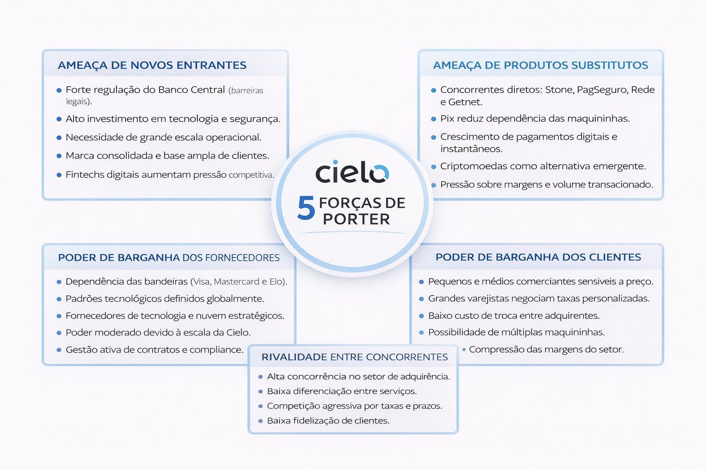
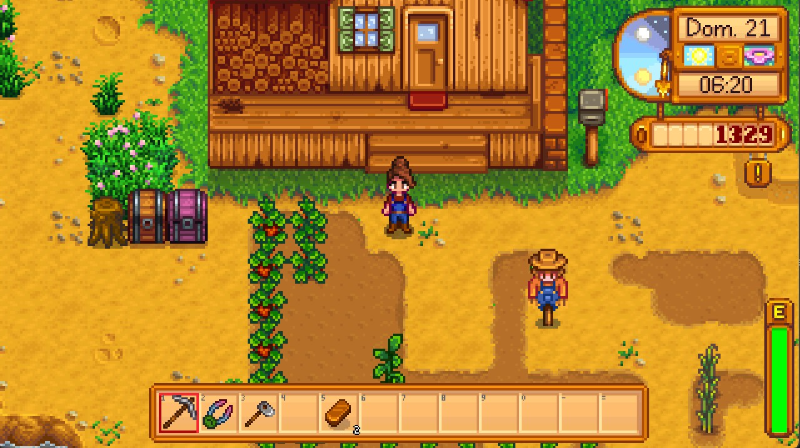
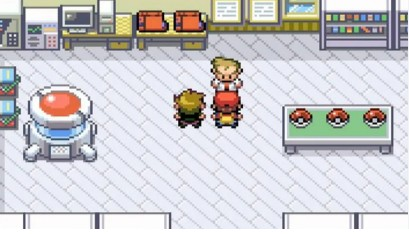
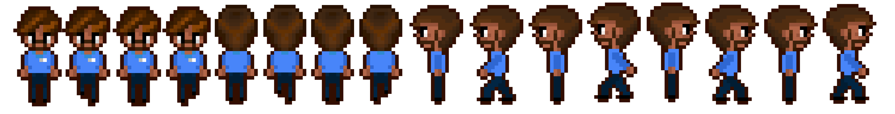
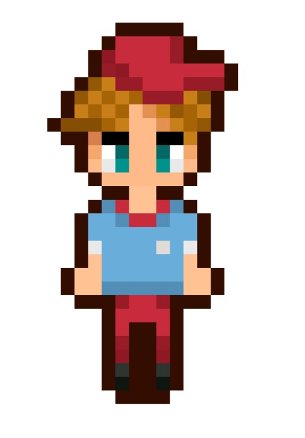
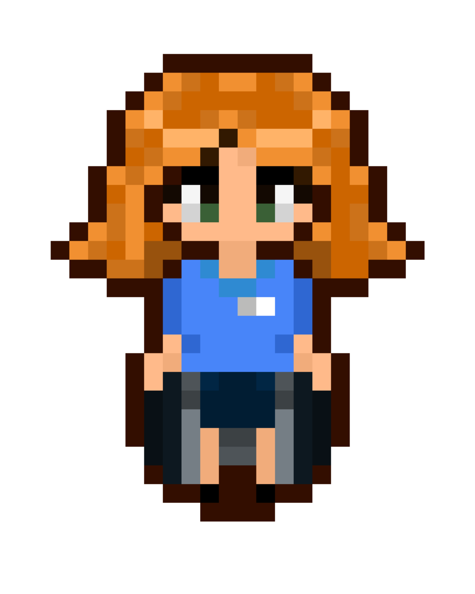
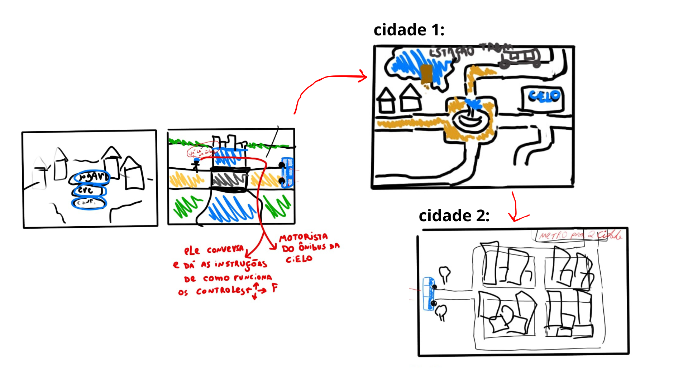
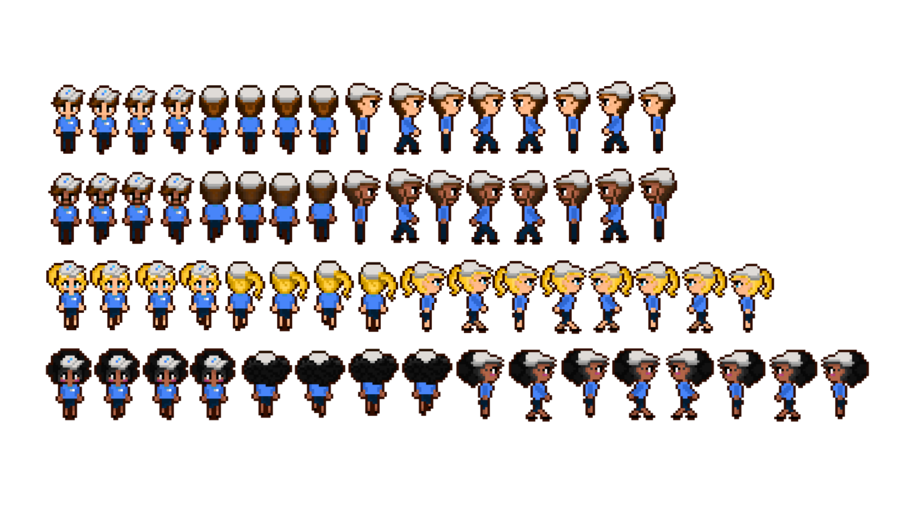
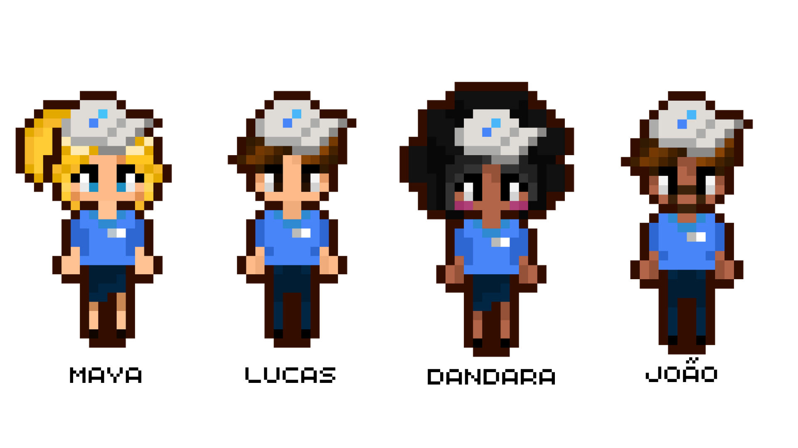

<<<<<<< HEAD:documents/gdd.md


# GDD - Game Design Document - Módulo 1 - Inteli

**_Os trechos em itálico servem apenas como guia para o preenchimento da seção. Por esse motivo, não devem fazer parte da documentação final_**

## Nome do Grupo:
Cielitos
#### Nomes dos integrantes do grupo
- Alícia Medina 
- Eduardo Melquiades 
- Gabriel Scatolin 
- Lucas Borten 
- Nicolas Dely 
- Rachel Silvestre
- Sofia Brandão

## Sumário

[1. Introdução](#c1)

[2. Visão Geral do Jogo](#c2)

[3. Game Design](#c3)

[4. Desenvolvimento do jogo](#c4)

[5. Casos de Teste](#c5)

[6. Conclusões e trabalhos futuros](#c6)

[7. Referências](#c7)

[Anexos](#c8)

<br>


# <a name="c1"></a>1. Introdução (sprints 1 a 4)

## 1.1. Plano Estratégico do Projeto

### 1.1.1. Contexto da indústria (sprint 2)

&emsp; A Cielo S.A. posiciona-se como a líder nacional no setor de adquirência e serviços financeiros, desempenhando um papel sistêmico na economia brasileira. Fundada em 1995 (originalmente como VisaNet), a companhia evoluiu de uma processadora de transações para uma plataforma de tecnologia de ponta voltada ao varejo. Com presença capilarizada em 99% do território nacional, a Cielo detém uma abrangência sem paralelos, atendendo desde microempreendedores até gigantes do varejo corporativo.[1](#ref1)
<br>&emsp;O impacto da organização é mensurável: em 2022, a empresa processou aproximadamente 9 bilhões de transações, movimentando o equivalente a 7% do Produto Interno Bruto (PIB) brasileiro. [2](#ref2) Esse volume financeiro é sustentado por um ecossistema que ultrapassa a "maquininha", incluindo soluções de e-commerce, logística de pagamentos, antecipação de recebíveis e análise de dados (Big Data).
<br>&emsp;Atualmente, a indústria de meios de pagamento no Brasil atravessa um cenário de hipercompetitividade e disrupção tecnológica. A Cielo enfrenta concorrentes de peso como Rede, Stone, Getnet e PagSeguro, além da ascensão das fintechs e do sistema PIX, que alteraram o comportamento de consumo. [3](#ref3) Nesse contexto, o diferencial competitivo da Cielo não reside apenas na tecnologia, mas na capacidade consultiva de sua força de vendas.
<br>&emsp;A estratégia atual da companhia foca na transformação digital e na excelência do atendimento. Para manter a liderança, é imperativo que o time de vendas possua um conhecimento homogêneo e profundo sobre o portfólio. O uso de ferramentas de gamificação surge, portanto, como uma resposta estratégica para garantir a equidade no aprendizado e a atualização constante dos vendedores em um mercado que se redefine a cada ciclo tecnológico. [4](#ref4)


#### 1.1.1.1. Modelo de 5 Forças de Porter (sprint 2)

<br>&emsp;A Análise das 5 Forças de Porter é um framework estratégico utilizado para compreender o nível de competitividade de uma empresa a partir da influência de agentes externos: a ameaça de novos entrantes, o poder de barganha dos fornecedores, o poder de barganha dos clientes, a ameaça de produtos substitutos e a rivalidade entre concorrentes existentes.[5](#ref5)
<br>&emsp;Sob essa perspectiva, observa-se na Figura 01 a análise desenvolvida pelo grupo com foco no setor de adquirência e meios de pagamento eletrônicos no Brasil, buscando compreender os principais desafios estruturais enfrentados pela Cielo e identificar fatores que impactam sua sustentabilidade competitiva.


<div align="center">
<sub>Figura 1 - Análise de 5 Forças de Porter - Cielo</sub>

<sup>Fonte: Equipe cielitos, Faculdade Inteli 2026</sup>
</div>

<br>&emsp;No que se refere à ameaça de novos entrantes, ela é considerada alta no segmento de adquirência e, sobretudo, de subadquirência. O avanço tecnológico, a digitalização dos pagamentos e a relativa facilidade regulatória para determinados modelos de negócio reduzem barreiras de entrada, permitindo o surgimento constante de fintechs, gateways e plataformas digitais. Esse cenário pressiona empresas consolidadas. Entretanto, a Cielo mantém vantagens estruturais relevantes, como o forte suporte acionário do Banco do Brasil e do Bradesco, além de elevada capacidade de investimento em inovação, segurança e tecnologia. Outro diferencial competitivo são os DDNs (Distribuidores de Negócios), que ampliam sua capilaridade comercial e fortalecem o relacionamento com clientes em todo o território nacional.
<br>&emsp;Em relação ao poder de barganha dos fornecedores, observa-se um nível moderado. As bandeiras de cartão e provedores de tecnologia exercem influência significativa ao definirem padrões operacionais e tecnológicos indispensáveis ao funcionamento do sistema de pagamentos. Contudo, devido à sua escala, relevância de mercado e estrutura consolidada, a Cielo possui capacidade de negociação que mitiga parte desse poder e preserva sua competitividade.
<br>&emsp;O poder de barganha dos clientes é elevado. Pequenos e médios empreendedores demonstram alta sensibilidade a preço e condições comerciais, enquanto grandes varejistas possuem forte poder de negociação devido ao volume transacionado. Além disso, o baixo custo de troca entre adquirentes intensifica a competição por taxas mais atrativas, exigindo estratégias de fidelização, oferta de serviços agregados e diferenciação por meio de soluções financeiras integradas.
<br>&emsp;A ameaça de produtos substitutos também é alta. Soluções como Pix, transferências diretas via QR Code, carteiras digitais e novas infraestruturas de pagamento reduzem a dependência do arranjo tradicional de cartões e impactam diretamente as receitas provenientes das maquininhas. A adaptação estratégica a essas tecnologias torna-se, portanto, essencial para manutenção da relevância no mercado.
<br>&emsp;Por fim, a rivalidade entre concorrentes existentes é intensa. A disputa ocorre principalmente entre adquirentes e subadquirentes como Stone, PagSeguro e Rede, que competem agressivamente por meio de diferenciação tecnológica, guerra de taxas e oferta de serviços financeiros adicionais, como antecipação de recebíveis e crédito. Além disso, portais de pagamento e cooperativas ampliam a competição no ecossistema. Esse ambiente pressiona margens e exige inovação contínua, eficiência operacional e fortalecimento do relacionamento com clientes.

### 1.1.2. Análise SWOT (sprint 2)

&emsp; A Matriz SWOT (Strengths, Weaknesses, Opportunities e Threats) é um framework que busca trazer uma análise abrangente das diferentes características de uma empresa, projeto ou processo, visando avaliar a posição competitiva deste elemento no mercado com base em dados. [6](#ref6) Por meio da Matriz SWOT, é possível visualizar fatores internos (Forças e Fraquezas) e fatores externos (Oportunidades e Ameaças) que afetam o desempenho do objeto em questão. [2](#ref2)

&emsp; A Figura 2 apresenta uma Matriz SWOT elaborada para a empresa Cielo, com base nos princípios descritos no parágrafo anterior. Essa matriz destaca como a organização se posiciona frente aos principais fatores internos (forças e fraquezas) e externos (oportunidades e ameaças) identificados na análise.


<div align="center">
  <sub>Figura 2 - Análise SWOT - Cielo</sub>
  
  <sup>Fonte: Equipe cielitos, Faculdade Inteli 2026</sup>
</div>

#### Forças (Strengths) 
1. **Liderança e Capilaridade de Mercado:** Presente em 99% do território brasileiro, a Cielo possui a maior rede de aceitação do país, o que garante uma vantagem competitiva em volume de transações.

2. **Ecossistema Tecnológico Adaptativo:** A implementação de tecnologias como o Cielo Tap (NFC) transforma smartphones em maquininhas, reduzindo a barreira de entrada para microempreendedores

3. **Multibandeira e Homologação:** A companhia é homologada com as principais bandeiras globais e locais, oferecendo segurança e estabilidade operacional superior aos novos entrantes.

4. **Portfólio Customizado:** Capacidade de oferecer produtos distintos (Cielo Lio, Cielo Zip, e-commerce) que atendem desde o pequeno varejo até grandes corporações.

### Fraquezas (Weaknesses)

1. **Dependência do Varejo Físico:** Embora esteja em transição digital, a maior parte da receita ainda provém de transações físicas, tornando-a vulnerável a crises de mobilidade ou fechamento de comércio

2. **Custos Operacionais Elevados:** A logística de manutenção e substituição de hardware (maquininhas) gera um custo fixo significativamente maior que o de competidores puramente digitais.

3. **Desafios de Fidelização (Churn):** Devido à "guerra das maquininhas", a fidelidade do cliente é baixa, com alta sensibilidade a taxas e custos de aluguel. [7](#ref7)

### Oportunidades (Opportunities)

1. **Expansão dos Meios Digitais:** O crescimento exponencial do Pix e do e-commerce permite à Cielo atuar como gateway de pagamento, indo além do hardware físico. 

2. **Novos Modelos de Negócio (Logística):** O aumento do serviço de entregas (delivery) gera demanda por soluções de pagamento móveis e integradas a aplicativos. 

3. **Data Intelligence:** Utilizar o volume massivo de dados transacionados (7% do PIB) para oferecer serviços de consultoria e análise de crédito para lojistas. 

### Ameaças (Threats)
1. **Hipercompetitividade (Guerra de Taxas):** A entrada agressiva de players como Stone, PagSeguro e fintechs força a compressão das margens de lucro. 

2. **Insegurança e Fraudes:** Ataques cibernéticos e fraudes em cartões trazem riscos financeiros e de reputação para a marca. [[14]](#ref14)

3. **Desintermediação (Blockchain/DeFi):** O surgimento de tecnologias que eliminam intermediários financeiros pode ameaçar o modelo de negócio de adquirência a longo prazo.

 &emsp;Com base nesta análise SWOT, destacamos que a Cielo S.A. pode utilizar sua liderança absoluta e capilaridade de mercado para aproveitar as oportunidades de expansão nos meios de pagamento digitais e serviços baseados em dados, como o Pix e o e-commerce. [1](#ref1)Isso mitigaria os riscos de dependência do varejo físico, aplicando uma estratégia de diversificação de receita que vai além do hardware tradicional. &emsp; Além disso, a Cielo fortaleceria sua posição contra a concorrência acirrada e a ameaça de novos entrantes ao investir na capacitação de sua força de vendas, garantindo que inovações como o Cielo Tap sejam disseminadas com eficiência e segurança. [5](#ref5) Ademais, a hipercompetitividade do setor e a volatilidade econômica são dificultadores diretos, já que a compressão de margens exige uma operação extremamente enxuta e consultiva. Este cenário em que a Cielo está inserida é altamente desafiador e compartilhado por concorrentes como Rede, Stone e PagSeguro. [6](#ref6) Entretanto, seu foco em tecnologia de ponta e a busca por equidade no aprendizado de seus colaboradores são fatores essenciais que lhe permitem manter a soberania e a competitividade no mercado nacional.


### 1.1.3. Missão / Visão / Valores (sprint 2)

Missão, Visão e Valores são os três pilares fundamentais que definem a identidade e o propósito de uma empresa ou projeto.[10](#ref10) Definir esses conceitos é essencial para ter uma concepção clara de si mesma, de sua filosofia e até mesmo da maneira como deve ser estruturada e gerida.

**Missão:** Desenvolver um jogo educacional capaz de capacitar gerentes de negócios que vivem em regiões mais afastadas, promovendo equidade no acesso à formação em vendas e reduzindo a diferença de aprendizado em relação aos profissionais localizados nos grandes centros urbanos. [9](#ref9)

**Visão:** Ser referência em jogos educacionais para capacitação em vendas, destacando-se pela acessibilidade, jogabilidade e impacto social

**Valores:** Os valores do projeto refletem os princípios éticos e operacionais que guiam o desenvolvimento do jogo, assegurando o alinhamento com a cultura de inovação e responsabilidade da Cielo S.A. [12](#ref12)

Equidade e Acessibilidade: Garantir a democratização do conhecimento, assegurando que o aprendizado esteja disponível para todos os profissionais, independentemente de sua localização geográfica ou condição socioeconômica.

Inovação e Gamificação: Utilizar tecnologias disruptivas para transformar processos de treinamento tradicionais em experiências de aprendizado dinâmicas e eficazes.

Aprendizagem Contínua (Lifelong Learning): Fomentar uma cultura de autodesenvolvimento, incentivando a atualização constante das competências necessárias para o mercado de adquirência. [2](#ref2)

Foco na Experiência (UX/Gamer): Priorizar a usabilidade e a jogabilidade, garantindo uma interface simples, intuitiva e envolvente para maximizar a retenção do conhecimento.

Impacto Social e Produtivo: Contribuir diretamente para a formação profissional de qualidade, gerando oportunidades reais de crescimento e performance na rede de vendas. [8](#ref8)


### 1.1.4. Proposta de Valor (sprint 4)

&emsp;A Proposta de Valor do Mini Mundo Cielo está estruturada em torno de dois perfis centrais: a **Cielo S.A.** (cliente contratante) e os **Gerentes de Negócios** (usuários finais do jogo).

**Para a Cielo S.A.:**

- **Ganhos gerados:** Padronização do treinamento de vendas em escala nacional; redução de custos operacionais com treinamentos presenciais; geração de métricas de desempenho individuais e coletivas; aceleração do onboarding de novos GNs.
- **Dores aliviadas:** Disparidade no nível de conhecimento entre GNs de diferentes regiões do Brasil; dificuldade de avaliar a evolução dos profissionais em campo; alto custo logístico de treinamentos presenciais.
- **Produto/Serviço:** Jogo educacional web-based, acessível sem instalação, que simula situações reais de venda do portfólio Cielo com feedback imediato e sistema de pontuação.

**Para os Gerentes de Negócios (GNs):**

- **Ganhos gerados:** Aprendizado prático e dinâmico das técnicas de venda; autonomia para treinar no próprio ritmo; feedback imediato sobre acertos e erros; experiência engajante que substitui materiais estáticos.
- **Dores aliviadas:** Falta de acesso a treinamentos de qualidade em regiões remotas; desmotivação com métodos tradicionais (manuais, vídeos passivos); insegurança ao aplicar técnicas de venda com clientes reais.
- **Produto/Serviço:** Personagem customizável, missões baseadas em situações reais, progresso visível com moedas e ranking, e narrativa que contextualiza o portfólio da Cielo.

### 1.1.5. Descrição da Solução Desenvolvida (sprint 4)

&emsp;O **Mini Mundo Cielo** é um jogo educacional do tipo Serious Game, desenvolvido para navegador web (desktop), que simula o cotidiano de um Gerente de Negócios da Cielo S.A. em campo. O jogador escolhe um personagem representativo da diversidade brasileira e percorre cidades em pixel art top-down, interagindo com NPCs que simulam clientes reais — desde donos de padaria até proprietários de postos de gasolina.

&emsp;A solução é estruturada em duas cidades progressivas: a primeira introduz as mecânicas básicas e os estabelecimentos iniciais; a segunda apresenta contextos de venda mais complexos, desbloqueada apenas após o cumprimento de metas mínimas na cidade anterior. A progressão é medida por um sistema de moedas obtidas nas interações de negociação, onde o jogador deve selecionar a resposta mais adequada em diálogos com múltipla escolha que replicam as etapas de venda do portfólio Cielo.

&emsp;O jogo é acessado diretamente pelo navegador, sem necessidade de instalação, garantindo acesso equitativo a todos os GNs independentemente de sua localização geográfica. A experiência é individual, com duração estimada de sessões de 15 minutos, totalizando aproximadamente 3 horas de conteúdo completo.

### 1.1.6. Matriz de Riscos (sprint 4)

&emsp;A matriz de riscos abaixo identifica as principais ameaças ao projeto, classificadas por probabilidade e impacto, com o respectivo plano de resposta.

<div align="center">
<sub>Tabela 2 - Matriz de Riscos do Projeto</sub>

| # | Risco | Probabilidade | Impacto | Classificação | Plano de Resposta |
|---|-------|:---:|:---:|:---:|---|
| R1 | Incompatibilidade do jogo com diferentes navegadores ou versões de sistema operacional dos GNs | Média | Alto | **Crítico** | Testar em Chrome, Edge e Firefox desde as primeiras sprints; padronizar versões mínimas suportadas na documentação. |
| R2 | Desengajamento dos usuários com o formato de Serious Game | Média | Alto | **Crítico** | Aplicar testes de jogabilidade com o público-alvo real desde a Sprint 3; iterar narrativa e mecânicas com base no feedback. |
| R3 | Conteúdo do portfólio Cielo sofrer alterações durante o desenvolvimento | Baixa | Alto | **Moderado** | Manter diálogos e missões parametrizáveis para facilitar atualização de conteúdo sem necessidade de refatoração de código. |
| R4 | Escopo técnico maior que a capacidade da equipe nas sprints definidas | Alta | Médio | **Moderado** | Priorizar MVP funcional com features essenciais; aplicar metodologia ágil com revisão de escopo a cada sprint. |
| R5 | Baixa adesão dos GNs por dificuldade com ferramentas digitais | Média | Médio | **Moderado** | Garantir tutorial claro e progressivo no início do jogo; priorizar UX simples e intuitiva em todas as telas. |
| R6 | Perda de dados de progresso do jogador por falha técnica | Baixa | Baixo | **Baixo** | Implementar salvamento de estado da sessão; documentar este risco para versões futuras com backend. |

<sub>Fonte: Autoria Própria (2026)</sub>
</div>

### 1.1.7. Objetivos, Metas e Indicadores (sprint 4)

&emsp;As metas SMART abaixo foram definidas para orientar o desenvolvimento e a validação do Mini Mundo Cielo, garantindo que os objetivos sejam específicos, mensuráveis, alcançáveis, relevantes e temporais.

<div align="center">
<sub>Tabela 3 - Objetivos SMART do Projeto</sub>

| # | Objetivo | Específico | Mensurável | Alcançável | Relevante | Temporal |
|---|----------|-----------|-----------|-----------|----------|---------|
| O1 | Entregar MVP funcional com Cidade 1 completa | Implementar mapa, 6 NPCs com diálogos e sistema de moedas | 100% dos requisitos da Cidade 1 implementados e testados | Escopo dimensionado para 5 sprints com equipe de 8 pessoas | Permite validar o core loop do jogo com o parceiro | Até o final da Sprint 4 |
| O2 | Garantir compatibilidade multiplataforma | Jogo funcional em Chrome, Edge e Firefox | Taxa de erros < 5% em cada navegador testado | Uso do framework Phaser.js com suporte amplo a browsers | Garante acesso equitativo a GNs em diferentes ambientes corporativos | Até o final da Sprint 3 |
| O3 | Validar o jogo com testes de jogabilidade | Realizar sessões de playtest com pelo menos 5 usuários externos | Coletar avaliação mínima de 7/10 de satisfação nos testes | Acessar usuários por meio da rede de contatos da equipe e da Inteli | Fundamenta decisões de melhoria com base em dados reais | Até o final da Sprint 5 |
| O4 | Garantir acessibilidade básica | Implementar modo daltônico, controle de volume e brilho | Todas as opções de acessibilidade funcionais nas configurações | Recursos já planejados na mecânica de configurações | Atende a diversidade do público-alvo de 3.000 GNs anuais | Até o final da Sprint 4 |
| O5 | Representar diversidade no elenco de personagens | Criar 4 personagens jogáveis e 8 NPCs com diversidade étnica e regional | 100% dos personagens com fichas técnicas e sprites finalizados | Personagens já desenvolvidos em pixel art nas primeiras sprints | Reflete a diversidade real da base de vendedores da Cielo no Brasil | Até o final da Sprint 2 |

<sub>Fonte: Autoria Própria (2026)</sub>
</div>

## 1.2. Requisitos do Projeto (sprints 1 e 2)

Os requisitos do projeto descrevem as funcionalidades e características necessárias para o desenvolvimento do jogo, considerando as demandas do parceiro e as decisões do grupo. Eles orientam a implementação técnica e a experiência do usuário, devendo ser atualizados sempre que houver mudanças no projeto.

<div align="center">

<sub>Tabela 1 - Requisitos Funcionais do Projeto</sub>

\# | Requisitos Funcionais (RF)
--- | ---
RF01| O jogo deverá apresentar uma tela inicial contendo as opções “Jogar”, “Créditos” e “Configurações”.
RF02| O jogo deverá permitir o controle do personagem por meio das teclas WASD para movimentação no ambiente.
RF03| O jogo deverá permitir a interação com objetos e NPCs através do acionamento da tecla E.
RF04| O jogo deverá apresentar uma tela de seleção de personagens antes do início da partida.
RF05| O jogo deverá apresentar um mapa interativo que possibilite o acompanhamento do deslocamento e progresso do personagem.
RF06| O jogo deverá contar com uma câmera de acompanhamento no formato side-scroller ou top-down.
RF07| O jogo deverá permitir a interação com NPCs que simulam situações de atendimento e venda.
RF08| O jogo deverá executar as etapas de venda seguindo o passo a passo padrão do parceiro durante as interações.
RF09| O jogo deverá bloquear o controle de movimentação do jogador durante diálogos e eventos narrativos até o término da interação.
RF10| O jogo deverá exibir janelas de pop-up para informações rápidas, feedbacks, quizzes e alertas.
RF11| O jogo deverá incluir quizzes e puzzles que registrem métricas de acertos e falhas dos jogadores.
RF12| O jogo deverá conter missões vinculadas ao ganho de moedas como sistema de progressão e recompensa.
RF13| O jogo deverá ser estruturado em levels (níveis) com dificuldade e objetivos progressivos.
RF14| O jogo deverá conter cutscenes para introduzir a narrativa e realizar transições entre missões.
RF15| O jogo deverá apresentar um Menu de pausa com opções de retornar ao jogo, configurações e sair.
RF16| O jogo deverá apresentar instruções claras e progressivas sobre suas mecânicas e objetivos.
RF17| O jogo deverá apresentar uma cena final de encerramento após a conclusão de todos os níveis e metas.

<sub>Tabela 2 - Requisitos Não Funcionais do Projeto</sub>

\# |  Requisitos Não Funcionais (RNF)
--- | ---
Descrevem restrições técnicas, de design, acessibilidade e regras de negócio.
RNF01| O jogo deverá ser desenvolvido para a plataforma web, permitindo acesso via navegador sem necessidade de instalação.
RNF02| O jogo deverá utilizar a identidade visual (cores e logotipos) da Cielo.
RNF03| O jogo deverá conter referências visuais, logotipos e cores dos bancos parceiros (Bradesco e Banco do Brasil), incluindo a representação de suas agências.
RNF04| O jogo deverá integrar o aprendizado de técnicas de venda e serviços à narrativa e às missões de forma pedagógica.
RNF05| O jogo deverá basear suas missões e rotas em trajetos e situações reais enfrentadas pelos vendedores da Cielo.
RNF06| O jogo deverá permitir, através do menu de configurações, o ajuste de volume, brilho e a ativação de um modo de daltonismo.
RNF07| O jogo deverá ser intuitivo, garantindo que o jogador compreenda a progressão sem auxílio externo.


<sub>Fonte: Autoria Própria (2026) </sub>
</div>

## 1.3. Público-alvo do Projeto (sprint 2)

<br>&emsp;O público-alvo é definido como o extrato demográfico e profissional para o qual o produto é direcionado, permitindo a personalização da linguagem e das mecânicas de engajamento para maximizar a conversão educacional. [11](#ref11) No contexto do Mini Mundo Cielo, o foco reside na padronização da excelência comercial em escala nacional. 
<br>&emsp;O público-alvo é composto por novos Gerentes de Negócios (GNs) da área comercial da Cielo. São adultos com ensino médio completo, com idade média aproximada de 44 anos, distribuídos por todo o território brasileiro. Anualmente, cerca de 3.000 novos profissionais ingressam na função, com maior concentração na região Sudeste (aproximadamente 2.000), seguida pelo Nordeste (315), Sul (340), Centro-Oeste (200) e Norte (100), evidenciando um público geograficamente diverso.
<br>&emsp;Trata-se de profissionais em fase ativa da carreira, muitos com responsabilidades pessoais e foco em estabilidade e crescimento profissional. A função de Gerente de Negócios representa uma oportunidade dentro do mercado formal, o que indica um público que valoriza resultados concretos e aplicabilidade prática no trabalho.
<br>&emsp;Por atuarem na área comercial, desenvolvem habilidades de comunicação e argumentação, embora possam apresentar diferentes níveis de familiaridade com ferramentas digitais. Assim, o jogo deve priorizar simplicidade, clareza e usabilidade, garantindo um treinamento acessível e alinhado à realidade desses profissionais em diferentes contextos regionais. 
<br>&emsp;A Cielo já utiliza jogos físicos em treinamentos presenciais, bem recebidos pelos participantes. O Mini Mundo Cielo surge como evolução dessa estratégia, digitalizando e ampliando o acesso ao aprendizado, ao mesmo tempo em que reforça a cultura da empresa e promove padronização do treinamento em escala nacional. 

### Perfil Demográfico e Profissional
**Segmento:** Novos Gerentes de Negócios (GN) da área comercial da Cielo S.A.

**Escolaridade:** Ensino Médio completo (mínimo exigido para a função).

**Faixa Etária Média:** 44 anos (Perfil de adultos com experiência prévia em vendas ou transição de carreira).

**Necessidade Operacional:** Profissionais em fase de onboarding que necessitam de domínio rápido do portfólio (Cielo Tap, Lio, e-commerce) e da cultura organizacional. [1](#ref1)

**Distribuição Geográfica e Escala**
O projeto visa atender uma demanda anual de aproximadamente 3.000 novos profissionais, caracterizando-se por uma alta dispersão geográfica que justifica a digitalização do treinamento.

**Justificativa de Gamificação Digital**
A transição dos jogos físicos presenciais para o Mini Mundo Cielo representa a evolução da estratégia de learning & development da companhia. Ao digitalizar dinâmicas que já possuem eficácia comprovada, a Cielo elimina barreiras geográficas e garante que um Gerente de Negócios no Norte tenha a mesma equidade de aprendizado e acesso às ferramentas que um profissional no Sudeste. 


# <a name="c2"></a>2. Visão Geral do Jogo (sprint 2)

## 2.1. Objetivos do Jogo (sprint 2)

&emsp;O objetivo do jogo é capacitar o jogador no desenvolvimento de competências específicas de atendimento e vendas, como identificação de necessidades do cliente, comunicação persuasiva e resolução de objeções. A aprendizagem ocorre por meio de missões interativas que simulam situações reais do cotidiano comercial, nas quais o jogador deve interagir com NPCs, responder quizzes e tomar decisões que impactam o resultado da negociação. A progressão é estruturada em fases com sistemas de pontuação, feedback imediato e recompensas, permitindo mensurar o desempenho e acompanhar a evolução das habilidades ao longo da experiência. [19](#ref19)


## 2.2. Características do Jogo (sprint 2)
&emsp;O Mini Mundo Cielo é classificado como um Serious Game, projetado para equilibrar a carga pedagógica com o entretenimento. Suas características técnicas foram selecionadas para atender à diversidade do público-alvo e à complexidade do ecossistema de pagamentos. [4]

### 2.2.1. Gênero do Jogo (sprint 2)
&emsp;O Mini Mundo Cielo é classificado tecnicamente como um Serious Game (Jogo Sério) educacional, [20](#ref20) com uma estrutura híbrida que combina elementos de Simulação, RPG Leve e Aventura Narrativa. O foco central não reside apenas no entretenimento, mas na validação de competências críticas para o sucesso comercial dentro da Cielo S.A. [4]
&emsp;A experiência mergulha o jogador em uma jornada interativa onde a progressão é pautada por missões de campo e tomada de decisão em tempo real. Cada fase funciona como um laboratório seguro para testar habilidades de negociação, resolução de problemas e domínio técnico do portfólio de produtos, transformando o onboarding em um processo dinâmico e envolvente.
### 2.2.2. Plataforma do Jogo (sprint 2)

O jogo será desenvolvido para desktop, com acesso via navegador, dispensando instalação.

Dispositivo: Computadores desktop e notebooks.
Sistema: Navegadores modernos compatíveis (Google Chrome, Microsoft Edge e Firefox).

### 2.2.3. Número de jogadores (sprint 2)

Mini Mundo Cielo é projetado para um jogador (single player), permitindo experiência individual focada no aprendizado e na progressão personalizada das habilidades de vendas.

### 2.2.4. Títulos semelhantes e inspirações (sprint 2)

&emsp;O projeto se inspira em jogos que utilizam progressão por tarefas, interação com personagens e evolução gradual do jogador. Um dos principais referenciais é Stardew Valley, que apresenta mecânicas de rotina, missões e interação com NPCs, influenciando a estrutura de progressão do jogo.

&emsp;Outra inspiração é Pokémon FireRed, que contribui com a lógica de progressão por objetivos, desbloqueio de novas áreas e evolução contínua das habilidades do jogador. Esses elementos orientam a organização das fases e o sistema de recompensas do projeto.

<div align="center">
<sub>Figura 4 - Stardew Valley</sub><br/>

<sup>Fonte: Stardew Valley, 2026.</sup><br/>
<sub>Figura 5 - Pokemon FireRed</sub><br/>

  <sup>TechTudo (2016)</sup>
</div>


O jogo também se baseia em princípios de gamificação e serious games aplicados à aprendizagem profissional.

### 2.2.5. Tempo estimado de jogo (sprint 5)

&emsp;O jogo foi projetado para sessões curtas e progressivas, permitindo que cada partida tenha duração média de até 15 minutos, facilitando sua aplicação em contextos de aprendizagem e treinamento. A experiência completa é estimada em aproximadamente 3 horas, considerando a realização de todas as missões, desafios e interações previstas nas diferentes fases. 
&emsp;Ressalta-se que essa estimativa será validada por meio de testes com o público-alvo, que permitirão avaliar o tempo real de conclusão, identificar possíveis ajustes de ritmo e refinar a duração total da experiência conforme o comportamento dos jogadores.

# <a name="c3"></a>3. Game Design (sprints 2 e 3)

## 3.1. Enredo do Jogo (sprints 2 e 3)

&emsp;O jogador assume o papel de um novo gerente de vendas que inicia sua jornada profissional em uma empresa de tecnologia de pagamentos localizada no centro da cidade. Em seu primeiro dia, ele precisa explorar o ambiente, conhecer diferentes estabelecimentos e interagir com personagens que representam clientes reais do cotidiano comercial.

 &emsp;Ao longo da experiência, o jogador recebe missões que simulam situações de atendimento, negociação e resolução de problemas, enfrentando desafios progressivamente mais complexos. Cada interação contribui para o desenvolvimento de competências essenciais, como comunicação com clientes, identificação de necessidades e tomada de decisão em contextos de vendas.

 &emsp;A progressão narrativa acompanha a evolução profissional do personagem, que passa de iniciante a especialista, desbloqueando novas áreas da cidade, novos tipos de clientes e desafios mais estratégicos. Dessa forma, a narrativa funciona como um fio condutor para a aprendizagem, contextualizando as atividades do jogo em situações próximas da realidade do mercado.

## 3.2. Personagens (sprints 2 e 3)

### 3.2.1. Controláveis

<div align="center">
<sub>Quadro 2 - Personagens</sub>

| \#  |          Personagem           |                  Spritesheet                  |
| :-: | :---------------------------: | :-------------------------------------------: |
|  1  | Gabriel Oliveira |   |
|  2  | Maya Souza |  |
|  3  | Dandara Santos |   |
|  4  |João Victor |   |
</div>

## Personagens Controláveis
&emsp;Os personagens controláveis representam os novos Gerentes de Negócios da Cielo em processo de onboarding. Embora possuam identidades visuais e histórias individuais distintas, todos os personagens compartilham a diversidade étnica e cultural brasileira, refletindo o compromisso do projeto com a representatividade. Cada personagem foi desenvolvido em pixel art 2D, com spritesheet contendo 16 frames, que estão organizados em quatro direções de movimentação com quatro frames de animação cada, o que permite movimentação fluida no mapa em formato top-down. As diferenças entre os personagens são de natureza narrativa e representativa, não havendo distinções de vantagem mecânica entre eles, o que assegura equidade na experiência de aprendizagem. A escolha do personagem pelo jogador impacta exclusivamente na identificação e na imersão visual, sem interferir no desempenho ou nas mecânicas de jogo.

&emsp;Nota: Todos os personagens compartilham a mesma estrutura visual: uniforme azul com crachá institucional e dispositivo de pagamento portátil. As distinções entre eles são exclusivamente de ordem narrativa e representativa.

### Gabriel Oliveira
&emsp;Gabriel Oliveira é um personagem masculino de 38 anos, oriundo de Recife (PE). Seu perfil narrativo foi concebido para representar o modelo de gerente orientado à construção e à manutenção de relacionamentos com clientes. No contexto do jogo, sua atuação está associada à gestão de carteira e ao atendimento recorrente, com ênfase na fidelização. Visualmente, o personagem é apresentado em pixel art 2D com uniforme azul, crachá institucional e dispositivo de pagamento portátil.
### Maya Souza
&emsp;Maya Souza é uma personagem feminina de 42 anos, natural de Salvador (BA). Seu perfil narrativo representa o modelo de gerente com foco em desenvolvimento e crescimento de clientes. No âmbito do jogo, sua atuação está associada à expansão de negócios e ao cumprimento de metas de crescimento, com ênfase na ampliação de resultados da carteira sob sua responsabilidade. Visualmente, a personagem é apresentada em pixel art 2D com uniforme azul, crachá institucional e dispositivo de pagamento portátil.
### Dandara Santos
&emsp;Dandara Santos é uma personagem feminina de 40 anos, originária de São Paulo (SP). Seu perfil narrativo representa o modelo de gerente voltado à negociação e à construção de confiança com o cliente. No contexto do jogo, sua atuação está associada a negociações complexas e ao atendimento consultivo, com ênfase na condução estruturada de interações comerciais. Visualmente, a personagem é apresentada em pixel art 2D com uniforme azul, crachá institucional e dispositivo de pagamento portátil.
### João Victor
&emsp;João Victor é um personagem masculino de 45 anos, proveniente de Pelotas (RS). Seu perfil narrativo foi desenvolvido para representar o modelo de gerente voltado à conversão de novos clientes. No jogo, sua atuação está associada à aquisição de novos contratos, com ênfase na prospecção ativa e no fechamento inicial de vendas. Visualmente, o personagem é apresentado em pixel art 2D com uniforme azul, crachá institucional e dispositivo de pagamento portátil.

#### Fichas técnicas visuais dos quatro personagens controláveis:

<div align="center">
  <sub>Figura 7 - Fixa técnica dos personagens jogáveis</sub>
  
  <sup>Fonte: Equipe cielitos, Faculdade Inteli 2026</sup>
</div>

&emsp;Com isso, espera-se que o jogador se identifique com os personagens e se sinta representado ao longo da experiência. A diversidade narrativa, aliada à equidade mecânica, reforça a imersão e contribui para uma gameficação do onboarding mais envolvente e significativa.

### 3.2.2. Non-Playable Characters (NPC)
&emsp; Os NPCs do Mini Mundo Cielo são fundamentais para a progressão do enredo, trazendo auxílio para a resolução de puzzles e determinação dos objetivos primários e secundários do jogador.

<div align="center">

**Quadro 5 — Lista de NPCs**

| # | Personagem | Classificação | Ilustração |
|:-:|:----------:|:-------------:|:----------:|
| 1 | Alícia  | Trabalha no mercado |  |
| 2 | Eduardo | Trabalha no salão de beleza |  |
| 3 | Lucas | Trabalha no restaurante de comida japonesa |  |
| 4 | Gabriel | Trabalha em escritório |  |
| 5 | Nicolas | Trabalha no posto de gasolina |  |
| 6 | Rachel | Trabalha na farmácia |  |
| 7 | Sofia | Trabalha na padaria |  |
| 8 | Vanessa | Tutora do usúario/ jogador |  |

</div> 


### 3.2.3. Diversidade e Representatividade dos Personagens

A concepção do elenco do Mini Mundo Cielo fundamenta-se na senioridade e na capilaridade nacional dos gerentes de negócios da companhia. A escolha das personagens Dandara, Gabriel, João Vitor e Maya foi estruturada para transpor a barreira do entretenimento, atuando como um instrumento de equidade pedagógica. [14](#ref14)

1. **Embasamento na Realidade Brasileira:** As decisões de design estão ancoradas nos dados do Censo Demográfico 2022 (IBGE), que reporta uma população majoritariamente feminina e negra (pretos e pardos somam 55,5% dos brasileiros). [16](#ref16) Ao definir a idade média das personagens em 44 anos, o projeto espelha a maturidade profissional exigida pelo cargo de gestão na Cielo, enquanto a seleção de sobrenomes como "Santos" e "Souza" reflete a herança do registro civil nacional, gerando uma ancoragem realista e cotidiana. [13](#ref13)

2. **Adequação ao Público-Alvo:** Conforme detalhado na Seção 1.3, o público-alvo é composto por adultos distribuídos por todo o território nacional. O jogo promove a representatividade ao apresentar avatares que ocupam a mesma faixa geracional e profissional dos usuários. Essa simetria entre jogador e personagem estabelece o pertencimento, transformando o treinamento corporativo em uma extensão do ambiente de trabalho real, o que potencializa o engajamento e a retenção do conteúdo.

3. **Justificativa de Equidade:** O projeto promove a equidade ao descentralizar a liderança de um único perfil hegemônico. A inclusão de Dandara Santos (mulher negra) e João Vitor (homem negro) em postos de gerência sênior atua na validação de grupos historicamente sub-representados em espaços de decisão. A autoridade dentro da narrativa do jogo é distribuída de forma equânime, reforçando o compromisso da Cielo com uma cultura inclusiva e o cumprimento de metas de ESG (Social). [12](#ref12)

4. **Inovação e Criatividade:** A inovação reside na desconstrução de estereótipos regionais através da técnica de subversão de vieses inconscientes. [15](#ref15) Ao posicionar João Vitor como representante de Pelotas (RS) e Maya Souza como representante de Salvador (BA), o jogo desafia a homogeneização geográfica. Essa solução criativa celebra a miscigenação e a mobilidade profissional real do Brasil, oferecendo uma representação sofisticada que evita caricaturas e estimula o pensamento crítico sobre diversidade no ambiente corporativo.

## 3.3. Mundo do jogo (sprints 2 e 3)

### 3.3.1. Locações Principais e/ou Mapas (sprints 2 e 3)
&emsp;O Mini Mundo Cielo é estruturado como uma cidade interativa em perspectiva top-down, que simula a rotina operacional de um Gerente de Negócios (GN) da Cielo. O mapa principal funciona como um hub de navegação central, possibilitando o acesso a estabelecimentos que representam segmentos estratégicos do portfólio da empresa, incluindo Cielo Tap, LIO, e-commerce e antecipação de recebíveis. A estética adotada é pixel art 2D, em conformidade com a proposta de Serious Game e com a identidade visual da marca.

### Mapa Geral Inicial — Cidade 1
&emsp;A Cidade 1 constitui a área de entrada do jogo e permite a movimentação livre do personagem por meio das teclas WASD. O ambiente simula a rotina de visitas do GN e cumpre as seguintes funções narrativas e pedagógicas: 
- introduzir os controles básicos do personagem; 
- instruir o jogador por meio de missões mediadas pela NPC tutora Vanessa; 
- permitir o deslocamento entre os estabelecimentos disponíveis; 
- desbloquear áreas progressivamente, conforme a conclusão das missões; 
- representar simbolicamente a evolução profissional do jogador ao longo da experiência.

&emsp;O mapa é delimitado por barreiras invisíveis e elementos urbanos, garantindo o controle narrativo do ambiente. Novos estabelecimentos tornam-se acessíveis à medida que as missões anteriores são concluídas, promovendo uma progressão estruturada e coerente com os objetivos de aprendizagem.
(FOTO DO MAPA 1)

### Mapa Geral Secundário — Cidade 2
&emsp;A Cidade 2 representa uma etapa avançada da jornada do jogador, caracterizada por maior complexidade técnica e pela introdução de novos segmentos comerciais. Em contraste com a Cidade 1, esse ambiente apresenta estabelecimentos distintos, ampliando os cenários de atuação do GN e exigindo maior domínio do portfólio, capacidade argumentativa e autonomia nas negociações. A transição entre as duas cidades simboliza a progressão profissional do jogador, refletindo o desenvolvimento gradual das competências trabalhadas ao longo do jogo.
(FOTO DO MAPA 2)

## Estabelecimentos
&emsp;Os estabelecimentos constituem os ambientes de missão do Mini Mundo Cielo. Cada locação representa um segmento comercial específico e é habitada por um NPC com perfil, demandas e objeções próprias. A seguir, descrevem-se os estabelecimentos presentes na Cidade 1 em ordem de missões:

### Bancos (Banco Bradesco - cidade 1 e Banco do Brasil- cidade 2)
Os bancos parceiros representam o ponto inicial de organização das atividades do Gerente de Negócios dentro de cada cidade. É nesse ambiente que o jogador recebe as missões que deverão ser realizadas nos estabelecimentos locais. A escolha dessa locação se justifica pelo papel estratégico dos bancos como parceiros institucionais da Cielo, reforçando a integração entre adquirente e sistema financeiro. Os bancos tem a função de disponibilizar as missões da cidade, apresentar os objetivos de cada visita comercial e contextualizar o cenário e perfil dos clientes a serem atendidos. As funções pedagógicas envolvem: 
- Compreender a relação entre Cielo e instituições financeiras
- Desenvolver planejamento de visitas comerciais
- Preparar o jogador para a execução das negociações

Ao todo, o jogo será composto por dois bancos, um para cada cidade focando em apresentar as missões referentes aquele cenário. 

### Padaria
&emsp;A padaria representa um comércio de bairro com fluxo constante de clientes e operações de baixo a médio ticket médio. A proprietária, Sofia, manifesta preocupações relacionadas a taxas, agilidade no atendimento e controle do caixa. A missão estrutura-se por meio de diálogo interativo, no qual o jogador deve identificar e apresentar as soluções mais adequadas do portfólio da Cielo. Os objetivos pedagógicos desta fase contemplam: 
- apresentar soluções de pagamento rápidas e acessíveis; 
- comunicar as taxas de forma clara e transparente; 
- fortalecer o relacionamento com pequenos empreendedores.

(Inserir Figura. Representação visual interna e externa da Padaria.)

### Farmácia
&emsp;A farmácia simboliza estabelecimentos com alta demanda transacional e sensibilidade a questões de segurança e estabilidade operacional. A NPC Rachel questiona a confiabilidade e a segurança do sistema. Os objetivos pedagógicos desta missão incluem: 
- argumentar sobre segurança transacional; 
- diferenciar as soluções da Cielo em relação à concorrência;
- reforçar a credibilidade institucional da empresa.

 &emsp;O foco central desta fase é o desenvolvimento da autoridade técnica e da confiança junto ao cliente.

(Inserir Figura. Representação visual interna e externa da Farmácia.)

### Escritório 

### Salão de Beleza
&emsp;O salão de beleza representa negócios do setor de serviços com recorrência de clientes. O NPC Eduardo manifesta preocupações relacionadas ao fluxo de caixa e à antecipação de recebíveis. Os objetivos pedagógicos desta fase compreendem: 
- compreender o funcionamento da antecipação de recebíveis; 
- explicar conceitos de gestão financeira de forma acessível;
- adotar postura consultiva junto ao cliente; 
- personalizar soluções conforme o perfil do estabelecimento.

&emsp;Nesta fase, o jogador expande sua atuação para um perfil consultivo, diferenciando-se da abordagem meramente transacional das etapas anteriores.

(Inserir Figura Representação visual interna e externa do Salão de Beleza.)

### Posto de Gasolina
&emsp;O posto de gasolina representa operações de alto volume financeiro, com demandas por soluções integradas e fluidez no atendimento. O NPC Nicolas exige soluções que reduzam filas e otimizem processos. Os objetivos pedagógicos desta etapa envolvem: 
- consolidar os conteúdos trabalhados nas fases anteriores; 
- demonstrar soluções integradas do portfólio; 
- conduzir o processo de fechamento de venda; 
- aplicar argumentação estratégica em contexto de alta complexidade. 

&emsp;Esta missão funciona como uma avaliação prática das competências desenvolvidas ao longo da jornada.

(Inserir Figura. Representação visual interna e externa do Posto de Gasolina.)

### Restaurante de Comida Japonesa
&emsp;O restaurante simboliza estabelecimentos com alto fluxo de clientes e demanda por soluções ágeis e integradas. O NPC Lucas apresenta exigências que requerem do jogador domínio técnico mais aprofundado do portfólio da Cielo, bem como maior complexidade argumentativa em relação às missões anteriores.

(Inserir Figura. Representação visual interna e externa do Restaurante de Comida Japonesa.)

### Mercado
&emsp;O mercado representa o segmento de pequenos e médios varejistas. A NPC Alícia apresenta objeções relacionadas a taxas e à concorrência, situação que estrutura o conflito central da missão. A interação ocorre por meio de diálogo interativo com elementos de quiz, com ênfase no desenvolvimento da argumentação comercial do jogador.

(Inserir Figura. Representação visual interna e externa do Mercado Varejista.)

### Sede da Cielo (Cena Final)
A sede da Cielo representa o ambiente de encerramento da jornada do jogador dentro do Mini Mundo Cielo. Após concluir todas as missões e desafios propostos ao longo das cidades, o jogador retorna à sede da empresa, onde recebe sua certificação simbólica de conclusão do jogo, representando sua evolução como Gerente de Negócios. A fução narrativa dessa cena é representar o reconhecimento profissional do jogador, validar a evolução de competências adquiridas e, por fim, encerrar a experiência com sentimento de conquista e progressão. Dessa forma as função pedagógica dessa cena são:
Reforçar os conhecimentos aplicados durante a jornada
- valorizar a aprendizagem baseada em prática e tomada de decisão;
- estimular a percepção de crescimento profissional dentro do contexto da Cielo.

### Síntese das Locações
Em síntese, as locações descritas estruturam a experiência do Mini Mundo Cielo, articulando de forma integrada os elementos narrativos, as mecânicas de jogo e os objetivos pedagógicos. A progressão entre os ambientes é concebida de maneira gradual e aplicada, promovendo o desenvolvimento contínuo das competências profissionais do jogador ao longo de toda a jornada.


### 3.3.2. Navegação pelo mundo (sprints 2 e 3)

&emsp;A dinâmica de movimentação dos personagens no mundo do jogo foi concebida para reforçar a sensação de progressão e descoberta gradual. O deslocamento ocorre livremente dentro das áreas já desbloqueadas, por meio de movimentação direcional no mapa urbano, permitindo ao jogador explorar ruas, aproximar-se de estabelecimentos e interagir com pontos específicos do cenário. Essa exploração não é apenas espacial, mas também estratégica, pois cada interação representa a possibilidade de iniciar um novo desafio de vendas, diretamente vinculado ao avanço narrativo e ao desenvolvimento do personagem.

&emsp;O mundo é estruturado em duas cidades interdependentes, organizadas segundo uma lógica de progressão sequencial e condicionada ao desempenho. A Cidade 1 constitui o núcleo inicial da experiência, sendo parcialmente desbloqueada no início do jogo. Nela, os estabelecimentos funcionam como fases, cada qual com objetivos próprios, metas de vendas específicas e missões vinculadas à evolução do jogador. O primeiro local, a Padaria, encontra-se disponível desde o início, atuando como etapa introdutória. A partir dela, o acesso aos demais estabelecimentos ocorre de maneira progressiva: a Farmácia é liberada após o cumprimento da meta mínima de vendas da Padaria; o Posto de Gasolina torna-se acessível mediante desempenho satisfatório na Farmácia; posteriormente, o Restaurante Japonês e outros estabelecimentos complementares são desbloqueados conforme a conclusão sequencial das missões anteriores.

&emsp;Essa estrutura estabelece uma relação de dependência direta entre as locações, na qual cada nova área somente pode ser acessada após o cumprimento integral dos objetivos da fase precedente. Caso o jogador não alcance os critérios estabelecidos, como metas mínimas de vendas ou indicadores de desempenho específicos, o desafio deverá ser repetido até que os requisitos sejam atingidos. A Cidade 2, por sua vez, permanece bloqueada no início do jogo e só é desbloqueada após a conclusão completa dos principais desafios da Cidade 1. Caracterizada por maior complexidade e novos níveis de dificuldade, ela representa a consolidação da progressão do jogador. Assim, o sistema de movimentação e desbloqueio articula exploração, desempenho e narrativa, garantindo uma progressão estruturada, coerente e orientada por metas claras.

&emsp;Em síntese, o sistema de movimentação e desbloqueio estrutura a progressão do jogo de forma clara e estratégica, integrando exploração, desempenho e narrativa. Assim, cada nova área conquistada simboliza avanço espacial e o crescimento contínuo do personagem ao longo da experiência.

### 3.3.3. Condições climáticas e temporais (sprints 2 e 3)

&emsp; O jogo apresenta variações leves de condições temporais e ambientais com o objetivo de enriquecer a ambientação e a sensação de progressão ao longo da experiência. As fases podem ocorrer em diferentes períodos do dia, como manhã, tarde e noite, refletindo a rotina comercial dos estabelecimentos e contribuindo para a contextualização das interações com os NPCs.

&emsp; As condições climáticas possuem caráter principalmente estético, podendo incluir variações visuais como dias ensolarados ou nublados, sem impactar diretamente as mecânicas principais de gameplay. Essas mudanças auxiliam na imersão do jogador e na diferenciação visual entre fases e áreas do mapa.

&emsp; O tempo não atua como um fator limitante rígido para a conclusão das atividades. Cada missão foi projetada para ser realizada no ritmo do jogador, embora algumas tarefas possam sugerir objetivos de duração estimada para fins de organização e acompanhamento do progresso.

### 3.3.4. Concept Art (sprint 2)

&emsp;O termo concept art, traduzido como "arte de conceito", refere-se a ilustrações elaboradas com a finalidade de representar visualmente a identidade, a atmosfera e a direção estética de um projeto. No contexto do presente jogo, as concept arts desempenharam papel fundamental na consolidação do estilo visual, na definição da ambientação das cidades fictícias e no estabelecimento da personalidade dos personagens. Após a consolidação do enredo, procedeu-se ao desenvolvimento dos personagens e ao level design de cada módulo, buscando-se coerência entre narrativa, mecânica e estética.

### Integração dos Cenários
&emsp;Previamente à etapa de implementação final, foi elaborada uma arte conceitual representando a integração dos cenários do jogo. Tal ilustração demonstra a forma pela qual os ambientes se conectam visualmente dentro da proposta das duas cidades, apresentando a composição geral dos espaços urbanos. Essa produção funcionou como guia orientador para a construção dos mapas e do trajeto que o jogador passará.

<div align="center">
  <sub>Figura 8 - Concept Art - integração entre cenários</sub>
  
  <sup>Fonte: Equipe cielitos, Faculdade Inteli 2026</sup>
</div>

### Telas de Interface: Tela Inicial e Tela da Ponte
Foram elaboradas concept arts para as telas de interface do jogo, a saber:
- Tela Inicial: responsável por apresentar a identidade visual do jogo e proporcionar a primeira impressão ao jogador;
- Tela da Ponte: corresponde à transição entre a cena incial e a primeira cidade.
Ambas as telas foram concebidas de modo a manter coerência estética com os demais elementos do jogo, garantindo unidade visual e favorecendo a imersão do jogador.

<div align="center">
  <sub>Figura 9 - Concept Art - Cidades do jogo</sub>
  
  <sup>Fonte: Equipe cielitos, Faculdade Inteli 2026</sup>
</div>

Em síntese, as concept arts desenvolvidas no âmbito do Sprint 2 constituíram a base estrutural para a construção visual do mapa do jogo, orientando decisões de design, ambientação e identidade gráfica anteriormente à etapa de implementação definitiva.


### 3.3.5. Trilha sonora (sprint 4)

*Descreva a trilha sonora do jogo, indicando quais músicas serão utilizadas no mundo e nas fases. Utilize listas ou tabelas para organizar esta seção. Caso utilize material de terceiros em licença Creative Commons, não deixe de citar os autores/fontes.*

*Exemplo de tabela*
\# | titulo | ocorrência | autoria
--- | --- | --- | ---
1 | tema de abertura | tela de início | própria
2 | tema de combate | cena de combate com inimigos comuns | Hans Zimmer
3 | ... 

## 3.4. Inventário e Bestiário (sprint 3)

### 3.4.1. Inventário

*\<opcional\> Caso seu jogo utilize itens ou poderes para os personagens obterem, descreva-os aqui, indicando títulos, imagens, meios de obtenção e funções no jogo. Utilize listas ou tabelas para organizar esta seção. Caso utilize material de terceiros em licença Creative Commons, não deixe de citar os autores/fontes.* 

*Exemplo de tabela*
\# | item |  | como obter | função | efeito sonoro
--- | --- | --- | --- | --- | ---
1 | moeda |  | há muitas espalhadas em todas as fases | acumula dinheiro para comprar outros itens | som de moeda
2 | madeira |  | há muitas espalhadas em todas as fases | acumula madeira para construir casas | som de madeiras
3 | ... 

### 3.4.2. Bestiário

*\<opcional\> Caso seu jogo tenha inimigos, descreva-os aqui, indicando nomes, imagens, momentos de aparição, funções e impactos no jogo. Utilize listas ou tabelas para organizar esta seção. Caso utilize material de terceiros em licença Creative Commons, não deixe de citar os autores/fontes.* 

*Exemplo de tabela*
\# | inimigo |  | ocorrências | função | impacto | efeito sonoro
--- | --- | --- | --- | --- | --- | ---
1 | robô terrestre |  |  a partir da fase 1 | ataca o personagem vindo pelo chão em sua direção, com velocidade constante, atirando parafusos | se encostar no inimigo ou no parafuso arremessado, o personagem perde 1 ponto de vida | sons de tiros e engrenagens girando
2 | robô voador |  | a partir da fase 2 | ataca o personagem vindo pelo ar, fazendo movimento em 'V' quando se aproxima | se encostar, o personagem perde 3 pontos de vida | som de hélice
3 | ... 

## 3.5. Gameflow (Diagrama de cenas) (sprint 2)

&emsp; O Gameflow é uma técnica que permite a análise visual completa da progressão de um jogo de forma não-linear, encadeando as diferentes telas e cenários, bem como as interações que o usuário deve fazer para transitar entre eles.[17](#ref17) Por ser conciso e bem abrangente, o Gameflow traz um entendimento geral do funcionamento do jogo de forma efetiva. Abaixo, um esquema que descreve o diagrama de cenas do Mini mundo cielo.

<div align='center'>
<sub>Figura 6 - Página 1 do Diagrama de Cenas</sub>

<sup>Fonte: Equipe cielitos, Faculdade Inteli 2026</sup>
</div>

## 3.6. Regras do jogo (sprint 3)

As regras definem a lógica operacional do sistema, estabelecendo limites, objetivos e as consequências das ações do jogador para garantir uma experiência equilibrada e funcional.

**Fluxo de Navegação e Menus**

**Menu Inicial:**
- Jogar: Gatilho para a cena de Seleção de Personagens.
- Créditos: Sobreposição ou transição para a lista de colaboradores.
- Configurações: Acesso a sub-menu de ajustes globais (Volume: 0-100%, Brilho, Filtro de Daltonismo: On/Off).

**Seleção de Personagens:**
- Feedback Visual: O hover (passar o mouse) ativa uma animação de destaque e escala (+10%) no card do personagem.
- Informação: Exibição dinâmica de descrição e status de vida (HP/Resistência).
- Confirmação: O clique bloqueia a seleção e inicia o carregamento (loading) do Nível 1.

**Regras de Início (Prólogo)**

**Interação com NPC (Vanessa):**

- A proximidade habilita o prompt da tecla [E].
- Trava de Diálogo: O jogador perde o controle de movimentação até que todos os nós do diálogo sejam percorridos.
- Gatilho de Progressão: O fim do diálogo ativa o script de follow (Vanessa caminha até a ponte). A entrada no ônibus (trigger de área) dispara a cutscene de transição para o Banco.

**O Hub do Banco e Missões**

- Gerente-Geral: Atua como o Quest Giver. O diálogo concede ao jogador a rota da missão.
- Logística de Venda:
 - Objetivo Secundário: Otimização de Combustível. O jogador deve planejar a ordem de visita aos estabelecimentos.
  - Parceiro (PJ): O personagem PJ deve estar dentro de um raio de distância específico para que as interações com clientes sejam habilitadas.

**Sistema de Negociação (Interação com Clientes)**

O sucesso da venda é baseado em um sistema de pontuação oculta derivado das escolhas de diálogo:

- Estrutura da Resposta: Cada pergunta apresenta 3 níveis de eficácia:
  - Adequada (+2 Cielo Coins): Resposta ideal, alinhada aos valores Cielo.
  - Intermediária (+1 Cielo Coins): Resposta neutra, mantém a negociação ativa.
  - Inadequada (0 Cielo Coins): Resposta errada, reduz a probabilidade de fechamento.
- Cálculo de Feedback: Ao final da árvore de diálogo, o sistema soma os pontos.
  - Sucesso: Soma ≥ Limiar estipulado (Venda Concluída).
  - Falha: Soma < Limiar estipulado (Venda Perdida).
-Resultado: Exibição de interface de feedback com o resumo da performance e impacto na progressão.

## 3.7. Mecânicas do jogo (sprint 3)

CONTROLES E MECÂNICAS DE INTERAÇÃO

VISÃO GERAL

Esta seção descreve as mecânicas de controle e interação disponíveis ao jogador, detalhando:

• Dispositivos de entrada utilizados
• Comandos disponíveis
• Estados do jogo afetados
• Respostas sistêmicas decorrentes de cada comando

Plataforma: Desktop
Dispositivos de entrada: Teclado e Mouse
Modelo de interação: Tempo real com eventos condicionais

MECÂNICAS DE INTERFACE E NAVEGAÇÃO

2.1 Tela Inicial

Dispositivo: Mouse
Modelo de interação: Clique pontual

Elementos interativos:

Botão Jogar
Ação do jogador: Clique com o mouse
Resultado sistêmico: Transição para a cena de seleção de personagem

Botão Créditos
Ação do jogador: Clique com o mouse
Resultado sistêmico: Abertura da tela de créditos com links externos (LinkedIn dos desenvolvedores e opção de gerar certificado para LinkedIn)

Botão Configurações
Ação do jogador: Clique com o mouse
Resultado sistêmico: Abertura de pop-up de configurações

2.2 Seleção de Personagem

Dispositivo: Mouse

Interação:

Quatro cartas de personagem disponíveis
Ação do jogador: Clique em uma carta
Restrição: Seleção única
Resultado sistêmico: Personagem selecionado é carregado como avatar ativo na partida

MECÂNICAS DE CONFIGURAÇÃO E ACESSIBILIDADE

Interface em formato pop-up modal.

3.1 Controle de Volume

Dispositivo: Mouse

Botão “+”
Resultado: Incremento do volume global do jogo

Botão “–”
Resultado: Redução do volume global do jogo

3.2 Controle de Brilho

Dispositivo: Mouse

Botão “+”
Resultado: Aumento do brilho da tela

Botão “–”
Resultado: Redução do brilho da tela

3.3 Modo Alto Contraste

Dispositivo: Mouse

Botão ON
Estado visual: Verde
Resultado: Ativação de contraste elevado para melhoria de legibilidade

Botão OFF
Estado visual: Vermelho
Resultado: Retorno ao padrão visual original

3.4 Modos para Daltonismo

Dispositivo: Mouse

Opções disponíveis:

Normal
Deuteranomalia
Protanomalia
Tritanomalia

Resultado sistêmico: Ajuste da paleta de cores do jogo para adaptação visual conforme o perfil selecionado

3.5 Fechar Configurações

Dispositivo: Mouse

Botão Fechar
Resultado: Retorno à cena anterior sem reinicialização do estado do jogo

MECÂNICAS DE MOVIMENTO E CONTROLE EM TEMPO REAL

4.1 Movimentação do Personagem

Dispositivo: Teclado
Modelo: Movimento contínuo enquanto tecla estiver pressionada

Tecla A
Ação: Movimento horizontal para a esquerda

Tecla D
Ação: Movimento horizontal para a direita

Tecla W
Ação: Movimento vertical para cima

Tecla S
Ação: Movimento vertical para baixo

Observação técnica: O deslocamento é contínuo e depende do tempo de pressão da tecla.

4.2 Interação com NPC

Pré-condição: Proximidade espacial com NPC

Tecla E
Resultado: Abertura de pop-up de diálogo

No pop-up:

Botão “Vamos!”
Dispositivo: Mouse
Resultado: NPC executa movimento programado para a direita

4.3 Controle de Tela

Tecla F
Resultado: Alterna modo tela cheia

Tecla ESC
Primeiro acionamento: Sai do modo tela cheia (se ativo)
Segundo acionamento: Pausa o jogo e abre menu principal

4.4 Transição de Cena

Condição: Personagem atinge limite direito da tela

Resultado sistêmico:
• Mudança automática de cena
• Reprodução de vídeo (ambiente de ônibus)
• Interação bloqueada, exceto comandos básicos de movimentação

MECÂNICAS DE EXPLORAÇÃO NO MAPA

Dispositivo: Teclado

Movimentação via AWSD

Sistema de progressão:

• O mapa segue ordem lógica de estabelecimentos
• Entrada condicionada ao posicionamento do jogador

Condição de entrada:

Quando o personagem está posicionado em frente ao estabelecimento
Resultado: Acesso ao interior

MECÂNICA DE DIÁLOGO E TOMADA DE DECISÃO

Dentro dos estabelecimentos:

Dispositivo: Mouse

Cada fala do NPC apresenta três blocos de escolha

Ação do jogador: Clique em uma das três opções

Resultado sistêmico:
• Progressão do diálogo
• Impacto narrativo ou sistêmico conforme escolha

Modelo de interação: Escolha discreta com consequências estruturadas

MECÂNICA DE RANKING

Acesso via botão dedicado

Dispositivo: Mouse

Resultado: Abertura da tela de ranking regional

Funcionalidades:

• Visualização de ranking por cidade
• Exibição comparativa de Cielo Coins acumuladas
• Scroll vertical para navegação
• Botão Fechar para retorno ao mapa

Modelo: Interface informacional não interativa com dados dinâmicos

CLASSIFICAÇÃO DAS MECÂNICAS

O jogo combina três tipos principais de mecânicas:

• Mecânicas de Navegação e Interface
• Mecânicas de Movimento em Tempo Real
• Mecânicas de Escolha e Decisão

Esse conjunto cria uma experiência híbrida de exploração, narrativa interativa e progressão baseada em desempenho.

## 3.8. Implementação Matemática de Animação/Movimento (sprint 4)

&emsp;Esta seção descreve as formulações matemáticas utilizadas para a movimentação do personagem, detecção de proximidade com NPCs e a transição de cenas com efeito clock wipe.

### 3.8.1. Movimentação do Personagem

&emsp;O personagem se move com **velocidade constante** em quatro direções (cima, baixo, esquerda, direita). A posição do personagem a cada frame é atualizada pela equação cinemática de movimento uniforme:

$$P_{n+1} = P_n + v \cdot \Delta t$$

Onde:
- $P_n$ = posição atual do personagem (em pixels)
- $v$ = velocidade escalar constante (definida em `velocidadePersonagem`, em pixels por segundo)
- $\Delta t$ = intervalo de tempo entre frames (gerenciado internamente pelo Phaser.js via `update()`)

&emsp;Na implementação com Phaser.js, a velocidade é aplicada diretamente ao corpo físico do sprite, e o motor de física atualiza a posição automaticamente a cada frame:

```js
corpoFisico.setVelocityX(velocidadePersonagem);  // movimento horizontal
corpoFisico.setVelocityY(-velocidadePersonagem); // movimento vertical (eixo Y invertido)
```

### 3.8.2. Limitação de Fronteiras (Clamping)

&emsp;Para impedir que o personagem saia dos limites do mapa, aplica-se a função de clamping, que restringe a posição do personagem ao intervalo $[P_{min}, P_{max}]$:

$$P_{clamped} = \max(P_{min},\; \min(P_{max},\; P))$$

&emsp;Na implementação:

```js
this.personagemSprite.x = Phaser.Math.Clamp(this.personagemSprite.x, 0, 1920);
this.personagemSprite.y = Phaser.Math.Clamp(this.personagemSprite.y, 578, 690);
```

### 3.8.3. Detecção de Proximidade com NPCs

&emsp;A interação com NPCs é ativada quando o personagem se encontra dentro de um raio de proximidade. A distância euclidiana entre dois pontos no plano 2D é calculada por:

$$d = \sqrt{(x_2 - x_1)^2 + (y_2 - y_1)^2}$$

Onde $(x_1, y_1)$ é a posição do personagem e $(x_2, y_2)$ é a posição do NPC. Se $d < r_{interação}$ (definido como 150 pixels), o indicador de interação `[E]` é exibido e a tecla de ação fica disponível:

```js
const distNpc = Phaser.Math.Distance.Between(px, py, npcX, npcY);
this.indicadorE.setVisible(distNpc < 150 && !this.dialogoNpcAberto);
```

### 3.8.4. Animação Clock Wipe (Transição de Cenas)

&emsp;A transição entre cenas utiliza um efeito clock wipe, que anima uma máscara circular de forma progressiva. O ângulo inicial $\theta_0 = -\frac{\pi}{2}$ (topo do círculo) e avança em sentido horário até completar $2\pi$ radianos (volta completa):

$$\theta(t) = -\frac{\pi}{2} + t \cdot 2\pi, \quad t \in [0, 1]$$

&emsp;A cada frame da animação, um arco é desenhado do ângulo $\theta_0$ até $\theta(t)$, revelando progressivamente a nova cena por baixo da máscara:

```js
onUpdate: (tween) => {
  const t = tween.getValue(); // progresso de 0 a 1
  const startAngle = -Math.PI / 2 + t * Math.PI * 2;
  maskGraphics.clear();
  maskGraphics.arc(cx, cy, raio, startAngle, -Math.PI / 2 + Math.PI * 2, false);
  maskGraphics.fillPath();
}
```

# <a name="c4"></a>4. Desenvolvimento do Jogo

## 4.1. Desenvolvimento preliminar do jogo (sprint 1)

## 1. Estrutura do projeto: 
O projeto foi estruturado de forma modular, separando os diferentes eixos do sistema em arquivos distintos, como cenas, assets e códigos principais, incluindo a separação do arquivo main.js. 
Essa organização facilita a manutenção, a leitura do código e o trabalho em equipe.
Os principais arquivos são:
Main.js: arquivo responsável por inicializar o jogo e gerenciar as cenas.
index.html: arquivo responsável pelas configurações da página web e pela integração com o main.js.

## 2. Estrutura dos Personagens:
A primeira versão do jogo teve como foco principal o desenvolvimento visual e conceitual, priorizando a criação dos personagens e dos cenários iniciais que compõem o universo do jogo.

2.1. Desenvolvimento de personagens jogáveis:

Nesta etapa, foram desenvolvidos alguns personagens jogáveis em pixel art 2D utilizando o site piskelapp.com.
Os personagens foram pensados para permitir futuras animações.
Sprites dos personagens jogáveis:

<div align="center">
	
<sub>Figura 1 - Sprite sheet personagens jogáveis</sub>



<sub>Figura 2 - Personagens jogáveis</sub>



<sub>Fonte: Autoria Própria usando o Piskel (2026)Descrição: imagem do sprite sheet dos personagens jogáveis</sub>
</div>
	
Os sprites foram criados seguindo um padrão de tamanho e proporção, facilitando sua utilização posterior no código do jogo e garantindo consistência visual entre os personagens.

2.2. Desenvolvimento de personagens secundários:

Além dos personagens jogáveis, foram desenvolvidos personagens secundários (NPCs), que representam diferentes profissões e ambientes do jogo. Esses NPCs contribuem para a ambientação e a narrativa, sendo que cada um representa um integrante do grupo.
Sprites dos personagens secundários:

<div align="center">
	
<sub>Figura 3 - Personagens secundários </sub>


</div>

<div align="center">
<sub>Fonte: Autoria Própria usando o Piskel (2026) Descrição: imagem dos personagens secundários que trabalham no comércios do jogo</sub>
</div>
	
<sub>Figura 4 - Foto perfil personagens secundários </sub>


<div align="center">
<sub>Fonte: Autoria Própria usando o Piskel e Inteligência Artifcial (2026) Descrição: imagens detalhada dos personagens secundários que trabalham no comércios do jogo</sub>
</div>

## 3. Estrutura dos cenários iniciais:
Foram desenvolvidos cenários iniciais em pixel art utilizando ferramentas de inteligência artificial. Esses cenários representam os primeiros ambientes que o jogador irá explorar.

<sub>Figura 5 - Cenários dos estabelecimentos internamente</sub>


<sub>Fonte: Autoria Própria usando Inteligência Artifcial (2026) Descrição: imagens dos cenários internos do jogo</sub>
</div>

## 4.2. Desenvolvimento básico do jogo (sprint 2)

&emsp;No desenvolvimento preliminar do jogo, o principal objetivo foi estruturar as cenas iniciais e implementar os sistemas fundamentais de jogabilidade. Para isso, o foco esteve na criação do menu principal, na tela de seleção de personagens, no mapa de gameplay com movimentação do jogador, no primeiro NPC interativo e na cutscene introdutória com transições personalizadas.

&emsp;Durante esse processo, foi identificado um erro no sistema de animação do personagem: ao trocar de direção durante o movimento, os frames continuavam sendo reproduzidos no estado anterior. A solução foi implementar animações separadas para cada direção, com frames carregados dinamicamente conforme o personagem escolhido na tela anterior.

&emsp;A maior dificuldade foi sincronizar esse carregamento dinâmico com o sistema de animação, garantindo que as imagens corretas fossem carregadas no `preload()` antes de serem referenciadas no `create()`. Isso exigiu um sistema de passagem de dados entre cenas, onde o nome da pasta e o prefixo do personagem são transmitidos como parâmetro ao iniciar a `SceneJogo`. Apesar dos desafios, todas as dificuldades foram superadas e o trabalho foi concluído com sucesso.

Figura 28 - Tela inicial do Mini Mundo Cielo &emsp;<sub>Fonte: Equipe Cielitos, Faculdade Inteli 2026</sub>

&emsp;O primeiro cenário desenvolvido foi o menu principal (`SceneInicial.js`). Primeiramente, foram criadas as variáveis de configuração da cena e definida a lista de botões com suas posições, escalas e ações correspondentes:

```js
this.CONFIG = {
  PIXELATE_AMOUNT: 40,
  PIXELATE_DURATION: 800,
  BOTOES: [
    { key: "botaoJogar",    x: "center", y: 600, scale: 0.5,  action: "startGame"    },
    { key: "botaoConfig",   x: "center", y: 870, scale: 0.48, action: "openSettings" },
    { key: "botaoCreditos", x: "center", y: 730, scale: 0.85, action: "fecharJogo"   }
  ]
};
```

&emsp;Em seguida, os botões foram adicionados de forma iterativa com efeitos de hover. A transição para a próxima cena aplica um efeito de pixelização progressiva usando postFX do Phaser:

```js
btn.on("pointerover", () => btn.setScale(botao.scale * 1.07));
btn.on("pointerout",  () => btn.setScale(botao.scale));

startGame() {
  const pixelated = this.cameras.main.postFX.addPixelate(1);
  this.add.tween({
    targets: pixelated, amount: this.CONFIG.PIXELATE_AMOUNT,
    duration: this.CONFIG.PIXELATE_DURATION, ease: "Sine.easeIn",
    onComplete: () => { this.scene.start("ScenePersonagem"); }
  });
}
```

Figura 29 - Tela de seleção de personagens &emsp;<sub>Fonte: Equipe Cielitos, Faculdade Inteli 2026</sub>

&emsp;Na tela de seleção (`ScenePersonagem.js`), foram criadas as variáveis para definir os quatro personagens jogáveis com suas posições, escalas e prefixos de arquivo. Ao clicar, os dados do personagem escolhido são passados para a cena seguinte:

```js
this.listaPersonagens = [
  { id: "Gabriel", x: 300,  y: 700, escala: 0.42, prefixoArquivo: "HB" },
  { id: "Maya",    x: 730,  y: 700, escala: 0.42, prefixoArquivo: "ML" },
  { id: "Joao",    x: 1170, y: 700, escala: 0.42, prefixoArquivo: "HM" },
  { id: "Dandara", x: 1600, y: 700, escala: 0.42, prefixoArquivo: "MM" }
];

// Ao clicar, realiza fade out e inicia SceneJogo com os dados do personagem
this.scene.start("SceneJogo", { nomePasta: dados.id, prefixo: dados.prefixoArquivo });
```

&emsp;No arquivo `SceneJogo.js`, foram criadas as variáveis de estado que controlam todas as interações da cena, e os 16 frames do personagem (4 direções × 4 frames) são carregados dinamicamente no `preload()` com base no personagem recebido:

```js
this.podeMover       = false; // Bloqueado até fechar o tutorial
this.dialogoNpcAberto = false;
this.npcPartiu        = false;
this.transicaoAtiva   = false;

for (let i = 1; i <= 4; i++) {
  this.load.image(`sprite_frente_${i}`,  `${caminhoBase}/${pre}_frente_${i}.png`);
  this.load.image(`sprite_direita_${i}`, `${caminhoBase}/${pre}_direita_${i}.png`);
  // ... demais direções
}
```

&emsp;Após isso, foi desenvolvida a função `criarAnimacoes()`, que cria de forma iterativa as animações das quatro direções de movimento:


```js
criarAnimacoes() {
  ['frente', 'tras', 'direita', 'esquerda'].forEach(dir => {
    this.anims.create({
      key: `andar_${dir}`,
      frames: [{ key: `sprite_${dir}_1` }, { key: `sprite_${dir}_2` },
               { key: `sprite_${dir}_3` }, { key: `sprite_${dir}_4` }],
      frameRate: 8,
      repeat: -1
    });
  });
}
```

&emsp;Na sequência, utilizando a função `update()`, nativa do Phaser.js, foi implementada a movimentação do personagem pelas teclas WASD, com a animação pausando automaticamente ao soltar as teclas, e os limites de mapa restringindo a área de movimento:

```js
update() {
  corpoFisico.setVelocity(0);
  if (this.teclasControl.d.isDown) {
    corpoFisico.setVelocityX(this.velocidadePersonagem);
    this.personagemSprite.anims.play("andar_direita", true);
    estaAndando = true;
  }
  // ... demais direções

  if (!estaAndando) { this.personagemSprite.anims.pause(); }
  else              { this.personagemSprite.anims.resume(); }

  this.personagemSprite.y = Phaser.Math.Clamp(this.personagemSprite.y, 578, 690);
  this.personagemSprite.x = Phaser.Math.Clamp(this.personagemSprite.x, 0, 1920);
}
```

&emsp;Para estar de acordo com o princípio de reutilização de código da POO, foi desenvolvido um sistema padrão de interação com objetos do cenário. No caso do NPC Vanessa, uma colisão por posição impede o jogador de ultrapassá-lo, e a detecção de proximidade com `Phaser.Math.Distance.Between()` exibe o indicador `[E]` e abre o diálogo ao pressionar a tecla:

```js
// Colisão — impede o jogador de passar pelo NPC
const limiteX = this.npcSprite.x - 60;
if (this.personagemSprite.x > limiteX) this.personagemSprite.x = limiteX;

// Proximidade e interação
const distNpc = Phaser.Math.Distance.Between(/* player e npc */);
this.indicadorE.setVisible(distNpc < 150 && !this.dialogoNpcAberto);

if (distNpc < 150 && Phaser.Input.Keyboard.JustDown(this.teclaE)) {
  this.dialogoNpcAberto = true;
  this.mostrarDialogoObjetivo(); // Abre diálogo com efeito typewriter
}
```

Figura 30 - Cena de gameplay com o NPC Vanessa na ponte &emsp;<sub>Fonte: Equipe Cielitos, Faculdade Inteli 2026</sub>

&emsp;Por fim, ao chegar na borda direita do mapa, é acionada a transição clock wipe em sentido horário usando máscara de geometria do Phaser. Essa mesma função foi encapsulada e reutilizada na `SceneCutscene.js` ao final do vídeo introdutório:

```js
iniciarClockWipe() {
  const maskGraphics = this.make.graphics();
  this.cameras.main.setMask(maskGraphics.createGeometryMask());

  this.tweens.add({
    targets: { progress: 0 }, progress: 1, duration: 1000, ease: "Sine.easeInOut",
    onUpdate: (tween) => {
      const startAngle = -Math.PI / 2 + tween.getValue() * Math.PI * 2;
      maskGraphics.clear();
      maskGraphics.arc(cx, cy, raio, startAngle, -Math.PI / 2 + Math.PI * 2, false);
      maskGraphics.fillPath();
    },
    onComplete: () => { this.scene.start("SceneCutscene"); }
  });
}
```

Dificuldades

- Implementar o carregamento dinâmico dos sprites conforme o personagem selecionado, garantindo que todos os frames estivessem disponíveis antes de criar as animações
- Criar o sistema de colisão simples com o NPC sem utilizar physics bodies, usando apenas comparação de posições no eixo X
- Corrigir a animação do personagem para que pausasse e retomasse corretamente ao parar e reiniciar o movimento

Próximos passos

- Criar o mapa interno dos estabelecimentos para a fase seguinte
- Adicionar os puzzles e desafios de vendas do jogo
- Implementar mais NPCs com diálogos e interações variadas

## 4.3. Desenvolvimento intermediário do jogo (sprint 3)

*Descreva e ilustre aqui o desenvolvimento da versão intermediária do jogo, explicando brevemente o que foi entregue em termos de código e jogo. Utilize prints de tela para ilustrar. Indique as eventuais dificuldades e próximos passos.*

## 4.4. Desenvolvimento final do MVP (sprint 4)

*Descreva e ilustre aqui o desenvolvimento da versão final do jogo, explicando brevemente o que foi entregue em termos de MVP. Utilize prints de tela para ilustrar. Indique as eventuais dificuldades e planos futuros.*

## 4.5. Revisão do MVP (sprint 5)

*Descreva e ilustre aqui o desenvolvimento dos refinamentos e revisões da versão final do jogo, explicando brevemente o que foi entregue em termos de MVP. Utilize prints de tela para ilustrar.*

# <a name="c5"></a>5. Testes

## 5.1. Casos de Teste (sprints 2 a 4)

*Os casos de teste são conjuntos de condições, ações, dados de entrada e resultados esperados, projetados para verificar se uma funcionalidade específica de um software funciona corretamente.*  

| # | Pré-condição | Descrição do teste | Pós-condição | Requisitos relacionados
|---|---|---|---|
| 1 | O jogo foi iniciado no navegador e está em processo de carregamento inicial. | Aguardar a abertura completa do jogo e verificar se a tela inicial é exibida corretamente. | A tela inicial é carregada sem erros visuais ou travamentos. | RF01, RNF01
| 2 | A tela inicial foi carregada com sucesso. | Verificar se o fundo da tela inicial está visível, dimensionado corretamente e posicionado de forma adequada. | O fundo é exibido corretamente na tela inicial. |
| 3 | A tela inicial está visível e interativa. | Verificar se os botões principais da tela inicial estão visíveis, identificáveis e clicáveis. | Os botões da tela inicial estão funcionando corretamente. |
| 4 | A tela inicial está carregada e os botões estão visíveis. | Passar o cursor do mouse sobre os botões da tela inicial e observar se há animação visual de destaque. | As animações dos botões são executadas corretamente ao passar o mouse. |
| 5 | O jogador está na tela inicial. | Clicar no botão **Jogar** e verificar se ocorre a transição para a tela de seleção de personagens. | A transição para a tela de seleção de personagens ocorre corretamente. |
| 6 | A tela de seleção de personagens foi carregada. | Verificar se os personagens são exibidos corretamente na tela de seleção. | Os personagens são carregados corretamente e ficam visíveis para seleção. |
| 7 | A tela de seleção de personagens está aberta. | Passar o cursor do mouse sobre os personagens e observar se ocorre o destaque visual previsto. | O efeito de hover é aplicado corretamente aos personagens. |
| 8 | A tela de seleção de personagens está aberta e interativa. | Selecionar um personagem com um clique e verificar se o carregamento do mundo é iniciado com o personagem escolhido. | O mundo do jogo é carregado com o personagem selecionado. |
| 9 | O mundo do jogo foi carregado com o personagem selecionado. | Utilizar as teclas **W, A, S e D** para movimentar o personagem em diferentes direções. | O personagem se movimenta corretamente conforme os comandos do jogador. |
| 10 | O personagem está posicionado em uma área com obstáculos no cenário. | Tentar movimentar o personagem em direção a barreiras ou objetos com colisão. | O personagem não atravessa os obstáculos do cenário. |
| 11 | O mundo do jogo foi iniciado após a seleção do personagem. | Observar a interface logo após o início da fase e verificar se o tutorial é exibido. | O tutorial aparece corretamente ao jogador. |
| 12 | A tela inicial foi carregada com sucesso. | Clicar no botão **Créditos** e verificar se a listagem de colaboradores é exibida corretamente. | A tela ou sobreposição de créditos é aberta corretamente. |
| 13 | A tela de créditos está aberta. | Fechar a tela de créditos e verificar se o jogo retorna ao menu inicial sem falhas. | O jogador retorna corretamente à tela inicial. |
| 14 | A tela inicial foi carregada com sucesso. | Clicar no botão **Configurações** e verificar se o submenu de ajustes globais é aberto. | O menu de configurações é exibido corretamente. |
| 15 | O menu de configurações está aberto. | Alterar o volume para diferentes valores dentro do intervalo permitido e verificar se o ajuste é aceito pelo sistema. | O controle de volume responde corretamente às alterações realizadas. |
| 16 | O menu de configurações está aberto. | Alterar a configuração de brilho e observar se há mudança perceptível na apresentação visual. | O brilho é ajustado corretamente de acordo com a configuração escolhida. |
| 17 | O menu de configurações está aberto. | Ativar e desativar o filtro de daltonismo, verificando se a mudança visual é aplicada ao jogo. | O filtro de daltonismo é ativado e desativado corretamente. |
| 18 | O jogador se encontra no prólogo, em uma área próxima à NPC Vanessa. | Aproximar o personagem da NPC e verificar se o prompt de interação com a tecla **E** é exibido. | O prompt de interação aparece corretamente quando o jogador se aproxima da NPC. |
| 19 | O jogador está próximo da NPC Vanessa e o prompt de interação está visível. | Pressionar a tecla **E** para iniciar o diálogo com a NPC. | O diálogo com a NPC é iniciado corretamente. |
| 20 | O diálogo com a NPC Vanessa foi iniciado. | Tentar movimentar o personagem durante o diálogo e verificar se o controle do jogador permanece bloqueado até o fim da interação. | O jogador não consegue se mover durante o diálogo, e o bloqueio funciona corretamente. |
| 21 | O jogador concluiu o diálogo do prólogo com a NPC Vanessa e o gatilho de progressão foi ativado. | Deslocar o personagem até a área de entrada do ônibus e verificar se a cutscene é iniciada corretamente. | A cutscene do ônibus é iniciada ao entrar na área de gatilho. |
| 22 | A cutscene do ônibus foi iniciada. | Acompanhar a execução completa da cutscene e verificar se a transição para o banco ocorre corretamente ao final. | A transição para o hub do banco é concluída corretamente após a cutscene. |
| 23 | O jogador concluiu o prólogo e está no hub principal do banco. | Aproximar o personagem do Gerente-Geral e iniciar a interação. | O diálogo com o Gerente-Geral é iniciado corretamente. |
| 24 | O diálogo com o Gerente-Geral foi iniciado. | Percorrer todas as falas do NPC até o encerramento do diálogo. | A missão principal é atribuída corretamente ao jogador. |
| 25 | O jogador recebeu uma missão do Gerente-Geral. | Verificar se a interface exibe de forma clara o objetivo atual da missão. | O objetivo da missão aparece corretamente na interface. |
| 26 | O jogador está com uma missão ativa. | Deslocar-se até o primeiro estabelecimento indicado pela rota da missão. | O sistema reconhece corretamente a chegada ao local da missão. |
| 27 | O jogador está acompanhado do personagem PJ. | Aproximar-se de um cliente com o PJ dentro da distância exigida para interação. | A interação com o cliente é habilitada corretamente. |
| 28 | O jogador está próximo de um cliente, mas o PJ está fora do raio exigido. | Tentar iniciar a interação com o cliente. | A interação permanece bloqueada até que o PJ esteja dentro da distância necessária. |
| 29 | O jogador iniciou uma negociação com um cliente. | Selecionar uma resposta classificada como adequada durante a interação. | O sistema registra corretamente a pontuação máxima prevista para a resposta. |
| 30 | O jogador iniciou uma negociação com um cliente. | Selecionar uma resposta classificada como intermediária durante a interação. | O sistema registra corretamente a pontuação intermediária prevista para a resposta. | 

<sub>Fonte: Autoria Própria (2026) </sub>
</div>

## 5.2. Testes de jogabilidade (playtests) (sprint 5)

### 5.2.1 Registros de testes

*Descreva nesta seção as sessões de teste/entrevista com diferentes jogadores. Registre cada teste conforme o template a seguir.*

Nome | João Jonas (use nomes fictícios)
--- | ---
Já possuía experiência prévia com games? | sim, é um jogador casual
Conseguiu iniciar o jogo? | sim
Entendeu as regras e mecânicas do jogo? | entendeu as regras, mas sobre as mecânicas, apenas as essenciais, não explorou os comandos complexos
Conseguiu progredir no jogo? | sim, sem dificuldades  
Apresentou dificuldades? | Não, conseguiu jogar com facilidade e afirmou ser fácil
Que nota deu ao jogo? | 9.0
O que gostou no jogo? | Gostou  de como o jogo vai ficando mais difícil ao longo do tempo sem deixar de ser divertido
O que poderia melhorar no jogo? | A responsividade do personagem aos controles, disse que havia um pouco de atraso desde o momento do comando até a resposta do personagem

### 5.2.2 Melhorias

&emsp;Com base nos resultados do playtest realizado e nas observações da equipe durante o desenvolvimento, foram identificados os seguintes pontos de melhoria e respectivos planos de ação:

<div align="center">
<sub>Tabela 4 - Plano de Melhorias Pós-Playtest</sub>

| # | Problema Identificado | Origem | Prioridade | Plano de Ação |
|---|----------------------|--------|:---:|---------------|
| M1 | Atraso na resposta do personagem aos comandos de movimento (input lag) | Feedback do testador João Jonas | Alta | Revisar a lógica da função `update()` para garantir que a aplicação de velocidade ocorra antes do cálculo de posição no mesmo frame; avaliar redução do `frameRate` de animação para eliminar sobrecarga. |
| M2 | Mecânicas avançadas não exploradas espontaneamente pelo jogador | Observação durante o playtest | Média | Expandir o tutorial inicial para apresentar todos os controles disponíveis (E para interação, F para tela cheia, ESC para pausa) de forma gradual e contextualizada. |
| M3 | Ausência de feedback visual ao completar uma missão com sucesso | Identificado pela equipe | Média | Implementar animação de celebração (ex: efeito de partículas ou tela de resultado) ao atingir o objetivo de moedas da missão. |
| M4 | Dificuldade não percebida nos primeiros diálogos de negociação | Observação durante o playtest | Baixa | Rebalancear as respostas dos primeiros NPCs para que a diferença entre opções adequada/inadequada seja mais clara, servindo como tutorial implícito de negociação. |

<sub>Fonte: Autoria Própria (2026)</sub>
</div>

# <a name="c6"></a>6. Conclusões e trabalhos futuros (sprint 5)

## 6.1. Atingimento dos Objetivos

&emsp;O Mini Mundo Cielo foi desenvolvido com o objetivo central de capacitar Gerentes de Negócios da Cielo S.A. por meio de uma experiência gamificada que simula situações reais de venda do portfólio da empresa. Ao longo das sprints de desenvolvimento, o projeto avançou de forma significativa em direção a esse objetivo, entregando um MVP funcional com as seguintes realizações:

**Objetivos atingidos:**
- Implementação completa do fluxo de jogo: menu inicial → seleção de personagem → gameplay → interação com NPC → transição de cena.
- Desenvolvimento de 4 personagens jogáveis representativos da diversidade brasileira, cada um com sprite sheet animado em 4 direções e 16 frames.
- Criação de 8 NPCs secundários com identidades, estabelecimentos e contextos de venda distintos.
- Sistema de movimentação funcional com WASD, colisão com obstáculos, limites de mapa e detecção de proximidade para interação.
- Implementação de opções de acessibilidade (modo daltônico, controle de volume e brilho) nas configurações do jogo.
- Identidade visual alinhada à marca Cielo, com uso de cores institucionais, logotipos e referências ao portfólio da empresa.
- Sistema de diálogo com múltipla escolha e feedback imediato, replicando as etapas de negociação do processo de venda.

**Objetivos parcialmente atingidos:**
- A Cidade 2 foi planejada mas não completamente implementada no MVP, sendo identificada como prioridade para versões futuras.
- O sistema de ranking regional foi arquitetado nas mecânicas, mas a integração com backend para persistência de dados não foi realizada neste ciclo.

## 6.2. Pontos Fortes e Pontos de Melhoria

**Pontos fortes:**
- A escolha do Phaser.js como framework permitiu desenvolvimento ágil e compatibilidade nativa com navegadores modernos, sem necessidade de plugins ou instalação.
- A estrutura modular do código (separação de cenas, assets e lógica) facilita a manutenção e a colaboração em equipe, além de simplificar a adição de novas funcionalidades.
- O design dos personagens e do mundo em pixel art transmite uma estética coesa e acessível, compatível com o público-alvo sem exigir hardware de alto desempenho.
- A representatividade étnica e regional nos personagens jogáveis e NPCs é um diferencial que reforça o senso de pertencimento dos GNs ao interagir com o jogo.
- O sistema de transições animadas (pixelização e clock wipe) eleva a qualidade percebida do produto, conferindo ao jogo uma identidade visual distinta.

**Pontos de melhoria:**
- O input lag identificado no playtest indica necessidade de otimização da lógica de movimento no ciclo `update()`.
- A curva de aprendizagem poderia ser mais suave com um tutorial mais completo que apresente gradualmente todos os controles disponíveis.
- A ausência de feedback visual explícito ao completar missões reduz a sensação de recompensa do jogador.
- A documentação de sprints 3, 4 e 5 no GDD poderia ser mais detalhada, com screenshots e descrições de cada funcionalidade implementada.

## 6.3. Plano de Trabalhos Futuros

&emsp;Com base nos aprendizados do desenvolvimento do MVP, nos feedbacks dos testes de jogabilidade e nas limitações de escopo identificadas, foram definidas as seguintes prioridades para versões futuras do Mini Mundo Cielo:

| # | Melhoria | Descrição | Impacto Esperado |
|---|----------|-----------|-----------------|
| F1 | Implementação completa da Cidade 2 | Desenvolver a segunda cidade com estabelecimentos de maior complexidade e NPCs com missões avançadas de venda | Aumenta o tempo de jogo para ~3h e aprofunda o aprendizado do portfólio |
| F2 | Backend e persistência de dados | Implementar servidor para salvar progresso do jogador, histórico de missões e pontuações | Permite ranking real entre GNs e geração de relatórios de desempenho para a Cielo |
| F3 | Sistema de ranking regional | Exibir leaderboard por região do Brasil, incentivando competição saudável entre GNs | Aumenta engajamento e permite à Cielo identificar regiões com melhor performance |
| F4 | Expansão do sistema de quizzes | Adicionar mais variações de perguntas por NPC e embaralhar opções de resposta a cada sessão | Evita memorização mecânica das respostas e garante aprendizado genuíno |
| F5 | Otimização de performance | Refatorar o ciclo `update()` para reduzir input lag; implementar carregamento lazy de assets | Melhora a experiência de jogo, especialmente em computadores com hardware limitado |
| F6 | Versão mobile | Adaptar controles para toque e redimensionar a interface para telas menores | Amplia o alcance do treinamento para GNs que utilizam tablets ou smartphones no campo |
| F7 | Atualização dinâmica de conteúdo | Parametrizar diálogos e produtos em arquivos externos (JSON), permitindo atualização do portfólio Cielo sem refatoração de código | Garante relevância do conteúdo a longo prazo sem depender de intervenção técnica |

&emsp;O Mini Mundo Cielo demonstrou, ao longo deste ciclo de desenvolvimento, que a gamificação aplicada ao treinamento corporativo é uma estratégia viável, engajante e alinhada às necessidades da Cielo S.A. O feedback positivo dos testes de jogabilidade valida a premissa pedagógica do projeto e aponta para um produto com potencial real de impacto na capacitação de milhares de Gerentes de Negócios em todo o Brasil.

# <a name="c7"></a>7. Referências (sprint 5)

&emsp; Optou-se pela utilização das normas da APA (American Psychological Association) em vez das normas da ABNT (Associação Brasileira de Normas Técnicas), com o intuito de alinhar o projeto a padrões internacionais de formatação e citação, favorecendo sua aplicação e reconhecimento em contextos acadêmicos e profissionais fora do Brasil.

## 7. Referências

<br><a name="ref1">[1]:</a>
CIELO S.A. **Quem somos**. Disponível em: https://www.cielo.com.br/institucional/. Acesso em: 26 fev. 2026.
<br><a name="ref2">[2]:</a> 
Cielo. (2022). Relatório anual integrado 2022. Recuperado em 26 fev. 2026, de
https://www.cielo.com.br/docs/sustentabilidade/2022/pt-br/Relatorio-Anual-Integrado-2022.pdf
<br><a name="ref3">[3]:</a>
VALOR ECONÔMICO. **Guerra das maquininhas: Cielo reage e disputa se acirra**. Disponível em: https://valor.globo.com/. Acesso em: 26 fev. 2026.
<br><a name="ref4">[4]:</a>
 HARVARD BUSINESS REVIEW. **How Gamification Can Help Your Employees Learn**. Disponível em: https://hbr.org/. Acesso em: 26 fev. 2026.
<br><a name="ref5">[5]:</a> 
Júnior, H. (2015). As cinco forças de porter e os fatores críticos de sucesso: Uma análise da tomada de decisões estratégicas na empresa Total Eletro em Pau dos Ferros-RN. Universidade do Estado do Rio Grande do Norte. Disponível em: https://www.uern.br/controledepaginas/2015-/arquivos/5018helder_viana_marinho_de_oliveira_janior.pdf. Acesso em: 26 fev. 2026.
<br><a name="ref6">[6]:</a> Cielo. (s.d.). Como fazer análise SWOT. Blog Cielo. 
https://blog.cielo.com.br/vender/como-fazer-analise-swot/ acesso em 26 fev. 2026
<br><a name="ref7">[7]:</a> Exame. (2020, janeiro 27). O pior da guerra das maquininhas de fato passou para a Cielo? Exame. https://exame.<br><a name="ref8">[8]:</a>com/negocios/o-pior-da-guerra-das-maquininhas-de-fato-passou-para-a-cielo/ Acesso em: 26 fevereiro 2026.
Exame. (2016, maio 3). Cielo vê concorrência mais agressiva e retração de clientes. Exame. https://exame.com/negocios/cielo-ve-concorrencia-mais-agressiva-e-retracao-de-clientes/ Acesso em: 26 fevereiro 2026.
<br><a name="ref9">[9]:</a>Kotler, P.; Keller, K. Administração de Marketing.
Sebrae (2022). Planejamento estratégico empresarial. acessado em: 18 fevereiro 2026
<br><a name="ref10">[10]:</a> Corrales, J. A. (2019, maio 8). Entenda o que é a missão e a visão de uma empresa com o exemplo de 3 marcas de sucesso. Rock Content - BR; Rock Content. https://rockcontent.com/br/blog/missao-e-visao
<br><a name="ref11">[11]:</a>Desidério, M. (2017, agosto 14). 5 dicas essenciais para definir o público-alvo do seu negócio. Exame. https://exame.com/pme/5-dicas-essenciais-para-definir-o-publico-alvo-do-seu-negocio/ Acesso em: 26 fevereiro 2026.
<br><a name="ref12">[12]:</a>Serviço Brasileiro de Apoio às Micro e Pequenas Empresas (Sebrae). (s.d.). ESG: o que é e qual é a importância? Saiba aqui! https://sebrae.com.br/sites/PortalSebrae/ufs/pe/artigos/esg-o-que-e-e-qual-e-a-importancia-saiba-aqui,4ef39fd767ede710VgnVCM100000d701210aRCRD Acesso em: 26 fevereiro 2026.
<br><a name="ref13">[13]:</a>Souza, B. (2025, novembro 4). IBGE revela nomes e sobrenomes mais populares do Brasil; veja ranking. CNN Brasil. https://www.cnnbrasil.com.br/nacional/brasil/ibge-revela-nomes-e-sobrenomes-mais-populares-do-brasil-veja-ranking/ Acesso em: 26 fevereiro 2026.
<br><a name="ref14">[14]:</a>Instituto Claro. (2022, agosto 26). Construção de identidade: a importância da representatividade. Instituto Claro. https://www.institutoclaro.org.br/educacao/para-ensinar/planos-de-aula/construcao-de-identidade-a-importancia-da-representatividade/ Acesso em: 26 fevereiro 2026
<br><a name="ref15">[15]:</a>Avelino, D. (2023, abril 20). Como os vieses inconscientes impactam a diversidade nas empresas. StartSe. https://www.startse.com/artigos/vies-inconsciente-nas-empresas/ Acesso em: 26 fevereiro 2026.
<br><a name="ref16">[16]:</a>nstituto Brasileiro de Geografia e Estatística (IBGE). (2023, dezembro 22). Censo 2022: pela primeira vez desde 1991 a maior parte da população do Brasil se declara parda. Agência IBGE Notícias. https://agenciadenoticias.ibge.gov.br/agencia-noticias/2012-agencia-de-noticias/noticias/38719-censo-2022-pela-primeira-vez-desde-1991-a-maior-parte-da-populacao-do-brasil-se-declara-parda Acesso em: 26 fevereiro 2026.
<br><a name="ref17">[17]:</a>Oniria. (s.d.). Como os games motivam o aprendizado e desenvolvimento profissional dos colaboradores. Oniria. https://oniria.com.br/como-os-games-motivam-o-aprendizado-e-desenvolvimento-profissional-dos-colaboradores/Acesso em: 26 fevereiro 2026.
<br><a name="ref18">[18]:</a>Neogrid. (2020, dezembro 15). O poder de barganha dos compradores na cadeia de suprimentos pode ser o vilão dos consumidores. Neogrid. https://neogrid.com/o-poder-de-barganha-dos-compradores-na-cadeia-de-suprimentos-e-frequentemente-o-vilao-dos-consumidores/Acesso em: 26 fevereiro 2026.
<br><a name="ref19">[19]:</a>Michael, D. R., & Chen, S. L. (2005). Serious games: Games that educate, train, and inform. Thomson Course Technology.
<br><a name="ref20">[20]:</a>Baldissera, O. (2021, agosto 30). O que é serious game, estratégia poderosa de gamificação. Pós PUCPR Digital. https://posdigital.pucpr.br/blog/serious-game


# <a name="c8"></a>Anexos

## 8.1. Diagrama de Cenas

&emsp;O diagrama de cenas abaixo representa o fluxo completo de navegação entre as telas do Mini Mundo Cielo, desde o menu inicial até as transições entre as cidades do jogo.

- **SceneInicial** → tela de menu principal com botões Jogar, Configurações e Créditos.
- **ScenePersonagem** → tela de seleção dos 4 personagens jogáveis.
- **SceneCutscene** → vídeo introdutório que contextualiza a narrativa do jogo.
- **SceneJogo** → cena principal de gameplay (Cidade 1), com movimentação do personagem, interação com NPCs e sistema de missões.
- **SceneCidade2** → cena da segunda cidade, desbloqueada após completar as missões da Cidade 1 com pontuação mínima.
- **SceneFinal** → tela de encerramento com certificado de conclusão na sede da Cielo.

## 8.2. Tabela de Requisitos x Funcionalidades Implementadas

<div align="center">
<sub>Tabela 5 - Rastreabilidade de Requisitos</sub>

| Requisito | Descrição | Status |
|-----------|-----------|:------:|
| R1 | Tela inicial com opções Jogar, Créditos e Configurações | Implementado |
| R2 | Controle do personagem via WASD | Implementado |
| R3 | Jogo para plataforma web sem instalação | Implementado |
| R4 | Mapa interativo com deslocamento do personagem | Implementado |
| R5 | Interação com NPCs que simulam situações de venda | Implementado |
| R6 | Aprendizado de técnicas de venda integrado à narrativa | Implementado |
| R7 | Missões com sistema de moedas como recompensa | Implementado |
| R8 | Identidade visual Cielo (cores, logotipos) | Implementado |
| R9 | Quizzes e puzzles com registro de acertos e falhas | Parcial |
| R10 | Instruções claras e progressivas (tutorial) | Implementado |
| R11 | Missões inspiradas em situações reais da Cielo | Implementado |
| R12 | Câmera no formato top-down | Implementado |
| R13 | Etapas de venda seguindo passo a passo da Cielo | Implementado |

<sub>Fonte: Autoria Própria (2026)</sub>
</div>
=======;
